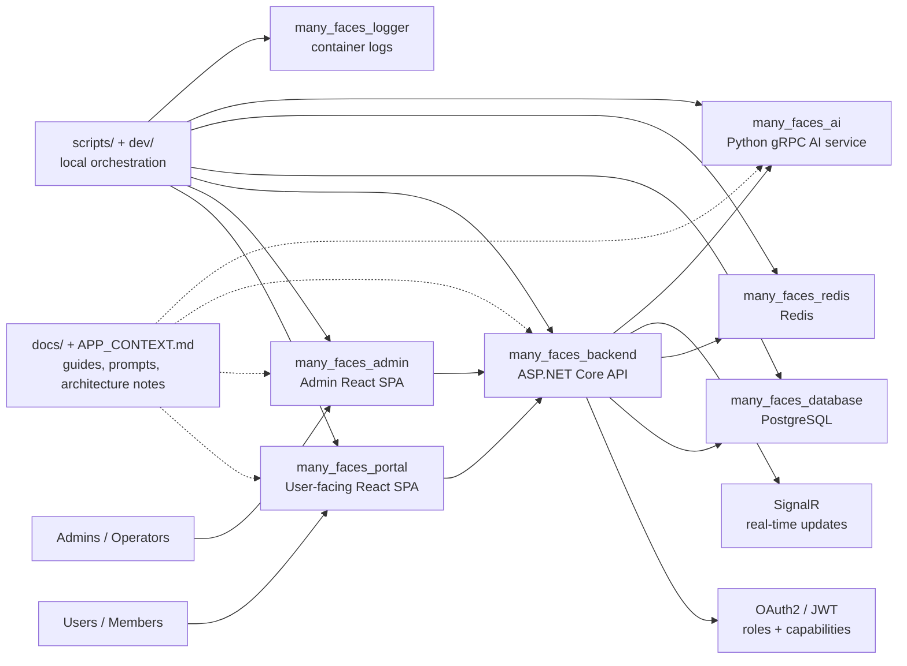
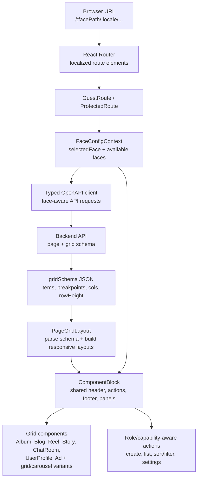
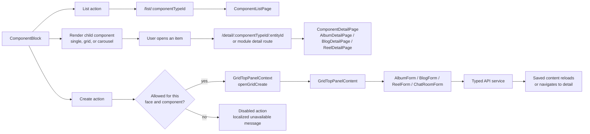
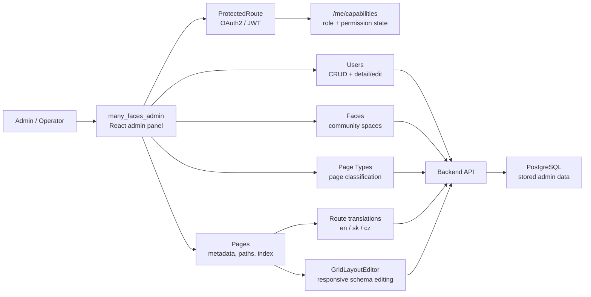
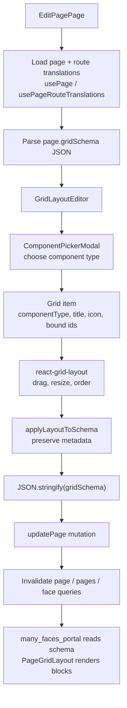
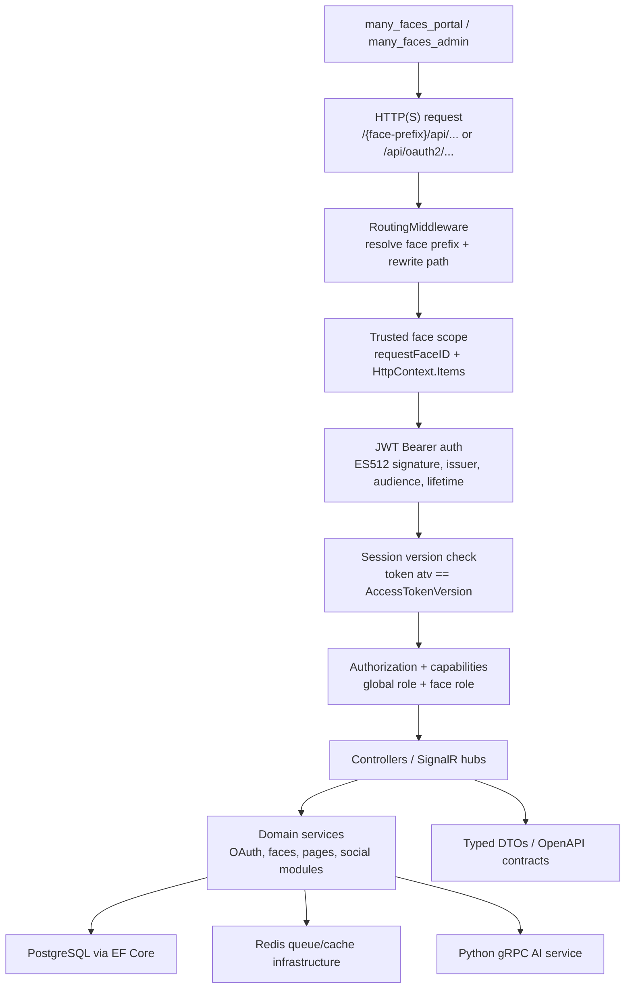
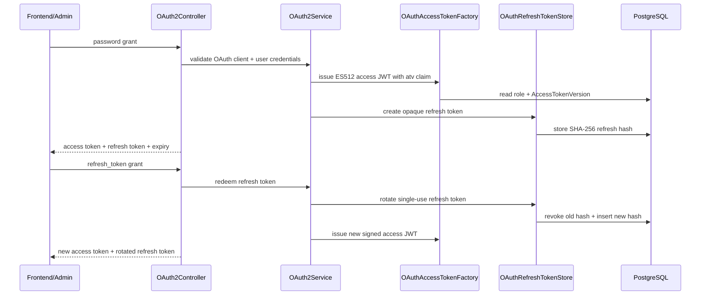
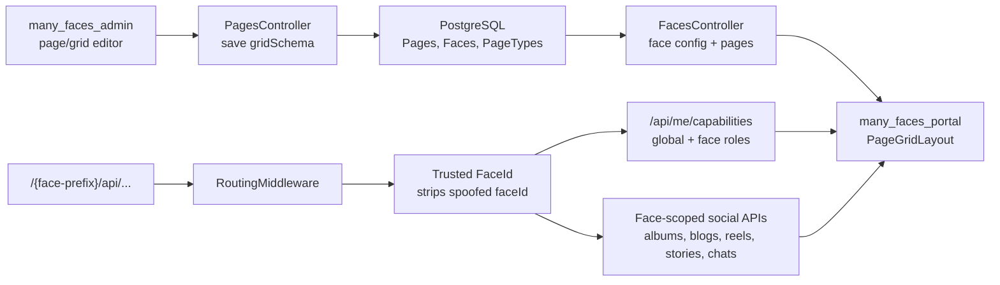
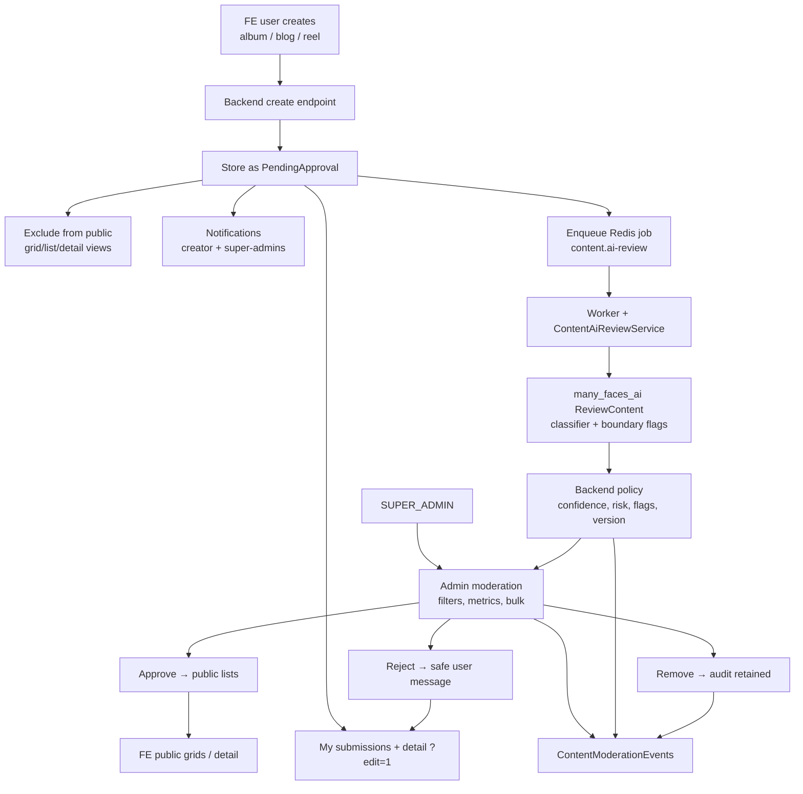

# Many Faces AI (MFAI) - monorepo

MFAI Demo is a full-stack social platform demo built around the concept of **faces**: configurable community spaces with their own pages, roles, content, chats, stories, profiles, listings, albums, blogs, reels, and AI-assisted features.

The project shows how a modern social product can be assembled from reusable building blocks: dynamic page grids, role-aware user flows, media-rich content, real-time communication, profile directories, public and private spaces, admin-managed structure, and backend-enforced data separation between faces.

The monorepo includes the customer-facing frontend, the admin portal, the backend API, AI services, PostgreSQL and Redis infrastructure, Docker-based local orchestration, development scripts, documentation, and reusable AI-agent prompts that help continue implementation work consistently.

It is designed both as a runnable local demo and as an engineering playground for experimenting with configurable social experiences, face-specific content, access rules, media workflows, real-time features, and AI-powered interactions. Each app is its own **git submodule**.

**GitHub:** this tree is the **`many_faces_main`** repository; submodule remotes use the `many_faces_*` names (backend, portal, admin, ai, database, redis, logger). Local directory names stay `many_faces_backend/`, `many_faces_portal/`, … — see [`.gitmodules`](./.gitmodules) and [`docs/guides/git-submodules.md`](./docs/guides/git-submodules.md).

Security and trust boundaries are a high priority in the architecture: the demo uses OAuth2/JWT authentication, signed access tokens, refresh-token based sessions, role-aware access control, capability-based UI flows, backend-enforced checks for face-specific data, protected admin operations, HTTPS-oriented local development, and documented crypto/TLS hardening work. Token handling covers signed JWTs, refresh-token rotation, server-side validation, explicit expiry handling, and protected API boundaries; the documentation also calls out key/certificate handling, hashing/encryption decisions, and future hardening work. The goal is to keep access rules and sensitive behavior explicit across the frontend, admin portal, and backend API, so the system remains understandable, reviewable, and safer to extend.

## What This Demo Shows

- Configurable **faces** with their own routes, pages, roles, visual identity, and content.
- Dynamic page grids managed from the admin portal and rendered by reusable frontend blocks.
- Social modules for profiles, albums, blogs, reels, stories, wall listings, chats, comments, likes, follows, blocks, and notifications.
- Real-time and asynchronous features through SignalR, Redis-backed infrastructure, and an AI gRPC service.
- Role-aware frontend flows backed by backend authorization and explicit capability checks.
- A Docker-first local environment that brings the API, SPAs, PostgreSQL, Redis, logging, and AI service up together.
- Long-lived documentation and agent prompts that preserve architectural context and implementation checklists.
- AI-assisted content approval for user-created albums, blogs, and reels: **My submissions** and detail `?edit=1` on the user app, Redis-backed AI review jobs, superadmin moderation with **filters, metrics, alerts, bulk actions**, in-app **notifications**, optional **retention** redaction of internal AI fields, and a full **audit** trail.

## System Overview



## Frontend Route And Grid Rendering

The user-facing frontend turns a face URL and backend-managed page schema into a responsive grid of reusable social components:



## Frontend Component Interaction Flow

Grid blocks use the same wrapper and route contract, so list/detail/create behaviour stays consistent across content modules:



## Admin Configuration Flow

The admin portal configures the structural data that the backend stores and the user-facing frontend later renders:



## Admin Grid Schema Lifecycle

Admin page edits create and update the `gridSchema` consumed by the frontend as a read-only layout:



## Backend Request And Trust Boundary

The backend is the main trust boundary: it resolves face scope, validates signed tokens, enforces roles/capabilities, persists data, and serves typed contracts to both React apps.



## Backend Security And Token Lifecycle



## Backend Face Scope And Grid Data



## AI-Assisted Content Approval

Regular users can create albums, blogs, and reels from the user-facing frontend, but the approval workflow keeps that content out of public views until it is approved. The backend owns approval status and visibility, enqueues **asynchronous** AI review work (`content.ai-review` on Redis), validates structured recommendations, notifies creators and super-admins on key transitions, and restricts approve / reject / remove / bulk / requeue to **`SUPER_ADMIN`**. Creators use **`GET /api/my/content-submissions`** and the **My submissions** page; the admin app exposes the moderation queue with **filters, metrics + alerts, bulk actions**, and per-item audit. Optional **retention** hosting can redact internal AI trace fields after a policy delay. Full reference: [`docs/guides/ai-assisted-content-approval.md`](./docs/guides/ai-assisted-content-approval.md).



## Architecture Overview

| Layer | Path | Purpose |
| --- | --- | --- |
| User frontend | [`many_faces_portal/`](./many_faces_portal/) | **many_faces_portal** — React SPA for public/private face pages, page grids, social content, profiles, messaging, and user flows. |
| Admin portal | [`many_faces_admin/`](./many_faces_admin/) | **many_faces_admin** — React SPA for managing faces, pages, grid layouts, roles, admin data, and operational views. |
| Backend API | [`many_faces_backend/`](./many_faces_backend/) | **many_faces_backend** — ASP.NET Core API for auth, face-scoped routes, EF Core data access, SignalR hubs, ACL/capabilities, and social modules. |
| AI service | [`many_faces_ai/`](./many_faces_ai/) | **many_faces_ai** — Python gRPC service used by AI-assisted workflows and health checks. |
| Data stores | [`many_faces_database/`](./many_faces_database/), [`many_faces_redis/`](./many_faces_redis/) | **many_faces_database** + **many_faces_redis** — PostgreSQL for persisted application data and Redis for queue/cache-style infrastructure. |
| Logging | [`many_faces_logger/`](./many_faces_logger/) | **many_faces_logger** — local log viewing with Dozzle / container log tooling. |
| Orchestration | [`scripts/`](./scripts/), [`dev/`](./dev/) | Local startup, rebuild, lint/test, HTTPS, and Docker orchestration scripts. |
| Documentation | [`docs/`](./docs/) | Guides, component notes, submodule overviews, architecture notes, and reusable implementation prompts. |

## Tech Stack Highlights

- **Backend:** ASP.NET Core, EF Core, OAuth2/JWT, SignalR, OpenAPI, PostgreSQL, Redis.
- **Frontend/Admin:** React, Vite, TypeScript, React Router, TanStack Query, i18next, Vitest, Cypress, ESLint.
- **AI/infra:** Python gRPC service, Docker Compose, local HTTPS tooling, log viewer, Bash orchestration scripts.
- **Quality:** linting, type checks, unit tests, narrow integration tests, local CI script, documented security and dependency audit prompts.

## Security Highlights

- OAuth2/JWT authentication with signed access tokens and refresh-token based sessions.
- Explicit JWT expiry handling, server-side validation, protected API boundaries, and documented token flows.
- Role-aware access control and capability-based UI behaviour for user-facing and admin workflows.
- Backend-enforced checks for face-specific data access, protected admin operations, and documented ACL/capability APIs.
- HTTPS-oriented local development, TLS/key/certificate notes, hashing/encryption decisions, and a tracked hardening backlog.
- Repeatable validation through linting, type checks, automated tests, and CI-style local scripts.

## How To Review The Repo

1. Start with this README for the product and architecture overview.
2. Open [`docs/README.md`](./docs/README.md) for the documentation hub.
3. Read [`APP_CONTEXT.md`](./APP_CONTEXT.md) for the current product and engineering north star.
4. Use [`docs/readmes/README.md`](./docs/readmes/README.md) to jump into each submodule.
5. Check [`docs/prompts/README.md`](./docs/prompts/README.md) for long-lived implementation prompts and active engineering checklists.

## Demo Access

Demo users and passwords are documented in [`docs/guides/demo-users-and-passwords.md`](./docs/guides/demo-users-and-passwords.md). Keep demo credentials separate from real secrets; local environment values and certificates are documented under [`docs/guides/`](./docs/guides/).

## Project Status

This is an active demo codebase, not a production deployment. Security, architecture, and hardening work are documented so production-grade decisions remain explicit and reviewable as the system evolves.

## Documentation (start here)

**[`docs/README.md`](./docs/README.md)** — hub: `guides/`, `components/`, `prompts/`, `readmes/`.  
Folder layout: [`docs/STRUCTURE.md`](./docs/STRUCTURE.md).  
Development, CI, scripts: [`docs/guides/development.md`](./docs/guides/development.md).

### Quick links

| Topic                     | Document                                                                                     |
| ------------------------- | -------------------------------------------------------------------------------------------- |
| Auth / JWT / `rememberMe` | [`docs/guides/authentication-and-sessions.md`](./docs/guides/authentication-and-sessions.md) |
| ACL / capabilities API    | [`docs/guides/acl-and-capabilities.md`](./docs/guides/acl-and-capabilities.md)               |
| OAuth2 + Stories (curl)   | [`docs/guides/api-oauth-stories-curl.md`](./docs/guides/api-oauth-stories-curl.md)           |
| Git submodules            | [`docs/guides/git-submodules.md`](./docs/guides/git-submodules.md)                           |
| Local HTTPS (`dev/`)      | [`docs/guides/dev-https.md`](./docs/guides/dev-https.md)                                     |
| TLS / crypto backlog      | [`docs/guides/security-crypto-sockets.md`](./docs/guides/security-crypto-sockets.md)         |
| Submodule README index    | [`docs/readmes/README.md`](./docs/readmes/README.md)                                         |

Backend details: [`many_faces_backend/README.md`](./many_faces_backend/README.md). Other services — see the table in [`docs/readmes/README.md`](./docs/readmes/README.md).

## Layout (short)

```
many_faces_backend/       # many_faces_backend — API (OAuth2, JWT, SignalR, EF Core)
many_faces_portal/       # many_faces_portal — user-facing SPA
many_faces_admin/    # many_faces_admin — admin SPA
many_faces_database/       # many_faces_database — PostgreSQL compose
many_faces_redis/    # many_faces_redis — job queue
many_faces_ai/       # many_faces_ai — gRPC health / AI
many_faces_logger/   # many_faces_logger — Dozzle
scripts/       # monorepo orchestration (start-all-dev, ci-local, lint-all, …)
```

## Quick start

**Requirements:** Docker, Docker Compose, Bash.

```bash
git submodule update --init --recursive
./scripts/start-all-dev.sh
```

**Common ports:** API HTTP `8000`, HTTPS `8001`, FE `8081`, admin `8082`, Seq `5341`, DB `54320`. Exact mapping: [`docs/guides/dev-https.md`](./docs/guides/dev-https.md) and submodule READMEs.

**Run all tests:**

```bash
export SKIP_CYPRESS=1   # optional; without it FE may run e2e
./scripts/ci-local.sh   # lint → build → test (same idea as monorepo_scripts in CI)
```

## Other root files (archive / reference)

Some guides were moved under **`docs/guides/`** (git submodules, Husky, boilerplate checklist, proposals). Search by filename in `docs/guides/` or use the hub above.

## License / contributing

Fill in per your project policy.
