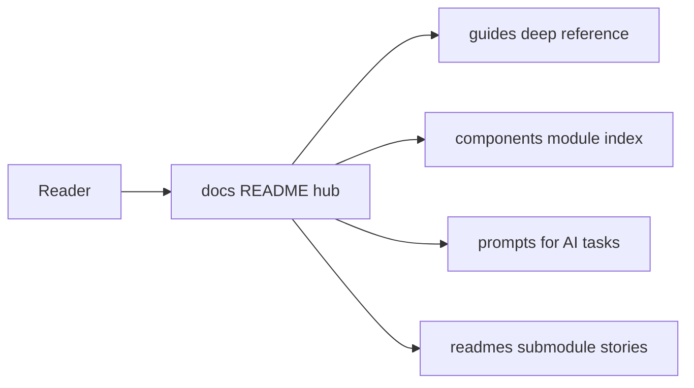

# Documentation hub (`docs/`)

Central documentation for the **`many_faces_main`** monorepo on GitHub lives here. **Per-submodule README** files remain under `many_faces_backend/`, `many_faces_portal/`, … — see [`readmes/README.md`](./readmes/README.md) for an index.

**Why these folders:** [STRUCTURE.md](./STRUCTURE.md) (short rationale for `guides/` vs `components/` vs `prompts/` vs `readmes/`).

### Diagram: how to use this hub

---

## Guides — reference guides

Start with **[`development.md`](./guides/development.md)** for CI, scripts, and hooks. **Archived** material (audit logs, long Husky copy): [`guides/archive/README.md`](./guides/archive/README.md).

### Onboarding, CI, and local environment

| Document | Contents |
| -------- | -------- |
| [development.md](./guides/development.md) | CI, Node/Python, Husky/commitlint, `scripts/` orchestration, tests, links. |
| [local-dev-accounts.md](./guides/local-dev-accounts.md) | Local seed accounts and passwords (tables). |
| [git-submodules.md](./guides/git-submodules.md) | Submodule setup and workflow. |
| [dev-https.md](./guides/dev-https.md) | Local HTTPS certs (`dev/README.md`), ports, Docker, macOS PFX. |
| [docker-and-compose.md](./guides/docker-and-compose.md) | Root compose + submodule stacks, **Mermaid** data-path diagram, **edge cases** (`ENABLE_*=0`, missing submodules, TLS smoke grpcurl), link to **`verify-dev-stack-contracts.sh`**. |
| [elasticsearch-local-dev.md](./guides/elasticsearch-local-dev.md) | Elasticsearch + Go search-worker, gRPC wiring, ports, grpcurl smoke; use **`ENABLE_ELASTICSEARCH=0`** with `start-all-dev` to skip. |
| [elasticsearch-search-features-overview.md](./guides/elasticsearch-search-features-overview.md) | **Summary:** search stack capabilities (TLS/mTLS, smoke script, CI, tests, health) and links to deeper guides. |
| [elasticsearch-grpc-tls-mtls.md](./guides/elasticsearch-grpc-tls-mtls.md) | TLS and mTLS for backend ↔ search-worker gRPC; env matrix, openssl example, Docker mounts. |
| [push-notifications-local-dev.md](./guides/push-notifications-local-dev.md) | **FCM + `many_faces_push`**: dev compose, service account, backend `Push:*`, grpcurl, localization catalog. |
| [push-grpc-tls-mtls.md](./guides/push-grpc-tls-mtls.md) | **Push-worker gRPC TLS/mTLS**: env vars, backend `Push:WorkerTls*`, smoke script + CI (aligned with search-worker TLS guide). |
| [`many_faces_push/README.md`](../many_faces_push/README.md) | Push worker repo entry (ports, security, proto regen) — complements the guide above. |
| [`many_faces_mailer/README.md`](../many_faces_mailer/README.md) | Mailer worker (gRPC + SMTP + templates) — **[mailer-local-dev.md](./guides/mailer-local-dev.md)** (Mailpit, `Mail:*`) · **[mailer-grpc-tls-mtls.md](./guides/mailer-grpc-tls-mtls.md)** (TLS/mTLS + CI smoke). |
| [testing-and-ci-matrix.md](./guides/testing-and-ci-matrix.md) | What runs where (scripts + per-stack commands). |
| [troubleshooting-local-dev.md](./guides/troubleshooting-local-dev.md) | Common local failures and where to read next. |
| [husky-setup.md](./guides/husky-setup.md) | **Pointer** → canonical [`development.md`](./guides/development.md#git-hooks-husky--commitlint); legacy in [`archive/husky-setup-legacy.md`](./guides/archive/husky-setup-legacy.md). |
| [boilerplate-checklist.md](./guides/boilerplate-checklist.md) | Template checklist. |

### Security, auth, and realtime

| Document | Contents |
| -------- | -------- |
| [authentication-and-sessions.md](./guides/authentication-and-sessions.md) | OAuth2, JWT, `rememberMe`, configuration, FE/admin, tests. |
| [email-code-registration.md](./guides/email-code-registration.md) | Two-step signup (email code + link), mailer template, portal/mobile/admin. |
| [acl-and-capabilities.md](./guides/acl-and-capabilities.md) | Permission keys, `GET …/api/me/capabilities`, gates, file map, tests. |
| [security-crypto-sockets.md](./guides/security-crypto-sockets.md) | TLS, JWT keys, WebSockets backlog, deferred `TRACK-*`, §16–18 record. |
| [signalr-hub-security-matrix.md](./guides/signalr-hub-security-matrix.md) | Hub inventory (`ChatHub`), JWT/face rules, coverage. |
| [manual-oauth-smoke.md](./guides/manual-oauth-smoke.md) | Curl-level OAuth smoke when E2E/Cypress is skipped. |

### Product domains and operations

| Document | Contents |
| -------- | -------- |
| [ai-assisted-content-approval.md](./guides/ai-assisted-content-approval.md) | User-created album/blog/reel approval pipeline (full design). |
| [content-moderation-operations.md](./guides/content-moderation-operations.md) | Short operator runbook (links to full guide). |
| [admin-dashboard-metrics.md](./guides/admin-dashboard-metrics.md) | Admin stats APIs, public snapshot, SignalR + AI modes, diagrams. |
| [backend-stats-and-admin-ai-runbook.md](./guides/backend-stats-and-admin-ai-runbook.md) | Operator checklist for stats + AI chat modes. |
| [api-oauth-stories-curl.md](./guides/api-oauth-stories-curl.md) | OAuth2 + Stories via **curl**. |
| [wall-tickets.md](./guides/wall-tickets.md) | Wall tickets API, moderation, Redis worker. |
| [chat-rooms-testing-and-operations.md](./guides/chat-rooms-testing-and-operations.md) | Face chat rooms — tests and operations. |
| [mobile-expo-development.md](./guides/mobile-expo-development.md) | **many_faces_mobile** — Expo, env, parity, quality gates. |
| [openapi-client-generation.md](./guides/openapi-client-generation.md) | Regenerate `src/api` from Swagger (portal + admin). |
| [efcore-migrations-and-seeding.md](./guides/efcore-migrations-and-seeding.md) | EF migrations + seeds + database submodule. |
| [redis-workers-and-queues.md](./guides/redis-workers-and-queues.md) | Redis job queue patterns and known job types. |
| [observability-seq-and-logs.md](./guides/observability-seq-and-logs.md) | Seq, Serilog, Dozzle, frontend logging pointers. |
| [submodule-bump-and-release-checklist.md](./guides/submodule-bump-and-release-checklist.md) | Order of bumps across BE / FE / AI / mobile. |
| [grid-schema-and-page-layout.md](./guides/grid-schema-and-page-layout.md) | `gridSchema` lifecycle and pointers to code. |
| [i18n-conventions.md](./guides/i18n-conventions.md) | Locales and key discipline (portal/admin/mobile). |

### Archive (snapshots and one-off reports)

| Document | Contents |
| -------- | -------- |
| [archive/proposal-many-faces-state.md](./guides/archive/proposal-many-faces-state.md) | Proposal / state snapshot. |
| [archive/monorepo-dependency-audit-completion.md](./guides/archive/monorepo-dependency-audit-completion.md) | Dependency audit evidence (2026-04-10). |

---

## Components — implemented building blocks

Index file: [`components/README.md`](./components/README.md). Short **what it is** + **where**; deep detail stays in `guides/`.

| Document | Contents |
| -------- | -------- |
| [acl-capabilities-module.md](./components/acl-capabilities-module.md) | ACL catalog, capabilities API, FE/admin `src/acl/`. |
| [content-moderation-module.md](./components/content-moderation-module.md) | Album/blog/reel moderation queue, Redis AI jobs, audit. |
| [operator-stats-and-admin-ai-module.md](./components/operator-stats-and-admin-ai-module.md) | Stats APIs + admin AI stats context (`off` / `inline` / `live`). |
| [mobile-parity-module.md](./components/mobile-parity-module.md) | Expo app vs portal — REST parity matrix and phases. |

---

## AI prompts (`prompts/`)

Specs for **agent-assisted implementation**: [`prompts/README.md`](./prompts/README.md) (full table + retention rules). **Humans** implementing features should read the relevant **`guides/`** first, then open a prompt for checklists and acceptance criteria.

**Push notifications (FCM):** full-stack agent spec (Go gRPC worker submodule, backend, Expo) — [`prompts/push-notifications-fcm-go-grpc-firebase-worker-agent-prompt.md`](./prompts/push-notifications-fcm-go-grpc-firebase-worker-agent-prompt.md); operator guide [`guides/push-notifications-local-dev.md`](./guides/push-notifications-local-dev.md).

---

## Readmes — README index + extended overviews

| Document | Contents |
| -------- | -------- |
| [readmes/README.md](./readmes/README.md) | Links to each submodule README + this folder. |
| [readmes/fe-portal-overview.md](./readmes/fe-portal-overview.md) | Portal architecture and features. |
| [readmes/admin-portal-overview.md](./readmes/admin-portal-overview.md) | Admin architecture and features. |
| [readmes/be-backend-overview.md](./readmes/be-backend-overview.md) | Backend API surface narrative (links to submodule + guides). |
| [readmes/ai-grpc-overview.md](./readmes/ai-grpc-overview.md) | Python gRPC service narrative. |
| [readmes/redis-subrepo.md](./readmes/redis-subrepo.md) | Redis submodule / job queue context. |

---

## External / repo root

| Path | Contents |
| ---- | -------- |
| [`../README.md`](../README.md) | Monorepo overview, diagrams, and quick orientation. |
| [`../many_faces_backend/README.md`](../many_faces_backend/README.md) | Backend entry + links to `docs/DETAILED_README.md` (index) and `docs/reference/*.md`. |
| [`../many_faces_backend/STORIES_API.md`](../many_faces_backend/STORIES_API.md) | Stories HTTP reference (tables + Swagger pointers). |
| [`../many_faces_mobile/README.md`](../many_faces_mobile/README.md) | Expo mobile client (Phase 1+). |
| [`../many_faces_database/README.md`](../many_faces_database/README.md) | Local PostgreSQL stack. |
| [`../many_faces_logger/README.md`](../many_faces_logger/README.md) | Dozzle log viewer. |

**New docs:** prefer `guides/` (reference), `components/` (catalog), `prompts/` (AI), or `readmes/` (overviews / index). Update this hub and [`guides/development.md`](./guides/development.md) when you add paths.
