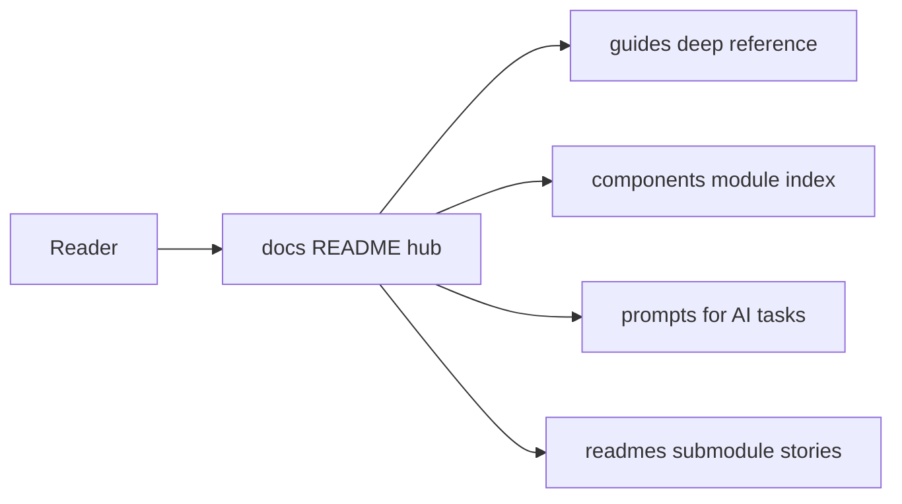

# Documentation hub (`docs/`)

Central documentation for the **`_mfai_demo`** monorepo lives here. **Per-submodule README** files remain under `be_demo/`, `fe_demo/`, … — see [`readmes/README.md`](./readmes/README.md) for an index.

**Why these folders:** [STRUCTURE.md](./STRUCTURE.md) (short rationale for `guides/` vs `components/` vs `prompts/` vs `readmes/`).

### Diagram: how to use this hub

---

## [`guides/`](./guides/) — reference guides

| Document                                                                              | Contents                                                                                                                                         |
| ------------------------------------------------------------------------------------- | ------------------------------------------------------------------------------------------------------------------------------------------------ |
| [development.md](./guides/development.md)                                             | CI, Node/Python, Husky/commitlint, `scripts/` orchestration (`scripts/ci-local.sh`, …), API errors in the browser, tests, face home grid, links. |
| [authentication-and-sessions.md](./guides/authentication-and-sessions.md)             | OAuth2, JWT, `rememberMe`, configuration, FE/admin, tests.                                                                                       |
| [demo-users-and-passwords.md](./guides/demo-users-and-passwords.md)                   | Local seed: super admin / admin / demo users and passwords (tables).                                                                             |
| [acl-and-capabilities.md](./guides/acl-and-capabilities.md)                           | Permission keys, `GET …/api/me/capabilities`, gates, file map, integration users, test index.                                                    |
| [api-oauth-stories-curl.md](./guides/api-oauth-stories-curl.md)                       | OAuth2 + Stories via **curl**.                                                                                                                   |
| [wall-tickets.md](./guides/wall-tickets.md)                                           | Wall tickets API, moderation, Redis worker.                                                                                                      |
| [chat-rooms-testing-and-operations.md](./guides/chat-rooms-testing-and-operations.md) | Face chat rooms — tests and operations.                                                                                                          |
| [security-crypto-sockets.md](./guides/security-crypto-sockets.md)                     | TLS, JWT keys, WebSockets backlog, baseline vs code, **deferred `TRACK-*`**, **§16–§18 engagement record** (gap analysis, audits, diagrams).   |
| [signalr-hub-security-matrix.md](./guides/signalr-hub-security-matrix.md)             | Hub inventory (`ChatHub`), JWT/face rules, manual vs automated coverage.                                                                         |
| [manual-oauth-smoke.md](./guides/manual-oauth-smoke.md)                               | Curl-level OAuth smoke when E2E/Cypress is skipped.                                                                                              |
| [dev-https.md](./guides/dev-https.md)                                                 | Local HTTPS certs (`dev/`), ports, Docker, macOS PFX key flags for host `dotnet run`.                                                            |
| [git-submodules.md](./guides/git-submodules.md)                                       | Submodule setup and workflow.                                                                                                                    |
| [husky-setup.md](./guides/husky-setup.md)                                             | Husky / hooks (historical note).                                                                                                                 |
| [boilerplate-checklist.md](./guides/boilerplate-checklist.md)                         | Template checklist.                                                                                                                              |
| [proposal-mfai-demo-state.md](./guides/proposal-mfai-demo-state.md)                   | Snapshot / proposal (archive).                                                                                                                   |

---

## [`components/`](./components/) — implemented building blocks

Short **what it is** and **where in the repo**; deep detail stays in `guides/`.

| Document                                                              | Contents                                            |
| --------------------------------------------------------------------- | --------------------------------------------------- |
| [acl-capabilities-module.md](./components/acl-capabilities-module.md) | ACL catalog, capabilities API, FE/admin `src/acl/`. |

_(Add more files as you ship coherent modules.)_

---

## [`prompts/`](./prompts/) — AI prompts

| File                                                                                                                           | Purpose                                                                                                                                                                                                                                                                                    |
| ------------------------------------------------------------------------------------------------------------------------------ | ------------------------------------------------------------------------------------------------------------------------------------------------------------------------------------------------------------------------------------------------------------------------------------------ |
| [super-admin-api.md](./prompts/super-admin-api.md)                                                                             | SUPER_ADMIN-only global role API — analysis + implementation prompt.                                                                                                                                                                                                                       |
| [mermaid-documentation-diagrams-agent-prompt.md](./prompts/mermaid-documentation-diagrams-agent-prompt.md)                     | **Agent prompt:** add every specified Mermaid diagram across `docs/` (full inventory, placement, styling, sequence/flow/state/ER specs).                                                                                                                                                   |
| [security-hardening-full-stack-edge-tests-agent-prompt.md](./prompts/security-hardening-full-stack-edge-tests-agent-prompt.md) | **Agent prompt (strict):** full monorepo security + tests + **English** comments + docs + Mermaid; **no optional items**; use sections 16–18 in that file for checklists.                                                                                                                  |
| [monorepo-dependency-audit-and-upgrade-agent-prompt.md](./prompts/monorepo-dependency-audit-and-upgrade-agent-prompt.md)       | **Agent prompt:** inventory of **all** packages per app (NuGet, Yarn, PyPI, Docker) + **latest stable** snapshot + feasibility; commands to re-run audit and PR checklist.                                                                                                                 |
| [eslint10-react-hooks-peer-yarn-agent-prompt.md](./prompts/eslint10-react-hooks-peer-yarn-agent-prompt.md)                     | **Agent prompt:** **ESLint 10** vs **`eslint-plugin-react-hooks`** under **Yarn 4** — **required** investigation (full peer trees, `@latest`/`@canary`, whole eslint graph, lockfile), **decision matrix** **A1/A2/B/C**, flat-config alignment, CI `YN0060`/`YN0086` grep, anti-patterns. |
| [react-hooks-compiler-rules-rollout-agent-prompt.md](./prompts/react-hooks-compiler-rules-rollout-agent-prompt.md)             | **Agent prompt:** post-canary migration — enable **`flat.recommended`** / **`recommended-latest`** safely (**S1–S4** strategies), per-rule playbook, **required** violation baselines, flat-config merge order, **react.dev** lint docs + CHANGELOG.                                       |
| [unit-test-gap-fill-agent-prompt.md](./prompts/unit-test-gap-fill-agent-prompt.md)                                             | **Agent prompt:** unit-test gaps (**P0–P2**), **`fe_demo`/`admin_demo`/`be_demo`/`ai_demo`/scripts**, extract pure logic, **no render-first** testing policy, verification checklist.                                                                                                      |
| [fe-performance-and-refactor-agent-prompt.md](./prompts/fe-performance-and-refactor-agent-prompt.md)                         | **Agent prompt:** **`fe_demo`** performance + refactor — bundle/code-splitting, Query/cache, context re-renders, SignalR, `App.tsx` decomposition, measurement protocol.                                                                                                                      |
| [fe-grid-face-scope-rollout-agent-prompt.md](./prompts/fe-grid-face-scope-rollout-agent-prompt.md)                             | **Agent prompt:** **`fe_demo`** grid — face-scoped rollout: current state audit, per-component TODOs, placeholders, bindings, responsiveness, verification checklist.                                                                                                                                       |

Full index (including retention policy): [`prompts/README.md`](./prompts/README.md).

---

## [`readmes/`](./readmes/) — README index + extended overviews

| Document                                                   | Contents                                      |
| ---------------------------------------------------------- | --------------------------------------------- |
| [README.md](./readmes/README.md)                           | Links to each submodule README + this folder. |
| [fe-demo-overview.md](./readmes/fe-demo-overview.md)       | `fe_demo` architecture and features.          |
| [admin-demo-overview.md](./readmes/admin-demo-overview.md) | `admin_demo` architecture and features.       |
| [redis-subrepo.md](./readmes/redis-subrepo.md)             | `redis_demo` submodule for the job queue.     |

---

## External / repo root

| Path                                                     | Contents                              |
| -------------------------------------------------------- | ------------------------------------- |
| [`../README.md`](../README.md)                           | Short monorepo entry and quick start. |
| [`../be_demo/STORIES_API.md`](../be_demo/STORIES_API.md) | Stories API reference.                |

**New docs:** prefer `guides/` (reference), `components/` (catalog), `prompts/` (AI), or `readmes/` (overviews / index). Update this hub and [`guides/development.md`](./guides/development.md) when you add paths.
