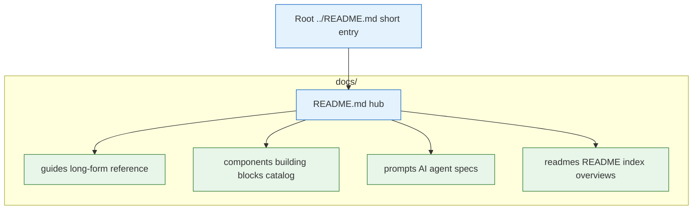

# Layout of `docs/` (why these folders)

| Folder            | Role                                                                                                                                            |
| ----------------- | ----------------------------------------------------------------------------------------------------------------------------------------------- |
| **`guides/`**     | Long-form reference: CI, auth, ACL, APIs, security design, submodules. Language: **English**.                                                   |
| **`components/`** | Short **catalog** of implemented building blocks (where they live in the repo + link to the full guide). Not a duplicate of `guides/`.          |
| **`prompts/`**    | Copy-paste **specs for AI agents** (implementation prompts, not end-user docs).                                                                 |
| **`readmes/`**    | **Index** of per-submodule README files plus **extended overview** pages for apps (`fe_demo`, `admin_demo`, Redis) that read like long READMEs. |

The hub for humans is **[README.md](./README.md)**. Root **[`../README.md`](../README.md)** stays a short monorepo entry and points here.

### Diagram: docs folder layout

