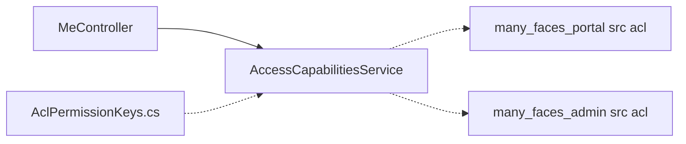

# ACL & capabilities module

## What it is

Server-driven **permission strings** and **`GET /{face}/api/me/capabilities`** so SPAs do not infer authz only from JWT role names.

## Where in the repo

| Layer                 | Location                                                                                          |
| --------------------- | ------------------------------------------------------------------------------------------------- |
| Permission catalog    | `many_faces_backend/BeDemo.Api/Security/AclPermissionKeys.cs`                                                |
| Capabilities response | `many_faces_backend/BeDemo.Api/Services/AccessCapabilitiesService.cs`, `Models/DTOs/CapabilitiesResponse.cs` |
| HTTP                  | `many_faces_backend/BeDemo.Api/Controllers/MeController.cs`                                                  |
| FE (mirror)           | `many_faces_portal/src/acl/*`, `src/api/meCapabilitiesClient.ts`, `src/hooks/api/useMeCapabilities.ts`      |
| Admin (mirror)        | `many_faces_admin/src/acl/*`, same client/hook pattern                                                  |

### Diagram: capabilities data path (high level)

**Full file-level flow:** see [acl-and-capabilities.md §3 Backend file map](../guides/acl-and-capabilities.md#3-backend-file-map) (canonical diagram scope).

## Full reference

→ [`../guides/acl-and-capabilities.md`](../guides/acl-and-capabilities.md) (keys, gates, tests, integration users).
