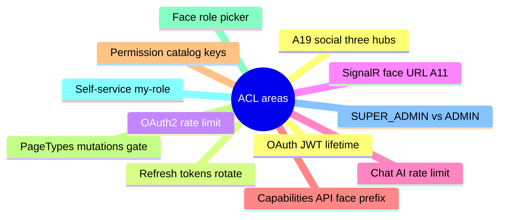
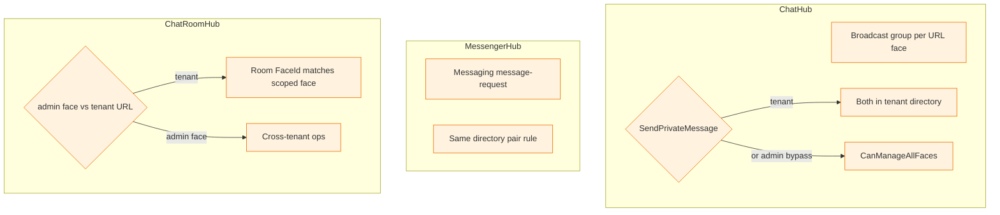
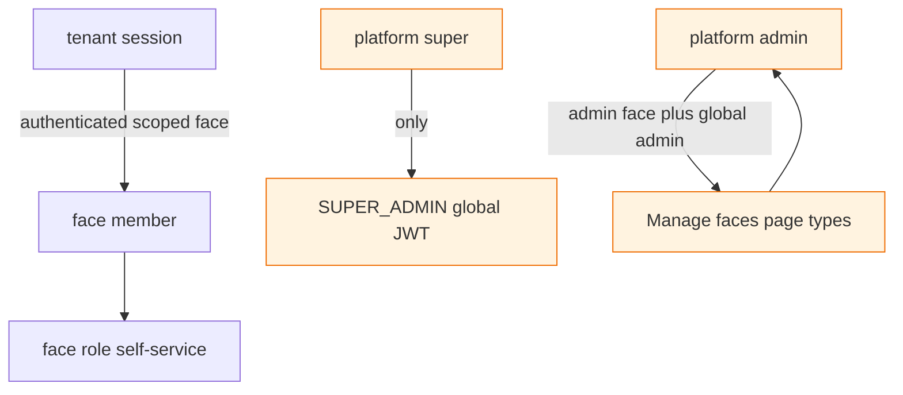
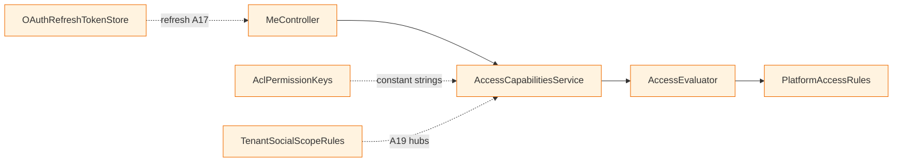
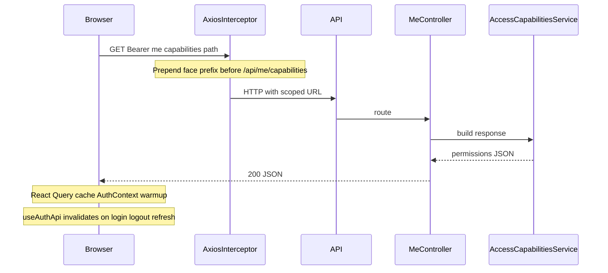
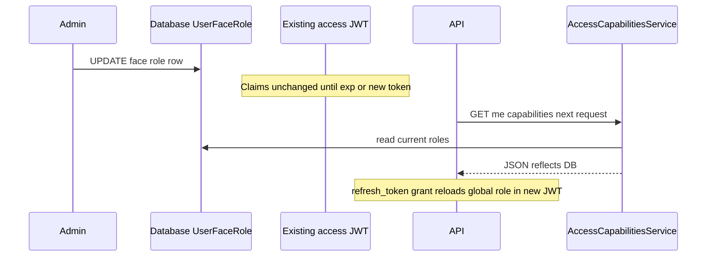

# ACL, capabilities API, and frontend permission helpers

Language: **English**. Audience: implementers maintaining **BE / fe_demo / admin_demo**.

**Auth / JWT / storage:** [authentication-and-sessions.md](./authentication-and-sessions.md).

---

## 1. What was implemented (summary)

| Area                       | Behaviour                                                                                                                                                                                                                                                                                                                                                                                                                |
| -------------------------- | ------------------------------------------------------------------------------------------------------------------------------------------------------------------------------------------------------------------------------------------------------------------------------------------------------------------------------------------------------------------------------------------------------------------------ |
| **JWT lifetime**           | `JwtBearerOptions.TokenValidationParameters.ValidateLifetime = true` and `ClockSkew = TimeSpan.Zero` in `Program.cs` (aligned with OAuth2 access token `Expires`).                                                                                                                                                                                                                                                       |
| **Refresh tokens**         | `OAuthRefreshToken` rows (hash only); `refresh_token` grant rotates (single-use). Config: `Jwt:RefreshTokenDaysSession` / `Jwt:RefreshTokenDaysRememberMe`.                                                                                                                                                                                                                                                              |
| **OAuth2 rate limit**      | `POST /api/oauth2/token` — fixed window per IP (`OAuth2:TokenRateLimitPermitLimit`, `OAuth2:TokenRateLimitWindowSeconds`; disabled stress in `Testing`).                                                                                                                                                                                                                                                                 |
| **SignalR URL**            | Hubs must use the **same face prefix** as REST, e.g. `/{face}/hubs/chat?access_token=…` so `RoutingMiddleware` runs (A11).                                                                                                                                                                                                                                                                                               |
| **Chat AI rate limit**     | `ChatHub.SendToAi` — per-user window (`ChatHub:SendAiMaxPerWindow`, `ChatHub:SendAiWindowSeconds`).                                                                                                                                                                                                                                                                                                                      |
| **Capabilities API**       | `GET /{face-prefix}/api/me/capabilities` — JSON with global role, scoped face metadata, and a **sorted, de-duplicated** `permissions` string list. Requires **face URL prefix**; returns **400** on bare `/api/me/capabilities`.                                                                                                                                                                                         |
| **Permission catalog**     | `BeDemo.Api/Security/AclPermissionKeys.cs` — single source of truth for capability strings (FE/admin mirror under `src/acl/aclPermissionKeys.ts`).                                                                                                                                                                                                                                                                       |
| **PageTypes mutations**    | `POST` / `PUT` / `DELETE` `/api/pagetypes` require **`CanMutateGlobalPageTypes`** (same bar as **`CanManageAllFaces()`**: global Admin or SuperAdmin **and** admin face scope). Tenant scope or **admin JWT on a tenant-prefixed URL** → **403**. Reads stay available to authenticated tenants.                                                                                                                         |
| **Face role picker**       | `GET /api/faces/face-roles` — tenants and anonymous callers **do not** see `FACE_ADMIN`; platform admin on `/admin/` sees full list.                                                                                                                                                                                                                                                                                     |
| **Self-service role**      | `PUT /api/faces/{id}/my-role` — only whitelisted face roles (`FACE_USER`, `INZERENT`, `SUBSCRIBER`, `FACE_HOST`) unless caller **`CanManageAllFaces()`**; `FACE_ADMIN` self-assign → **403**.                                                                                                                                                                                                                            |
| **SUPER_ADMIN vs ADMIN**   | Both pass the same **platform** gates (`CanManageAllFaces`, page types). **Capabilities** add `platform:super` only for global `SUPER_ADMIN`. Code may call **`IAccessEvaluator.IsGlobalSuperAdmin`** where a Super-only gate is needed later.                                                                                                                                                                           |
| **SignalR / social (A19)** | **`ChatHub`**: broadcast is per URL face group (`hubchat_face_{id}`); **`SendPrivateMessage`** requires both users in the tenant directory (`UserFaceProfile` for scoped face) unless **`CanManageAllFaces`**. **`MessengerHub`**: messaging / message-request actions use the same pair rule. **`ChatRoomHub`**: under tenant URL, room `FaceId` must match scoped face; admin face URL unchanged for cross-tenant ops. |

### Diagram: what was implemented (topic map)

### Diagram: SignalR / tenant social (A19) overview

---

## 2. Permission strings (`permissions[]`)

| Key                        | Meaning                                                                               |
| -------------------------- | ------------------------------------------------------------------------------------- |
| `platform:super`           | Global `SUPER_ADMIN` (JWT role claim).                                                |
| `platform:admin`           | Admin face scope + global Admin or SuperAdmin.                                        |
| `platform:pagetype:mutate` | May change `PageType` rows (same bar as above).                                       |
| `tenant:session`           | Authenticated request with resolved face scope.                                       |
| `face:member`              | User has a `UserFaceRole` row for the scoped face.                                    |
| `face:role:self-service`   | Tenant (non–admin-face) scope: may use role list + `my-role` within server whitelist. |

New users created via **`POST /api/oauth2/register`** receive **`FACE_HOST`** on every face (see `OAuth2Controller`) — so **`face:member`** appears immediately after registration for scoped faces.

### Diagram: permission layers

---

## 3. Backend file map

| File                                    | Role                                                                                    |
| --------------------------------------- | --------------------------------------------------------------------------------------- |
| `Utils/PlatformAccessRules.cs`          | `IsGlobalAdmin`, `IsGlobalSuperAdmin`, `CanManageAllFaces`, `CanMutateGlobalPageTypes`. |
| `Utils/FaceRoleSelfServiceRules.cs`     | Self-assignable face role names.                                                        |
| `Security/AclPermissionKeys.cs`         | Constant permission strings.                                                            |
| `Services/AccessCapabilitiesService.cs` | Builds `CapabilitiesResponse` from DB + principal + `IFaceScopeContext`.                |
| `Services/AccessEvaluator.cs`           | DI facade over `PlatformAccessRules` (A3/A6); includes `IsGlobalSuperAdmin`.            |
| `Utils/TenantSocialScopeRules.cs`       | Shared “both users in tenant directory” check for hubs (A19).                           |
| `Swagger/BearerAuthOperationFilter.cs`  | OpenAPI per-operation `security: Bearer` for `[Authorize]` actions (A23 / G15).         |
| `Services/OAuthRefreshTokenStore.cs`    | Refresh persistence + rotation (A17).                                                   |
| `Utils/TenantFaceAccessGate.cs`         | Shared 404 gate for tenant face id mismatch.                                            |
| `Utils/SecurityAuditLog.cs`             | Structured audit templates (A22).                                                       |
| `Controllers/MeController.cs`           | `GET api/me/capabilities`.                                                              |
| `Controllers/PageTypesController.cs`    | Mutation gate.                                                                          |
| `Controllers/FacesController.cs`        | `face-roles`, `my-role`, existing face APIs.                                            |

### Diagram: backend file flow (capabilities)

---

## 4. Frontend (`fe_demo`) and admin (`admin_demo`)

| Path                                 | Role                                                                                                                                                                                                                                                    |
| ------------------------------------ | ------------------------------------------------------------------------------------------------------------------------------------------------------------------------------------------------------------------------------------------------------- |
| `src/acl/aclPermissionKeys.ts`       | Same string constants as BE (Vitest asserts parity).                                                                                                                                                                                                    |
| `src/acl/capabilitiesTypes.ts`       | `MeCapabilities` TypeScript type.                                                                                                                                                                                                                       |
| `src/acl/permissions.ts`             | `parseMeCapabilities`, `hasPermission`, helpers (`canMutateGlobalPageTypes`, …).                                                                                                                                                                        |
| `src/api/meCapabilitiesClient.ts`    | GET `…/api/me/capabilities` with `Authorization: Bearer`. In the **browser**, the global axios interceptor (`api/config.ts`, `faceApiRouting.ts`) prepends the face URL segment before `/api/...` so `RoutingMiddleware` receives a tenant-scoped path. |
| `src/hooks/api/useMeCapabilities.ts` | React Query: `createMeCapabilitiesQueryOptions`, `useMeCapabilities`, `meCapabilitiesKeys`.                                                                                                                                                             |
| `src/contexts/AuthContext.tsx`       | `MeCapabilitiesWarmup` — prefetches capabilities when a token exists.                                                                                                                                                                                   |
| `src/hooks/api/useAuthApi.ts`        | On login / refresh: `invalidateQueries(meCapabilitiesKeys.all)`; on logout / refresh failure: `removeQueries(meCapabilitiesKeys.all)`.                                                                                                                  |

**Admin** uses the same module layout; `faceApiRouting.ts` is simpler (fixed `env.defaultFacePrefix`, typically `admin`).

### Diagram: browser → capabilities request

---

## 5. Integration test users (BE)

Seeded once per test host init (`CustomWebApplicationFactory` + `IntegrationTestSeed`):

| Email                             | Global role   | Purpose                                       |
| --------------------------------- | ------------- | --------------------------------------------- |
| `integration-admin@test.com`      | `ADMIN`       | Admin-face OAuth tests, page types CRUD, etc. |
| `integration-superadmin@test.com` | `SUPER_ADMIN` | Capabilities include `platform:super`.        |

Password: `Test123!@#` (see `IntegrationTestSeed.Password`).

---

## 6. Tests (where to look)

### Backend (`be_demo/BeDemo.Api.Tests`)

| File                                                     | Focus                                                                              |
| -------------------------------------------------------- | ---------------------------------------------------------------------------------- |
| `AclIntegrationTests.cs`                                 | HTTP: capabilities, face-roles, `my-role`, page types across scopes.               |
| `RefreshTokenEdgeCaseTests.cs`                           | Refresh grant success, rotation, reuse rejection, access-JWT-as-refresh rejection. |
| `AccessEvaluatorTests.cs`                                | `IAccessEvaluator` delegates match `PlatformAccessRules`.                          |
| `UserRolesSeededScopeTests.cs`                           | Seeded `UserRoles` rows have expected `RoleScope` (A12).                           |
| `AclBearerJwtValidationTests.cs`                         | Expired / not-yet-valid / malformed JWT → **401**.                                 |
| `AclPermissionKeysCatalogTests.cs`                       | Unique non-empty permission constants.                                             |
| `PlatformAccessRulesTests.cs`                            | Static rules + mocked `IFaceScopeContext`.                                         |
| `FaceRoleSelfServiceRulesTests.cs`                       | Whitelist / case / rejections.                                                     |
| `TenantSocialScopeRulesTests.cs`                         | Hub / A19 directory pair checks.                                                   |
| `AccessCapabilitiesServiceTests.cs`                      | In-memory EF + Moq scope.                                                          |
| `PageTypesControllerTests.cs`, `PagesControllerTests.cs` | Regressions with admin vs tenant clients (`AclTestClients`).                       |
| `AclTestClients.cs`                                      | OAuth unscoped + public/admin face clients + token helpers.                        |

### Frontend Vitest

| App            | Files (non-exhaustive)                                                                                                                                                                                             |
| -------------- | ------------------------------------------------------------------------------------------------------------------------------------------------------------------------------------------------------------------ |
| **fe_demo**    | `src/acl/__tests__/*`, `src/api/__tests__/meCapabilitiesClient.test.ts`, `src/api/__tests__/facePathRouting.test.ts` (includes `/api/me/capabilities` paths), `src/hooks/api/__tests__/useMeCapabilities.test.ts`. |
| **admin_demo** | Same ACL tests + `src/api/__tests__/faceApiRouting_acl.test.ts`, `meCapabilitiesClient.test.ts`, `useMeCapabilities.test.ts`.                                                                                      |

---

## 7. Operational notes

- **Capabilities** are derived at request time (global role from DB, face role from `UserFaceRole` for scoped face). Changing roles in the DB does not update an already-issued JWT claim set until re-login or a new token — but capabilities re-read DB on each `GET …/me/capabilities`.
- **Do not** duplicate permission string literals in UI code — import from `aclPermissionKeys.ts` or compare against `parseMeCapabilities` output.
- For **curl**, always use a face-prefixed base, e.g. `https://host/public/api/me/capabilities` with `Authorization: Bearer …`.

### Diagram: DB role change vs JWT vs capabilities

---

## Related

- [authentication-and-sessions.md](./authentication-and-sessions.md) — OAuth2, JWT storage, `rememberMe`.
- [development.md](./development.md) — CI, `yarn test` / `dotnet test`.
