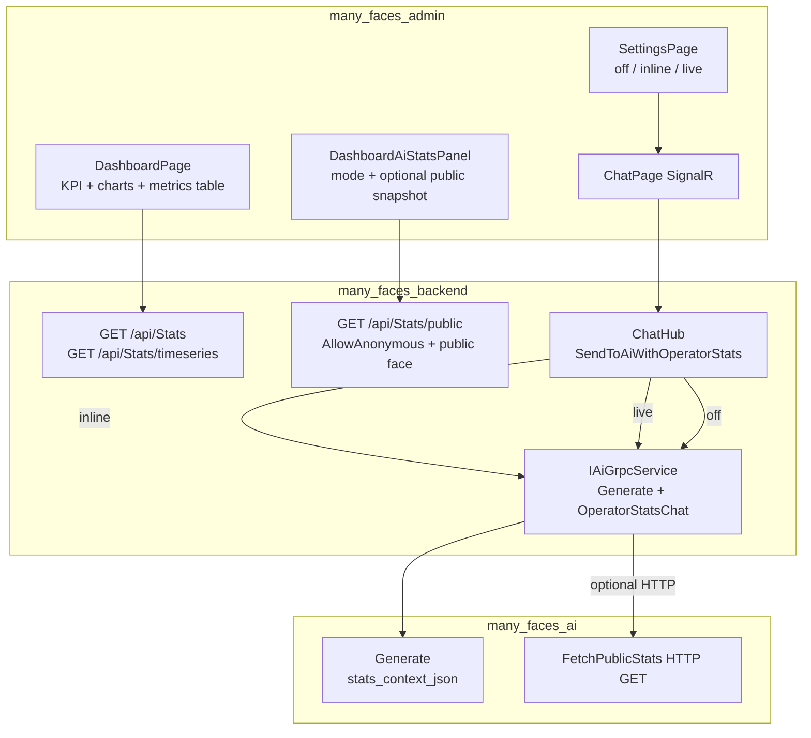

# Admin dashboard metrics and operator AI statistics

This guide documents the **operator dashboard** statistics APIs consumed by **`many_faces_admin`**, the **anonymous public aggregate snapshot** used for optional AI context, and how **SignalR + gRPC** attach **non-identifying totals** to the admin **AI chat** when enabled.

## Purpose

| Endpoint | Audience | Payload |
| -------- | -------- | ------- |
| **`GET /api/Stats`** | Platform operators (`CanManageAllFaces`) | Full **`AdminDashboardSummaryDto`**: users, faces, pages, social graph, messaging, notifications, UGC, chat, wall, profile engagement, moderation-related **table sizes**, OAuth client count, etc. |
| **`GET /api/Stats/timeseries`** | Same | Histogram buckets for one metric (users, messages, stories, blogs, reels, albums, friend requests, wall tickets) over a UTC range (`bucket=day\|week`). |
| **`GET /api/Stats/public`** | **Anonymous** on the **`public`** face URL only | **`PublicStatsSnapshotDto`**: **aggregate counts only** — no OAuth count, no moderation audit counts, no per-user rows. Intended for **read-only AI context** and external demos. |

The admin UI renders **KPI cards**, **Recharts** (line / donut / bar), a **full metrics table**, an **“AI & public aggregates”** strip (mode + optional public snapshot), **Settings → AI chat — public statistics** (`off` / `inline` / `live`, stored in **`localStorage`**), and (for **`SUPER_ADMIN`**) a **moderation health** strip from **`GET /api/contentmoderation/metrics`** — queue logic is **not** duplicated inside `StatsController`.

## Authorization (critical)

### Operator summary and timeseries

Both **`GET /api/Stats`** and **`GET /api/Stats/timeseries`** require:

1. A valid **JWT** (`[Authorize]` on `StatsController`).
2. **`CanManageAllFaces`** — same predicate as **`UsersController`**: **admin face HTTP scope** (`IFaceScopeContext.IsAdminFaceScope`, typically URL prefix from `VITE_DEFAULT_FACE_PREFIX`, default **`admin`**) **and** a global **Admin** or **SuperAdmin** role on the token.

If the SPA calls **`/api/...`** from the **wrong** face prefix, the user may be authenticated but still receives **`403 Forbidden`**. The dashboard shows a localized warning.

### Public snapshot (`/api/Stats/public`)

- The action uses **`[AllowAnonymous]`** so unauthenticated clients may read **totals only**.
- **Face scope still applies:** you must call **`/{public-face-prefix}/api/Stats/public`** (seeded face index **`public`** → kebab path **`/public/...`**). On a **private** face prefix (e.g. **`/admin/...`**) without a JWT, **`FaceScopeEnforcementMiddleware`** returns **`401`** — so **live** mode for the Python worker must use a URL like **`http(s)://host/public/api/Stats/public`**, not the admin-prefixed path.
- **Do not** expose this endpoint on a private face for anonymous callers; routing is per-face by design.

Implementation references:

- `many_faces_backend/BeDemo.Api/Controllers/StatsController.cs`
- `many_faces_backend/BeDemo.Api/Services/PlatformStatsQueryService.cs`
- `many_faces_backend/BeDemo.Api/Models/DTOs/PublicStatsSnapshotDto.cs`
- `many_faces_backend/BeDemo.Api/Utils/PlatformAccessRules.cs`
- `many_faces_backend/BeDemo.Api/Services/AccessEvaluator.cs`
- `many_faces_backend/BeDemo.Api/Middlewares/FaceScopeEnforcementMiddleware.cs`

## Optional AI context (admin chat)

Operators may attach **only** the public snapshot shape to the **admin SignalR AI chat** (`ChatHub`). Modes are stored in the browser (**`localStorage`**, key **`admin_ai_public_stats_mode`**).

| Mode | Behaviour |
| ---- | --------- |
| **`off`** | `Generate` gRPC with conversation prompt only (legacy behaviour). |
| **`inline`** | API reads **`PublicStatsSnapshotDto`** from EF, serializes JSON, passes **`stats_context_json`** on **`GenerateRequest`**. |
| **`live`** | Backend calls gRPC **`OperatorStatsChat`**; Python performs **HTTP GET** of **`AiStats:PublicSnapshotAbsoluteUrl`** (must be reachable from the AI container; use **`/public/...`** URL), then **`Generate`** with the JSON as **`stats_context_json`**. |

SignalR:

- **`SendToAiWithOperatorStats(message, history?, statsMode)`** — requires **`CanManageAllFaces()`**; same **`ReceiveAiMessage`** callback as **`SendToAi`**; shares **`IChatHubAiRateLimiter`**.
- **`SendToAi`** remains unchanged for other clients.

Configuration (**`many_faces_backend`**):

- **`AiStats:PublicSnapshotAbsoluteUrl`** — required for **`live`** when the worker must fetch JSON over HTTP. Example in **`appsettings.Development.json`**: `http://localhost:8000/public/api/Stats/public`.

**`many_faces_ai`**:

- **`Generate`** prepends optional **`stats_context_json`** before the conversational prompt.
- **`FetchPublicStats`**, **`OperatorStatsChat`** — see `many_faces_ai/README.md` and `proto/health.proto`.

Agent prompt (completed checklist): [`docs/prompts/admin-ai-public-stats-operator-chat-agent-prompt.md`](../prompts/admin-ai-public-stats-operator-chat-agent-prompt.md).

## Data flow (mermaid)

## Frontend wiring

| Area | Location |
| ---- | -------- |
| Operator summary types | `many_faces_admin/src/types/adminDashboardStats.ts` |
| Public snapshot type | `many_faces_admin/src/types/publicStatsSnapshot.ts` |
| TanStack Query (operator) | `many_faces_admin/src/hooks/api/useStatsApi.ts` (`useStats`, `useStatsTimeseries`) |
| Public snapshot fetch | `many_faces_admin/src/hooks/api/usePublicStatsApi.ts` — **`fetch`** to **`absolutePublicFaceUrl('/api/Stats/public')`** (not the admin-prefixed OpenAPI base) |
| Face URL helpers | `many_faces_admin/src/api/faceApiRouting.ts` — **`scopePathForPublicFace`**, **`absolutePublicFaceUrl`** |
| AI mode persistence | `many_faces_admin/src/utils/adminAiStatsSettings.ts` |
| Charts + merge helpers | `many_faces_admin/src/utils/dashboardChartData.ts` |
| UI | `DashboardPage.tsx`, `components/dashboard/*`, `SettingsPage.tsx`, `ChatPage.tsx` |

Charts default to the **last 30 days (UTC)** for the line series. Content mix and friend-request charts use **snapshot totals** from **`GET /api/Stats`**.

## Performance notes

Summary counts are implemented in **`PlatformStatsQueryService`** as **sequential `CountAsync`** calls for **EF Core compatibility** (including the **InMemory** test provider). For very large production databases, consider batched SQL, `IDbContextFactory`, or read replicas.

Timeseries **loads timestamps** in range and **buckets in memory** — acceptable for demo volumes.

**`GET /api/Stats/public`** is the same count style but a **smaller** projection; still sequential counts. Add rate limiting if the public URL is abused.

## Tests

### Backend (`many_faces_backend`)

`BeDemo.Api.Tests/StatsControllerTests.cs`:

- **`GET /api/Stats`**: unauthorized (admin face, no JWT); forbidden when JWT cannot satisfy **`CanManageAllFaces`** (wrong face scope); full summary for admin-scoped operator.
- **`GET /api/Stats/public`**: **200** without JWT on **`public`** face; **401** without JWT on **`admin`** face; **400** for **bare** `/api/Stats/public` (missing face prefix, **`CreateUnscopedClient`**); **200** with operator JWT on **`public`** face (still no sensitive fields); response shape: expected **numeric** aggregate keys only, **no** `oauthClientsCount` / `contentModerationEventsCount` / `aiReviewJobsCount`.
- **`GET /api/Stats/timeseries`**: bad range; happy path buckets.

### Admin (`many_faces_admin`)

- `src/utils/__tests__/dashboardChartData.test.ts` — chart merge helpers.
- `src/utils/__tests__/adminAiStatsSettings.test.ts` — **`localStorage`** modes, unknown values, errors.
- `src/api/__tests__/faceApiRouting.publicFace.test.ts` — **`scopePathForPublicFace`** / **`prependFaceBeforeApi`** edge cases (oauth exempt, no double prefix, query string).

### AI (`many_faces_ai`)

- `test_server.py` — **`Generate`** with **`stats_context_json`** (mocked model), whitespace-only stats, **`FetchPublicStats`** invalid schemes, **`OperatorStatsChat`** validation and unreachable live URL error path.

## Related documentation

- [Admin portal overview](../readmes/admin-portal-overview.md) — high-level admin UX.
- [ACL and capabilities](./acl-and-capabilities.md) — platform vs tenant scope.
- [AI-assisted content approval](./ai-assisted-content-approval.md) — moderation queue (separate from raw table counts on **`Stats`**).
- [Admin AI public stats — agent prompt](../prompts/admin-ai-public-stats-operator-chat-agent-prompt.md) — full spec + completed task list.
