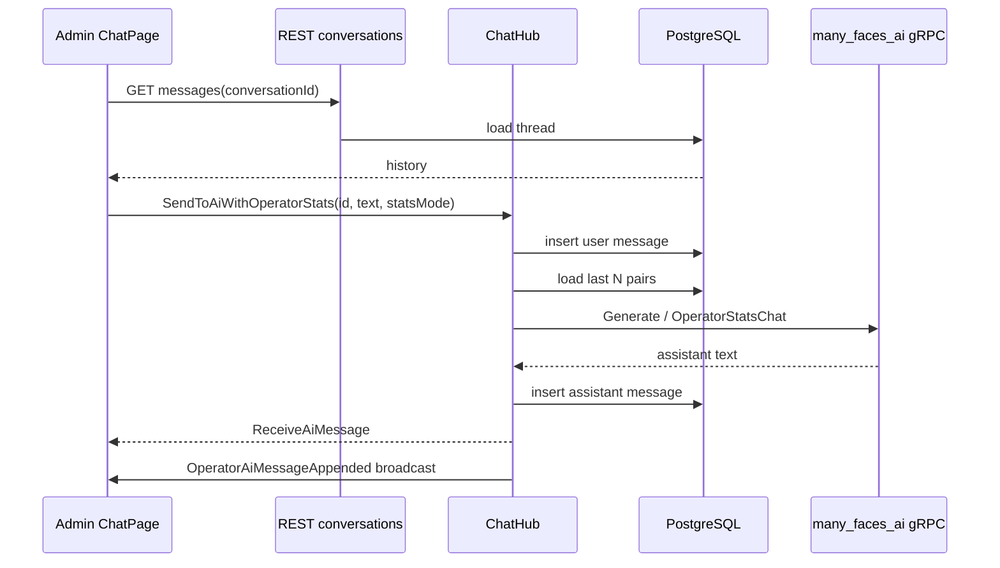
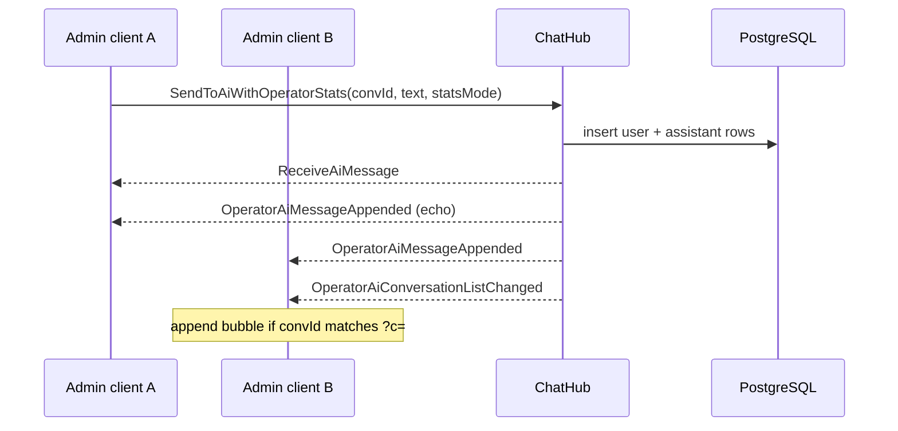
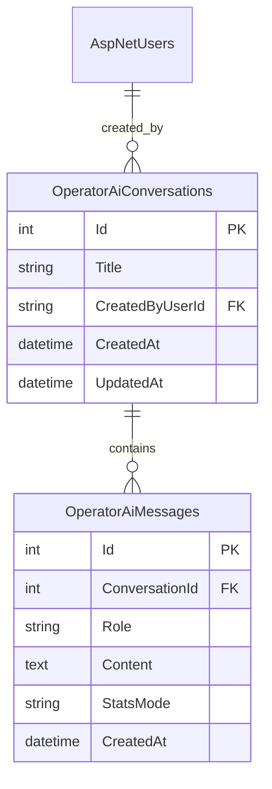
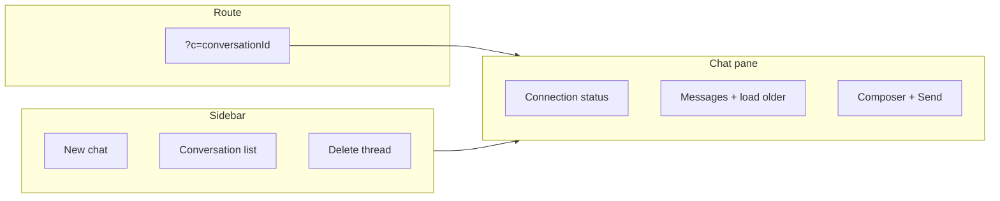
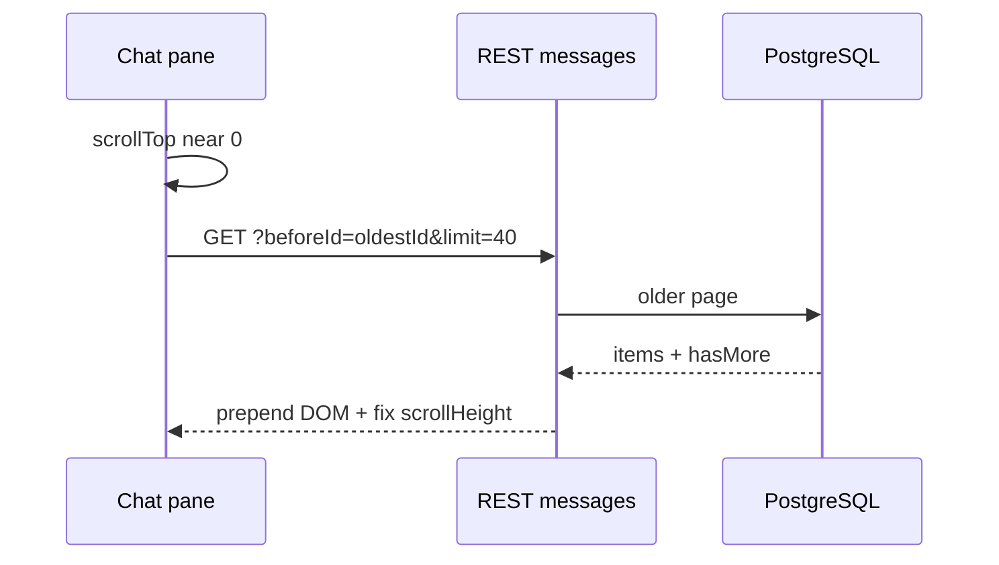
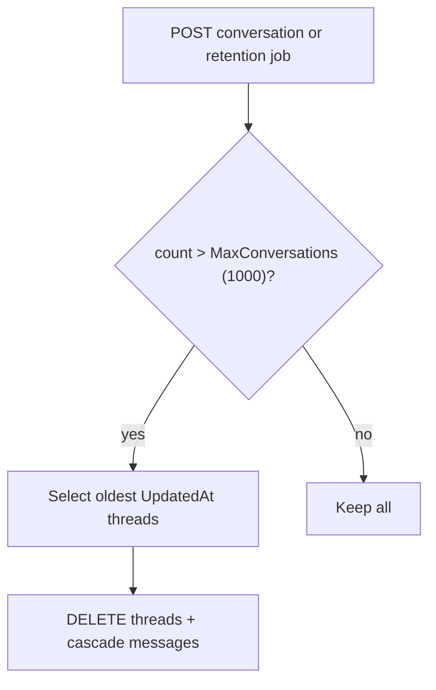
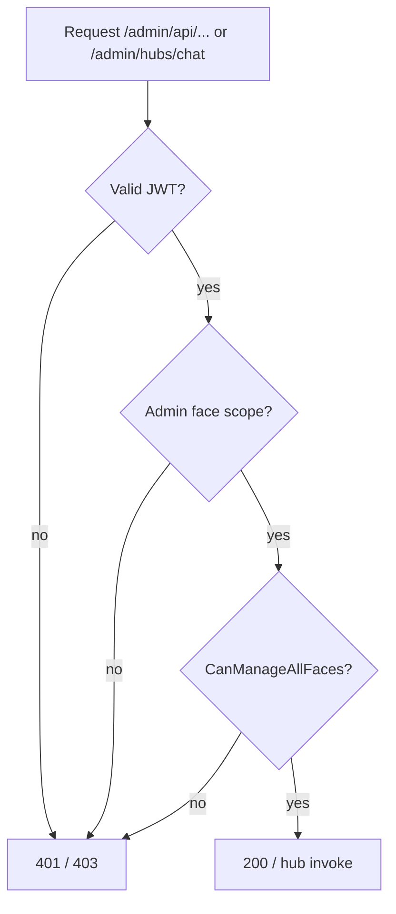
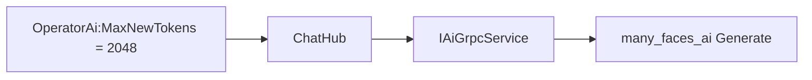

# Admin operator AI chat — threaded conversations

Shared **support inbox** for platform operators (`CanManageAllFaces` on the **admin** face scope). Conversations and messages live in PostgreSQL; the admin SPA uses REST for list/history and SignalR for sends and live sync.

**Related:** [backend-stats-and-admin-ai-runbook.md](./backend-stats-and-admin-ai-runbook.md), [signalr-hub-security-matrix.md](./signalr-hub-security-matrix.md), [admin-operator-ai-chat-threads-agent-prompt.md](../prompts/admin-operator-ai-chat-threads-agent-prompt.md).

## API

| Method | Path | Notes |
|--------|------|--------|
| `GET` | `/admin/api/operator-ai/conversations?limit=50` | All threads, `UpdatedAt` desc |
| `POST` | `/admin/api/operator-ai/conversations` | Body `{ "title": null }` optional |
| `GET` | `/admin/api/operator-ai/conversations/{id}` | Metadata |
| `PATCH` | `/admin/api/operator-ai/conversations/{id}` | Rename |
| `DELETE` | `/admin/api/operator-ai/conversations/{id}` | Hard delete + cascade messages |
| `GET` | `/admin/api/operator-ai/conversations/{id}/messages?limit=40&beforeId=` | Newest page; `beforeId` loads older |
| `GET` | `/admin/api/operator-ai/model-status` | Local Qwen readiness (`ready`, `loading`, `unavailable`) |

## SignalR (`/admin/hubs/chat`)

| Client → server | Args | Notes |
|-----------------|------|--------|
| `SendToAiWithOperatorStats` | `conversationId`, `message`, `statsMode` | Rejects when model not ready; does not persist transient “model loading” replies |

| Server → client | Purpose |
|-----------------|--------|
| `ReceiveAiMessage` | Caller-only AI reply (unchanged) |
| `OperatorAiMessageAppended` | All operators — new user+assistant rows |
| `OperatorAiConversationListChanged` | Sidebar refresh |
| `OperatorAiConversationDeleted` | Thread removed |

Group: `operator_ai_operators` (joined on connect when `CanManageAllFaces`).

## Configuration (`OperatorAi` in `appsettings.json`)

| Key | Default | Purpose |
|-----|---------|---------|
| `MaxHistoryPairs` | 5 | AI context pairs from DB |
| `MaxMessageLength` | 16000 | User message cap |
| `MaxConversations` | 1000 | Retention trim |
| `MessagesPageSize` | 40 | REST page size |
| `MaxNewTokens` | 384 | gRPC generation cap (dev-friendly on CPU) |

## Local AI (`ai-demo-dev`)

| Env | Default (dev compose) | Purpose |
|-----|----------------------|---------|
| `MFAI_AI_MODEL_NAME` | `Qwen/Qwen3-4B-Instruct-2507` | Needs 16g container RAM on CPU |
| `MFAI_PRELOAD_MODEL` | `1` | Blocking load before gRPC accepts traffic |
| `MFAI_FAST_GENERATION` | `0` | Greedy decode when `1` (faster, rougher text on CPU) |
| `MFAI_CONTAINER_CPUS` | `6` | CPU limit + `OMP_NUM_THREADS` |
| `MFAI_CONTAINER_MEM_LIMIT` | `16g` | Hard cap (Docker Desktop must allow ≥16GB for AI) |
| `MFAI_CONTAINER_MEM_RESERVATION` | `16g` | Reserved RAM for the AI container |
| `MFAI_CONTAINER_SHM_SIZE` | `2gb` | Shared memory for PyTorch load |

HealthCheck gRPC `message` is JSON: `{ "ready", "loading", "unavailable", "modelName" }`. Admin polls `model-status` and disables the composer until `ready`.

### Model cache (no re-download on container recreate)

Weights live on the **host** at **`.data/huggingface/`** (bind mount, gitignored). Deleting or recreating `ai-demo-dev` does **not** remove them. Avoid `docker compose down -v` together with deleting `.data/huggingface/`. `./scripts/clear-all-dev.sh` keeps AI and this folder unless you pass **`--clean-ai`** (removes container and deletes `.data/huggingface`). First download of Qwen3-4B is several GB; later starts only load from disk.

## Admin UI

- Route: `/chat?c={conversationId}`
- Left: conversation list, **New chat**, select thread
- Right: messages, scroll-up pagination, composer (disabled until model `ready`; banner while loading)
- Hides legacy DB rows that are transient “model loading” placeholders
- Stats mode: `admin_ai_public_stats_mode` in `localStorage` (unchanged)
- **No** `sessionStorage` chat history

---

### Diagram: D-OAI-01 — Send message

### Diagram: D-OAI-02 — Live sync between operators

### Diagram: D-OAI-03 — Data model

### Diagram: D-OAI-04 — Admin UI layout

### Diagram: D-OAI-05 — Message pagination scroll-up

### Diagram: D-OAI-06 — Retention trim

### Diagram: D-OAI-07 — Auth and face prefix

### Diagram: D-OAI-08 — Config to AI token limit

