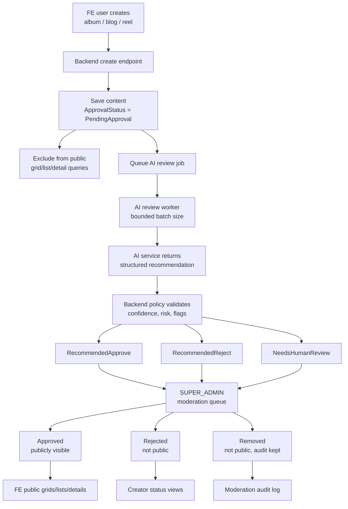

# AI-Assisted Content Approval

This guide describes the intended approval process for user-created content in Many Faces AI. It is a product and engineering reference, not an implementation completion record.

## Scope

The workflow applies to content created by regular users from the user-facing frontend (`fe_demo`):

- Albums
- Blogs
- Reels

It does not cover admin page/grid configuration, chat room creation, stories, ads, or user profiles.

## Product Goal

Users should be able to create useful content inside a face, but that content should not become public immediately. New user-created albums, blogs, and reels should enter an approval process first.

The first implementation phase stores content as `PendingApproval`, keeps it out of public lists, creates an AI review job record, and exposes a superadmin-only moderation queue. A later phase can connect the queued work to a real AI reviewer service and richer operational dashboards.

## Current Implementation Snapshot

The current branch implements the foundation described in this guide:

- `Album`, `Blog`, and `Reel` records include approval status, AI review status/metadata, moderation versioning, human decision metadata, and removal metadata.
- Regular FE-created albums, blogs, and reels are saved as `PendingApproval` and are not returned by public list queries until approved.
- Existing content is protected by migration defaults that keep migrated rows `Approved`.
- Backend moderation APIs list moderation items and allow approve/reject/remove actions for `SUPER_ADMIN` only.
- `ADMIN`, `FACE_ADMIN`, and regular FE users cannot approve, reject, or remove content through the moderation API.
- `AiReviewJobs` and `ContentModerationEvents` provide the queue/audit foundation for future AI processing.
- `fe_demo` shows creator-facing submitted-for-approval copy after album/blog/reel create.
- `admin_demo` includes a first `Moderation` screen for superadmin review actions.

The current AI integration is intentionally a queue/contract foundation. It does not make autonomous publish/remove decisions.

## Core Rule

Regular FE user-created content should start as:

- `PendingApproval`

Existing public content and admin-created content should not be accidentally hidden. The recommended default is:

- existing migrated content: `Approved`
- admin-created content: `Approved`
- regular FE-created content: `PendingApproval`

## Content Statuses

Keep the final public lifecycle separate from AI processing state.

Implemented content status:

- `PendingApproval` - created by a regular FE user and waiting for review
- `Approved` - public and visible in normal grid/list/detail views
- `Rejected` - not public; creator may see a safe rejection message
- `Removed` - was public or reviewed, then removed by an authorized admin/superadmin

Optional:

- `Draft` - only if product wants explicit draft editing before submission

## AI Review Statuses

AI review is a processing/recommendation state, not the same thing as final publication.

Implemented AI review status:

- `NotQueued`
- `Queued`
- `InProgress`
- `RecommendedApprove`
- `RecommendedReject`
- `NeedsHumanReview`
- `Failed`

This separation allows the system to say: “AI recommended reject, but a superadmin approved with a reason” without losing history.

## High-Level Flow



## Backend Responsibilities

The backend is the source of truth for approval status and visibility.

Required responsibilities:

- Set regular FE-created albums/blogs/reels to `PendingApproval`.
- Store approval metadata and creator ownership.
- Keep public queries filtered to `Approved`.
- Prevent users from approving their own content through public APIs.
- Expose protected review/moderation APIs for `SUPER_ADMIN` only in this phase.
- Store AI recommendation metadata separately from final status.
- Apply backend policy before any auto-transition.
- Write audit events for submit, approve, reject, remove, and override-style transitions.

Implemented approval metadata includes:

- `ApprovalStatus`
- `SubmittedAtUtc`
- `HumanReviewedAtUtc`
- `HumanReviewedByUserId`
- `HumanDecisionReason`
- `RemovedAtUtc`
- `RemovedByUserId`
- `RemovalReason`
- `CreatedByUserId` / creator ownership fields
- `ModerationVersion`

Recommended AI metadata:

- `AiReviewStatus`
- `AiReviewDecision`
- `AiReviewConfidence`
- `AiReviewRiskLevel`
- `AiReviewFlagsJson`
- `AiReviewReason`
- `AiReviewUserMessage`
- `AiReviewModelVersion`
- `AiReviewTraceId`
- `AiReviewedAtUtc`

## AI Reviewer Responsibilities

AI should return structured recommendations. It should not be treated as an unrestricted autonomous publisher by default.

Safe first rule:

- AI recommends.
- Backend policy validates.
- `SUPER_ADMIN` finalizes in the current implementation.
- Every decision is auditable.

Target AI response shape:

```json
{
  "decision": "approve | reject | needs_human_review",
  "confidence": 0.92,
  "riskLevel": "low | medium | high",
  "flags": ["spam", "unsafe_link", "low_quality"],
  "reason": "Internal explanation for admins.",
  "userMessage": "Safe optional message for the creator.",
  "modelVersion": "moderation-v1",
  "traceId": "ai-review-..."
}
```

Backend must treat invalid, incomplete, low-confidence, or high-risk AI responses as `NeedsHumanReview`.

## AI Queue And Backpressure

AI review should not run directly in the user create request. The create request should save content and enqueue review work.

Recommended job fields:

- `ContentType`
- `ContentId`
- `FaceId`
- `CreatedByUserId`
- `Priority`
- `Status`
- `Attempts`
- `MaxAttempts`
- `NextAttemptAtUtc`
- `CreatedAtUtc`
- `StartedAtUtc`
- `CompletedAtUtc`
- `LastError`

Recommended controls:

- global max concurrent reviews
- per-face queue limits
- per-user submission limits
- fixed batch sizes
- retry backoff
- max attempts
- duplicate/version detection
- circuit breaker when AI is unavailable
- fallback to `NeedsHumanReview`

If the queue is overloaded, content should remain `PendingApproval`; overload must never publish content.

## Admin Moderation

The admin portal exposes a first dedicated moderation area.

Target tabs/queues:

- Pending
- AI Recommended Approval
- AI Recommended Rejection
- Needs Human Review
- Approved
- Rejected
- Removed

Recommended filters:

- content type
- face
- author
- approval status
- AI review status
- risk level
- AI flags
- confidence range
- date range
- reviewer

Recommended detail view:

- content preview
- author and face metadata
- current approval status
- AI recommendation
- AI reason and flags
- safe user-facing rejection message
- moderation history
- approve / reject / remove actions
- superadmin override action with required reason

## Superadmin Rules

`SUPER_ADMIN` can override the moderation system.

Allowed actions:

- approve pending content
- approve AI-rejected content
- reject AI-approved content
- reject pending content
- remove already approved content
- view AI metadata and audit history
- override AI recommendations with a reason

Prefer `Removed` over hard delete for moderation removals. This keeps auditability and makes later review possible.

Current phase rule:

- `SUPER_ADMIN` may approve, reject, and remove content.
- `ADMIN` and `FACE_ADMIN` may not approve, reject, or remove user-created albums/blogs/reels.
- UI gating is for user experience only; backend enforcement is mandatory and covered by tests.

## Audit Log

Every important transition should write a moderation event.

Recommended event fields:

- `ContentType`
- `ContentId`
- `FaceId`
- `OldApprovalStatus`
- `NewApprovalStatus`
- `OldAiReviewStatus`
- `NewAiReviewStatus`
- `ActorType`
- `ActorUserId`
- `Reason`
- `UserMessage`
- `AiTraceId`
- `AiModelVersion`
- `CreatedAtUtc`

Events to log:

- content submitted
- AI job queued
- AI processing started
- AI recommendation completed
- AI failed / retry scheduled / human review required
- admin approved
- admin rejected
- superadmin override
- approved content removed
- removed content restored, if supported

## FE User Experience

The creator should receive clear copy after submitting content:

- “Submitted for approval.”
- “Your content was created and is waiting for review.”
- “This item is not public yet.”

Creator-owned content views can show:

- Pending approval
- Under AI review
- Needs review
- Approved
- Rejected
- Removed

Do not expose internal AI flags, trace ids, or model details to regular users. Show only safe user-facing messages.

## Resubmission

If rejected content can be edited and resubmitted:

- increment a moderation version or create a new content version
- reset status to `PendingApproval`
- enqueue a new AI review
- keep old moderation events

Do not overwrite old rejection reasons or AI decisions without history.

## Implementation Phases

Phase 1:

- Add pending approval status for FE-created albums/blogs/reels.
- Filter public queries to approved content.
- Add user-facing submitted/pending copy.

Phase 2A:

- Add AI review status and metadata.
- Add queue/job model.
- Add admin moderation lists without real AI.

Phase 2B:

- Add typed AI reviewer contract.
- Add mock AI reviewer.
- Store recommendations.

Phase 2C:

- Add admin moderation detail screen.
- Add approve/reject/remove/superadmin override.
- Add audit log UI.

Phase 2D:

- Connect real AI service.
- Add queue backpressure and retry policies.
- Add model/version tracing.

Phase 2E:

- Optional controlled auto-approval for low-risk/high-confidence content.
- Add per-face policy config and superadmin kill switch.

