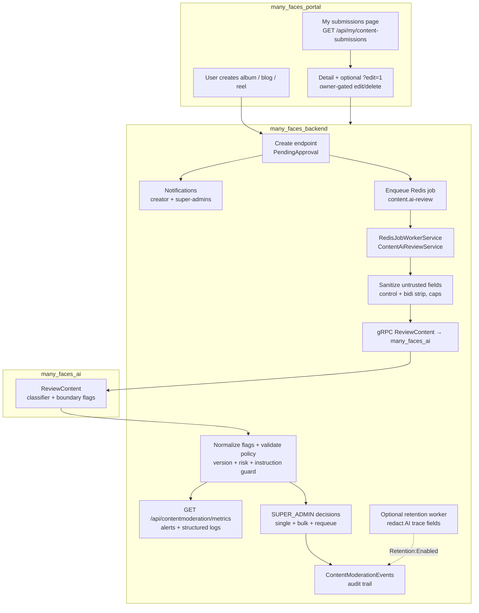
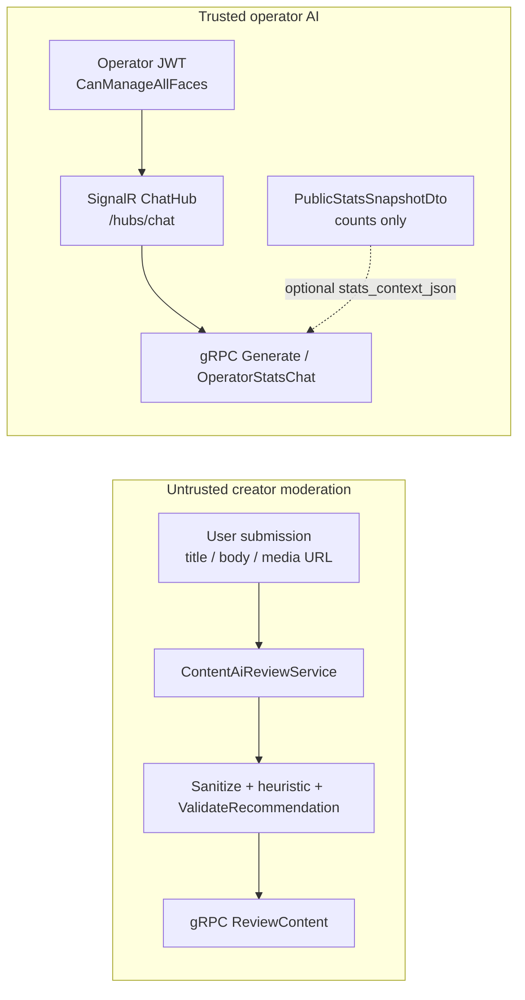

# AI-Assisted Content Approval

This guide is the **product and engineering reference** for how user-created albums, blogs, and reels move from submission to publication in Many Faces AI. It reflects the **current reference implementation** in `many_faces_backend`, `many_faces_portal`, `many_faces_admin`, `many_faces_ai`, and the **read path** for creators on **`many_faces_mobile`** (see table below), plus optional roadmap items.

**Related:** implementation task checklist (ticked items) — [`../prompts/user-content-approval-extensions-implementation-checklist.md`](../prompts/user-content-approval-extensions-implementation-checklist.md).

## Scope

The workflow applies to content created by **regular users** from the user-facing frontend (`many_faces_portal`) and to the **same creator API** when surfaced on mobile (`many_faces_mobile` — list + read-only detail today; mutations still portal-first):

- Albums
- Blogs
- Reels

It does not cover admin page/grid configuration, chat room creation, stories, ads, or user profiles (unless they reuse the same notification infrastructure).

## Product Goal

Users create content inside a **face**, but **non-approved** items must **not** appear in public grids, lists, or detail views for other users. The backend owns **approval status**, **public visibility**, **AI job lifecycle**, **audit events**, and **who may finalize** moderation decisions.

**Safety rule (unchanged):**

- **AI recommends** (structured gRPC response).
- **Backend policy validates** (ranges, risk, stale moderation version).
- **`SUPER_ADMIN` finalizes** approve / reject / remove in the current phase (no `ADMIN` / `FACE_ADMIN` moderation powers on this queue unless product explicitly changes that).

## What Is Implemented Today

| Area | Behaviour |
|------|-----------|
| **Persistence** | `Album`, `Blog`, `Reel` carry `ApprovalStatus`, AI fields, moderation version, human/removal metadata, `SubmittedAtUtc`. |
| **Defaults** | Regular FE creates → `PendingApproval`. Migrated / admin-created paths default to `Approved` where applicable. |
| **Public API** | List/grid/detail queries return **only `Approved`** content for non-owners; owners may load their own pending/rejected items for detail/edit flows. |
| **AI pipeline** | Redis job type `content.ai-review`; `ContentAiReviewService` sanitizes untrusted title/body/media URL before gRPC, merges optional **`instruction_like_text`** heuristic on stored content, normalizes AI flags, validates policy, then calls `many_faces_ai` `ReviewContent`; retries with backoff, escalates to `NeedsHumanReview` after max attempts. |
| **AI service** | Deterministic classifier (text + media URL metadata) with the same input normalization at RPC entry + optional Qwen `Generate` for other features; `ReviewContent` adds `image_analysis_boundary` / `video_analysis_boundary` flags for future heavy models without using them as sole reject triggers. |
| **Admin** | `ContentModerationController`: queue with filters (type, status, AI status, face, author, risk, flags substring, confidence band, submitted window, reviewer, queue age, moderation version), metrics `{ metrics, alerts }`, per-item actions, **bulk** approve/reject/remove/requeue, audit events. |
| **Creator FE** | `GET /api/my/content-submissions`, **My submissions** page (`/my-submissions`), grouping helpers, safe reasons, links to detail with optional `?edit=1`, edit/delete gated on owner + pending/rejected. |
| **Creator mobile** | Same **`GET /api/my/content-submissions`** (face-scoped via `faceScope`); **`MySubmissionsScreen`** + **`MySubmissionDetailScreen`** (read-only detail from list cache). **No** native `?edit=1` / edit form / delete yet — portal remains canonical for mutations until ported. |
| **Notifications** | `IContentModerationNotifier` writes `Notification` rows for creator + super-admins on submit and when AI exhausts retries. |
| **Retention** | `ContentRetentionCleanupService` + hosted worker: optional `Retention:` config; dry-run vs execute; redacts internal AI trace fields after policy delay; `ModerationActorType.Retention` audit events. |
| **Tests** | Backend integration tests for visibility, bulk, retention, alerts, **prompt-injection defenses** (`ContentModerationTests`, `ContentModerationSecurityEdgeTests`, `ContentModerationUnicodeSpoofingTests` for SHV2 **PI-6**, `ContentModerationTrustBoundaryTests` for SHV2 **PI-9** untrusted vs operator AI split); FE/admin helpers covered by Vitest; AI `ReviewContent` + `moderation_input_sanitize` tests in `many_faces_ai`; mobile grouping + response normalisation in `many_faces_mobile` Jest (`contentModeration`, `myContentSubmissionsApi`). |

## Core Rule

Regular FE user-created content starts as:

- **`PendingApproval`**

Existing public content should not be hidden accidentally:

- **Migrated content:** `Approved` (via migration defaults).
- **Admin-created / product-chosen paths:** typically `Approved` unless explicitly submitted through the same pending flow.

## Content Statuses (`ContentApprovalStatus`)

| Status | Meaning |
|--------|---------|
| `PendingApproval` | Awaiting human decision; not public to others. |
| `Approved` | Shown in normal public catalog/detail flows. |
| `Rejected` | Not public; creator may see safe message; may edit/resubmit per policy. |
| `Removed` | Removed from publication; audit retained; prefer soft semantics over hard delete for moderation. |

## AI Review Statuses (`AiReviewStatus`)

AI state is **separate** from final approval so history can record “AI recommended reject, superadmin approved with reason”.

Implemented values: `NotQueued`, `Queued`, `InProgress`, `RecommendedApprove`, `RecommendedReject`, `NeedsHumanReview`, `Failed`.

## High-Level Flow



## Key HTTP Endpoints (summary)

| Method | Path | Role | Notes |
|--------|------|------|--------|
| GET | `/api/my/content-submissions` | Authenticated creator | Unified list with `canEdit` / `canDelete`; safe fields only. |
| GET | `/api/contentmoderation` | `SUPER_ADMIN` | Filterable moderation queue. |
| GET | `/api/contentmoderation/metrics` | `SUPER_ADMIN` | JSON `{ metrics, alerts }`; alerts also logged. |
| POST | `/api/contentmoderation/bulk` | `SUPER_ADMIN` | Per-item results; reasons required for reject/remove. |
| POST | `/api/contentmoderation/{type}/{id}/approve|reject|remove` | `SUPER_ADMIN` | Single-item decisions. |
| GET | `/api/contentmoderation/{type}/{id}/events` | `SUPER_ADMIN` | Audit history. |

Public album/blog/reel list endpoints remain **`Approved`-only** for anonymous or non-owning callers; detail routes enforce owner vs public rules in controllers.

## AI Response Shape (contract)

The gRPC layer maps to persisted fields including:

- `decision` → validated enum
- `confidence`, `riskLevel`, `flags[]`
- `reason` (internal / admin-facing where appropriate)
- `userMessage` (creator-safe)
- `modelVersion`, `traceId`

Invalid or high-risk combinations are forced to **`NeedsHumanReview`** after validation in the backend worker.

## Untrusted creator content vs trusted operator AI (SHV2 PI-9)

Many Faces AI exposes **two separate trust models**. Confusing them would either block legitimate operator tooling or leave creator prompt-injection undefended.

| Dimension | **Untrusted — creator moderation** | **Trusted — operator AI** |
|-----------|-----------------------------------|---------------------------|
| **Who supplies input** | Any authenticated user submitting album / blog / reel | Platform operators with **`CanManageAllFaces`** (admin face scope) |
| **What is sent to AI** | Title, body/description, media URL from the submission | Operator chat message + optional **aggregate public stats** JSON (counts only) |
| **Transport** | Redis `content.ai-review` → `ContentAiReviewService` → gRPC **`ReviewContent`** | SignalR **`/hubs/chat`** → `ChatHub` → gRPC **`Generate`** / **`OperatorStatsChat`** / **`FetchPublicStats`** |
| **Prompt-injection defenses** | **Yes** — sanitizer, instruction heuristic, `ValidateRecommendation`, corpus tests | **No** — not the same as auto-publish moderation; ACL + rate limit + stats URL policy instead |
| **Auto-approve risk** | AI **`RecommendedApprove`** can influence queue; policy must block unsafe combos | Chat replies are **not** written to `ApprovalStatus`; no creator content is published from chat |
| **Code anchors** | `ContentModerationInputSanitizer`, `ContentModerationPromptInjectionHeuristic`, `ContentModerationTrustBoundary.UntrustedAiRpcName` | `GET /api/Stats/public`, `PublicStatsSnapshotDto`, `ContentModerationTrustBoundary.TrustedOperatorAiRpcNames` |
| **Spec** | [`moderation-content-prompt-injection-defense-agent-prompt.md`](../prompts/moderation-content-prompt-injection-defense-agent-prompt.md) | [`admin-ai-public-stats-operator-chat-agent-prompt.md`](../prompts/admin-ai-public-stats-operator-chat-agent-prompt.md) |



**Rules of thumb**

1. Never pass creator submission fields through **`Generate`** for moderation decisions; never pass **`stats_context_json`** through **`ReviewContent`**.
2. **`ContentModeration:InstructionHeuristicEnabled`** and red-team corpus tests apply **only** to the untrusted path (`ContentModerationTrustBoundaryTests` in `BeDemo.Api.Tests`).
3. Operator chat may contain arbitrary natural language; threat model is **misuse of privileged access**, not **anonymous auto-approve of public UGC**. Still: stats context must remain **non-row-level** (see public stats prompt).
4. Admin moderation UI shows **text fields as plain text** in the queue/detail drawer (no `dangerouslySetInnerHTML` on untrusted preview — SHV2 **PI-8** tracks any future body preview).

### Untrusted moderation pipeline (detail)

Album, blog, and reel text (and media URLs) are **untrusted**: they must not be able to steer the moderation classifier as if it were a chat “system” message. The implementation uses **defense in depth**:

- **Backend (`ContentAiReviewService`)** strips bidi / zero-width / disallowed control characters and caps field sizes before building the gRPC `ReviewContent` request; optional **`instruction_like_text`** heuristic flags obvious prompt-injection phrasing on the **stored** submission.
- **Policy (`ContentModerationHelpers.ValidateRecommendation`)** never allows **`Approve`** together with **`instruction_like_text`**: that combination is normalized to **human review** with an explicit fallback reason.
- **`many_faces_ai`** applies the same normalization at the start of **`ReviewContent`** so delimiter-smuggling cannot bypass keyword checks inside the Python process.

AI `flags` from the wire are **whitelisted and canonicalized** before persistence; unknown flag strings are dropped.

### Trusted operator AI (detail)

- **`GET /api/Stats/public`** — `[AllowAnonymous]` only under the **`public`** face prefix; returns **`PublicStatsSnapshotDto`** (numeric aggregates, no message bodies, no moderation audit payloads).
- **SignalR** — `SendToAi` / `SendToAiWithOperatorStats`; latter requires **`CanManageAllFaces`** and reuses **`IChatHubAiRateLimiter`**.
- **Modes** — `off` | `inline` | `live` via admin `localStorage` key `admin_ai_public_stats_mode` (see operator AI prompt).
- **Hub security matrix** — [`signalr-hub-security-matrix.md`](./signalr-hub-security-matrix.md).

### Configuration

| Setting | Location | Purpose |
|--------|----------|---------|
| `ContentModeration:InstructionHeuristicEnabled` | `many_faces_backend` `appsettings*.json` | When `true` (default), stored title/body/media URL are scanned for instruction-like phrases; **`Approve` + `instruction_like_text`** always becomes human review after validation. Set `false` only for narrow diagnostics or tests. |

### Edge cases covered by automated tests

- **Sanitizer:** C0 controls (except tab/LF/CR), bidi and zero-width code points, BOM, length caps for title/body/media URL.
- **Heuristic:** Phrases in title, HTML body, or reel `VideoUrl` query text (including percent-encoded query stuffing); negative examples that must not match; case-insensitive matching after normalization.
- **Policy:** `Approve` blocked when the instruction flag survives normalization; `Reject` with the same flag remains valid when a reject reason is present; unknown AI flags dropped; duplicate canonical flags collapsed.
- **Red-team corpus:** `many_faces_backend/BeDemo.Api.Tests/Fixtures/prompt_injection_corpus.txt` (≥20 attack lines). `ContentModerationSecurityEdgeTests` asserts each line cannot yield `AiReviewStatus.RecommendedApprove` when the AI returns high-confidence `Approve`; `ContentModerationUntrustedContentEvaluator` mirrors the worker merge path in pure functions.
- **Unicode spoofing (SHV2 PI-6):** bidi controls (LRE/RLO/LRI/PDI), zero-width joiners, and Cyrillic/Greek homoglyphs are stripped from gRPC wire fields via `ContentModerationInputSanitizer` and folded in `ContentModerationUnicodeHomoglyphFold` + `ContentModerationTextNormalization.BuildHeuristicScanBlob` so instruction heuristics still match smuggled phrases. Tests: `ContentModerationUnicodeSpoofingTests`; corpus includes bidi-wrapped and homoglyph `ignore previous` lines.
- **Invalid Redis payload logging (SHV2 PI-7):** malformed `content.ai-review` jobs log only `ContentModerationHelpers.FormatInvalidAiReviewPayloadForLog` diagnostics (length, hash prefix, safe ids) — never raw JSON that may contain smuggled title/body. Tests: `ContentModerationPayloadLogRedactionTests`.
- **Trust boundary (SHV2 PI-9):** `ContentModerationTrustBoundary` + `ContentModerationTrustBoundaryTests` — `ReviewContent` vs `Generate`/`OperatorStatsChat`; public stats JSON must not match instruction heuristic.
- **Python:** Same sanitizer limits at `ReviewContent` entry plus classifier behaviour on delimiter-smuggled keywords.

Run corpus-related tests:

```bash
cd many_faces_backend && dotnet test --filter "FullyQualifiedName~ContentModerationSecurityEdgeTests"
cd many_faces_backend && dotnet test --filter "FullyQualifiedName~ContentModerationUnicodeSpoofing"
cd many_faces_backend && dotnet test --filter "FullyQualifiedName~ContentModerationTrustBoundary"
```

## Redis Queue And Backpressure

- Jobs are **not** processed synchronously on HTTP create.
- Worker respects **retry delay**, **max attempts**, **stale moderation version** (ignored jobs), and terminal states.
- Overload must **never** auto-publish: worst case content stays `PendingApproval` with AI in `Queued` / `Failed` / `NeedsHumanReview`.

## Admin Moderation UI (`many_faces_admin`)

The **Moderation** area (superadmin-gated in UI; backend enforces the same):

- Primary + secondary **filter** rows aligned with backend query parameters.
- **Metrics** cards: pending, AI queue states, failed jobs, oldest pending, avg/P95 latency, human-review counts, timeout-ish job heuristic, top flags table, pending-by-face table.
- **Operational banner** when queue age, failed jobs, or alert severities warrant attention.
- **Bulk** selection, shared reason, confirmation for destructive actions, per-item result summary.
- **Detail drawer** with audit timeline.

## Creator Experience (`many_faces_portal`)

- After create: submitted-for-approval copy (existing success paths).
- **My submissions:** grouped cards (pending, under AI review, needs review, approved, rejected, removed) with safe truncated reasons.
- **Detail pages:** edit/delete controls only for **owner** and while status is **pending or rejected**; `?edit=1` opens the editor when allowed.

Internal AI diagnostics (raw model reason, trace IDs, flag dumps) are **not** shown to regular users in copy or badges.

## Retention And Privacy (local development policy)

Configured under **`Retention`** in `many_faces_backend` `appsettings` (see submodule README):

- `Enabled` — run hosted loop (default off in many dev profiles).
- `Execute` — `false` = dry-run counts only; `true` = persist redactions.
- `IntervalHours` — spacing between runs.

Policy redacts **internal AI trace fields** on rejected/removed content whose human/removal decision is older than **`DefaultRetentionDays`** (**180** days in `ContentModerationHelpers`), preserves **audit events**, and records retention actions with **`ModerationActorType.Retention`**.

## Audit Log

`ContentModerationEvents` capture submit, AI progress, recommendations, failures, human decisions, bulk actions, and retention. Reasons passed through `RedactForAudit` for very long strings.

## Resubmission

Rejected (or edited pending) content flows through existing **update** endpoints: increment **`ModerationVersion`**, reset pipeline to **`PendingApproval`**, enqueue a **new** AI job, preserve prior events.

## Roadmap (optional, not required for the current reference stack)

- Controlled auto-approval for strictly defined low-risk profiles.
- Per-face moderation policy configuration.
- Heavier image/video models behind the existing **boundary** flags.
- External alerting integrations (today: structured logs + admin UI alerts).

## Related agent specifications

- **Prompt-injection defense** for untrusted creator content in the `ReviewContent` / moderation pipeline (sanitization, policy, tests): [`../prompts/moderation-content-prompt-injection-defense-agent-prompt.md`](../prompts/moderation-content-prompt-injection-defense-agent-prompt.md).
- **Trusted operator AI** (admin chat + public stats — explicitly **out of scope** for moderation sanitizer/heuristic): [`../prompts/admin-ai-public-stats-operator-chat-agent-prompt.md`](../prompts/admin-ai-public-stats-operator-chat-agent-prompt.md).
- **Security hardening v2 PI-9** task list: [`../prompts/security-hardening-v2-agent-prompt.md`](../prompts/security-hardening-v2-agent-prompt.md) §4.

## Implementation Phase Checklist (historical)

The work originally rolled out in slices; the rows below are **done** in the current monorepo reference stack unless explicitly listed as roadmap above.

- **Phase 1 — Pending + public filtering + FE copy:** done.
- **Phase 2 — AI jobs, gRPC contract, worker, validation, metrics, admin detail/bulk, creator submissions + notifications, retention helpers:** done.
- **Phase 3+ — optional auto-approve, per-face policy, external ops integrations:** not implemented unless added later.

For agent prompts and extension ideas, see also [`../prompts/fe-user-content-ai-approval-workflow-agent-prompt.md`](../prompts/fe-user-content-ai-approval-workflow-agent-prompt.md) and [`../prompts/user-content-approval-extensions-agent-prompt.md`](../prompts/user-content-approval-extensions-agent-prompt.md).
