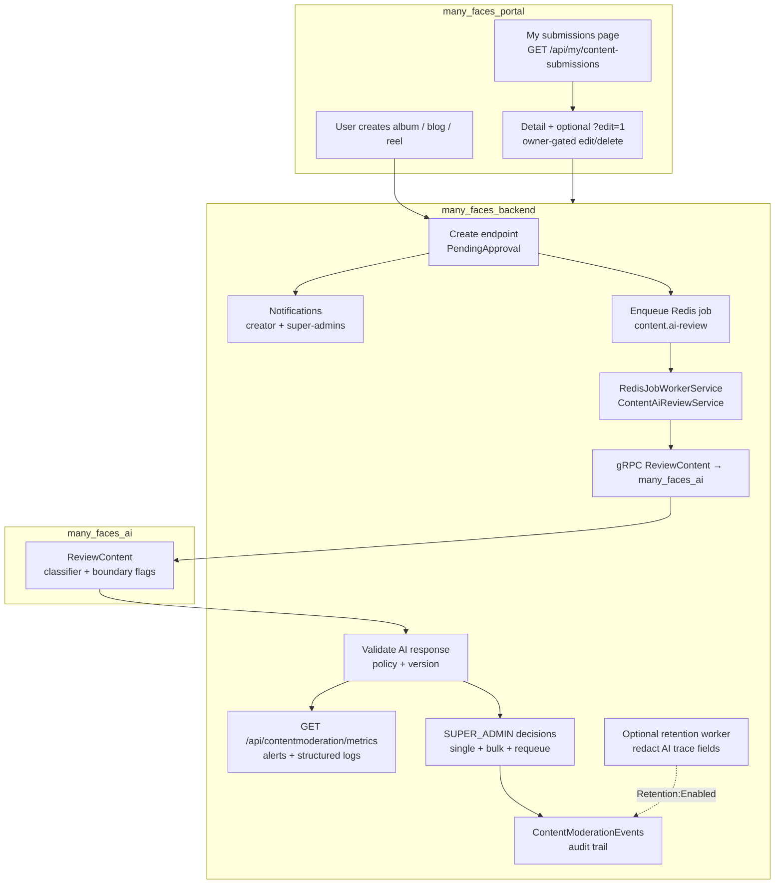

# AI-Assisted Content Approval

This guide is the **product and engineering reference** for how user-created albums, blogs, and reels move from submission to publication in Many Faces AI. It reflects the **current demo implementation** in `many_faces_backend`, `many_faces_portal`, `many_faces_admin`, and `many_faces_ai`, plus optional roadmap items.

**Related:** implementation task checklist (ticked items) — [`../prompts/user-content-approval-extensions-implementation-checklist.md`](../prompts/user-content-approval-extensions-implementation-checklist.md).

## Scope

The workflow applies to content created by **regular users** from the user-facing frontend (`many_faces_portal`):

- Albums
- Blogs
- Reels

It does not cover admin page/grid configuration, chat room creation, stories, ads, or user profiles (unless they reuse the same notification infrastructure).

## Product Goal

Users create content inside a **face**, but **non-approved** items must **not** appear in public grids, lists, or detail views for other users. The backend owns **approval status**, **public visibility**, **AI job lifecycle**, **audit events**, and **who may finalize** moderation decisions.

**Safety rule (unchanged):**

- **AI recommends** (structured gRPC response).
- **Backend policy validates** (ranges, risk, stale moderation version).
- **`SUPER_ADMIN` finalizes** approve / reject / remove in the current phase (no `ADMIN` / `FACE_ADMIN` moderation powers on this queue unless product explicitly changes that).

## What Is Implemented Today

| Area | Behaviour |
|------|-----------|
| **Persistence** | `Album`, `Blog`, `Reel` carry `ApprovalStatus`, AI fields, moderation version, human/removal metadata, `SubmittedAtUtc`. |
| **Defaults** | Regular FE creates → `PendingApproval`. Migrated / admin-created paths default to `Approved` where applicable. |
| **Public API** | List/grid/detail queries return **only `Approved`** content for non-owners; owners may load their own pending/rejected items for detail/edit flows. |
| **AI pipeline** | Redis job type `content.ai-review`; `ContentAiReviewService` calls `many_faces_ai` `ReviewContent`, validates response, retries with backoff, escalates to `NeedsHumanReview` after max attempts. |
| **AI service** | Deterministic classifier (text + media URL metadata) + optional Qwen `Generate` for other features; `ReviewContent` adds `image_analysis_boundary` / `video_analysis_boundary` flags for future heavy models without using them as sole reject triggers. |
| **Admin** | `ContentModerationController`: queue with filters (type, status, AI status, face, author, risk, flags substring, confidence band, submitted window, reviewer, queue age, moderation version), metrics `{ metrics, alerts }`, per-item actions, **bulk** approve/reject/remove/requeue, audit events. |
| **Creator FE** | `GET /api/my/content-submissions`, **My submissions** page (`/my-submissions`), grouping helpers, safe reasons, links to detail with optional `?edit=1`, edit/delete gated on owner + pending/rejected. |
| **Notifications** | `IContentModerationNotifier` writes `Notification` rows for creator + super-admins on submit and when AI exhausts retries. |
| **Retention** | `ContentRetentionCleanupService` + hosted worker: optional `Retention:` config; dry-run vs execute; redacts internal AI trace fields after policy delay; `ModerationActorType.Retention` audit events. |
| **Tests** | Backend integration tests for visibility, bulk, retention, alerts; FE/admin helpers covered by Vitest; AI `ReviewContent` tests in `many_faces_ai/test_server.py`. |

## Core Rule

Regular FE user-created content starts as:

- **`PendingApproval`**

Existing public content should not be hidden accidentally:

- **Migrated content:** `Approved` (via migration defaults).
- **Admin-created / product-chosen paths:** typically `Approved` unless explicitly submitted through the same pending flow.

## Content Statuses (`ContentApprovalStatus`)

| Status | Meaning |
|--------|---------|
| `PendingApproval` | Awaiting human decision; not public to others. |
| `Approved` | Shown in normal public catalog/detail flows. |
| `Rejected` | Not public; creator may see safe message; may edit/resubmit per policy. |
| `Removed` | Removed from publication; audit retained; prefer soft semantics over hard delete for moderation. |

## AI Review Statuses (`AiReviewStatus`)

AI state is **separate** from final approval so history can record “AI recommended reject, superadmin approved with reason”.

Implemented values: `NotQueued`, `Queued`, `InProgress`, `RecommendedApprove`, `RecommendedReject`, `NeedsHumanReview`, `Failed`.

## High-Level Flow

## Key HTTP Endpoints (summary)

| Method | Path | Role | Notes |
|--------|------|------|--------|
| GET | `/api/my/content-submissions` | Authenticated creator | Unified list with `canEdit` / `canDelete`; safe fields only. |
| GET | `/api/contentmoderation` | `SUPER_ADMIN` | Filterable moderation queue. |
| GET | `/api/contentmoderation/metrics` | `SUPER_ADMIN` | JSON `{ metrics, alerts }`; alerts also logged. |
| POST | `/api/contentmoderation/bulk` | `SUPER_ADMIN` | Per-item results; reasons required for reject/remove. |
| POST | `/api/contentmoderation/{type}/{id}/approve|reject|remove` | `SUPER_ADMIN` | Single-item decisions. |
| GET | `/api/contentmoderation/{type}/{id}/events` | `SUPER_ADMIN` | Audit history. |

Public album/blog/reel list endpoints remain **`Approved`-only** for anonymous or non-owning callers; detail routes enforce owner vs public rules in controllers.

## AI Response Shape (contract)

The gRPC layer maps to persisted fields including:

- `decision` → validated enum
- `confidence`, `riskLevel`, `flags[]`
- `reason` (internal / admin-facing where appropriate)
- `userMessage` (creator-safe)
- `modelVersion`, `traceId`

Invalid or high-risk combinations are forced to **`NeedsHumanReview`** after validation in the backend worker.

## Redis Queue And Backpressure

- Jobs are **not** processed synchronously on HTTP create.
- Worker respects **retry delay**, **max attempts**, **stale moderation version** (ignored jobs), and terminal states.
- Overload must **never** auto-publish: worst case content stays `PendingApproval` with AI in `Queued` / `Failed` / `NeedsHumanReview`.

## Admin Moderation UI (`many_faces_admin`)

The **Moderation** area (superadmin-gated in UI; backend enforces the same):

- Primary + secondary **filter** rows aligned with backend query parameters.
- **Metrics** cards: pending, AI queue states, failed jobs, oldest pending, avg/P95 latency, human-review counts, timeout-ish job heuristic, top flags table, pending-by-face table.
- **Operational banner** when queue age, failed jobs, or alert severities warrant attention.
- **Bulk** selection, shared reason, confirmation for destructive actions, per-item result summary.
- **Detail drawer** with audit timeline.

## Creator Experience (`many_faces_portal`)

- After create: submitted-for-approval copy (existing success paths).
- **My submissions:** grouped cards (pending, under AI review, needs review, approved, rejected, removed) with safe truncated reasons.
- **Detail pages:** edit/delete controls only for **owner** and while status is **pending or rejected**; `?edit=1` opens the editor when allowed.

Internal AI diagnostics (raw model reason, trace IDs, flag dumps) are **not** shown to regular users in copy or badges.

## Retention And Privacy (demo policy)

Configured under **`Retention`** in `many_faces_backend` `appsettings` (see submodule README):

- `Enabled` — run hosted loop (default off in many dev profiles).
- `Execute` — `false` = dry-run counts only; `true` = persist redactions.
- `IntervalHours` — spacing between runs.

Policy redacts **internal AI trace fields** on rejected/removed content whose human/removal decision is older than **`DefaultRetentionDays`** (**180** days in `ContentModerationHelpers`), preserves **audit events**, and records retention actions with **`ModerationActorType.Retention`**.

## Audit Log

`ContentModerationEvents` capture submit, AI progress, recommendations, failures, human decisions, bulk actions, and retention. Reasons passed through `RedactForAudit` for very long strings.

## Resubmission

Rejected (or edited pending) content flows through existing **update** endpoints: increment **`ModerationVersion`**, reset pipeline to **`PendingApproval`**, enqueue a **new** AI job, preserve prior events.

## Roadmap (optional, not required for current demo)

- Controlled auto-approval for strictly defined low-risk profiles.
- Per-face moderation policy configuration.
- Heavier image/video models behind the existing **boundary** flags.
- External alerting integrations (today: structured logs + admin UI alerts).

## Implementation Phase Checklist (historical)

The work originally rolled out in slices; the rows below are **done** in the current monorepo demo unless explicitly listed as roadmap above.

- **Phase 1 — Pending + public filtering + FE copy:** done.
- **Phase 2 — AI jobs, gRPC contract, worker, validation, metrics, admin detail/bulk, creator submissions + notifications, retention helpers:** done.
- **Phase 3+ — optional auto-approve, per-face policy, external ops integrations:** not implemented unless added later.

For agent prompts and extension ideas, see also [`../prompts/fe-user-content-ai-approval-workflow-agent-prompt.md`](../prompts/fe-user-content-ai-approval-workflow-agent-prompt.md) and [`../prompts/user-content-approval-extensions-agent-prompt.md`](../prompts/user-content-approval-extensions-agent-prompt.md).
