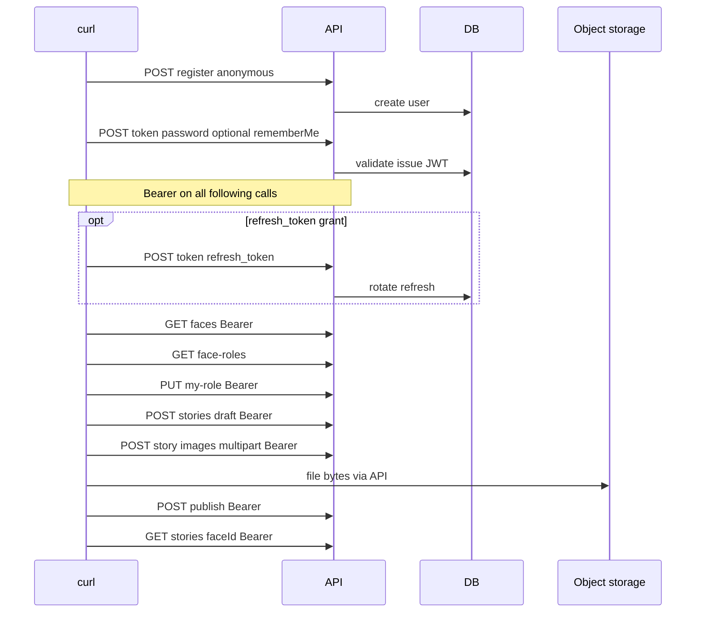
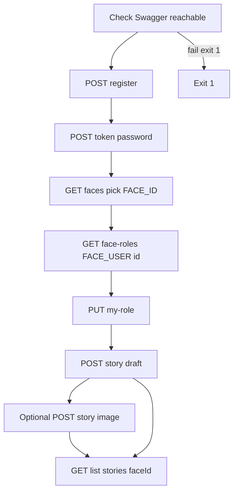

# BeDemo API: OAuth2, faces, and Stories — curl walkthrough

This document shows how to verify **OAuth2** registration and token issuance, set a **face role** (needed to see the stories list), and run a full **Stories** flow with **curl**. Useful for local development and post-deploy smoke tests.

## 1. Base URL

| Environment                                        | Typical URL             | Notes                                                  |
| -------------------------------------------------- | ----------------------- | ------------------------------------------------------ |
| Docker Compose (`docker-compose.dev.yml`)          | `http://127.0.0.1:8000` | `ASPNETCORE_URLS` maps the container to host **8000**. |
| `dotnet run` from Visual Studio / `launchSettings` | `http://127.0.0.1:8080` | Check `BeDemo.Api/Properties/launchSettings.json`.     |

In the examples below:

```bash
export BASE=http://127.0.0.1:8000
```

Change `BASE` if your API listens elsewhere.

### Diagram: full curl story (register → stories list)



### Confirm you are running the expected API build

Swagger UI: `$BASE/swagger/index.html`  
OpenAPI JSON: `$BASE/swagger/v1/swagger.json`

After adding Stories, OpenAPI should contain a path with `Stories` (e.g. `/api/Stories` — ASP.NET routing is case-insensitive, so `/api/stories` works too). If **Stories** endpoints are **missing** in Swagger, the container or process is an **old build** — rebuild the image / restart `dotnet run` after `git pull`.

## 2. OAuth2 client (development defaults)

From `BeDemo.Api/appsettings.json` (Development):

| Field          | Value                            |
| -------------- | -------------------------------- |
| `clientId`     | `be-demo-client`                 |
| `clientSecret` | `be-demo-secret-very-strong-key` |

In production, secrets must live in configuration / a secret store, not in the repo.

## 3. Register a user

`POST /api/oauth2/register` — **AllowAnonymous**.

```bash
EMAIL="you+$(date +%s)@example.com"
PASS='Test123!@#'

curl -sS -X POST "$BASE/api/oauth2/register" \
  -H "Content-Type: application/json" \
  -d "{\"email\":\"$EMAIL\",\"password\":\"$PASS\",\"firstName\":\"Test\",\"lastName\":\"User\"}"
```

Success: JSON with `userId`, `profileId`, optional `faceProfileCount`.  
Failure: `400` with Identity validation errors (weak password, duplicate email, etc.).

## 4. Token — password grant

`POST /api/oauth2/token` — **AllowAnonymous**.

JSON uses **camelCase** property names (e.g. `grantType`, `clientId`, `accessToken`).

```bash
TOK_JSON=$(curl -sS -X POST "$BASE/api/oauth2/token" \
  -H "Content-Type: application/json" \
  -d "{
    \"grantType\": \"password\",
    \"clientId\": \"be-demo-client\",
    \"clientSecret\": \"be-demo-secret-very-strong-key\",
    \"username\": \"$EMAIL\",
    \"password\": \"$PASS\"
  }")

ACCESS_TOKEN=$(echo "$TOK_JSON" | jq -r .accessToken)
REFRESH_TOKEN=$(echo "$TOK_JSON" | jq -r .refreshToken)
echo "$TOK_JSON" | jq .
```

On success the body typically includes:

- `accessToken` — JWT for `Authorization: Bearer …`
- `refreshToken` — opaque refresh token (stored hashed server-side; rotated on use)
- `expiresIn`, `tokenType` (usually `Bearer`)

Errors: `401` with `error` / `errorDescription` (OAuth2 error object), or `503` if the database is not ready.

### 4.1 Longer access token lifetime — `rememberMe`

Optional field **`rememberMe: true`** in the password grant body asks the API for a JWT with a longer lifetime per **`Jwt:ExpiresInMinutesRememberMe`** in `appsettings.json`. If the field is **omitted** or **`false`**, **`Jwt:ExpiresInMinutes`** applies (shorter session). It is not a separate session type—only the **`exp`** claim changes. Details: [authentication-and-sessions.md](./authentication-and-sessions.md).

```bash
TOK_LONG_JSON=$(curl -sS -X POST "$BASE/api/oauth2/token" \
  -H "Content-Type: application/json" \
  -d "{
    \"grantType\": \"password\",
    \"clientId\": \"be-demo-client\",
    \"clientSecret\": \"be-demo-secret-very-strong-key\",
    \"username\": \"$EMAIL\",
    \"password\": \"$PASS\",
    \"rememberMe\": true
  }")

echo "$TOK_LONG_JSON" | jq '{ expiresIn, tokenType }'
```

Compare: **`expiresIn`** (seconds) is usually **larger** with `rememberMe: true` (depends on API config).

## 5. Token — `refresh_token` grant

Use the opaque **`refreshToken`** from the password grant response. The server validates it in **`OAuthRefreshTokens`**, **rotates** it (single-use), and returns a new access + refresh pair. Misusing a valid access JWT as a refresh token is rejected.

```bash
TOK_JSON=$(curl -sS -X POST "$BASE/api/oauth2/token" \
  -H "Content-Type: application/json" \
  -d "{
    \"grantType\": \"refresh_token\",
    \"clientId\": \"be-demo-client\",
    \"clientSecret\": \"be-demo-secret-very-strong-key\",
    \"refreshToken\": \"$REFRESH_TOKEN\"
  }")
echo "$TOK_JSON" | jq .
```

See [authentication-and-sessions.md](./authentication-and-sessions.md) for lifetimes and rotation rules.

## 6. Face role — why it matters for Stories

`GET /api/stories?faceId=…` returns a list only for users whose face role in that face is **not** the host role.

Host constant in code: `FACE_HOST` (`UserRole.FaceRoleNames.FaceHost`). New users often default to **FACE_HOST**; use the API to switch e.g. to **FACE_USER**.

### 6.1 List faces (authorized)

```bash
curl -sS "$BASE/api/faces" -H "Authorization: Bearer $ACCESS_TOKEN" | jq .
```

Pick target face `id` → `FACE_ID`.

### 6.2 List face roles (public endpoint)

```bash
curl -sS "$BASE/api/faces/face-roles" | jq .
```

Find the row with `name` = `FACE_USER` (or another non-host role) → `USER_ROLE_ID`.

### 6.3 Set my face role

```bash
curl -sS -X PUT "$BASE/api/faces/$FACE_ID/my-role" \
  -H "Authorization: Bearer $ACCESS_TOKEN" \
  -H "Content-Type: application/json" \
  -d "{\"userRoleId\": $USER_ROLE_ID}" | jq .
```

## 7. Stories — full curl flow

Short endpoint overview in **`be_demo`**: [`STORIES_API.md`](../be_demo/STORIES_API.md).

### 7.1 Create draft

```bash
STORY_JSON=$(curl -sS -X POST "$BASE/api/stories" \
  -H "Authorization: Bearer $ACCESS_TOKEN" \
  -H "Content-Type: application/json" \
  -d '{"title":"Smoke test story"}')

STORY_ID=$(echo "$STORY_JSON" | jq -r .id)
echo "$STORY_JSON" | jq .
```

Without `faceIds` (or empty), the story targets **all** faces (same idea as reels). Optionally send `faceIds: [1,2]`.

### 7.2 Upload image (multipart)

At least one file is required before publish. `sortOrder` 0–9.

```bash
curl -sS -X POST "$BASE/api/stories/$STORY_ID/images" \
  -H "Authorization: Bearer $ACCESS_TOKEN" \
  -F "file=@/path/to/photo.jpg;type=image/jpeg" \
  -F "sortOrder=0" \
  -F "description=Optional caption" | jq .
```

### 7.3 Publish (immediate)

```bash
curl -sS -X POST "$BASE/api/stories/$STORY_ID/publish" \
  -H "Authorization: Bearer $ACCESS_TOKEN" \
  -H "Content-Type: application/json" \
  -d '{"scheduledPublishAt":null}' | jq .
```

Scheduling: set `scheduledPublishAt` to an ISO UTC string; the worker processes job `story.publish`.

### 7.4 List stories for a face (non-host viewer)

```bash
curl -sS "$BASE/api/stories?faceId=$FACE_ID" \
  -H "Authorization: Bearer $ACCESS_TOKEN" | jq .
```

If you are still **FACE_HOST** in that face, the list may be empty or the API may apply host-specific rules.

### 7.5 Other calls

- Detail: `GET /api/stories/{id}?faceId=…`
- Mine: `GET /api/stories/me`
- View: `POST /api/stories/{id}/view?faceId=…`
- Likes / comments: see the table in `STORIES_API.md`

## 8. One-shot bash smoke test

Requires `jq`, `curl`, and a valid `BASE`. After registration, sets `FACE_USER` on the first face and creates a story; you can upload `/tmp/story-smoke.jpg` for a minimal JPEG.

### Diagram: smoke script steps



```bash
#!/usr/bin/env bash
set -euo pipefail
BASE="${BASE:-http://127.0.0.1:8000}"
EMAIL="smoke+$(date +%s)@example.com"
PASS='Test123!@#'

curl -sf "$BASE/swagger/index.html" >/dev/null || { echo "API is not running at $BASE"; exit 1; }

curl -sS -X POST "$BASE/api/oauth2/register" -H "Content-Type: application/json" \
  -d "{\"email\":\"$EMAIL\",\"password\":\"$PASS\"}" | jq .

TOK=$(curl -sS -X POST "$BASE/api/oauth2/token" -H "Content-Type: application/json" \
  -d "{\"grantType\":\"password\",\"clientId\":\"be-demo-client\",\"clientSecret\":\"be-demo-secret-very-strong-key\",\"username\":\"$EMAIL\",\"password\":\"$PASS\"}" | jq -r .accessToken)

FACE_ID=$(curl -sS "$BASE/api/faces" -H "Authorization: Bearer $TOK" | jq -r '.[0].id')
ROLE_USER=$(curl -sS "$BASE/api/faces/face-roles" | jq -r '.[] | select(.name=="FACE_USER") | .id')

curl -sS -X PUT "$BASE/api/faces/$FACE_ID/my-role" \
  -H "Authorization: Bearer $TOK" -H "Content-Type: application/json" \
  -d "{\"userRoleId\":$ROLE_USER}" | jq .

# If /api/stories is missing in Swagger, the next steps return 404 — rebuild API.
STORY_ID=$(curl -sS -X POST "$BASE/api/stories" -H "Authorization: Bearer $TOK" \
  -H "Content-Type: application/json" -d '{"title":"smoke"}' | jq -r .id)

# Upload a file instead of skipping:
# curl -sS -X POST "$BASE/api/stories/$STORY_ID/images" -H "Authorization: Bearer $TOK" \
#   -F "file=@/tmp/story-smoke.jpg" -F "sortOrder=0"

curl -sS "$BASE/api/stories?faceId=$FACE_ID" -H "Authorization: Bearer $TOK" | jq .
```

## 9. Lint and tests in the monorepo

From `mfai_demo` root:

```bash
./scripts/lint-all.sh
```

Backend tests (test project only):

```bash
cd be_demo && dotnet test BeDemo.Api.Tests/BeDemo.Api.Tests.csproj
```

Frontend:

```bash
cd fe_demo && yarn lint && yarn format:check && yarn test && yarn build
```

## 10. Related documentation

- [Stories API (endpoint table)](../be_demo/STORIES_API.md)
- [Docker dev stack](../docker-compose.dev.yml) — FE/BE/admin ports
- [README](../../README.md) — monorepo overview
