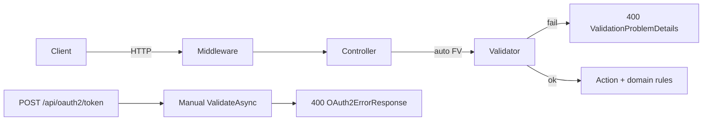

# API request validation (FluentValidation)

**Status:** Shipped **2026-05-16** (`BeDemo.Api`). Agent spec and EF appendix: [`endpoint-schema-validation-agent-prompt.md`](../prompts/endpoint-schema-validation-agent-prompt.md) (§12 marked complete in-file).

Centralized input validation for `many_faces_backend` using **FluentValidation 11.x**. One validator class per request or query schema; controllers stay thin for **authorization** and **domain** rules (existence, state machines, scope).

## Request flow



## Layout

| Path | Purpose |
|------|---------|
| `BeDemo.Api/Models/Requests/**` | Query objects and request DTOs (e.g. `Moderation/`, `Faces/`, `Auth/`) |
| `BeDemo.Api/Validation/**` | `{Name}Validator` per schema (~**76** input schemas) |
| `BeDemo.Api/Validation/Rules/` | Shared extensions (`SafeHttpUrl`, pagination, platforms, …) — each with `*RulesTests.cs` |
| `BeDemo.Api/Validation/Files/` | `IFileValidator` — magic-byte image checks (SHV2 **BE-U1**) |
| `BeDemo.Api.Tests/Validation/**` | `{Name}ValidatorTests` (required for every validator) |
| `many_faces_backend/scripts/verify-validator-tests-parity.sh` | CI/local guard: every `*Validator.cs` has `*ValidatorTests.cs` |
| `many_faces_backend/scripts/generate_section4_matrix_tests.py` | Regenerates §4 matrix tests (T1 + T11 per validator) |

Registration in `Program.cs`:

- `AddFluentValidationAutoValidation()` — default **400** with `ValidationProblemDetails`
- `AddValidatorsFromAssemblyContaining<Program>()`
- **`POST /api/oauth2/token`** is **excluded** from auto-validation; validated manually in `OAuth2Controller.Token` → `OAuth2ErrorResponse`

## Adding a new endpoint

1. Define `{RequestName}` under `Models/Requests/…` (preserve JSON camelCase property names).
2. Add `{RequestName}Validator` with bounds from EF / product rules (see prompt §18).
3. Add `{RequestName}ValidatorTests` (§4 cases: empty, bounds, valid minimal; parity script enforces the file).
4. Bind the action: `[FromBody]`, `[FromQuery]`, or `[FromForm]`.
5. Remove duplicate inline `BadRequest` / `[Required]` on the same fields when FV covers them.
6. Run validation tests and parity:

```bash
cd many_faces_backend
dotnet test BeDemo.Api.Tests --filter "FullyQualifiedName~Validation"
./scripts/verify-validator-tests-parity.sh
```

Optional: regenerate the broad §4 matrix after adding many validators:

```bash
python3 scripts/generate_section4_matrix_tests.py
dotnet test BeDemo.Api.Tests --filter "FullyQualifiedName~ValidatorSection4Matrix"
```

## 400 response shapes

| Surface | Status | Body |
|---------|--------|------|
| Most APIs | 400 | `ValidationProblemDetails` — `errors` keyed by camelCase property paths |
| `POST /api/oauth2/token` | 400 | `OAuth2ErrorResponse` — `error`: `invalid_request`, … (never ProblemDetails) |
| Domain / authz | 4xx | Legacy `{ "error": "…" }` (not for pure input shape) |

Clients should read `errors[field][0]` for forms, or `errorCode` when present (`val_*` prefix). OpenAPI clients: [`openapi-client-generation.md`](./openapi-client-generation.md).

## `val_*` error codes (selection)

| Code | Meaning |
|------|---------|
| `val_null_byte` | String contains `\0` |
| `val_url_unsafe` | URL not absolute http/https |
| `val_page_min` / `val_page_size_range` | Pagination out of range |
| `val_face_id_invalid` | `faceId` ≤ 0 when required |
| `val_push_platform_invalid` | Push platform not ios/android |
| `val_platform_invalid` | Registration platform not mobile/empty |
| `val_file_required` / `val_file_format` / `val_file_empty` / `val_file_content_type` | Upload validation |
| `val_sort_order_range` | Story image `sortOrder` not in 0–9 |
| `val_password_min_length` | Password below Identity minimum on admin create/update |
| `val_confidence_range` | Moderation min/max confidence inconsistent |
| `val_collection_min` / `val_collection_max` | Bulk moderation item list bounds |
| `val_moderation_reason_required` | Reject/remove without reason |
| `val_skip_min` / `val_take_range` | Admin invite list skip/take |
| `val_enum_invalid` | Enum out of defined values |
| `val_string_required` | Required string missing |
| `val_datetime_future` | Scheduled publish not in the future |
| `val_content_id_invalid` | Moderation content id ≤ 0 |

Full catalog and engagement notes: prompt §6 and §12.

## Uploads

Inject `IFileValidator` and call `ValidateImageAsync` after size/content-type checks. Do not duplicate magic-byte logic in controllers. Avatar max **30 MB**; story images **52 MB** with sort order 0–9. Complements [`security-hardening-v2-agent-prompt.md`](../prompts/security-hardening-v2-agent-prompt.md) **BE-U1** (done); **BE-U2**–**BE-U5** (public URLs, path traversal, filenames) remain in SHV2.

## Moderation request models

Bulk and decision bodies live under `BeDemo.Api/Models/Requests/Moderation/` (`ModerationDecisionDto`, `BulkModerationRequest`, …) with validators in `Validation/Moderation/`. See [`ai-assisted-content-approval.md`](./ai-assisted-content-approval.md) for the approval pipeline; input shape is validated before queue/domain logic.

## Face routing

Validators document logical paths **`/api/...`** after `RoutingMiddleware`. Exempt from face prefix: `/api/oauth2/*`, `/api/auth/*`, `/api/localization/*`, JWKS, etc.

## Testing

```bash
cd many_faces_backend
dotnet test BeDemo.Api.Tests --filter "FullyQualifiedName~Validation"
./scripts/verify-validator-tests-parity.sh
```

| Layer | Location |
|-------|----------|
| Unit per schema | `BeDemo.Api.Tests/Validation/**/*ValidatorTests.cs` |
| Shared rules | `BeDemo.Api.Tests/Validation/Rules/*RulesTests.cs` |
| §4 matrix | `ValidatorSection4MatrixTests.cs` (generated) — T1 invalid + T11 valid minimal per validator |
| Integration | `Validation/Integration/ValidationProblemDetailsIntegrationTests.cs` — invalid JSON, register email, OAuth2 token shape, story upload content-type |

Monorepo CI matrix: [`testing-and-ci-matrix.md`](./testing-and-ci-matrix.md).

## Password policy

Register/complete/admin-create-user validators check presence, max length, and no null bytes. **Minimum length and complexity** remain ASP.NET Identity (`IdentityPasswordPolicyOptions` / `UserManager`). Auth flows: [`authentication-and-sessions.md`](./authentication-and-sessions.md).

## Deferred (TRACK-VAL)

| Id | Item |
|----|------|
| TRACK-VAL-route | Optional route-segment validators (`FaceIdRouteValidator`, …) |
| TRACK-VAL-swagger | `MicroElements.Swashbuckle.FluentValidation` — rules documented in this guide instead |

## Appendix

EF `HasMaxLength` reference: [`endpoint-schema-validation-agent-prompt.md`](../prompts/endpoint-schema-validation-agent-prompt.md) §18.
