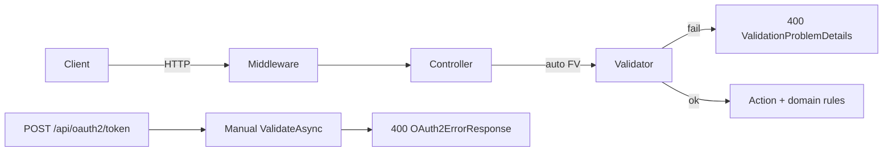

# API request validation (FluentValidation)

Centralized input validation for `many_faces_backend` (`BeDemo.Api`) using **FluentValidation 11.x**. One validator class per request or query schema; controllers stay thin for authz and domain rules.

## Request flow



## Layout

| Path | Purpose |
|------|---------|
| `BeDemo.Api/Models/Requests/**` | Query objects and request DTOs (moving from controller file bottoms) |
| `BeDemo.Api/Validation/**` | `{Name}Validator` per schema |
| `BeDemo.Api/Validation/Rules/` | Shared extensions (`SafeHttpUrl`, pagination, platforms, …) |
| `BeDemo.Api/Validation/Files/` | `IFileValidator` — magic-byte image checks (SHV2 BE-U1) |
| `BeDemo.Api.Tests/Validation/**` | `{Name}ValidatorTests` (required for every validator) |

Registration in `Program.cs`:

- `AddFluentValidationAutoValidation()` — default **400** with `ValidationProblemDetails`
- `AddValidatorsFromAssemblyContaining<Program>()`
- OAuth2 token body is **excluded** from auto-validation; validated manually in `OAuth2Controller.Token`

## Adding a new endpoint

1. Define `{RequestName}` under `Models/Requests/…` (preserve JSON camelCase property names).
2. Add `{RequestName}Validator` with bounds from EF / product rules (see prompt §18).
3. Add `{RequestName}ValidatorTests` covering §4 cases (empty, bounds, valid minimal, …).
4. Bind the action to the type: `[FromBody]`, `[FromQuery]`, or `[FromForm]`.
5. Remove duplicate inline `BadRequest` checks for the same fields.
6. Run `dotnet test --filter FullyQualifiedName~Validation` and `./scripts/verify-validator-tests-parity.sh`.

## 400 response shapes

| Surface | Status | Body |
|---------|--------|------|
| Most APIs | 400 | `ValidationProblemDetails` — `errors` keyed by camelCase property paths |
| `POST /api/oauth2/token` | 400 | `OAuth2ErrorResponse` — `error`: `invalid_request`, … (never ProblemDetails) |
| Domain / authz | 4xx | Legacy `{ "error": "…" }` where appropriate (not for pure input validation) |

Clients should read `errors[field][0]` for forms, or `errorCode` when present (`val_*` prefix).

## `val_*` error codes (selection)

| Code | Meaning |
|------|---------|
| `val_null_byte` | String contains `\0` |
| `val_url_unsafe` | URL not absolute http/https |
| `val_page_min` / `val_page_size_range` | Pagination out of range |
| `val_face_id_invalid` | `faceId` ≤ 0 when required |
| `val_push_platform_invalid` | Push platform not ios/android |
| `val_platform_invalid` | Registration platform not mobile/empty |
| `val_file_required` / `val_file_format` / `val_file_empty` / `val_file_content_type` | Upload validation |
| `val_sort_order_range` | Story image `sortOrder` not in 0–9 |
| `val_password_min_length` | Password below Identity minimum on admin create/update |
| `val_confidence_range` | Moderation min/max confidence inconsistent |

## Uploads

Inject `IFileValidator` and call `ValidateImageAsync` after size/content-type checks. Do not duplicate magic-byte logic in controllers. Avatar max **30 MB**; story images **52 MB** with sort order 0–9.

## Face routing

Validators document logical paths **`/api/...`** after `RoutingMiddleware`. Exempt from face prefix: `/api/oauth2/*`, `/api/auth/*`, `/api/localization/*`, JWKS, etc.

## Testing

```bash
cd many_faces_backend
dotnet test BeDemo.Api.Tests --filter "FullyQualifiedName~Validation"
./scripts/verify-validator-tests-parity.sh
```

Integration samples: `BeDemo.Api.Tests/Validation/Integration/ValidationProblemDetailsIntegrationTests.cs`.

## Password policy

Register/complete/admin-create-user validators check presence, max length, and no null bytes. **Minimum length and complexity** remain ASP.NET Identity (`IdentityPasswordPolicyOptions` / `UserManager`).

## Appendix

EF `HasMaxLength` reference: `docs/prompts/endpoint-schema-validation-agent-prompt.md` §18.
