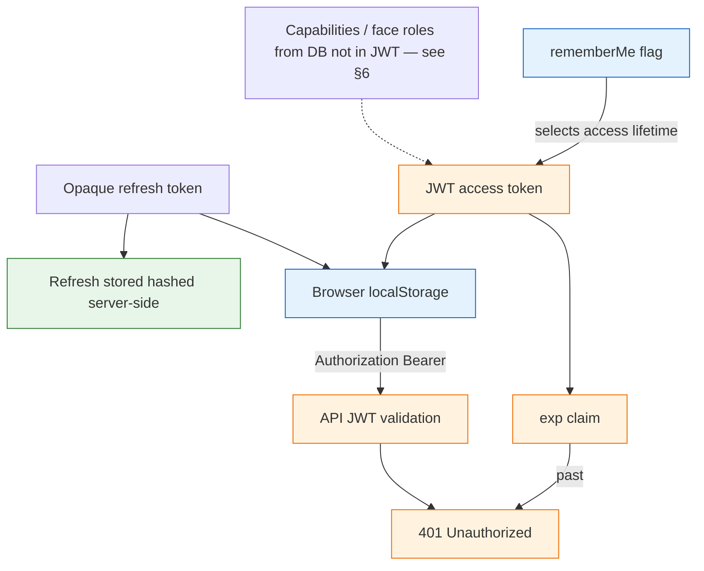
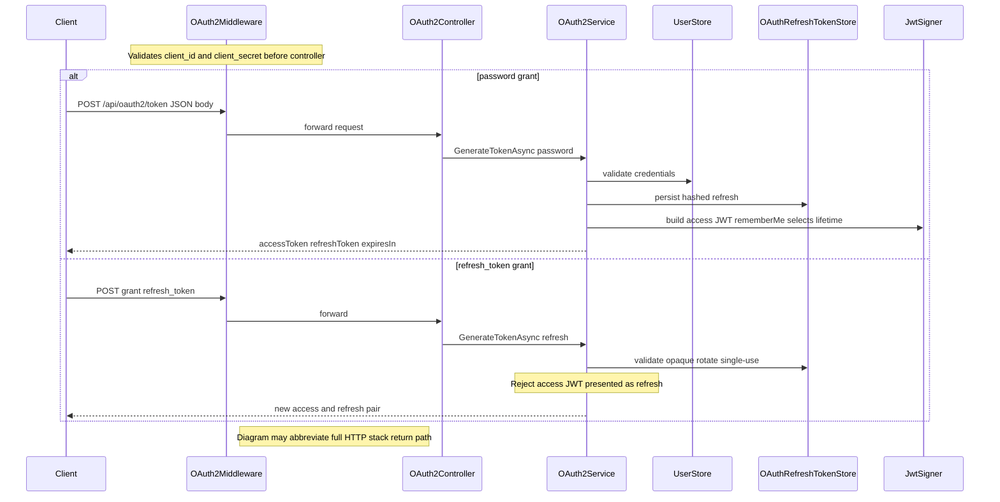
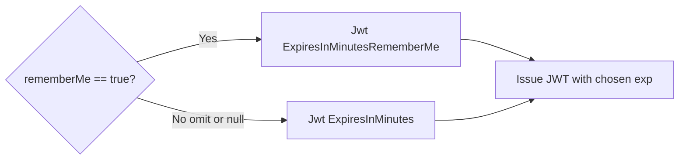
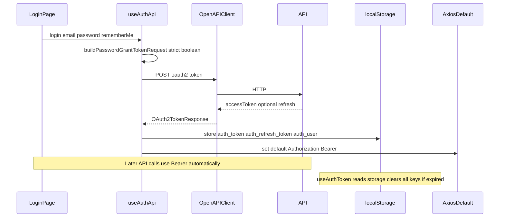
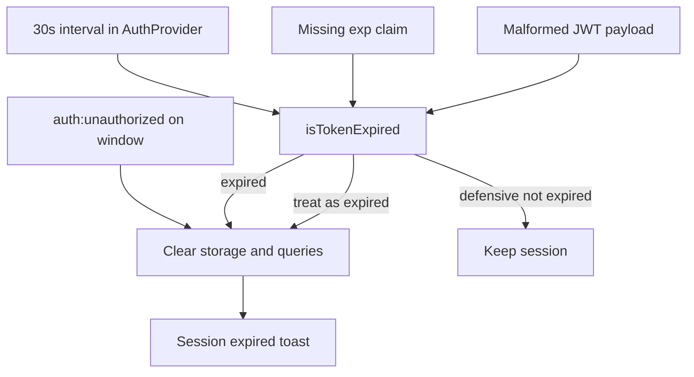
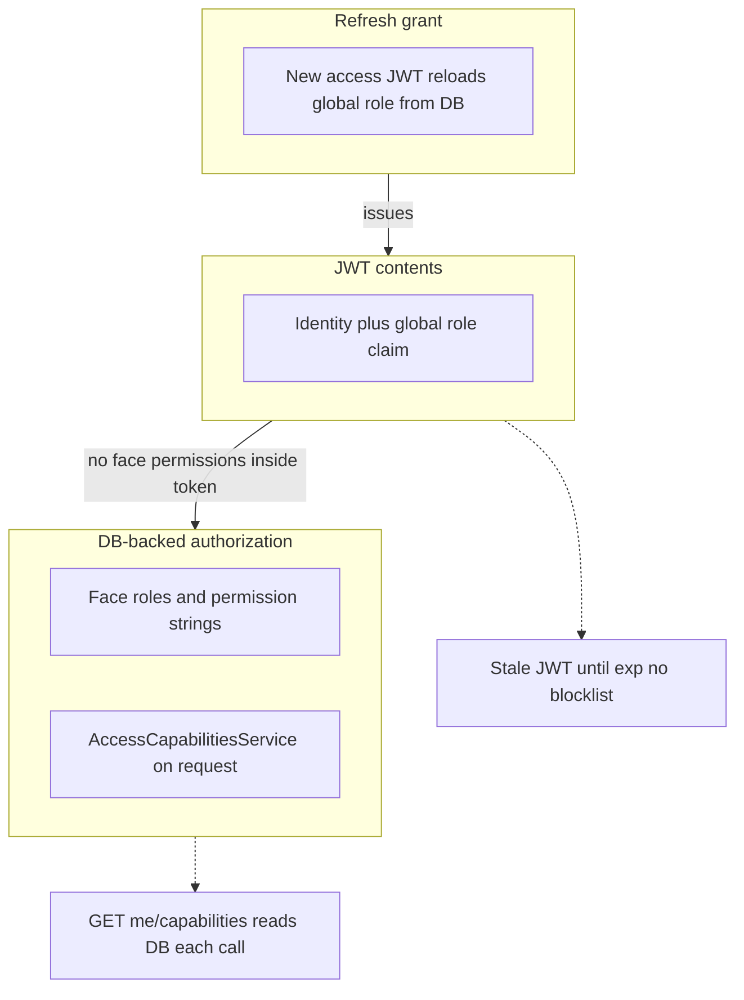

# Authentication, JWT lifetimes, and “stay signed in”

This document explains **how login works** across **BeDemo API** (`be_demo`), **main frontend** (`fe_demo`), and **admin UI** (`admin_demo`): OAuth2 password grant, the optional **`rememberMe`** flag, JWT configuration, browser storage, and how clients detect **expired** tokens.

For a **curl walkthrough** (register + token), see [api-oauth-stories-curl.md](./api-oauth-stories-curl.md).

---

## 1. Why this exists (mental model)

| Concept                             | Meaning in this project                                                                                                                                                                             |
| ----------------------------------- | --------------------------------------------------------------------------------------------------------------------------------------------------------------------------------------------------- |
| **Access token**                    | A **JWT** returned by `POST /api/oauth2/token`. The browser stores it and sends `Authorization: Bearer <token>` on API calls.                                                                       |
| **JWT `exp` claim**                 | Unix time (seconds) when the token **stops being valid** for the API. Identity middleware rejects expired JWTs with **401**.                                                                        |
| **“Stay signed in” (`rememberMe`)** | **Not** a second session mechanism. It only tells the API to issue a JWT with a **longer** lifetime (different config key). The client still stores one bearer token the same way.                  |
| **Refresh token**                   | Opaque string returned with the access token; stored **hashed** server-side (`OAuthRefreshTokens` table). **`refresh_token` grant** rotates it (single-use) and issues a new access JWT — see §2.1. |

So: **short session** = short JWT `exp` + refresh token with shorter absolute expiry; **persistent login** = longer access JWT when `rememberMe` is true **and** longer refresh token lifetime (`Jwt:RefreshTokenDaysRememberMe`).

### Diagram: mental model (access, refresh, storage)



---

## 2. Backend (`be_demo`)

### 2.1 Endpoint: `POST /api/oauth2/token`

- **Anonymous**; validates **client_id** / **client_secret** in `OAuth2Middleware` before the controller runs.
- Body model: `OAuth2TokenRequest` (`BeDemo.Api/Models/DTOs/OAuth2Request.cs`).
- Supported grants in `OAuth2Service.GenerateTokenAsync`:
  - **`password`** — email/username + password; optional **`rememberMe`**; persists refresh token (hash only).
  - **`refresh_token`** — validates opaque token in DB, **single-use rotation**, returns new access + refresh pair; misusing a valid access JWT as refresh is rejected.

### Diagram: token endpoint (password and refresh grants)



### 2.2 Field: `rememberMe` (nullable bool)

| JSON / property   | Server behaviour                                          |
| ----------------- | --------------------------------------------------------- |
| Omitted           | Treated like “normal” login → **short** JWT lifetime.     |
| `false` or `null` | Same → **short** lifetime.                                |
| **`true`**        | **Long** JWT lifetime (`Jwt:ExpiresInMinutesRememberMe`). |

The server uses **only** `RememberMe == true` (strict). This matches the frontends, which send `rememberMe: true` only when the checkbox is checked (`buildPasswordGrantTokenRequest`).

### Diagram: rememberMe → JWT lifetime config



### 2.3 Configuration: JWT lifetime

In `BeDemo.Api/appsettings.json` (and overridable via environment / secrets):

| Key                                                                      | Role                                                                                                                                      |
| ------------------------------------------------------------------------ | ----------------------------------------------------------------------------------------------------------------------------------------- |
| **`Jwt:ExpiresInMinutes`**                                               | Default access-token lifetime when **`rememberMe` is not true** (typical “browser session” length).                                       |
| **`Jwt:ExpiresInMinutesRememberMe`**                                     | Access-token lifetime when **`rememberMe` is true** (“stay signed in”). In demo configs this can be very large; tune down for production. |
| **`Jwt:Issuer`**, **`Jwt:Audience`**                                     | Standard JWT validation; must match between token creation and validation.                                                                |
| **`Jwt:RefreshTokenDaysSession`** / **`Jwt:RefreshTokenDaysRememberMe`** | Absolute lifetime (days) for stored refresh rows after password grant (shorter vs remember-me).                                           |

**Environment override example** (Docker / k8s):

```text
Jwt__ExpiresInMinutes=60
Jwt__ExpiresInMinutesRememberMe=43200
```

(`__` is the usual .NET env nesting separator.)

### 2.4 Response: `OAuth2TokenResponse`

- **`expiresIn`** — lifetime of the access token in **seconds** (API returns `expiresInMinutes * 60` from the chosen config).
- **`accessToken`** — JWT string.
- **`refreshToken`** — opaque string; store securely on the client; each refresh response **invalidates** the previous refresh value (rotation).

### 2.5 Optional: request signing

If the body includes **`signature`** + **`signatureAlgorithm`**, middleware validates ECDSA (**ES512**). Normal web clients do **not** send this. The canonical signing message **does not** include `rememberMe` (do not change that without updating any signing clients).

### 2.6 Key source files

| File                                            | Responsibility                                                               |
| ----------------------------------------------- | ---------------------------------------------------------------------------- |
| `BeDemo.Api/Controllers/OAuth2Controller.cs`    | Token + register endpoints.                                                  |
| `BeDemo.Api/Middlewares/OAuth2Middleware.cs`    | Client credentials; optional signature.                                      |
| `BeDemo.Api/Services/OAuth2Service.cs`          | Password / refresh handling; JWT creation; `rememberMe` → minutes selection. |
| `BeDemo.Api/Services/OAuthRefreshTokenStore.cs` | Persist / rotate refresh tokens (A17).                                       |
| `BeDemo.Api/Models/DTOs/OAuth2Request.cs`       | DTOs including `RememberMe`.                                                 |

---

## 3. Main frontend (`fe_demo`)

### Diagram: login → token → storage → axios default header



### 3.1 Login request shape

- **`src/hooks/api/authTokenRequest.ts`** — `buildPasswordGrantTokenRequest`: builds the password-grant body and forces **`rememberMe: credentials.rememberMe === true`** so the API never gets a ambiguous value.
- **`src/hooks/api/useAuthApi.ts`** — `useLogin` calls the OpenAPI client with that body; stores **`accessToken`** (and refresh if present) in **`localStorage`** and updates the axios default header via **`setAuthToken`**.

### 3.2 Storage keys (`localStorage`)

| Key                  | Purpose                                                                                        |
| -------------------- | ---------------------------------------------------------------------------------------------- |
| `auth_token`         | Current JWT access token.                                                                      |
| `auth_refresh_token` | Stored if API returns it; refresh mutation exists but **backend refresh grant does not work**. |
| `auth_user`          | Small decoded user profile for UI (not a security boundary).                                   |

### 3.3 Detecting expiry without calling the API

- **`src/utils/jwtUtils.ts`** — `isTokenExpired(jwt)`:
  - Parses the **payload** segment; reads **`exp`** (seconds).
  - If **`exp` is missing** → treated as **not expired** (defensive; API in this project always sets `exp`).
  - **Malformed** token (bad shape, bad JSON) → treated as **expired** so the app clears storage and forces re-login.

### 3.4 React Query + `AuthContext`

- **`useAuthToken`** — `queryFn` reads `auth_token` from `localStorage`; if missing or expired, **clears** all three keys and returns `null`.
- **`AuthProvider`** (`src/contexts/AuthContext.tsx`):
  - On mount: loads token/user from storage; drops expired token and clears queries.
  - **Interval every 30s**: if JWT expired, clears session and shows a **toast** (session expired).
  - Listens for **`auth:unauthorized`** on `window` (if the API layer dispatches it on 401) to align UI with forced logout.

### Diagram: expiry detection and session clear



### 3.5 Login UI

- **`src/pages/LoginPage.tsx`** — checkbox bound to **`rememberMe`** (default `false`); calls `login(email, password, { rememberMe })`.
- i18n: **`pages.login.rememberMe`** in `src/i18n/locales/{en,sk,cz}.json`.

### 3.6 Client env

OAuth2 **`clientId` / `clientSecret`** for the browser come from **`src/config/env`** (build-time env). They must match **`OAuth2`** section in API config for login to succeed.

---

## 4. Admin UI (`admin_demo`)

Same auth stack as FE for password login:

- **`src/hooks/api/authTokenRequest.ts`**, **`useAuthApi.ts`**, **`utils/jwtUtils.ts`**, **`AuthContext.tsx`**, **`LoginPage.tsx`**, locales.
- **`useAuthToken`** also clears expired tokens from storage (aligned with FE).
- **Session watcher** + **`pages.logout.sessionExpired`** toast when the JWT expires while the app is open.

---

## 5. Testing (what covers this behaviour)

| Layer              | Location                                                      | What is asserted                                                                                           |
| ------------------ | ------------------------------------------------------------- | ---------------------------------------------------------------------------------------------------------- |
| **BE integration** | `be_demo/BeDemo.Api.Tests/OAuth2RememberMeTests.cs`           | With overridden `Jwt:*`, `rememberMe` true/false/absent maps to correct **`expiresIn`** on token response. |
| **FE unit**        | `fe_demo/src/utils/__tests__/jwtUtils.test.ts`                | `exp` edge cases, malformed tokens.                                                                        |
| **FE unit**        | `fe_demo/src/hooks/api/__tests__/authTokenRequest.test.ts`    | Strict `rememberMe` → boolean in payload.                                                                  |
| **Admin unit**     | `admin_demo/src/utils/__tests__/jwtUtils.test.ts`             | Same as FE jwt tests.                                                                                      |
| **Admin unit**     | `admin_demo/src/hooks/api/__tests__/authTokenRequest.test.ts` | Same as FE payload tests.                                                                                  |

Run:

```bash
cd be_demo && dotnet test BeDemo.Api.Tests/BeDemo.Api.Tests.csproj
cd fe_demo && yarn test
cd admin_demo && yarn test
```

---

## 6. JWT strategy (thin token + invalidation) — ACL A9

- The **access JWT** carries identity plus a **single global** `role` claim from `UserRoles` / `ApplicationUser.UserRoleId` at issuance time.
- **Face roles** and fine-grained **permission strings** are **not** embedded in the JWT; they are resolved from the database (e.g. `AccessCapabilitiesService`, tenant gates).
- **`refresh_token` grant** rebuilds the access JWT and reloads the global role from the DB, so admin promotion can surface without re-entering the password.
- **Instant revocation** of an already-issued access JWT is **not** implemented (no server-side token blocklist); wait for `exp` or add a `jti`/version check if you need hard revocation.

### Diagram: thin JWT vs DB capabilities vs refresh



---

## 7. Security and product notes

1. **“Stay signed in”** keeps a **valid JWT** on the device longer. On a **shared computer**, that is higher risk than a short session.
2. Tokens in **`localStorage`** are readable by JavaScript (XSS surface). **HttpOnly cookies** would be a different architecture; not what this demo uses.
3. **Tune** `Jwt:ExpiresInMinutesRememberMe` per environment; demo values may be extremely large for convenience.
4. **Refresh tokens** are **rotated** server-side; clients must replace stored refresh material on each refresh response.

---

## 8. Related documentation

- [api-oauth-stories-curl.md](./api-oauth-stories-curl.md) — curl: register + token (includes `rememberMe` example).
- [development.md](./development.md) — monorepo dev workflow and links.
- [be_demo/README.md](../be_demo/README.md) — API overview.
