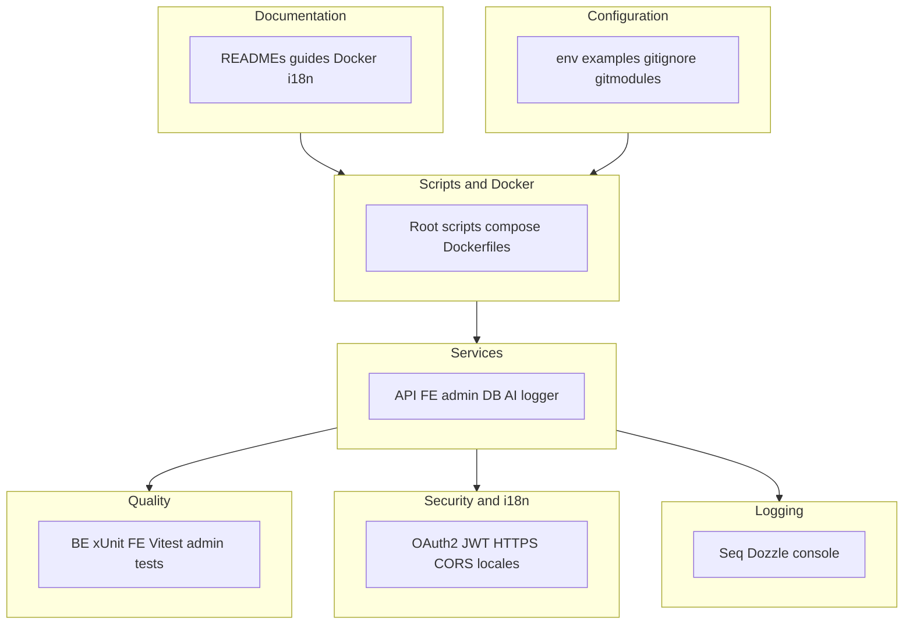

# Boilerplate Project Checklist

### Diagram: checklist areas covered

## ✅ What's Already Included

### 📚 Documentation

- ✅ **Root README.md** - Comprehensive overview with quick start guide
- ✅ **Service-specific READMEs** - Each module (many_faces_backend, many_faces_portal, many_faces_admin, etc.) has detailed README
- ✅ **Docker documentation** - DOCKER.md files in many_faces_portal and many_faces_admin
- ✅ **Setup guides** - YARN_PNP.md, SEQ_LOGGING.md, INSTALL_HTTPS_CERT.md
- ✅ **API documentation** - Auto-generated Swagger/OpenAPI docs
- ✅ **i18n documentation** - Internationalization setup guides

### 🔧 Configuration Files

- ✅ **.env.example files** - Environment variable templates in:
  - `many_faces_backend/.env.example`
  - `many_faces_portal/.env.example`
  - `many_faces_admin/.env.example`
  - `many_faces_ai/.env.example`
- ✅ **Docker Compose files** - docker-compose.dev.yml in root and service-specific
- ✅ **.gitignore** - Properly configured for all services
- ✅ **.gitmodules** - Git submodules configuration

### 🚀 Management Scripts

- ✅ **Monorepo `scripts/`** (run from repository root):
  - `scripts/start-all-dev.sh` - Start all services with live status
  - `scripts/stop-all-dev.sh` - Stop all services
  - `scripts/restart-all-dev.sh` - Restart all services with rebuild
  - `scripts/clear-all-dev.sh` - Clear all containers and volumes
  - `scripts/status-all.sh` - Show comprehensive status
  - `scripts/rebuild-all-dev.sh` - Rebuild all Docker images
  - `scripts/test-all.sh` - Run all tests
- ✅ **Service-specific scripts** - Each submodule keeps shell entrypoints under its own **`scripts/`** (e.g. `scripts/start-dev.sh`, `scripts/stop-dev.sh`, `scripts/clear-dev.sh`, `scripts/rebuild-dev.sh`); the monorepo root **`scripts/`** orchestrates them.

### 🐳 Docker Setup

- ✅ **Dockerfiles** - Development and production Dockerfiles
- ✅ **Docker Compose** - Comprehensive docker-compose configurations
- ✅ **Networking** - Proper Docker networks configured
- ✅ **Volumes** - Persistent volumes for data
- ✅ **Health checks** - Health check configurations

### 🧪 Testing

- ✅ **Backend tests** - ASP.NET Core xUnit tests with test database
- ✅ **Frontend tests** - Vitest tests in many_faces_portal
- ✅ **Admin tests** - Vitest tests in many_faces_admin
- ✅ **Test orchestration** - `scripts/test-all.sh` for running all tests

### 📦 Services & Modules

- ✅ **Backend API** - ASP.NET Core with PostgreSQL, OAuth2, Identity
- ✅ **Frontend** - React + TypeScript + Vite
- ✅ **Admin Panel** - React + TypeScript + Vite
- ✅ **Database** - PostgreSQL with pgAdmin
- ✅ **AI Service** - Python gRPC service
- ✅ **Logger** - Dozzle for log viewing
- ✅ **Seq** - Structured logging server

### 🔐 Security & Auth

- ✅ **OAuth2** - Token-based authentication
- ✅ **JWT** - JWT token generation and validation
- ✅ **HTTPS** - Self-signed certificates for development
- ✅ **CORS** - Properly configured for development

### 🌍 Internationalization

- ✅ **i18n setup** - English, Slovak, Czech support
- ✅ **Language switching** - UI components for language switching
- ✅ **Route translations** - Localized routing

### 📊 Logging & Monitoring

- ✅ **Seq logging** - Structured logging with web UI
- ✅ **Dozzle** - Docker log viewer
- ✅ **Console logging** - Standard output logging

## ⚠️ Optional Enhancements (Nice to Have)

### 📄 License

- ⚠️ **LICENSE file** - Currently placeholder in README ("Add your license information here")
- **Recommendation**: Add MIT, Apache 2.0, or your preferred license file

### 🤝 Contributing Guidelines

- ⚠️ **CONTRIBUTING.md** - Currently placeholder in README ("Add contributing guidelines here")
- **Recommendation**: Add contribution guidelines for:
  - Code style
  - Commit message format
  - Pull request process
  - Testing requirements

### 📝 CHANGELOG

- ❌ **CHANGELOG.md** - Not present
- **Recommendation**: Add CHANGELOG.md following Keep a Changelog format

### 🔄 CI/CD

- ✅ **GitHub Actions** — The monorepo root (**`many_faces_main`**) includes **`.github/workflows/ci.yml`**: parallel jobs per submodule (backend, portal, admin, mobile, AI, infra compose checks, docs Mermaid) plus **`monorepo_scripts`** running **`scripts/ci-local.sh`** (lint → build → test with `SKIP_CYPRESS=1` by default). Several submodules also ship their own workflows when developed standalone.
- **Optional for your fork**: add Dependabot, deployment workflows, or extra security scanning beyond what this reference stack already runs.

### 🔒 Security

- ⚠️ **Dependabot** - No automated dependency updates
- **Recommendation**: Add `.github/dependabot.yml` for:
  - Yarn dependency updates (use Yarn, not npm, for JS apps in this repo)
  - Docker image updates
  - GitHub Actions updates

### 📊 Code Quality

- ✅ **Git hooks** — **many_faces_portal**, **many_faces_admin**, **many_faces_backend**, and **many_faces_mobile** use **Husky** + **commitlint** (and lint-staged where configured). **many_faces_ai** uses the **`pre-commit`** Python framework (see **`many_faces_ai/README_PRE_COMMIT.md`** and **`.pre-commit-config.yaml`**), not Husky.
- **Optional**: add a single monorepo-wide `pre-commit` config if you want one hook runner across all languages.

### 📈 Additional Documentation

- ⚠️ **ARCHITECTURE.md** - System architecture overview
- ⚠️ **DEPLOYMENT.md** - Production deployment guide
- ⚠️ **API.md** - API documentation (beyond Swagger)
- ⚠️ **SECURITY.md** - Security policy and reporting

## ✅ Summary for Boilerplate

**For a boilerplate project, you have all the essential components:**

1. ✅ **Complete project structure** - All services properly organized
2. ✅ **Docker setup** - Full containerization ready
3. ✅ **Development scripts** - Easy start/stop/restart workflows
4. ✅ **Documentation** - Comprehensive READMEs and guides
5. ✅ **Configuration** - Environment variable templates
6. ✅ **Testing** - Test setup for all testable services
7. ✅ **Git setup** - Proper .gitignore and submodules
8. ✅ **Authentication** - OAuth2 and JWT implementation
9. ✅ **Database** - PostgreSQL with migrations
10. ✅ **Logging** - Structured logging with UI

**Optional but recommended additions:**

1. ⚠️ LICENSE file (currently placeholder)
2. ⚠️ CONTRIBUTING.md (currently placeholder)
3. ❌ CHANGELOG.md
4. ❌ CI/CD workflows (.github/workflows)
5. ⚠️ Pre-commit hooks (Husky)
6. ❌ Dependabot configuration

## 🎯 Priority Recommendations

**High Priority (for production-ready boilerplate):**

1. Add LICENSE file
2. Complete CONTRIBUTING.md
3. Add CHANGELOG.md

**Medium Priority (for better development experience):** 4. Add GitHub Actions CI/CD 5. Add pre-commit hooks (Husky)

**Low Priority (nice-to-have):** 6. Add Dependabot 7. Add ARCHITECTURE.md 8. Add DEPLOYMENT.md

## 📝 Notes

- All `.env.example` files exist and are properly documented
- All services have comprehensive README files
- Management scripts are well-documented and functional
- Docker setup is production-ready for development
- Test infrastructure is in place and working
- Git submodules are properly configured

The project is **ready to use as a boilerplate** with all essential components in place. The optional enhancements would make it even better but are not required for basic usage.
