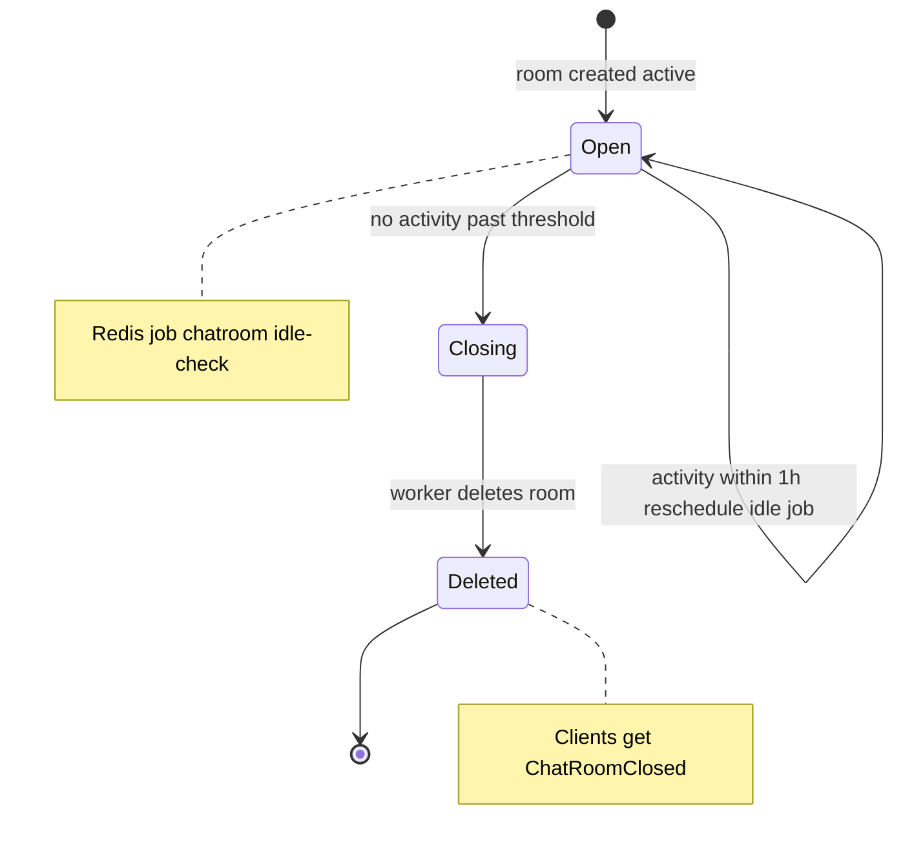
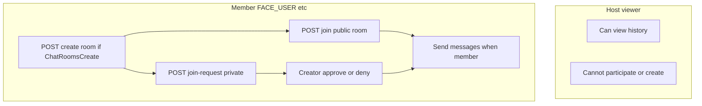
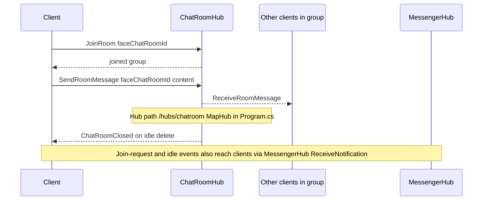
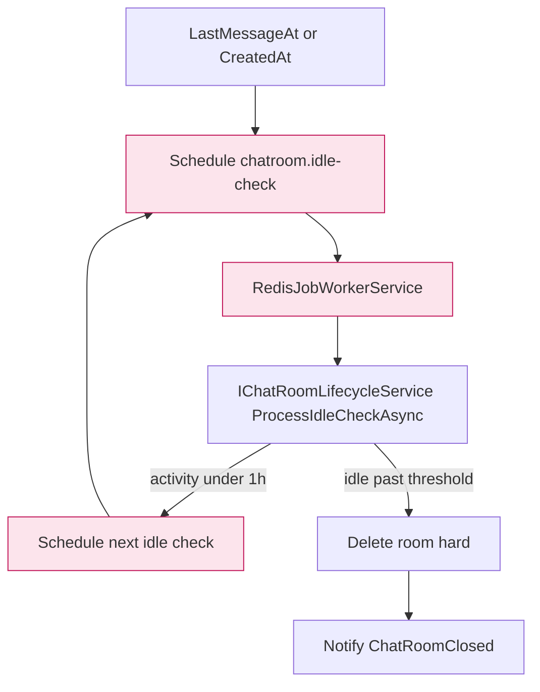
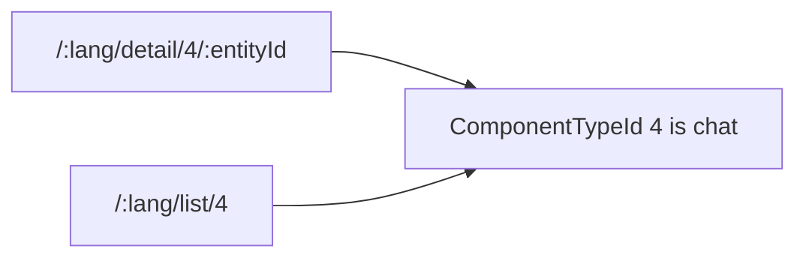
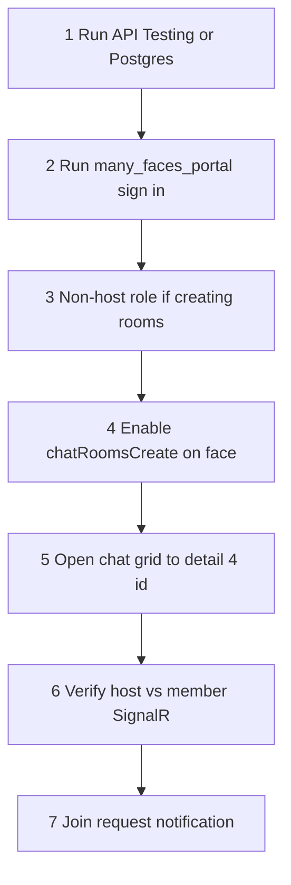

# Chat rooms: tests and operations

This document covers **face chat rooms** (API, SignalR, FE routing), **automated tests**, and **manual checks** in the browser. Ad-hoc HTTP checks (e.g. curl) are not scripted in the repo—do them as needed during development.

---

## 1. Backend (BeDemo.Api)

### 1.1 Running with `Testing` environment (in-memory, no Postgres)

Recommended for **quick manual checks** without Docker (Swagger, Postman, one-off curl):

```bash
cd many_faces_backend/BeDemo.Api
ASPNETCORE_ENVIRONMENT=Testing dotnet run --urls http://127.0.0.1:17778 --no-launch-profile
```

On startup, `Program.cs` runs **`EnsureCreated` + `DatabaseSeeder.SeedDataOnlyAsync`**: roles, faces, pages (same data as integration tests). Without this, `dotnet run` with `Testing` would see an **empty DB** and registration would fail with “USER role not found”.

**Note:** Do not run `dotnet test` and `dotnet run` with `Testing` in a way that shares one in-memory database name in **one process**—integration tests run in a separate process, so there is usually no conflict; issues were more common before seeding was added for standalone `dotnet run`.

### 1.2 Production / dev mode (Postgres)

Use `docker-compose.dev.yml` or your own connection string. After migrations, full `DatabaseSeeder.SeedAsync` runs, optionally `SeedUsersAsync`.

### 1.3 REST API (short reference)

| Method     | Path                                                    | Description                                    |
| ---------- | ------------------------------------------------------- | ---------------------------------------------- |
| GET        | `/api/faces/{faceId}/chat-rooms`                        | List rooms (host sees `canParticipate: false`) |
| GET        | `/api/faces/{faceId}/chat-rooms/{roomId}`               | Detail                                         |
| POST       | `/api/faces/{faceId}/chat-rooms`                        | User room (`Face.ChatRoomsCreate`, not host)   |
| POST       | `/api/faces/{faceId}/chat-rooms/system`                 | System room (global admin)                     |
| POST       | `/api/faces/{faceId}/chat-rooms/{roomId}/join`          | Public room                                    |
| POST       | `/api/faces/{faceId}/chat-rooms/{roomId}/join-requests` | Private room                                   |
| POST       | `/api/faces/{faceId}/chat-rooms/requests/{id}/approve`  | Approve (creator only)                         |
| POST       | `/api/faces/{faceId}/chat-rooms/requests/{id}/deny`     | Deny                                           |
| GET        | `/api/faces/{faceId}/chat-rooms/{roomId}/messages`      | History (host or member)                       |
| PUT/DELETE | `.../chat-rooms/{roomId}`                               | Update / delete per rules                      |

**OAuth2 (password grant)** (e.g. manual API calls):

- `POST /api/oauth2/register`
- `POST /api/oauth2/token` with `grantType=password`, `clientId=be-demo-client`, `clientSecret=be-demo-secret-very-strong-key`

**Face role:** A new user often has **`FACE_HOST`** after registration. To create a room they need **`FACE_USER`** (or another non-host role): `PUT /api/faces/{faceId}/my-role` with `userRoleId` from `GET /api/faces/face-roles`.

**Enabling room creation:** `PUT /api/faces/{faceId}` with `{ "chatRoomsCreate": true }`.

### Diagram: room lifecycle (idle / delete)



### Diagram: user flows (create, join, private request)



### 1.4 SignalR

- Hub: **`/hubs/chatroom`**
- Methods: `JoinRoom(faceChatRoomId)`, `LeaveRoom(faceChatRoomId)`, `SendRoomMessage(faceChatRoomId, content)`
- Client: `ReceiveRoomMessage`, `ChatRoomClosed`
- Join-request / idle-close notifications also go through **`MessengerHub`** (`ReceiveNotification`)—see existing FE `MessengerContext`.

### Diagram: SignalR chat room hub



### 1.5 Idle lifecycle (Redis)

Job type: `chatroom.idle-check`. Handled in `RedisJobWorkerService` → `IChatRoomLifecycleService.ProcessIdleCheckAsync`. If activity was within the last hour, the job is rescheduled; otherwise the room is deleted and the group receives `ChatRoomClosed`.

### Diagram: idle check worker



---

## 2. Automated tests — Backend (`BeDemo.Api.Tests`)

```bash
cd many_faces_backend
dotnet test BeDemo.Api.Tests/BeDemo.Api.Tests.csproj
```

### 2.1 `FaceChatRoomsControllerTests` (integration, WebApplicationFactory)

- **401** — list without token
- **404** — invalid `faceId`
- **403** — `Create` when `ChatRoomsCreate` is off
- **403** — `Create` for **FACE_HOST**
- **400** — empty room name
- **201** — create; creator is a member
- **404** — GET room under wrong `faceId`
- **403** — join for host
- **200** — join public room (FACE_USER)
- **200** — duplicate join → `alreadyMember`
- **400** — join-request on public room
- **200** — join-request on private room
- **403** — messages for non-member (non-host)
- **200** — messages for host without membership
- **403** — system create for normal user
- **201** — system create after **promoting user to global admin in DB** (test cannot rely on seeded admin accounts in in-memory DB)
- **403** — delete someone else’s room
- **204** — delete own room
- **200** — approve request as creator + verify `isMember`
- **200** — deny + verify `!isMember`
- **403** — approve as wrong user
- **Message pagination** — `beforeId` + insert messages via `ApplicationDbContext`

Helper: `PromoteUserToGlobalAdminAsync` sets `ApplicationUser.UserRoleId` to global **Admin** (API checks DB, not JWT).

### 2.2 `ChatRoomLifecycleServiceTests` (unit, InMemory + Moq)

- No room → no exception, no reschedule
- Recent `LastMessageAt` → `IRedisJobQueue.ScheduleAsync("chatroom.idle-check", …)`
- Old activity, `CreatorUserId == null` → room deleted
- `ScheduleIdleCheckAsync` → correct type and payload
- `LastMessageAt == null` → uses `CreatedAt` for reschedule decision

### 2.3 `FaceRoleParticipationTests`

- `IsHostFaceRole` only for exact `FACE_HOST` (case sensitive)
- `IsActiveForFaceRoleName` for non-host roles

---

## 3. Frontend (`many_faces_portal`)

```bash
cd many_faces_portal
yarn test
```

### 3.1 New / touched files

- `src/api/services/__tests__/ChatRoomsService.test.ts` — URLs, methods, headers, query `pageSize`/`beforeId`, error when `!res.ok`
- `src/constants/__tests__/componentTypeIds.test.ts` — chat variants → **4**, stories/reels sanity

### 3.2 Routing

- Detail: `/:lang/detail/4/:entityId` (`ComponentTypeId` chat = **4**)
- List: `/:lang/list/4`

### Diagram: FE routes for chat component type



---

## 4. Admin (`many_faces_admin`)

```bash
cd many_faces_admin
yarn test
```

- `useFacesApi`: `Face`, `CreateFaceData`, `UpdateFaceData` include **`chatRoomsCreate`**
- Test asserts `updateFace` sends `body.chatRoomsCreate`

_(You can add a UI checkbox in the face edit form separately—API and types are ready.)_

---

## 5. Manual checklist (OAuth + UI)

1. Run API (`Testing` or Postgres dev).
2. Run `many_faces_portal`, sign in (same OAuth password flow as the app).
3. In face settings pick a **non-host** role if you need to create rooms.
4. Turn **chat rooms create** on for the face (admin API or future admin UI).
5. Open the page with the chat grid → click a card → `/detail/4/{id}`.
6. Verify: host sees history, cannot write; member writes; SignalR delivers messages.
7. Notifications: private room → join request → `ReceiveNotification` in messenger.

### Diagram: manual checklist flow



---

## 6. File summary (main changes)

| Area            | Files                                                                                                                     |
| --------------- | ------------------------------------------------------------------------------------------------------------------------- |
| BE seed Testing | `BeDemo.Api/Program.cs`                                                                                                   |
| BE tests        | `BeDemo.Api.Tests/FaceChatRoomsControllerTests.cs`, `ChatRoomLifecycleServiceTests.cs`, `FaceRoleParticipationTests.cs`   |
| FE tests        | `many_faces_portal/src/api/services/__tests__/ChatRoomsService.test.ts`, `many_faces_portal/src/constants/__tests__/componentTypeIds.test.ts` |
| Admin           | `many_faces_admin/src/hooks/api/useFacesApi.ts`, `.../__tests__/useFacesApi.test.ts`                                            |
| Docs            | `docs/guides/chat-rooms-testing-and-operations.md`                                                                        |

---

## 7. Verification in this repo (2026-04-07)

- `dotnet test BeDemo.Api.Tests` — **296 passed**, 1 skipped (pre-existing).
- `many_faces_portal` `yarn test` — **58 passed**.
- `many_faces_admin` `yarn test` — **24 passed** (some files skipped as before).

If something fails, check API URL, environment (`Testing` vs Postgres), and OAuth `clientId` / `clientSecret` in `appsettings`.
