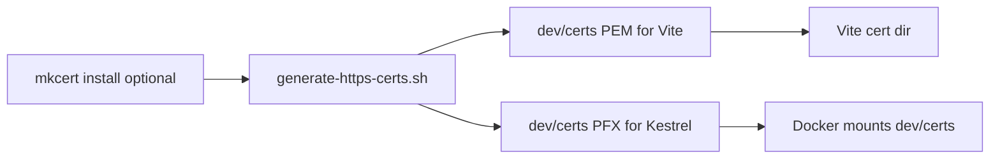
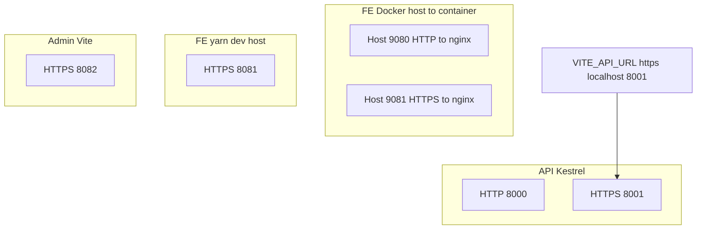

# Local HTTPS (API + Vite apps)

Scripts and cert output live in repository root: [`dev/`](../../dev/) (`generate-https-certs.sh`, `dev/certs/`).

## One-time setup

1. Generate shared certificates (PEM for Vite, PFX for ASP.NET):

   ```bash
   ./dev/generate-https-certs.sh
   ```

2. **Optional (recommended):** trust mkcert CA so browsers show no warnings:

   ```bash
   brew install mkcert   # if needed
   mkcert -install
   ```

   Without mkcert, the script uses OpenSSL; browsers will warn until you accept the risk.

### Diagram: cert generation flow



## Ports (default)

| Service                                | HTTP                               | HTTPS                              |
| -------------------------------------- | ---------------------------------- | ---------------------------------- |
| API (Kestrel)                          | 8000                               | 8001                               |
| FE (Vite, **Docker** host → container) | **9080** → 8081 (nginx → Vite TLS) | **9081** → 8081 (HTTPS to browser) |
| FE (`yarn dev` on host)                | —                                  | 8081                               |
| Admin (Vite)                           | —                                  | 8082                               |

**Cursor / embedded Chromium:** if `https://localhost:9081` fails with `ERR_CERT_AUTHORITY_INVALID`, open **`http://localhost:9080`** (same SPA shell). The browser then calls the API on the **same origin** (`http://localhost:9080/...`); nginx forwards `.../(api|hubs)` to Kestrel **HTTP** on `be-demo-dev:8000` so the embedded browser never touches `https://localhost:8001`.

**Safari / full browsers on `https://localhost:9081`:** in dev, the portal sets `VITE_API_URL` to the **same origin** on port **9081** as well, so XHR goes to nginx (not directly to `https://localhost:8001`, which Safari often rejects with no HTTP status). Nginx on **443** mirrors the **9080** API proxy rules; the regex excludes **`/src/api/...`** so Vite modules are not proxied to Kestrel by mistake.

Set `VITE_API_URL=https://localhost:8001` in `many_faces_portal/.env` and `many_faces_admin/.env` (see `.env.example`).

### Diagram: default HTTPS ports



## Docker (`docker-compose.dev.yml`)

- Mounts `./dev/certs` into the API container (`ASPNETCORE_DEV_HTTPS_PFX`) and into FE/admin (`VITE_DEV_CERT_DIR=/certs`).
- Run `./dev/generate-https-certs.sh` on the host **before** `docker compose up` if `dev/certs/` is empty.
- After **regenerating** PEM/PFX (any SAN change), restart every service that mounts `dev/certs` so nginx and Vite reopen the files and Kestrel reloads the PFX. From the monorepo root:

  ```bash
  docker compose -f docker-compose.dev.yml restart be-demo-dev fe-demo-dev fe-demo-proxy admin-demo-dev
  ```

  Skipping `fe-demo-proxy` / `fe-demo-dev` often looks like “the web broke” (`https://localhost:9081/...`): the browser or nginx may still be using a stale cert or the SPA may fail mixed-content checks until Vite restarts with the right env.

## Physical device (Expo) on the same network (Wi‑Fi or iPhone hotspot)

The phone must call the Mac’s **LAN IPv4**, not `localhost` (on the device, `localhost` is the phone itself). Docker already publishes `8001` on the host; the usual blocker is **TLS**: the dev cert must list that IP in **Subject Alternative Name**.

1. On the Mac, generate certs with the hotspot/LAN address in the SAN (pick one):

   ```bash
   # Auto-detect first IPv4 on en0 → en1 → en2 (typical for Wi‑Fi / hotspot client on Mac)
   HTTPS_DEV_INCLUDE_LAN_IP=1 ./dev/generate-https-certs.sh
   ```

   Or set the address explicitly (iPhone hotspot often uses `172.20.10.x` for the Mac):

   ```bash
   HTTPS_DEV_LAN_IP=172.20.10.2 ./dev/generate-https-certs.sh
   ```

   If you already have PEM/PFX and only changed options, force overwrite:

   ```bash
   HTTPS_DEV_REGENERATE=1 HTTPS_DEV_INCLUDE_LAN_IP=1 ./dev/generate-https-certs.sh
   ```

2. Restart TLS consumers (API + portal + nginx proxy + admin); see the Docker section above for the one-liner.

3. Configure **`many_faces_mobile`** (copy `.env.example` → `.env`):
   - **Recommended (auto):** set `EXPO_PUBLIC_DEV_LAN_HOST=<Mac-LAN-IP>` and **omit** `EXPO_PUBLIC_API_BASE_URL`. The app picks `http://10.0.2.2:8000` on Android emulator, `https://localhost:8001` on iOS Simulator, and **`http://<LAN-IP>:8000`** on a physical device (HTTP avoids untrusted mkcert TLS inside Expo Go). Faces config uses **`/public/api/...`** like the web portal.
   - **Manual HTTPS:** set `EXPO_PUBLIC_API_BASE_URL=https://<Mac-LAN-IP>:8001` only after the cert SAN includes that IP and the phone trusts the CA (mkcert root on device), or use a dev client build with ATS exceptions.

4. Restart Metro after `.env` changes: `npx expo start -c`.

**Trust / warnings:** With **mkcert**, the Mac trusts the local CA after `mkcert -install`; iOS does **not** trust that CA until you install the mkcert root on the phone (mkcert documents exporting the root CA). With **OpenSSL** self-signed, the device may still show TLS errors unless you use a profile or accept the exception—prefer mkcert for smoother HTTPS on a physical device, or use the mobile **HTTP :8000** auto path above for local-only demos.

## API with `localhost.pfx` on macOS (`dotnet run` on host)

When the PFX exists, Kestrel loads it with PKCS#12 key storage flags that differ by OS: **macOS does not support `EphemeralKeySet`**, so the API uses `DefaultKeySet` on Darwin and `EphemeralKeySet` on Linux/Windows (`Program.cs`). Docker images (Linux) are unchanged.

## API without `dev/certs`

If `dev/certs/localhost.pfx` is missing, the API uses normal `launchSettings` URLs. Use profile **https** and:

```bash
dotnet dev-certs https --trust
```
