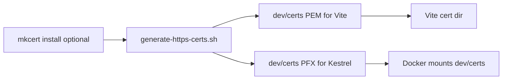
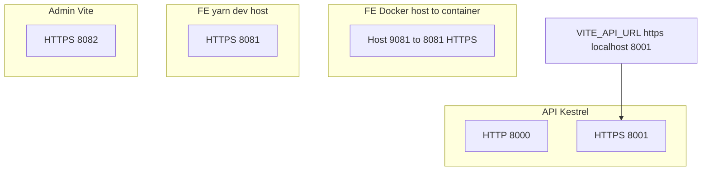

# Local HTTPS (API + Vite apps)

Scripts and cert output live in repository root: [`dev/`](../../dev/) (`generate-https-certs.sh`, `dev/certs/`).

## One-time setup

1. Generate shared certificates (PEM for Vite, PFX for ASP.NET):

   ```bash
   ./dev/generate-https-certs.sh
   ```

2. **Optional (recommended):** trust mkcert CA so browsers show no warnings:

   ```bash
   brew install mkcert   # if needed
   mkcert -install
   ```

   Without mkcert, the script uses OpenSSL; browsers will warn until you accept the risk.

### Diagram: cert generation flow



## Ports (default)

| Service                                | HTTP | HTTPS           |
| -------------------------------------- | ---- | --------------- |
| API (Kestrel)                          | 8000 | 8001            |
| FE (Vite, **Docker** host → container) | —    | **9081** → 8081 |
| FE (`yarn dev` on host)                | —    | 8081            |
| Admin (Vite)                           | —    | 8082            |

Set `VITE_API_URL=https://localhost:8001` in `fe_demo/.env` and `admin_demo/.env` (see `.env.example`).

### Diagram: default HTTPS ports



## Docker (`docker-compose.dev.yml`)

- Mounts `./dev/certs` into the API container (`ASPNETCORE_DEV_HTTPS_PFX`) and into FE/admin (`VITE_DEV_CERT_DIR=/certs`).
- Run `./dev/generate-https-certs.sh` on the host **before** `docker compose up` if `dev/certs/` is empty.

## API without `dev/certs`

If `dev/certs/localhost.pfx` is missing, the API uses normal `launchSettings` URLs. Use profile **https** and:

```bash
dotnet dev-certs https --trust
```
