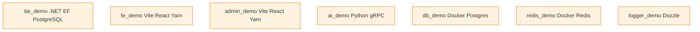
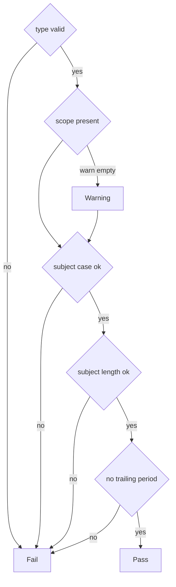
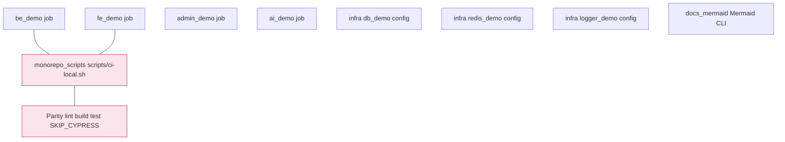
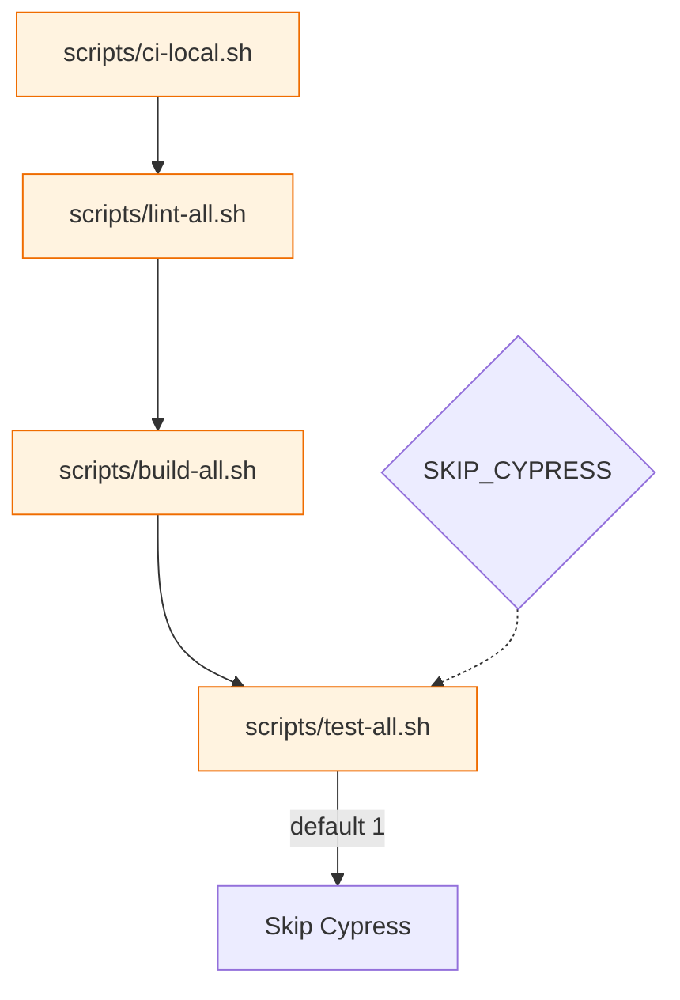
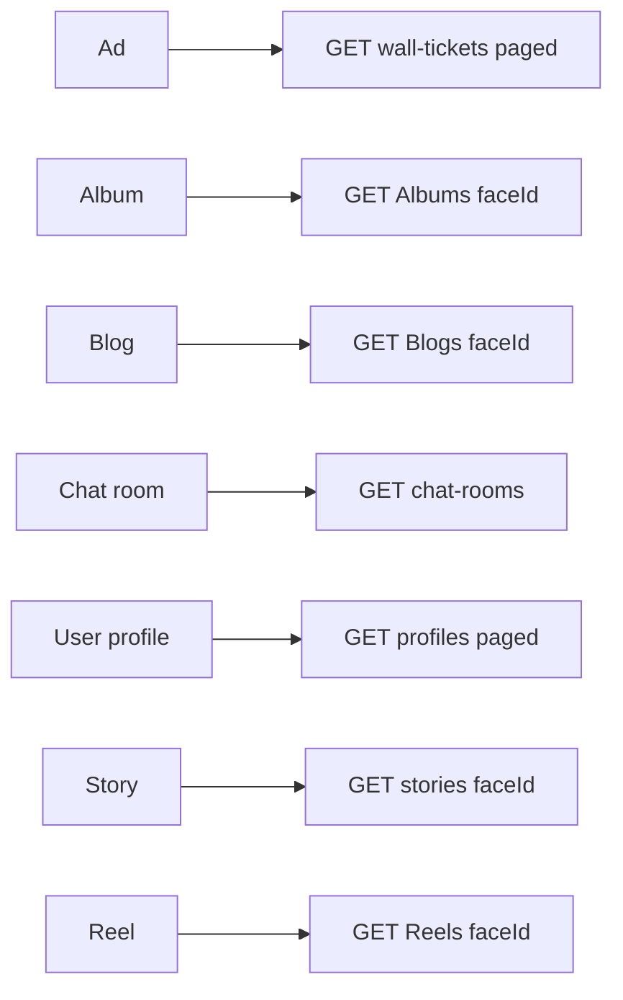
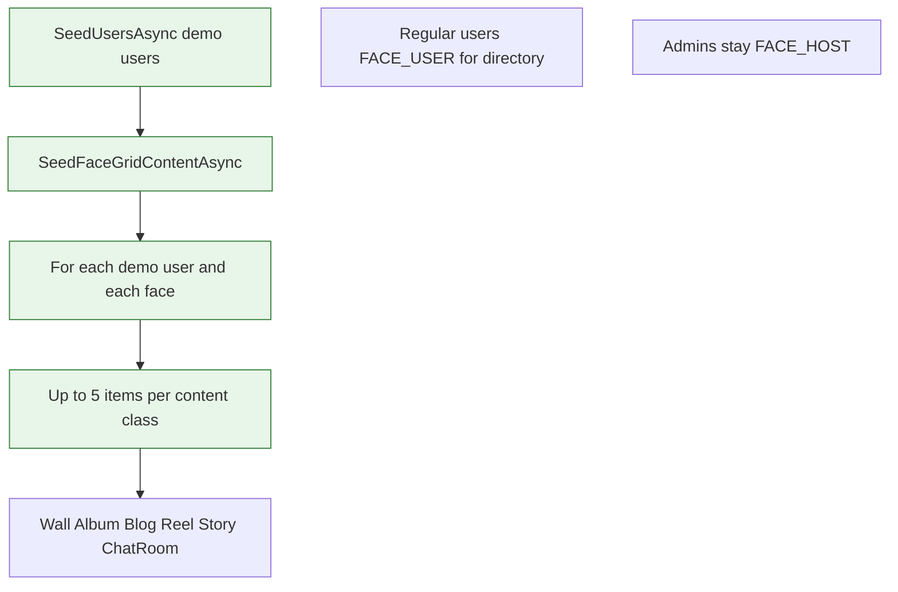

# Development — monorepo, CI, Node, Python, errors

This document covers **how we build and test** `_mfai_demo` (root repo with submodules / nested apps) and **contracts** shared by FE, admin, BE, and tooling.

## Documentation layout

- **Hub:** [**`docs/README.md`**](../README.md) — index of `guides/`, `components/`, `prompts/`, `readmes/`.
- **Structure rationale:** [`docs/STRUCTURE.md`](../STRUCTURE.md).

## Layout

| Area                 | Path           | Stack                     |
| -------------------- | -------------- | ------------------------- |
| Backend API          | `be_demo/`     | .NET, EF Core, PostgreSQL |
| Main frontend        | `fe_demo/`     | Vite, React, Yarn 4       |
| Admin UI             | `admin_demo/`  | Vite, React, Yarn 4       |
| AI gRPC service      | `ai_demo/`     | Python 3.11+, gRPC, Ruff  |
| PostgreSQL dev stack | `db_demo/`     | Docker Compose            |
| Redis dev stack      | `redis_demo/`  | Docker Compose            |
| Logger UI (Dozzle)   | `logger_demo/` | Docker Compose            |

### Diagram: monorepo layout



The **root** repository runs aggregated CI (see below). Each submodule that ships code also has its own `.github/workflows/ci.yml` for standalone pushes to that repo.

## Node.js (fe_demo, admin_demo)

- **Version**: `22.14.0` (`.nvmrc` in repo root, `fe_demo`, and `admin_demo`).
- **Package manager**: **Yarn 4** via Corepack (`packageManager` in each `package.json`). Do **not** use `npm` or `npx` for `fe_demo` / `admin_demo` (install, scripts, hooks, Docker) — use `yarn` / `yarn exec` / `yarn run` instead.
- **`engines.node`**: `>=22.14.0` in `fe_demo` and `admin_demo`.

Use `nvm use` (or your version manager) before `yarn install`. Older Node versions cause Vite warnings or failures.

### ESLint 10 and `eslint-plugin-react-hooks` (`fe_demo`, `admin_demo`)

Both SPAs use **ESLint 10** with **`@eslint/js` ^10** and **`typescript-eslint` ^8.58**. Stable **`eslint-plugin-react-hooks@latest`** (7.0.x) did not yet list ESLint **10** in `peerDependencies`, which produced Yarn **`YN0060`** against ESLint 10. The repos therefore pin an **exact** **canary** build whose peers include **`^10.0.0`** (strategy **A2** in [`docs/prompts/eslint10-react-hooks-peer-yarn-agent-prompt.md`](../prompts/eslint10-react-hooks-peer-yarn-agent-prompt.md)).

- **Submodule docs:** [`fe_demo/docs/eslint-plugin-react-hooks-peer.md`](../../fe_demo/docs/eslint-plugin-react-hooks-peer.md), [`admin_demo/docs/eslint-plugin-react-hooks-peer.md`](../../admin_demo/docs/eslint-plugin-react-hooks-peer.md) — removal trigger, risk, upstream links.
- **Flat config:** `eslint.config.js` extends **`reactHooks.configs.flat.recommended`** (full React Compiler–aligned hooks rules) with **`eslint-config-prettier` last**. Violations were cleared in both SPAs (`set-state-in-effect` refactors, TanStack Table / RHF **`react-hooks/incompatible-library`** remain at **`warn`** upstream).
- **Yarn:** after the pin, **`YN0060`** for the ESLint ↔ react-hooks conflict should be **gone**. A generic **`YN0086`** (“peer dependencies incorrectly met by **dependencies**”) may still appear from **transitive** trees (e.g. tooling); investigate with `yarn explain peer-requirements` if it blocks CI policy.
- **Gradual rollout** of the full `eslint-plugin-react-hooks` `flat.recommended` preset (React Compiler–oriented rules): agent prompt [`docs/prompts/react-hooks-compiler-rules-rollout-agent-prompt.md`](../prompts/react-hooks-compiler-rules-rollout-agent-prompt.md).

## Python (ai_demo)

- **CI / recommended**: **Python 3.11** (matches `pyproject.toml` target and GitHub Actions).
- Generated gRPC files (`proto/*_pb2*.py`) are **gitignored**; CI and local dev generate them with:

  ```bash
  cd ai_demo
  ./generate_proto.sh
  ```

  or `python -m grpc_tools.protoc -I proto --python_out=proto --grpc_python_out=proto proto/health.proto`.

- **Lint**: `./lint.sh` (Ruff). **Tests**: after generating protos, `PYTHONPATH=. pytest test_server.py` (no PyTorch required for health-check tests).

## Git hooks (Husky + commitlint)

- Husky **9**: hooks **do not** source `husky.sh`. Use a shebang and direct commands, e.g. `yarn exec commitlint --edit "$1"` (same for `lint-staged`).
- **fe_demo** and **admin_demo**: Yarn `prepare` → Husky; `commitlint.config.js` (ESM).
- **be_demo**: run **`yarn install`** in `be_demo/` (Yarn 4 / PnP as in `package.json`) so Husky and commitlint are available; **`commitlint.config.cjs`** + `.husky/commit-msg` runs `yarn exec commitlint` (same rules as FE/admin). **`node_modules/`** is gitignored for edge cases; this repo uses Plug’n’Play (`.pnp.cjs`).

### Commit message rules (all repos with commitlint)

Conventional Commits: **`type(scope): subject`**

| Rule        | Detail                                                                                                              |
| ----------- | ------------------------------------------------------------------------------------------------------------------- |
| **type**    | One of: `feat`, `fix`, `docs`, `style`, `refactor`, `perf`, `test`, `build`, `ci`, `chore`, `revert`                |
| **scope**   | Recommended, not empty (warning if missing): short area, e.g. `wall`, `fe`, `admin`, `api`, `ci`                    |
| **subject** | **lower-case** or **sentence-case**; no trailing period; max **100** chars                                          |
| **Avoid**   | Random **ALL CAPS** acronyms in the subject (e.g. write “ci workflow” not “CI Workflow”) — `subject-case` will fail |

**Examples (valid)**

```text
feat(wall): add host viewer detection for create button
fix(admin): show api error text in moderation toasts
test(api): cover wall list when face is missing
chore: bump fe_demo submodule pointer
docs: expand development and ci notes
```

**Examples (invalid)**

```text
feat: no scope (warning)
feat(WALL): WRONG CASE SUBJECT
fix(api): Ends with period.
```

### Diagram: commitlint decision tree



## Continuous integration

### Root `mfai_demo` — workflow `.github/workflows/ci.yml`

On push/PR to `main` / `master`, with **submodules recursive**:

| Job                   | What runs                                                                                                                                                    |
| --------------------- | ------------------------------------------------------------------------------------------------------------------------------------------------------------ |
| **be_demo**           | `dotnet restore`, `dotnet format --verify-no-changes`, Release build, `dotnet test`                                                                          |
| **fe_demo**           | Node from `fe_demo/.nvmrc`, `yarn install --immutable`, `yarn validate`, `yarn test`, `yarn build`                                                           |
| **admin_demo**        | Same pattern with `admin_demo/.nvmrc`                                                                                                                        |
| **ai_demo**           | Python **3.11**, pip install **grpcio 1.68.x** + ruff + pytest (no torch), **generate protos**, `ruff` + `pytest test_server.py`                             |
| **infra_db_demo**     | `docker compose -f db_demo/docker-compose.yml config`                                                                                                        |
| **infra_redis_demo**  | `docker compose -f redis_demo/docker-compose.yml config`                                                                                                     |
| **infra_logger_demo** | `docker compose -f logger_demo/docker-compose.dev.yml config`                                                                                                |
| **docs_mermaid**      | Node from `fe_demo/.nvmrc`, runs **`./scripts/check-mermaid-docs.sh`** — validates every **mermaid**-labeled fenced code block via `@mermaid-js/mermaid-cli` |
| **monorepo_scripts**  | Runs **`./scripts/ci-local.sh`**: `scripts/lint-all.sh` → `scripts/build-all.sh` → `scripts/test-all.sh` (with `SKIP_CYPRESS=1`)                             |

The **monorepo_scripts** job is the parity check that root orchestration scripts match what individual jobs already cover; it fails if e.g. `scripts/lint-all.sh` or `verify-ci.sh` drifts from CI.

### Diagram: root CI jobs (parallel)



Commits that **only** bump submodule SHAs and/or `docs/` still trigger this pipeline so every merge is validated against the checked-in submodule tree.

## Monorepo scripts (`scripts/`)

Run from repository root (submodules checked out). Make executable if needed: `chmod +x scripts/*.sh **/lint.sh ai_demo/verify-ci.sh`.

| Script                              | Purpose                                                                                                                                                                                                                         |
| ----------------------------------- | ------------------------------------------------------------------------------------------------------------------------------------------------------------------------------------------------------------------------------- |
| **`scripts/ci-local.sh`**           | One entrypoint: **lint-all** → **build-all** → **test-all**. Sets `SKIP_CYPRESS=1` unless you override.                                                                                                                         |
| **`scripts/lint-all.sh`**           | Calls `fe_demo`, `be_demo`, `admin_demo`, `ai_demo` each `./lint.sh` (FE/admin: `yarn validate`; BE: `dotnet format`; AI: Ruff).                                                                                                |
| **`scripts/build-all.sh`**          | `be_demo`: `dotnet build -c Release`; `fe_demo` / `admin_demo`: `yarn build`; `ai_demo`: `./verify-ci.sh`.                                                                                                                      |
| **`scripts/test-all.sh`**           | `dotnet test` (BE), `yarn test` (FE/admin), **`ai_demo/verify-ci.sh`**, optional Cypress e2e unless `SKIP_CYPRESS=1`.                                                                                                           |
| **`scripts/status-all.sh`**         | Docker / HTTP status of dev containers (does not run builds).                                                                                                                                                                   |
| **`scripts/format-all-doc.sh`**     | Prettier over all `*.md` / `*.mdx` (respects **`.prettierignore`**). Use **`--check`** for a no-write verify. Does **not** validate Mermaid syntax inside fences.                                                               |
| **`scripts/check-mermaid-docs.sh`** | Python walker + **`npx @mermaid-js/mermaid-cli`** (`mmdc`): each **mermaid** fence must render. Slower (Chromium); run before large doc merges. **`docs_mermaid`** CI job runs this. Not included in **`scripts/ci-local.sh`**. |

**Dev stack:** `scripts/start-all-dev.sh`, `scripts/stop-all-dev.sh`, `scripts/clear-all-dev.sh`, `scripts/rebuild-all-dev.sh`, `scripts/restart-all-dev.sh`, `scripts/start-missing-dev.sh`, `scripts/menu.sh`.

**`ai_demo/verify-ci.sh`**: local venv `.venv-ci-verify/`, gRPC stub generation, ruff, pytest — aligned with the **ai_demo** GitHub Actions job (no PyTorch).

### Diagram: ci-local chain



### Submodule-only repos

Each of `be_demo`, `fe_demo`, `admin_demo`, `ai_demo`, `db_demo`, `redis_demo`, `logger_demo` includes its own **CI** workflow for development outside the monorepo.

## Authentication, JWT, and “stay signed in” (`rememberMe`)

**Purpose:** Users log in through **`POST /api/oauth2/token`** (password grant). The optional **`rememberMe`** flag does **not** create a separate session type — it only selects a **longer JWT lifetime** from configuration (`Jwt:ExpiresInMinutesRememberMe` vs `Jwt:ExpiresInMinutes`). Both **`fe_demo`** and **`admin_demo`** store the access token in **`localStorage`**, decode **`exp`** in **`jwtUtils.isTokenExpired`**, and clear storage when the token is invalid so the UI matches API **401** behaviour.

**Why it matters:** Misunderstanding `rememberMe` leads to wrong ops expectations. With **`rememberMe: true`**, the API issues a **longer-lived access JWT**; **refresh tokens** are also supported server-side (rotation, single-use) — see `OAuthRefreshTokenStore` and [acl-and-capabilities.md](./acl-and-capabilities.md).

**Detailed guides (tables, file map, curl, tests):**

- [**authentication-and-sessions.md**](./authentication-and-sessions.md)
- Curl register/token (includes `rememberMe` example): [**api-oauth-stories-curl.md**](./api-oauth-stories-curl.md)

**Tests (auth slice):** `BeDemo.Api.Tests/OAuth2RememberMeTests.cs`; `fe_demo` / `admin_demo` — `src/utils/__tests__/jwtUtils.test.ts`, `src/hooks/api/__tests__/authTokenRequest.test.ts`.

## ACL, capabilities, and permission keys

**Purpose:** The UI should not re-implement authorization rules from JWT claims alone. The API exposes computed flags via **`GET /{face}/api/me/capabilities`**; **fe_demo** and **admin_demo** mirror permission strings in **`src/acl/`** and load data through **`fetchMeCapabilities`** + **`useMeCapabilities`** (React Query), with cache invalidation tied to login / logout / refresh in **`useAuthApi`**.

**Detailed reference (API shape, key catalog, file map, integration test users, list of test files):** [**acl-and-capabilities.md**](./acl-and-capabilities.md).  
**ACL / capabilities (operational):** [**acl-and-capabilities.md**](./acl-and-capabilities.md).

## API error messages in the browser

User-facing fetch wrappers use **`getApiErrorMessage`** (`fe_demo` / `admin_demo`: `src/utils/apiErrorMessage.ts`):

- Parses JSON bodies: `{ "error": "..." }`, ASP.NET **ProblemDetails** (`detail`, then `title`), and flat **`errors`** maps (validation).
- Non-JSON bodies shorter than ~280 characters are shown as plain text; longer bodies fall back to a generic message.

**Backend**: many endpoints return `new { error = "..." }` or ProblemDetails; both are covered.

## Testing (quick reference)

| Suite | Command                              | Notes                                                                                                                                                                                                                                                                                                                       |
| ----- | ------------------------------------ | --------------------------------------------------------------------------------------------------------------------------------------------------------------------------------------------------------------------------------------------------------------------------------------------------------------------------- |
| BE    | `dotnet test` in `be_demo`           | Integration tests; `Testing` environment where configured. Includes **`OAuth2RememberMeTests`** (JWT TTL vs `rememberMe`), **`AclIntegrationTests`**, **`AclBearerJwtValidationTests`** (expired/malformed JWT), **`AccessCapabilitiesServiceTests`**, **`PlatformAccessRulesTests`**, **`FaceRoleSelfServiceRulesTests`**. |
| FE    | `yarn test` in `fe_demo`             | Vitest. Auth: **`jwtUtils`**, **`authTokenRequest`**. ACL: **`src/acl/__tests__`**, **`meCapabilitiesClient`**, **`useMeCapabilities`**, **`facePathRouting`** (includes `/api/me/capabilities`).                                                                                                                           |
| Admin | `yarn test` in `admin_demo`          | Vitest. Same patterns; plus **`faceApiRouting_acl`**, **`meCapabilitiesClient`**, **`useMeCapabilities`**.                                                                                                                                                                                                                  |
| AI    | `pytest test_server.py` in `ai_demo` | After proto generation; `PYTHONPATH=.`                                                                                                                                                                                                                                                                                      |

Wall ticket API behaviour: [wall-tickets.md](./wall-tickets.md).

## Face home grid & demo content (FE + BE)

The **page grid** on a face home page (`PageGridLayout` + `fe_demo/src/components/grid/*`) supports **single**, **grid**, and **carousel** display modes per component type (Ad, Album, Blog, ChatRoom, UserProfile, Story, Reel).

### Data sources (authenticated, scoped by selected face)

| Type             | Source                                                                      | Notes                                                                               |
| ---------------- | --------------------------------------------------------------------------- | ----------------------------------------------------------------------------------- |
| **Ad**           | `GET /api/faces/{faceId}/wall-tickets` (paged; FE may fetch multiple pages) | Listing-style UI; image is a **placeholder** (picsum) — tickets have no image URL.  |
| **Album**        | `GET /api/Albums?faceId=`                                                   | Cover is placeholder by album id; album has no cover field on API.                  |
| **Blog**         | `GET /api/Blogs?faceId=`                                                    | Uses first blog image when present.                                                 |
| **Chat room**    | `GET /api/faces/{faceId}/chat-rooms`                                        | Single tile: first room or `boundChatRoomId` from grid JSON.                        |
| **User profile** | `GET /api/faces/{faceId}/profiles` (paged; FE aggregates pages)             | Directory lists **non-host** face roles; links use `/{faceIndex}/profile/{userId}`. |
| **Story**        | `GET /api/stories?faceId=`                                                  | Published, non-expired, targeted to face; links to `/{faceIndex}/stories`.          |
| **Reel**         | `GET /api/Reels?faceId=`                                                    | Standard reel list filter.                                                          |

### Diagram: face grid tile data sources



**Pagination**: grid/carousel components compute **items per page** from container size; **`ComponentBlock`** footer prev/next is **wired** via `page` / `onPageChange` from `PageGridLayout` for all modes that declare a footer.

### Database seeding (`DatabaseSeeder`)

After **`SeedUsersAsync`** (demo `@demo.com` users), **`SeedFaceGridContentAsync`** runs (non-fatal on failure):

- For **each** demo user and **each** face, ensures **5** items per content class: wall tickets, albums (+ `AlbumFace`), blogs (+ image), reels (+ `ReelFace`), **published** stories (+ `StoryFace` + image), `FaceChatRoom`.
- **Regular** seeded users (`user01@demo.com` …) are normalized to **`FACE_USER`** per face (not `FACE_HOST`) so the **profile directory** is populated; **admins** stay **`FACE_HOST`** for moderation semantics.
- Logic is **idempotent** (counts per user+face, fills up to 5).

Implementation: `be_demo/BeDemo.Api/Scripts/DatabaseSeeder.cs`; invoked from `Program.cs` after user seed in non-Testing environments.

### Diagram: seeding loops (idempotent)



## Functionality gaps (intentional / backlog)

Not implemented in this baseline (see also **Future** in [wall-tickets.md](./wall-tickets.md)):

- **Security / ops hardening**: rate limiting, strict CORS policy tuning (deferred).
- **Face-level moderators** (only global Admin/SuperAdmin for wall moderation today).
- **Notifications** for ticket state changes, **reports**, rich moderation filters.
- **Cancelling** delayed deny deletion jobs if workflow changes; configurable retention vs fixed 2 days.

i18n: wall and settings strings exist for **en / sk / cz**; other app areas may still be English-only — extend `src/i18n/locales` as needed.

## Related docs

- [**`docs/README.md`**](../README.md) — documentation hub.
- [authentication-and-sessions.md](./authentication-and-sessions.md) — login, JWT, `rememberMe`, config, FE/admin, tests, security.
- [wall-tickets.md](./wall-tickets.md) — feature behaviour, API tables, Redis worker, manual checks.
- [chat-rooms-testing-and-operations.md](./chat-rooms-testing-and-operations.md) — chat / rooms operations.
- [api-oauth-stories-curl.md](./api-oauth-stories-curl.md) — OAuth2 + Stories curl walkthrough.
- [acl-and-capabilities.md](./acl-and-capabilities.md) — capabilities API, permission keys, FE/admin wiring, tests.
- [redis-subrepo.md](../readmes/redis-subrepo.md) — Redis submodule.
- [fe-demo-overview.md](../readmes/fe-demo-overview.md) / [admin-demo-overview.md](../readmes/admin-demo-overview.md) — FE / admin extended overviews.
- [git-submodules.md](./git-submodules.md) — submodule checkout and updates.
- [security-crypto-sockets.md](./security-crypto-sockets.md) — TLS, JWT keys, WebSockets backlog.
