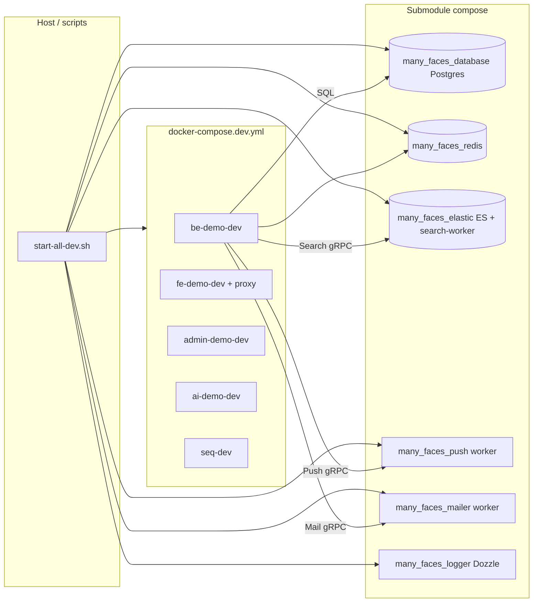

# Docker and Compose (local stack)

This guide ties together the **monorepo** compose file and per-service Docker READMEs. Commands assume repository root **`many_faces_main`**.

## Entry compose

- **`docker-compose.dev.yml`** (repo root) — primary local orchestration: API, SPAs, PostgreSQL, Redis, logger UI, AI, and (via **`./scripts/start-all-dev.sh`**) attached **Elasticsearch + search-worker**, **FCM push-worker**, and **Java mailer-worker** when their submodule scripts exist. Ports and env: [`dev-https.md`](./dev-https.md), [`troubleshooting-local-dev.md`](./troubleshooting-local-dev.md).

### Diagram: dev stack data paths (simplified)

## Submodule stacks

| Area | Submodule | Typical role |
| ---- | --------- | ------------- |
| PostgreSQL | `many_faces_database/` | Dev database container(s); see [`many_faces_database/README.md`](../../many_faces_database/README.md). |
| Redis | `many_faces_redis/` | Cache / job queue infra; see [`many_faces_redis/README.md`](../../many_faces_redis/README.md) and [`redis-subrepo.md`](../readmes/redis-subrepo.md). |
| Search index | `many_faces_elastic/` | Elasticsearch + **Go search-worker** (gRPC); backend talks to the worker only — see [`elasticsearch-search-features-overview.md`](./elasticsearch-search-features-overview.md), [`many_faces_elastic/README.md`](../../many_faces_elastic/README.md), [`elasticsearch-local-dev.md`](./elasticsearch-local-dev.md), and [`elasticsearch-grpc-tls-mtls.md`](./elasticsearch-grpc-tls-mtls.md). Started by default with **`./scripts/start-all-dev.sh`**; set **`ENABLE_ELASTICSEARCH=0`** to skip. |
| Push / FCM | `many_faces_push/` | **Go gRPC** FCM worker + compose; local dev: [`push-notifications-local-dev.md`](./push-notifications-local-dev.md), repo [`many_faces_push/README.md`](../../many_faces_push/README.md). Default-on with **`start-all-dev`**; **`ENABLE_PUSH_WORKER=0`** to skip. |
| Transactional mail | `many_faces_mailer/` | **Java gRPC** mailer + Mailpit in dev — [`mailer-local-dev.md`](./mailer-local-dev.md), [`many_faces_mailer/README.md`](../../many_faces_mailer/README.md). Default-on; **`ENABLE_MAILER_WORKER=0`** to skip. |
| Logs UI | `many_faces_logger/` | Dozzle / log viewing; see [`many_faces_logger/README.md`](../../many_faces_logger/README.md). |

## Edge cases (operators)

| Situation | What happens |
| --------- | -------------- |
| **`ENABLE_*=0`** | That worker stack is not started; backend still receives compose defaults for disabled integrations (`Search__` / `Push__` / `Mail__` from env substitution — see `docker-compose.dev.yml`). |
| Submodule directory missing or **no `scripts/start-*.sh`** | `start-all-dev.sh` skips starting that worker; exports may still enable API features — use **`ENABLE_*=0`** or check [`status-all.sh`](../../scripts/status-all.sh) output. |
| **Push without Firebase JSON** | Worker starts; FCM sends fail until `many_faces_push/firebase-sa.json` or **`FIREBASE_SA_HOST_PATH`** is set (script prints a warning). |
| **TLS smoke CI** (`*_GRPC_REFLECTION=0`) | `grpcurl` must use **`-import-path`** + **`-proto grpc/health/v1/health.proto`** (vendored under each worker’s `scripts/grpcurl-protos/`). Guarded by **`./scripts/verify-dev-stack-contracts.sh`**. |

## Scripts

Aggregated lifecycle scripts (`ci-local.sh`, `build-all.sh`, …) are documented in [`development.md`](./development.md) (*Monorepo scripts*). Quick contract drift checks run at the start of **`ci-local.sh`** via **`scripts/verify-dev-stack-contracts.sh`** (bash `-n`, grep invariants).

## Related

- [`dev-https.md`](./dev-https.md) — TLS, ports, macOS PFX notes.
- [`elasticsearch-search-features-overview.md`](./elasticsearch-search-features-overview.md) — search stack: capabilities, TLS/mTLS, smoke, CI, tests.
- [`elasticsearch-local-dev.md`](./elasticsearch-local-dev.md) — ports, `ENABLE_ELASTICSEARCH`, Docker DNS, gRPC env for the API.
- [`testing-and-ci-matrix.md`](./testing-and-ci-matrix.md) — CI jobs vs local scripts.
- [`troubleshooting-local-dev.md`](./troubleshooting-local-dev.md) — when containers fail health checks.
