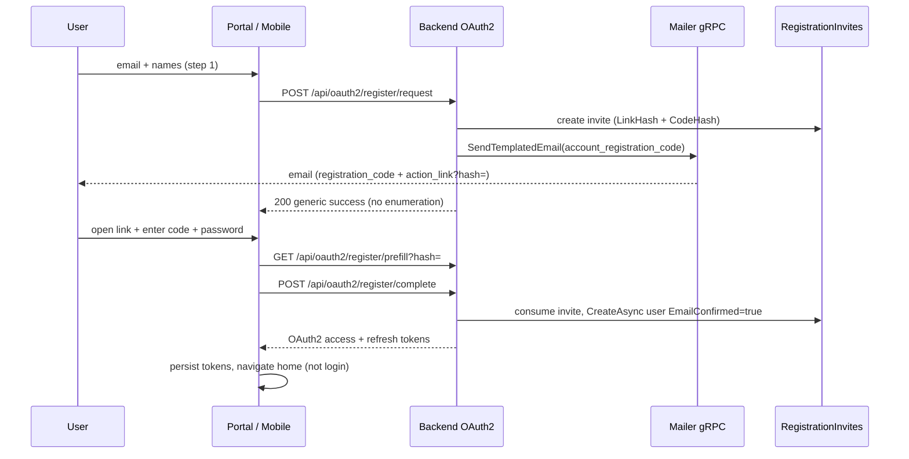

# Email + code registration (via mailer)

End-user signup is a **two-step** flow: request an email with a short verification code and a completion link (`?hash=` in the URL), then finish registration with password and receive **OAuth2 tokens** (auto-login). This replaces the legacy one-shot `POST /api/oauth2/register`.

**Related:** [authentication-and-sessions.md](./authentication-and-sessions.md) · [mailer-local-dev.md](./mailer-local-dev.md) · [Agent prompt](../prompts/email-code-registration-via-mailer-agent-prompt.md)

## Overview

| Step | User action | API |
|------|-------------|-----|
| 1 | Enter email (+ optional names) | `POST /api/oauth2/register/request` |
| 2 | Open mail link, enter code + password | `GET …/prefill?hash=` then `POST …/complete` |

The **verification code** appears only in the email body. The **link hash** appears only in the URL query (`hash=…`). The backend always pairs hash + code on the same `RegistrationInvite` row.

## Flow



## Public API

| Method | Path | Body / query | Response |
|--------|------|--------------|----------|
| POST | `/api/oauth2/register/request` | `email`, optional `firstName`, `lastName`, `locale`, `platform` (`mobile` → deep link in mail) | Generic OK message |
| POST | `/api/oauth2/register/resend` | `email`, optional `locale`, `platform` | Generic OK; **rotates** `LinkHash` + code |
| GET | `/api/oauth2/register/prefill` | `hash` (required) | `email`, names, `expiresAtUtc`, `valid` — **never** the code |
| POST | `/api/oauth2/register/complete` | `hash`, `code`, `password`, `clientId`, `clientSecret`, optional `rememberMe` | `OAuth2TokenResponse` + `userId`, `email` |

Legacy **`POST /api/oauth2/register`** → **400** `registration_flow_deprecated`.

All routes are under **`/api/oauth2/*`** (face-prefix exempt). Rate limit: **`oauth-register`**.

## Admin (stance B)

Operators with **`CanManageAllFaces`**:

| Method | Path |
|--------|------|
| GET | `/api/admin/registration-invites` |
| POST | `/api/admin/registration-invites` |
| POST | `/api/admin/registration-invites/{id}/revoke` |

UI: **many_faces_admin** → Registration invites (create, resend email, revoke).

## Mailer template

| `template_id` | Required params |
|---------------|-----------------|
| `account_registration_code` | `action_link`, `registration_code`, `user_name`, `expiry_minutes` |

Locales: **en**, **sk** (minimum). Copy explains finishing signup with the code — not “confirm existing account”.

## Configuration

| Key | Purpose |
|-----|---------|
| `RegistrationInvite:CodeLength` | Verification code length (default 6) |
| `RegistrationInvite:ExpiryMinutes` | Invite TTL |
| `RegistrationInvite:MaxAttempts` | Wrong-code budget per invite |
| `RegistrationInvite:HmacPepper` | Server secret for `CodeHash` |
| `RegistrationInvite:CleanupIntervalMinutes` | Background purge interval |
| `RegistrationInvite:ConsumedRetentionDays` | Keep consumed rows briefly, then delete |
| `Mail:Enabled` | When false, mail send is skipped (request still returns generic OK) |
| `Mail:RegistrationLinks:PortalPublicBaseUrl` | Portal origin for `action_link` |
| `Mail:RegistrationLinks:CompleteRegistrationPathTemplate` | e.g. `/{locale}/register/complete` |
| `Mail:RegistrationLinks:MobileDeepLinkBase` | e.g. `manyfaces://register/complete` |
| `Mail:RegistrationLinks:PreferMobileDeepLinkWhenPlatformMobile` | Use deep link when `platform: mobile` |

## Clients

| Client | Step 1 | Step 2 |
|--------|--------|--------|
| Portal | `RegisterPage` → `registrationApi.postRegisterRequest` | `/{locale}/register/complete?hash=` → `RegisterCompletePage` |
| Mobile | `RegisterScreen` → `requestRegistrationEmail` | Deep link `manyfaces://register/complete?hash=` → `RegisterCompleteScreen` |

## Edge cases (operator)

| Situation | Behavior |
|-----------|----------|
| Email already registered | Same 200 as success; **no** mail |
| Expired invite | `prefill.valid=false` or complete fails |
| Wrong code | Increments `FailedAttemptCount`; generic error |
| Resend | New hash + code; old hash stops working |
| Second complete with same hash | Fails (already consumed) |

## Manual acceptance

1. Start stack with **`ENABLE_MAILER_WORKER=1`**, **`Mail:Enabled=true`**, Mailpit on **58025**.
2. Portal: register step 1 → Mailpit shows **`account_registration_code`** with code + link containing `?hash=`.
3. Open `http://localhost:9081/en/register/complete?hash=…` → enter code + password → land on **authenticated** home (no login screen).
4. Mobile: request with app installed → tap deep link → complete screen → signed in.
5. Admin: create invite for test email → same mail pipeline.

## Cleanup

`RegistrationInviteCleanupHostedService` deletes expired, old consumed, and revoked rows on a timer.

## Tests

| Area | Class |
|------|--------|
| Backend edge cases | `RegistrationInviteEdgeCaseTests`, `OAuth2EdgeCaseTests` |
| Backend crypto / cleanup | `RegistrationInviteCryptoTests`, `RegistrationInviteCleanupHostedServiceTests` |
| Admin ACL | `AdminRegistrationInvitesControllerTests` |
| Mailer template | `AccountRegistrationCodeTemplateEdgeTest` |

```bash
cd many_faces_backend && dotnet test --filter "FullyQualifiedName~RegistrationInvite"
cd many_faces_mailer && ./mvnw test -Dtest=AccountRegistrationCodeTemplateEdgeTest
```
