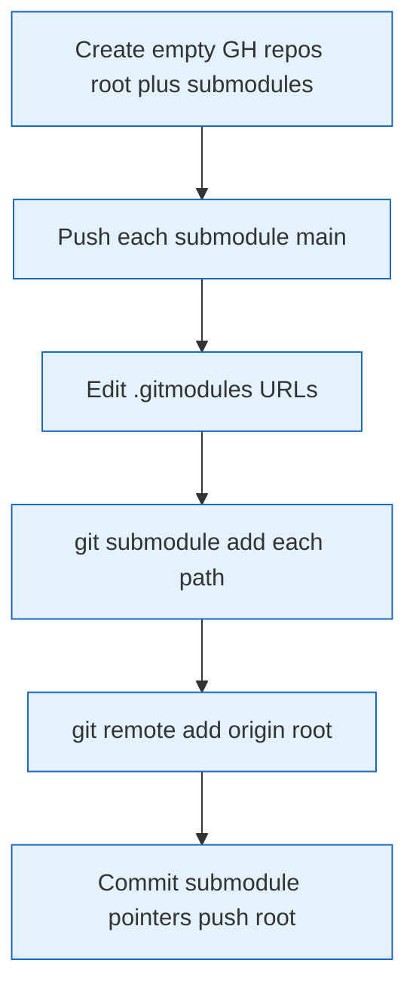
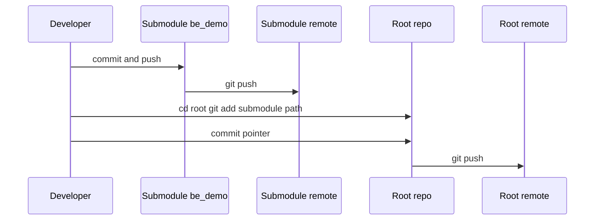

# Git submodules setup

## Creating GitHub repositories with submodules

### 1. Create repositories on GitHub

Create **7+ private repositories** on GitHub (root + submodules). Canonical names in this org:

1. **Root repo**: `many_faces_main` (historically cloned as `_mfai_demo` / `mfai_demo` is fine locally)
2. **Submodules** (remote repo names — **local paths** in the monorepo stay `be_demo/`, `fe_demo/`, …):
   - `many_faces_backend` → path `be_demo/`
   - `many_faces_portal` → path `fe_demo/`
   - `many_faces_admin` → path `admin_demo/`
   - `many_faces_ai` → path `ai_demo/`
   - `many_faces_database` → path `db_demo/`
   - `many_faces_redis` → path `redis_demo/`
   - `many_faces_logger` → path `logger_demo/`

### 2. Set remote URL in each submodule

For each submodule, set the remote URL (replace `YOUR_USERNAME` with your GitHub username):

```bash
# Backend
cd be_demo
git remote add origin https://github.com/YOUR_USERNAME/many_faces_backend.git
git branch -M main
git push -u origin main

# Frontend
cd ../fe_demo
git remote add origin https://github.com/YOUR_USERNAME/many_faces_portal.git
git branch -M main
git push -u origin main

# Admin
cd ../admin_demo
git remote add origin https://github.com/YOUR_USERNAME/many_faces_admin.git
git branch -M main
git push -u origin main

# AI Demo
cd ../ai_demo
git remote add origin https://github.com/YOUR_USERNAME/many_faces_ai.git
git branch -M main
git push -u origin main

# Database
cd ../db_demo
git remote add origin https://github.com/YOUR_USERNAME/many_faces_database.git
git branch -M main
git push -u origin main

# Redis (job queue)
cd ../redis_demo
git remote add origin https://github.com/YOUR_USERNAME/many_faces_redis.git
git branch -M main
git push -u origin main

# Logger (Seq / Dozzle stack)
cd ../logger_demo
git remote add origin https://github.com/YOUR_USERNAME/many_faces_logger.git
git branch -M main
git push -u origin main
```

### 3. Update `.gitmodules` with real GitHub URLs

Edit `.gitmodules` and replace `YOUR_USERNAME` with the actual username:

```bash
# From repo root
nano .gitmodules   # or use your editor
```

### 4. Register submodules in the root repository

```bash
cd /path/to/many_faces_main

# Add submodules
git submodule add -f https://github.com/YOUR_USERNAME/many_faces_backend.git be_demo
git submodule add -f https://github.com/YOUR_USERNAME/many_faces_portal.git fe_demo
git submodule add -f https://github.com/YOUR_USERNAME/many_faces_admin.git admin_demo
git submodule add -f https://github.com/YOUR_USERNAME/many_faces_ai.git ai_demo
git submodule add -f https://github.com/YOUR_USERNAME/many_faces_database.git db_demo
git submodule add -f https://github.com/YOUR_USERNAME/many_faces_redis.git redis_demo
git submodule add -f https://github.com/YOUR_USERNAME/many_faces_logger.git logger_demo

# Or if they already exist, update .gitmodules and commit:
git add .gitmodules
git commit -m "Add git submodules configuration"
```

### 5. Set remote URL on the root repository

```bash
# From repo root
git remote add origin https://github.com/YOUR_USERNAME/many_faces_main.git
git branch -M main
git add .gitmodules
git commit -m "Configure git submodules"
git push -u origin main
```

### 6. Push submodule references from the root

```bash
# Root points at specific commits inside submodules
git add .gitmodules
git commit -m "Update submodule references"
git push
```

### Diagram: bootstrap submodules from empty GitHub repos



## Important notes

- The **root repo only stores pointers to commits** in submodules, not the full tree.
- Clone with `git clone --recursive` or run `git submodule update --init --recursive` after clone.
- After updating a submodule, **commit the new pointer** in the root repository.

## Day-to-day usage

```bash
# Clone entire project with submodules
git clone --recursive https://github.com/YOUR_USERNAME/many_faces_main.git

# Or if you already have the root:
git submodule update --init --recursive

# Update all submodules to remote tracking branches
git submodule update --remote

# Commit changes inside a submodule
cd be_demo
git add .
git commit -m "Changes"
git push
cd ..
git add be_demo
git commit -m "Update be_demo submodule"
git push
```

### Diagram: day-to-day commit in submodule


