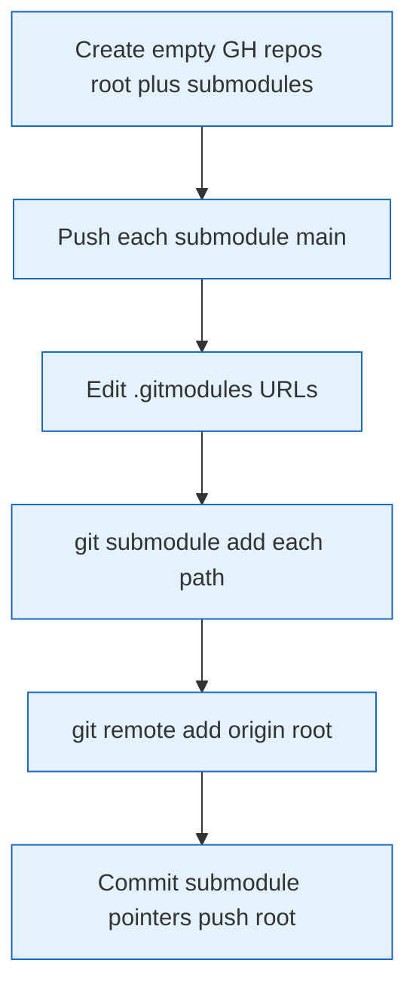
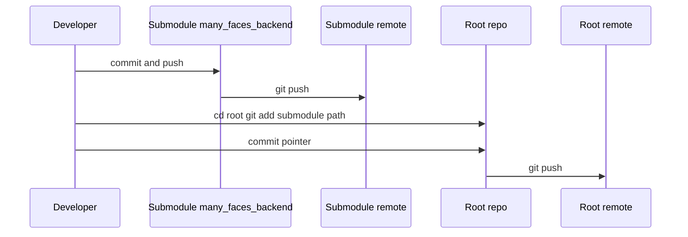

# Git submodules setup

## Creating GitHub repositories with submodules

### 1. Create repositories on GitHub

Create **8+ private repositories** on GitHub (root + submodules). Canonical names in this org:

1. **Root repo**: `many_faces_main` (GitHub). Submodule remotes use `many_faces_*` names; working-tree paths stay `many_faces_backend/`, `many_faces_portal/`, … — see [`.gitmodules`](../../.gitmodules) at the repo root.
2. **Submodules** (remote repo names — **local paths** in the monorepo stay `many_faces_backend/`, `many_faces_portal/`, …):
   - `many_faces_backend` → path `many_faces_backend/`
   - `many_faces_proto` → path `many_faces_proto/` (**shared gRPC `.proto` contracts**; Buf lint in this repo)
   - `many_faces_portal` → path `many_faces_portal/`
   - `many_faces_admin` → path `many_faces_admin/`
   - `many_faces_ai` → path `many_faces_ai/`
   - `many_faces_database` → path `many_faces_database/`
   - `many_faces_redis` → path `many_faces_redis/`
   - `many_faces_logger` → path `many_faces_logger/`
   - `many_faces_mobile` → path `many_faces_mobile/`

### 2. Set remote URL in each submodule

For each submodule, set the remote URL (replace `YOUR_USERNAME` with your GitHub username):

```bash
# Backend
cd many_faces_backend
git remote add origin https://github.com/YOUR_USERNAME/many_faces_backend.git
git branch -M main
git push -u origin main

# Frontend
cd ../many_faces_portal
git remote add origin https://github.com/YOUR_USERNAME/many_faces_portal.git
git branch -M main
git push -u origin main

# Admin
cd ../many_faces_admin
git remote add origin https://github.com/YOUR_USERNAME/many_faces_admin.git
git branch -M main
git push -u origin main

# Many Faces AI service
cd ../many_faces_ai
git remote add origin https://github.com/YOUR_USERNAME/many_faces_ai.git
git branch -M main
git push -u origin main

# Database
cd ../many_faces_database
git remote add origin https://github.com/YOUR_USERNAME/many_faces_database.git
git branch -M main
git push -u origin main

# Redis (job queue)
cd ../many_faces_redis
git remote add origin https://github.com/YOUR_USERNAME/many_faces_redis.git
git branch -M main
git push -u origin main

# Logger (Seq / Dozzle stack)
cd ../many_faces_logger
git remote add origin https://github.com/YOUR_USERNAME/many_faces_logger.git
git branch -M main
git push -u origin main

# Mobile (Expo)
cd ../many_faces_mobile
git remote add origin https://github.com/YOUR_USERNAME/many_faces_mobile.git
git branch -M main
git push -u origin main
```

### 3. Update `.gitmodules` with real GitHub URLs

Edit `.gitmodules` and replace `YOUR_USERNAME` with the actual username:

```bash
# From repo root
nano .gitmodules   # or use your editor
```

### 4. Register submodules in the root repository

```bash
cd /path/to/many_faces_main

# Add submodules
git submodule add -f https://github.com/YOUR_USERNAME/many_faces_backend.git many_faces_backend
git submodule add -f https://github.com/YOUR_USERNAME/many_faces_proto.git many_faces_proto
git submodule add -f https://github.com/YOUR_USERNAME/many_faces_portal.git many_faces_portal
git submodule add -f https://github.com/YOUR_USERNAME/many_faces_admin.git many_faces_admin
git submodule add -f https://github.com/YOUR_USERNAME/many_faces_ai.git many_faces_ai
git submodule add -f https://github.com/YOUR_USERNAME/many_faces_database.git many_faces_database
git submodule add -f https://github.com/YOUR_USERNAME/many_faces_redis.git many_faces_redis
git submodule add -f https://github.com/YOUR_USERNAME/many_faces_logger.git many_faces_logger
git submodule add -f https://github.com/YOUR_USERNAME/many_faces_mobile.git many_faces_mobile

# Or if they already exist, update .gitmodules and commit:
git add .gitmodules
git commit -m "Add git submodules configuration"
```

### 5. Set remote URL on the root repository

```bash
# From repo root
git remote add origin https://github.com/YOUR_USERNAME/many_faces_main.git
git branch -M main
git add .gitmodules
git commit -m "Configure git submodules"
git push -u origin main
```

### 6. Push submodule references from the root

```bash
# Root points at specific commits inside submodules
git add .gitmodules
git commit -m "Update submodule references"
git push
```

### Diagram: bootstrap submodules from empty GitHub repos



## Important notes

- The **root repo only stores pointers to commits** in submodules, not the full tree.
- Clone with `git clone --recursive` or run `git submodule update --init --recursive` after clone.
- After updating a submodule, **commit the new pointer** in the root repository.

### `many_faces_proto` (shared `.proto` contracts)

- The monorepo pins **`many_faces_proto/`** at a specific commit (Strategy A). Run **`git submodule update --init --recursive`** so backend and workers see the same wire definitions.
- To bump the contract pin: `cd many_faces_proto && git pull origin main && cd .. && git add many_faces_proto && git commit -m "chore: bump many_faces_proto submodule"`.

## Day-to-day usage

```bash
# Clone entire project with submodules
git clone --recursive https://github.com/YOUR_USERNAME/many_faces_main.git

# Or if you already have the root:
git submodule update --init --recursive

# Update all submodules to remote tracking branches
git submodule update --remote

# Commit changes inside a submodule
cd many_faces_backend
git add .
git commit -m "Changes"
git push
cd ..
git add many_faces_backend
git commit -m "Update many_faces_backend submodule"
git push
```

### Diagram: day-to-day commit in submodule


