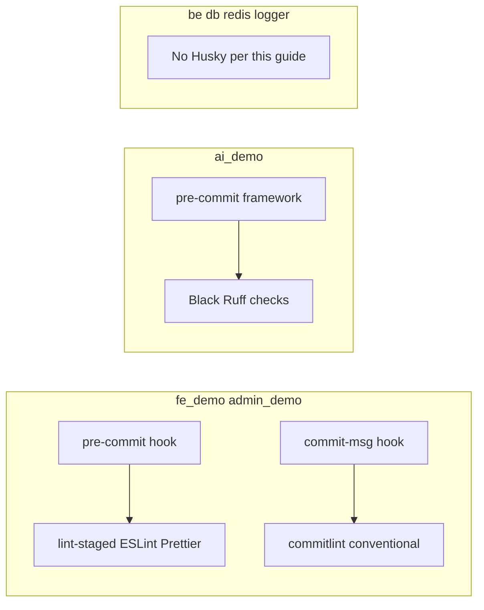

# Husky & Pre-commit Hooks Setup

This document describes the Husky and pre-commit hooks configuration for all subrepositories.

## Overview

Each subrepository has its own git hooks configuration:

- **React projects** (fe_demo, admin_demo): Husky with lint-staged and commitlint
- **Python project** (ai_demo): pre-commit framework with Black and Ruff
- **Other projects** (be_demo, db_demo, redis_demo, logger_demo): No hooks (Docker/infrastructure only)

### Diagram: hooks by repo (this document)



## React Projects: fe_demo & admin_demo

### Tools Used

- **Husky** - Git hooks manager
- **lint-staged** - Run linters on staged files only
- **commitlint** - Enforce conventional commit messages
- **ESLint** - TypeScript/JavaScript linting
- **Prettier** - Code formatting

### Installation

Husky is automatically installed when you run `yarn install` (via `prepare` script).

Manual setup:

```bash
cd fe_demo  # or admin_demo
yarn install  # This will run 'prepare' script which sets up Husky
```

### Pre-commit Hook

Runs automatically before each commit:

- **lint-staged** - Runs ESLint (--fix) and Prettier on staged files

Configuration: `.lintstagedrc.json`

```json
{
  "*.{ts,tsx}": ["eslint --fix", "prettier --write"],
  "*.{json,scss,css}": ["prettier --write"]
}
```

### Commit-msg Hook

Validates commit messages using conventional commits format:

Format: `type(scope): subject`

Types: `feat`, `fix`, `docs`, `style`, `refactor`, `perf`, `test`, `build`, `ci`, `chore`, `revert`

Examples:

- ✅ `feat(auth): add OAuth2 login`
- ✅ `fix(api): resolve user registration bug`
- ✅ `docs(readme): update setup instructions`
- ❌ `fix bug` (missing type and colon)
- ❌ `feat: add feature` (should have scope)

Configuration: `commitlint.config.js`

### Manual Execution

Run lint-staged manually:

```bash
yarn exec lint-staged
```

Validate commit message:

```bash
echo "feat(auth): add login" | yarn exec commitlint
```

### Skip Hooks (Not Recommended)

Skip hooks for a single commit:

```bash
git commit --no-verify -m "your message"
```

## Python Project: ai_demo

### Tools Used

- **pre-commit** - Git hooks framework for Python
- **Black** - Python code formatter
- **Ruff** - Fast Python linter (replaces flake8)

### Installation

```bash
cd ai_demo

# Install pre-commit
pip install pre-commit

# Install git hooks
pre-commit install
```

### Pre-commit Hooks

Runs automatically before each commit:

- **Trailing whitespace** - Removes trailing whitespace
- **End of file** - Ensures files end with newline
- **YAML/JSON/TOML validation** - Validates config files
- **Large files check** - Prevents committing files > 1MB
- **Merge conflict detection** - Detects merge conflict markers
- **Private key detection** - Prevents committing private keys
- **Black** - Formats Python code (line length: 100)
- **Ruff** - Lints Python code with auto-fix

Configuration: `.pre-commit-config.yaml`

### Manual Execution

Run all hooks on all files:

```bash
pre-commit run --all-files
```

Run specific hook:

```bash
pre-commit run black --all-files
pre-commit run ruff --all-files
```

### Update Hooks

```bash
pre-commit autoupdate
```

### Skip Hooks (Not Recommended)

```bash
git commit --no-verify -m "your message"
```

## Configuration Files

### fe_demo & admin_demo

- `.husky/pre-commit` - Pre-commit hook script
- `.husky/commit-msg` - Commit message validation hook
- `.lintstagedrc.json` - lint-staged configuration
- `commitlint.config.js` - Commitlint configuration
- `package.json` - Contains `prepare` script and dependencies

### ai_demo

- `.pre-commit-config.yaml` - Pre-commit hooks configuration
- `pyproject.toml` - Black and Ruff configuration
- `README_HUSKY.md` - Detailed documentation

## Notes

- `.husky/` directory should be **committed to git** (not in .gitignore)
- Hooks run automatically - you don't need to do anything special
- Failed hooks will prevent commit - fix issues and try again
- All hooks are fast - they only run on changed files (lint-staged) or staged files (pre-commit)

## Troubleshooting

### Husky hooks not running

1. Ensure Husky is installed: `yarn install` (runs `prepare` script)
2. Check hooks are executable: `chmod +x .husky/*`
3. Verify git hooks are installed: `ls .git/hooks/` should show symlinks to `.husky/`

### Pre-commit hooks not running

1. Install pre-commit: `pip install pre-commit`
2. Install hooks: `pre-commit install`
3. Check hooks: `ls .git/hooks/` should show `pre-commit` hook

### Hooks are too slow

- lint-staged only runs on staged files (fast by default)
- pre-commit caches results (fast after first run)
- If still slow, check hook configuration for unnecessary checks

### Commit message format rejected

Check commit message format:

```
type(scope): subject
```

Examples: `feat(auth): add login`, `fix(api): resolve bug`

## Summary

| Repository  | Hook Tool  | Linting | Formatting | Commit Msg |
| ----------- | ---------- | ------- | ---------- | ---------- |
| fe_demo     | Husky      | ESLint  | Prettier   | commitlint |
| admin_demo  | Husky      | ESLint  | Prettier   | commitlint |
| ai_demo     | pre-commit | Ruff    | Black      | -          |
| be_demo     | -          | -       | -          | -          |
| db_demo     | -          | -       | -          | -          |
| redis_demo  | -          | -       | -          | -          |
| logger_demo | -          | -       | -          | -          |
