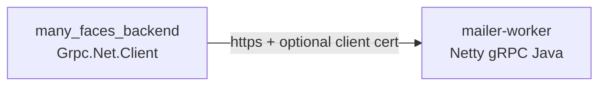

# Mailer-worker gRPC: TLS and mTLS

This guide mirrors **[`push-grpc-tls-mtls.md`](./push-grpc-tls-mtls.md)** for the **Java mailer worker** in **`many_faces_mailer`**: cleartext **h2c** is acceptable only on a trusted Docker bridge; production-style setups should use **TLS** and optionally **mTLS** so only trusted callers ( **`many_faces_backend`** ) open the channel.

**Product context:** [`mailer-local-dev.md`](./mailer-local-dev.md) · Submodule **[`many_faces_mailer/README.md`](../../many_faces_mailer/README.md)**.



---

## Worker (Java): environment variables

| Variable | Role |
| -------- | ---- |
| `MAILER_WORKER_GRPC_TLS_CERT_FILE` | Server certificate PEM path. |
| `MAILER_WORKER_GRPC_TLS_KEY_FILE` | Server private key PEM path matching the certificate. |
| `MAILER_WORKER_GRPC_MTLS_CLIENT_CA_FILE` | Optional PEM bundle of CAs used to verify **client** certificates. When set together with cert+key, the worker requires a valid client cert (**mTLS**). |

If **both** cert and key paths are **empty**, the worker listens in **plaintext** (development only). If **either** is set without the other, startup fails with a clear error (see `MailerConfig.loadFromEnv`).

---

## Backend (.NET): `Mail` configuration

| Key | When to use |
| --- | ----------- |
| `Mail:WorkerGrpcUrl` | Use `https://host:port` for TLS. Use `http://…` only on trusted dev networks (`Http2UnencryptedSupport` in `Program.cs`). |
| `Mail:WorkerTlsServerCaPath` | PEM file with one or more CA certificates when the server uses a **private CA** or **self-signed** cert. |
| `Mail:WorkerTlsClientCertPath` / `Mail:WorkerTlsClientKeyPath` | PEM client cert and key when the worker runs with **mTLS** (`MAILER_WORKER_GRPC_MTLS_CLIENT_CA_FILE`). |
| `Mail:WorkerGrpcTlsServerName` | Optional TLS server name (SNI / validation) when it differs from the host in `WorkerGrpcUrl`. |

TLS-related keys are **ignored** for `http://` URLs; setting them with `http://` causes startup failure (validated in **`GrpcWorkerChannelFactory`**).

---

## Generating a small internal CA (openssl)

Follow the same flow as **[`elasticsearch-grpc-tls-mtls.md`](./elasticsearch-grpc-tls-mtls.md#generating-a-small-internal-ca-openssl-example)**; set **SAN** to your mailer DNS name (e.g. `mailer-worker.internal`) and client CN **`many-faces-backend`**.

**Worker** mounts `server.crt`, `server.key`, and for mTLS sets `MAILER_WORKER_GRPC_MTLS_CLIENT_CA_FILE` to **`ca.crt`**.

**Backend** sets `Mail:WorkerTlsServerCaPath` to **`ca.crt`**, client PEM paths as above, and `Mail:WorkerGrpcUrl` to **`https://mailer-worker.internal:50054`**.

---

## grpcurl with TLS

Without mTLS (private CA still needs `-cacert`):

```bash
grpcurl -cacert ca.crt mailer-worker.internal:50054 grpc.health.v1.Health/Check
```

With mTLS:

```bash
grpcurl -cacert ca.crt -cert api-client.crt -key api-client.key \
  mailer-worker.internal:50054 grpc.health.v1.Health/Check
```

---

## CI and automated smoke

The monorepo workflow **`.github/workflows/ci.yml`** includes **`smoke_mailer_worker_grpc_tls`**, which runs **`many_faces_mailer/scripts/smoke-grpc-tls.sh`**: OpenSSL generates a short-lived CA + server + client chain, starts **`docker-compose.tls-smoke.yml`** (host gRPC **59216**), asserts **`grpcurl`** `Health/Check`, then runs **`dotnet test`** filtered to **`MailerWorkerTlsEndToEndSmokeTests`** with **`MAILER_TLS_SMOKE=1`**.

Normal **`dotnet test`** without that environment variable skips the Docker-backed class; fast TLS option validation lives in **`GrpcWorkerChannelFactoryMailOptionsTests`**.

The **`infra_many_faces_mailer`** job validates **`docker-compose.tls-smoke.yml`** compose expansion using **`MAILER_TLS_SMOKE_CERT_DIR=/tmp`**.

---

## Related documentation

- Push-worker TLS reference (same patterns): [`push-grpc-tls-mtls.md`](./push-grpc-tls-mtls.md)
- Mailer stack local dev + Mailpit: [`mailer-local-dev.md`](./mailer-local-dev.md)
