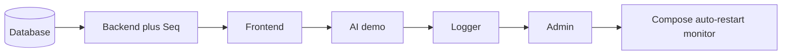
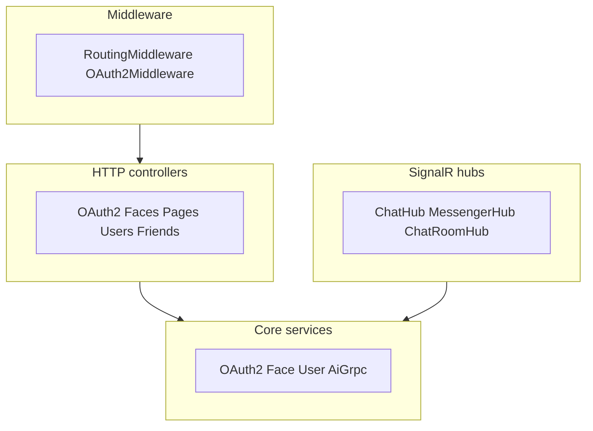
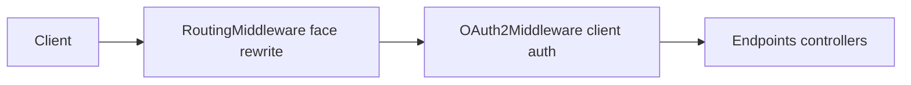
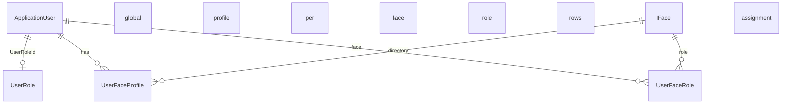
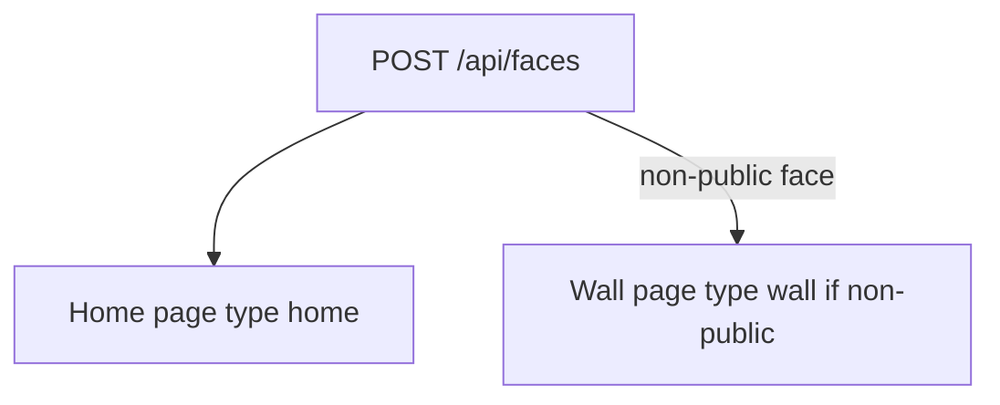
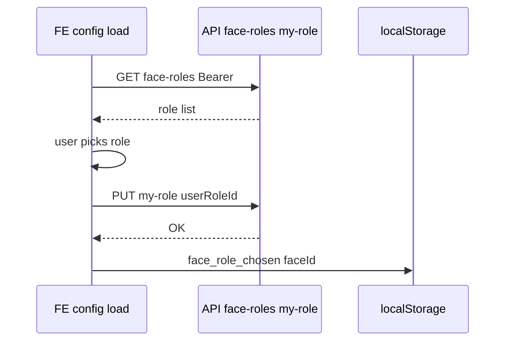
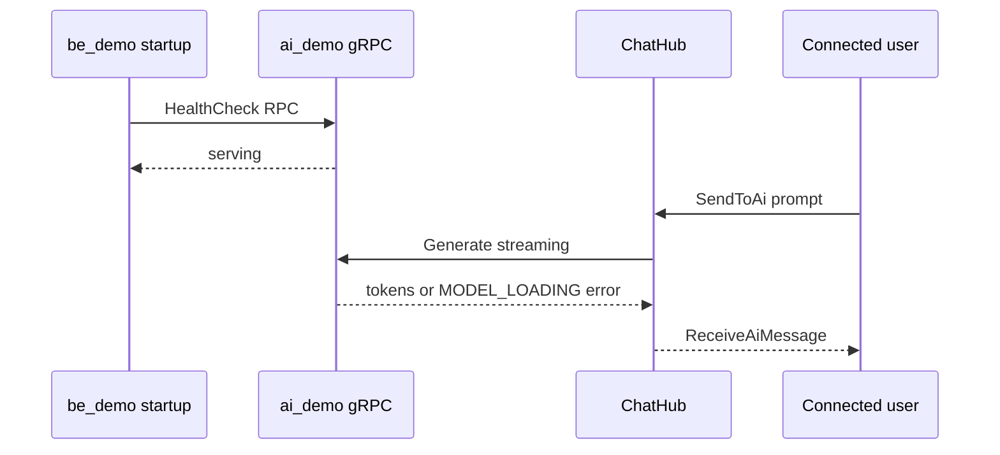

# MFAI Demo — what is implemented (current snapshot)

A consolidated inventory of implemented areas. Use it as a baseline when deciding what to build next.

---

## 1. Repository root

### Layout

- Monorepo: `be_demo`, `fe_demo`, `admin_demo`, `ai_demo`, `db_demo`, `logger_demo`.
- Main `docker-compose.dev.yml` for backend, frontend, admin, Seq, AI demo; DB and logger have their own compose files.
- Bash scripts for start, stop, status, clear, rebuild, test, lint.

### Monorepo scripts (`scripts/`)

| Script                         | Purpose                                                                                                                         |
| ------------------------------ | ------------------------------------------------------------------------------------------------------------------------------- |
| **scripts/start-all-dev.sh**   | Start: DB → backend+Seq → frontend → AI demo → logger → admin; live status every 5s; auto-restart stopped containers.           |
| **scripts/stop-all-dev.sh**    | Stop all services in reverse order.                                                                                             |
| **scripts/status-all.sh**      | One-shot status: containers, HTTP/gRPC reachability, ports, links.                                                              |
| **scripts/clear-all-dev.sh**   | Remove containers and volumes (**data loss**).                                                                                  |
| **scripts/restart-all-dev.sh** | Stop, rebuild images, start.                                                                                                    |
| **scripts/rebuild-all-dev.sh** | Rebuild all Docker images (no start).                                                                                           |
| **scripts/test-all.sh**        | `be_demo` xUnit, `fe_demo` Vitest + Cypress e2e, `admin_demo` Vitest; summary pass/fail.                                        |
| **scripts/lint-all.sh**        | Lint in `fe_demo`, `be_demo`, `admin_demo`, `ai_demo`.                                                                          |
| **scripts/menu.sh**            | TUI menu (Norton Commander style): arrows, Enter = drill/run, Backspace/←/Esc = back; monorepo scripts + per-container scripts. |

### Diagram: start-all-dev order

### Configuration

- **docker-compose.dev.yml**: services `be-demo-dev` (8000/8001), `fe-demo-dev` (8081), `admin-demo-dev` (8082), `seq` (5341), `ai-demo-dev` (50051); network `dev-network`; env for API URL, Seq, DB; healthchecks; volumes (node_modules, yarn cache, HTTPS cert, seq-data, HuggingFace cache).
- **README.md**: overview, layout, quick start, ports, default credentials, script list, troubleshooting.

---

## 2. Backend (`be_demo`)

### Stack

- ASP.NET Core 10, Identity, EF Core 10, Npgsql (PostgreSQL), JWT Bearer, Serilog + Seq, Swagger, SignalR, gRPC client (AI).

### Controllers

| Controller                   | Responsibilities                                                                                                                                                                                                           |
| ---------------------------- | -------------------------------------------------------------------------------------------------------------------------------------------------------------------------------------------------------------------------- |
| **AuthController**           | Register, login, logout.                                                                                                                                                                                                   |
| **OAuth2Controller**         | Token, register (`OAuth2Service`).                                                                                                                                                                                         |
| **UsersController**          | User CRUD; **GetUsers** with pagination and search (`page`, `pageSize`, `search`, `forAddFriend`); with `forAddFriend=true` returns only users the current user can add (excludes self, friends, pending friend requests). |
| **FacesController**          | Face CRUD; **GET config** returns **myFaceRoleId**, **myFaceRoleName** per face when authenticated; **GET face-roles**; **PUT {id}/my-role** (set own face role).                                                          |
| **PagesController**          | Page CRUD.                                                                                                                                                                                                                 |
| **PageTypesController**      | Page type CRUD.                                                                                                                                                                                                            |
| **FriendRequestsController** | Friend requests: list, send, accept, reject.                                                                                                                                                                               |

### SignalR hubs

| Hub              | Endpoint          | Responsibilities                                                                                                                                                                                                                                       |
| ---------------- | ----------------- | ------------------------------------------------------------------------------------------------------------------------------------------------------------------------------------------------------------------------------------------------------ |
| **ChatHub**      | `/hubs/chat`      | SendMessage (broadcast), SendPrivateMessage, **SendToAi** (gRPC to AI service, history, ReceiveAiMessage); 401 on invalid token.                                                                                                                       |
| **MessengerHub** | `/hubs/messenger` | SendChatMessage(receiverId, content), AcceptMessageRequest(senderId), RejectMessageRequest(senderId); callbacks: ReceiveChatMessage, ReceiveMessageRequest, ReceiveFriendRequest, MessageRequestAccepted, MessageRequestRejected, ReceiveNotification. |

### Diagram: backend layers (high level)

### Services

- **OAuth2Service**, **ECDSAKeyService** (JWT signing).
- **FaceService** — resolve face by index (kebab-case), cache.
- **UserService** — users.
- **AiGrpcService** — gRPC client to `ai_demo` (Health, Generate); keepalive 60s/30s; handles MODEL_LOADING and errors.

### Middleware

- **RoutingMiddleware** — face prefix from URL, rewrite to `/api/{face-id}/...?requestFaceID=...`; public paths bypassed; 403 on invalid face.
- **OAuth2Middleware** — OAuth2 client validation.

### Diagram: HTTP request path

### Data (EF Core)

- **Identity**: ApplicationUser, UserRole (**Scope**: Global/Face).
- **FriendRequest**, **Friendship**, **Message** (IsMessageRequest, MessageRequestStatus), **Notification**.
- **Face**, **Page**, **PageType**, **PageRouteTranslation**.
- **UserProfile**, **UserFaceProfile**, **UserFaceRole** (per-user per-face role).

#### Roles (global and face)

- **Global roles** (one per user, `ApplicationUser.UserRoleId`): **SUPER_ADMIN**, **ADMIN**, **USER**, **HOST**.
- **Face roles** (per user per face, **UserFaceRole**): **FACE_ADMIN**, **FACE_USER**, **INZERENT**, **SUBSCRIBER**, **FACE_HOST**.
- **UserRole** has **Scope** (enum: Global, Face); constants in `UserRole.GlobalRoleNames` and `UserRole.FaceRoleNames`.
- On **registration**, global role **USER** is assigned.
- When linking a user to a face (`UserFaceProfile`), a **UserFaceRole** with **FACE_HOST** is added for that face.
- Seed: global and face roles with Scope; seeded users get `UserFaceRole` FACE_HOST per face.

### Diagram: core identity entities (ER overview)

#### Default pages when creating a face

- **POST /api/faces** creates **Home** (`/home`) and, for **non-public** faces, **Wall** (`/wall`). CMS **PageTypes** are **`home`**, **`static`**, **`wall`** (login/register on public face use `static`). Entity lists and details on FE use fixed routes (e.g. **`/list/:componentTypeId`**), not admin-defined page types.
- PageType `"wall"` exists in seed; non-public faces get Home + Wall.

### Diagram: POST face creates default pages

#### Choosing a face role on first visit (private face)

- **GET /api/faces/config**: with `Authorization`, each face includes **myFaceRoleId** and **myFaceRoleName**.
- **GET /api/faces/face-roles** (AllowAnonymous): `[{ id, name }]` for FE dropdowns.
- **PUT /api/faces/{id}/my-role** (Authorize): body `{ userRoleId }` — sets or creates **UserFaceRole**; validates `Scope = Face`.

### Diagram: first visit private face role gate

### Other

- Swagger/OpenAPI, health checks, AI gRPC health on startup.
- ChatHub SendToAi: try/catch, user-friendly errors when AI is unavailable.

---

## 3. Frontend (`fe_demo`)

### Stack

- React 18, TypeScript, Vite, React Router, TanStack Query, Bootstrap, Radix UI, react-i18next, axios, react-toastify, @microsoft/signalr, OpenAPI client.

### Auth and session

- Register, login, protected/guest routes.
- **AuthContext**: JWT in `localStorage`, session watcher (~30s `exp` check), check on load, **401 interceptor** — auto logout on expired/invalid token.
- Logout in header (first nav item).

### Localization and routing

- i18n: en/sk/cz; localized paths (e.g. `/en/login`, `/sk/prihlasenie`).
- **Face-based routing**: URL prefix (e.g. `/acme-corp/dashboard`); API client adds face path; FaceConfigProvider; dynamic pages from backend (public/private faces).

### UI and pages

- **Header**, **Footer** (Messenger link), **LanguageSwitcher**, **ProtectedRoute**, **GuestRoute**, **FacePageView**.
- **Top panel on first private-face visit**: **FaceRoleSelectPanel** — shown below Header when user is signed in, private face selected, and `localStorage` lacks `face_role_chosen_{faceId}`. Dropdown from GET face-roles + confirm; after PUT my-role, localStorage key set, config reload, panel hidden.
- **Settings panel**: language, logout, face picker, Pages nav, **Friend Requests**, **Messenger**, **Notifications** (tabs).
- Pages: Home (guest), Login, Register, HomePageProtected, Profile, **Users** (list + detail), dynamic face pages.

### Friend requests (Add friend)

- **FriendRequestsTab**: incoming requests (accept/reject), “Add friend” section.
- **Backend pagination and search**: `getUsers(token, { page, pageSize, search, forAddFriend: true })`; response `{ items, totalCount, page, pageSize, totalPages }`.
- **Dynamic pageSize**: from available height (ResizeObserver, ITEM_HEIGHT_PX, PAGINATION_HEIGHT_PX, SAFETY_MARGIN_PX); no inner scroll—exactly as many rows as fit; Next/Prev pagination.
- Search debounce 300ms; separate loading for requests vs addable users; optimistic removal after send (`sentToIds`).
- Layout: flex, Add friend section with `friend-requests-list-wrapper` (`overflow: hidden`) so content does not spill under the footer.

### Messenger

- **MessengerContext**: SignalR to `/hubs/messenger`, Connecting/Connected/Disconnected.
- **MessengerTab**: conversation list, message requests (accept/reject), chat with selected user; send; realtime (ReceiveChatMessage, ReceiveMessageRequest, …).
- Time formatting (today = time, else date+time), connection status in UI.

### Notifications

- **NotificationsTab**: list (e.g. message requests).

### API and config

- **getFacesConfig(token?)**: sends `Authorization` when token present; backend returns **myFaceRoleId**, **myFaceRoleName** per face. FaceConfigProvider loads with token when signed in.
- **FaceRolesService**: **getFaceRoles()** — GET /api/faces/face-roles; **setMyFaceRole(faceId, userRoleId, token)** — PUT /api/faces/{id}/my-role.
- **UsersListService**: getUsers with params; GetUsersResponse; getUser(id).
- **authAwareFetch**: 401 handling, logout.
- **env**: VITE_API_URL, VITE_API_HTTPS_URL, OAuth2, Seq proxy, app name/version.
- Vite proxy for API and optional Seq; Seq logging can be off in dev.

### Testing

- Vitest, Cypress e2e; lint, format, type-check, generate:api.

---

## 4. Admin (`admin_demo`)

### Stack

- React 18, TypeScript, Vite, React Router, TanStack Query, Bootstrap, Radix UI, axios, react-toastify, @microsoft/signalr, OpenAPI client.

### Features

- OAuth2 login, protected admin routes.
- **CRUD**: Users (list, detail, create, edit), Faces (list, detail, create, edit), Pages (list, detail, create, edit), Page Types.
- **AdminLayout**: sidebar + header, tables (sort, pagination), forms, toasts.
- i18n en/sk/cz, localized routes.
- Pages: Dashboard, Login, Users, Faces, Pages, Chat (if enabled).

### Configuration

- Port 8082; env VITE_API_URL, VITE_PORT; Docker in root compose.

---

## 5. AI service (`ai_demo`)

### Stack

- Python 3.11, gRPC (grpcio, grpcio-tools, protobuf), transformers, torch, accelerate (DistilGPT-2).

### Features

- **HealthCheck** RPC; backend calls on startup.
- **Generate** RPC (prompt, max_new_tokens); DistilGPT-2 (Hugging Face, local).
- **Exception handling**: RuntimeError with “MODEL_LOADING” → friendly message; other errors logged and returned.
- **gRPC server options**: keepalive (permit without calls, min ping interval) so the .NET client can ping during long Generate calls.

### Diagram: AI health and ChatHub SendToAi

### Configuration

- Port 50051; `health.proto`; `generate_proto.sh`; Docker with HF_HOME volume, memory limit, long start_period.

---

## 6. Database (`db_demo`)

- PostgreSQL 16 (`postgres:16-alpine`), pgAdmin 4.
- Ports: 54320 (PostgreSQL), 5050 (pgAdmin).
- DB `bedemo`, user `bedemo_user`; volume for persistence; healthcheck.
- **servers.json** for pgAdmin (BeDemo Database, host `postgres-dev`).
- Migrations via backend (EF Core).

---

## 7. Logger (`logger_demo`)

- Dozzle — realtime logs from all containers.
- Port 8080; discovery via Docker socket; filter by container.

---

## 8. Summary — implemented

| Area                | Status                                                                                                                                                                  |
| ------------------- | ----------------------------------------------------------------------------------------------------------------------------------------------------------------------- |
| **Auth**            | Backend: OAuth2 + JWT, Identity, ECDSA. FE/Admin: login, register, protected/guest routes, token on API client, **auto-logout on 401/expiry**, logout in menu.          |
| **API**             | REST (Swagger), face-prefixed routes; FE/Admin clients from OpenAPI.                                                                                                    |
| **Users**           | GetUsers with **pagination and search**, **forAddFriend** for Add Friend; UsersPage, UserDetailPage.                                                                    |
| **Friend requests** | Backend: FriendRequestsController; FE: FriendRequestsTab, **backend pagination + search**, **dynamic row count from height**, debounce, optimistic UI.                  |
| **Realtime**        | SignalR: **ChatHub** (broadcast, private, **SendToAi**), **MessengerHub** (chat, message requests, notifications); FE MessengerContext, MessengerTab, NotificationsTab. |
| **AI**              | `ai_demo` gRPC Health + Generate (DistilGPT-2); backend AiGrpcService; ChatHub SendToAi + history; error handling and keepalive.                                        |
| **Database**        | PostgreSQL 16, EF Core migrations, Identity + FriendRequest, Friendship, Message, Notification, Face, Page, …                                                           |
| **Multi-tenant**    | Face-based routing (backend middleware + FE face path); public/private faces.                                                                                           |
| **DevOps**          | Docker Compose, `scripts/*` start/stop/status/clear/rebuild/test/lint, **`scripts/menu.sh`** (NC-style TUI).                                                            |
| **Logging**         | Serilog → Seq (backend); Dozzle (containers).                                                                                                                           |

---

## 9. Next steps (to agree)

- Feature expansion (new modules, reports, …).
- Tests: coverage, more e2e scenarios.
- UX/UI: Friend Requests / Messenger / Notifications polish.
- Security and performance: rate limiting, caching, hardening.
- Documentation: API, deployment, runbooks.
- Other priorities per product needs.

---

_Snapshot as of the last edit. Prioritize follow-up work from this inventory._
