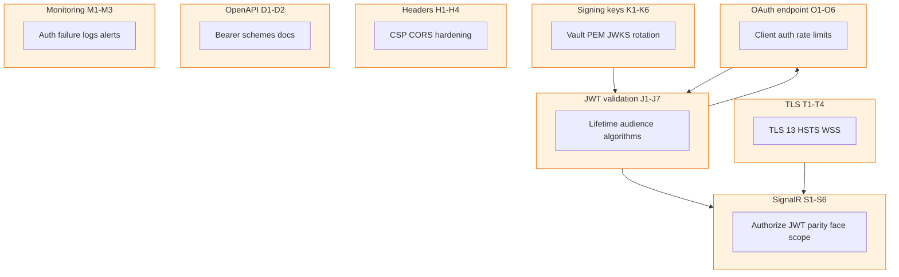
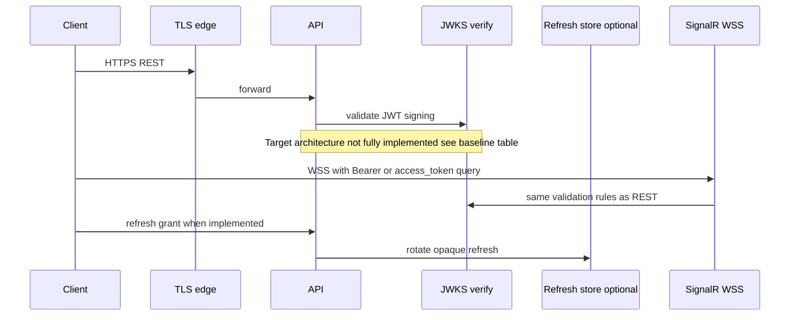
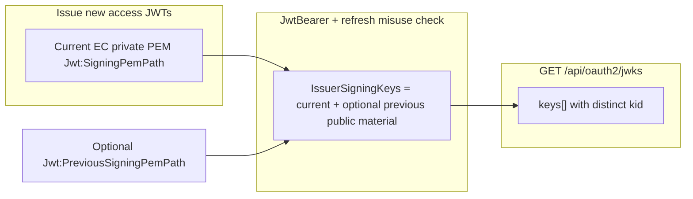
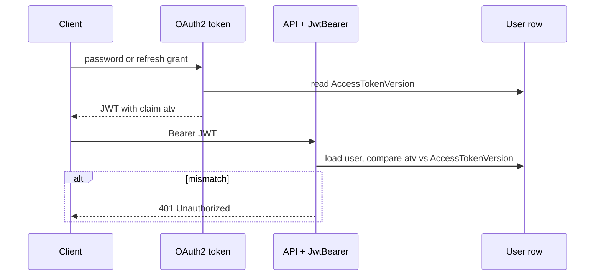
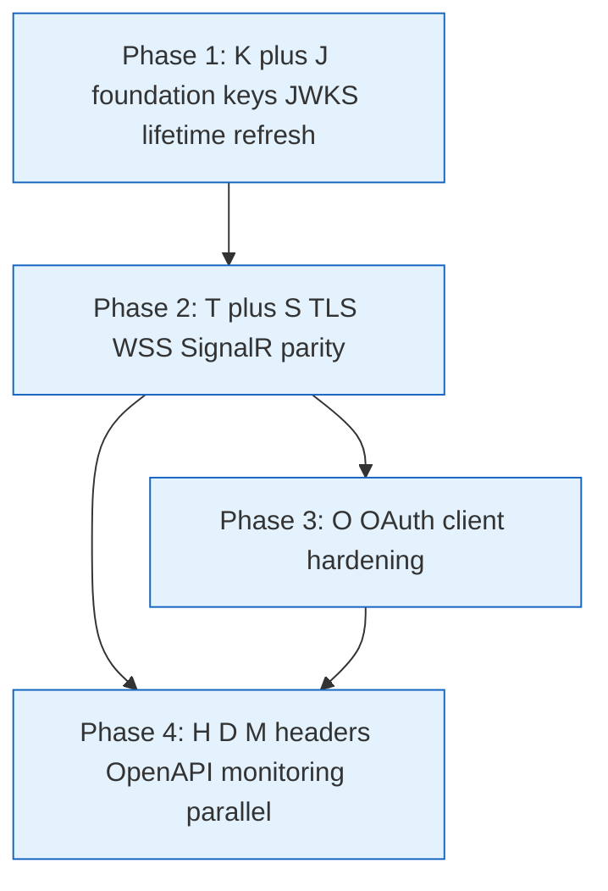
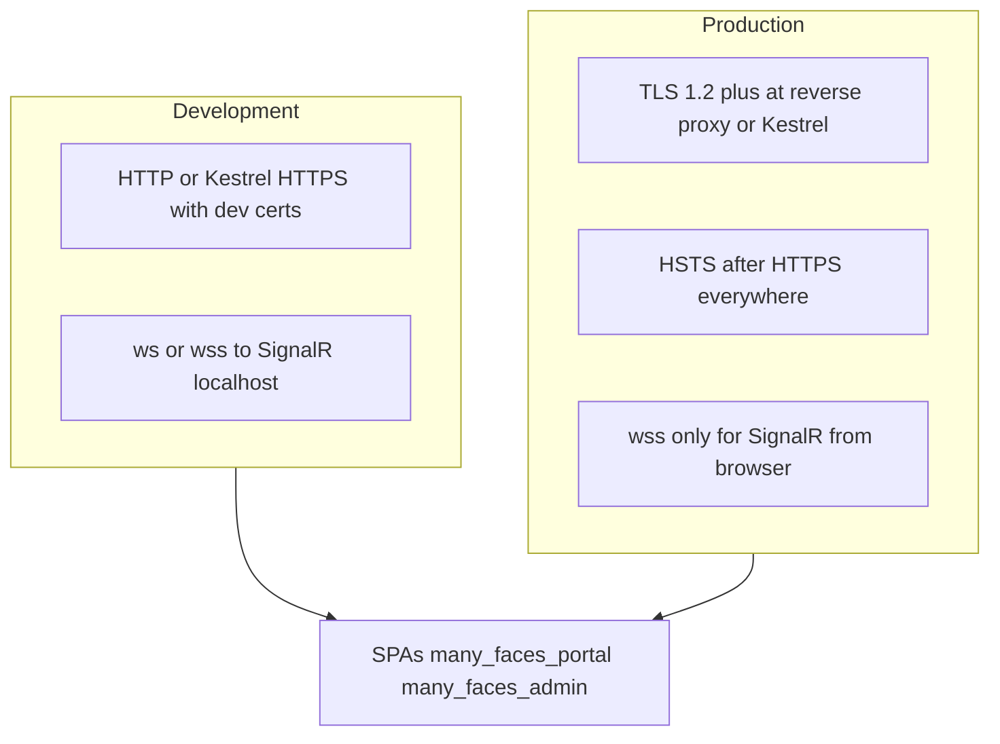
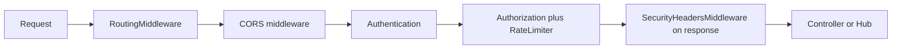
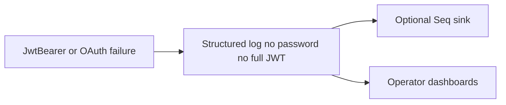
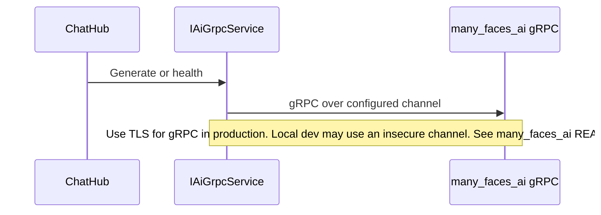
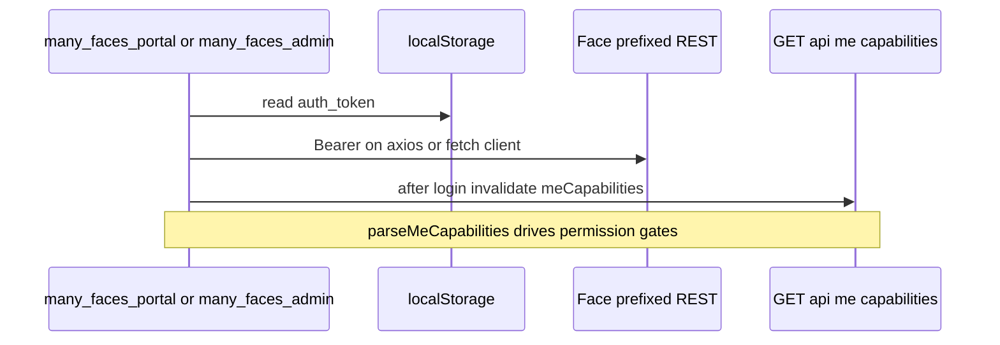

# Strong cryptography, JWT, API, and WebSocket security — implementation backlog (AI-oriented)

Language: English. Audience: implementers / security review / AI agents. Actionable checklist; not end-user documentation.

**Scope:** Signing keys, JWT hardening, TLS, REST API, SignalR/WebSockets, OAuth2 client flows, operational controls.

**Security hardening v2 (2026-05-16):** Worker/AI/ES/Redis trust boundary, FE CSP/XSS, uploads, PII logging, hardened compose, and moderation **PI-*** tasks — **[`../prompts/security-hardening-v2-agent-prompt.md`](../prompts/security-hardening-v2-agent-prompt.md)**. This guide remains the **K/J/O/T/S/H/D/M backlog** and **v1 (2026-04-11) completion record**; do not duplicate v2 phase checklists here.

**v2 delivered (examples, see prompt for full list):** **BE-A2** — `Jwt:ExpiresInMinutesRememberMe` capped at **7 days** (10 080 min); `ValidateOnStart` rejects legacy multi-year values; refresh **90 days** via `Jwt:RefreshTokenDaysRememberMe`. **PI-6** — Unicode bidi/zero-width stripping + homoglyph fold for moderation heuristics (`ContentModerationUnicodeHomoglyphFold`, `ContentModerationUnicodeSpoofingTests`). **PI-7** — `ContentAiReviewService` no longer logs raw invalid Redis AI review JSON; use `ContentModerationHelpers.FormatInvalidAiReviewPayloadForLog` (length + `sha256Prefix` + parsed ids only). **PI-9** — documented untrusted `ReviewContent` vs trusted operator `ChatHub`/`Generate` split (`ContentModerationTrustBoundary`, guide § PI-9). **PI-10** — explicit CI gate `scripts/verify-moderation-security-tests.mjs` (`Category=ModerationSecurity`). See [`ai-assisted-content-approval.md`](./ai-assisted-content-approval.md).

**Related:** [acl-and-capabilities.md](./acl-and-capabilities.md) (authorization / capabilities); this file focuses on **transport + token + key lifecycle**.

### Diagram: backlog layers (depends-on overview)

**Note:** This maps the **checklist structure**, not a claim that every item is already implemented—verify code before labeling anything “done”.

---

## P0 — Signing keys and JWT issuer (foundational)

- [ ] **K1** Replace ephemeral in-process `ECDsa.Create(P-521)` (`ECDSAKeyService` constructor) with **deterministic key material in production**: load signing key from **Azure Key Vault**, **AWS KMS**, **HashiCorp Vault**, or **mounted PEM/PFX** with restricted filesystem permissions. Development may keep ephemeral keys; production must not rotate keys on every deploy unless coordinated with token invalidation strategy.
- [ ] **K2** Prefer **asymmetric signing only**: keep **private** key in HSM/vault; expose **public** key (or JWKS) to resource servers and gateways that validate JWTs. Never distribute private key to clients.
- [ ] **K3** Implement **JWKS endpoint** (e.g. `GET /.well-known/jwks.json` or `/api/oauth2/jwks`) publishing **public** `ECDSA` (or `RSA`) JWK set with `kid` matching JWT header `kid` / claim `key_id`. Enables multi-instance API clusters and API gateways to validate without shared private key.
- [ ] **K4** **Key rotation:** support **two** active signing keys (current + previous) for verification window; new tokens signed with current; old tokens valid until `exp`. Document rotation runbook (promote key, overlap period, retire old).
- [ ] **K5** Align algorithm choice with ecosystem: **ES512** (P-521) is strong; ensure all validators (gateways, libraries, mobile) support it. If interoperability limits appear, document fallback policy (e.g. **RS256** with 3072+ bit RSA) as secondary key in JWKS — do not weaken default without explicit decision.
- [ ] **K6** Store **no private key** in `appsettings.json` or git. Use environment variables referencing vault URIs, or runtime injection from secret store.

---

## P0 — JWT content and validation (API + SignalR consumers)

- [ ] **J1** Set `TokenValidationParameters.ValidateLifetime = true` in `JwtBearerOptions` (`Program.cs`). Align with issued `Expires` in `OAuth2Service` (already set per `Jwt:ExpiresInMinutes` / RememberMe).
- [ ] **J2** Set non-zero `ClockSkew` (e.g. 1–2 minutes) or keep zero only if all clocks are NTP-synced; document choice.
- [ ] **J3** Enforce `ValidateAudience`, `ValidateIssuer`, `ValidateIssuerSigningKey` (already largely present); add **`ValidAlgorithms`** whitelist (e.g. only `ES512`) to reject algorithm confusion.
- [ ] **J4** Add JWT **`aud`** (audience) per client or per surface if needed (e.g. `bedemo-api` vs `bedemo-signalr`) — optional but reduces token reuse across services.
- [ ] **J5** Short **access token TTL** in production (e.g. 5–15 minutes); long sessions via **refresh tokens** stored server-side (see `OAuthRefreshTokenStore` / [acl-and-capabilities.md](./acl-and-capabilities.md)), rotated on use, revocable.
- [ ] **J6** On **global role or security-sensitive claim change**, invalidate refresh tokens or bump **token version** claim (`token_version`) checked on each request — forces re-auth after privilege change.
- [ ] **J7** Do not put **PII** or large blobs in JWT claims; keep claims minimal (`sub`, `role`, `jti`, `iat`, `exp`, `nbf`, optional `token_version`).

---

## P0 — OAuth2 token endpoint and client authentication

- [ ] **O1** **Client authentication:** move `client_id` / `client_secret` validation from static config to **hashed secrets in DB** (bcrypt/Argon2) or confidential client registry; support **client credential rotation**.
- [ ] **O2** **Rate limiting** on `POST /api/oauth2/token` and `POST /api/oauth2/register`: per-IP, per-`client_id`, per-username (sliding window or token bucket). Return `429` with `Retry-After`.
- [ ] **O3** **Lockout / backoff** integration with Identity lockout on failed password grants (already partially configured on Identity options — verify it applies to OAuth password path).
- [ ] **O4** Fix or remove **optional request body ECDSA signature** (`OAuth2Middleware` + `OAuthTokenRequestSignatureVerifier` via `IOAuth2Service`): current design verifies against **server** key — not standard “client signs with client private key.” Replace with either: (a) **mTLS** at reverse proxy for confidential clients, or (b) **private_key_jwt** (JWT client assertion, RFC 7523), or (c) drop feature and rely on TLS + `client_secret` + rate limits.
- [ ] **O5** **PKCE** for any future authorization-code flow from public clients (SPAs); document that password grant is **deprecated** in OAuth2.1 for third-party apps — migrate when feasible.
- [ ] **O6** **Register endpoint:** same rate limits; consider CAPTCHA or invite-only registration in production; email verification before full activation.

---

## P0 — TLS and transport (HTTP + WebSocket)

- [ ] **T1** Terminate **TLS 1.2+** (prefer **TLS 1.3**) at reverse proxy (nginx, Traefik, cloud LB) or Kestrel with valid **server certificate** (Let’s Encrypt or corporate PKI). No mixed content for browser clients.
- [ ] **T2** **HSTS** header on HTTPS responses (`Strict-Transport-Security`) with appropriate `max-age` (e.g. ≥ 6 months) after confirming HTTPS everywhere.
- [ ] **T3** **WebSocket upgrade (`wss://`)** only in production; `ws://` allowed only on localhost dev. SignalR clients must use same origin policy or explicit allowed origins.
- [ ] **T4** Optional **mTLS** for admin or machine-to-machine callers: client certificates validated at proxy; forward verified client identity as header only if proxy strips spoofed headers.

---

## P0 — SignalR / WebSockets (same security bar as REST)

- [ ] **S1** Keep **`[Authorize]`** on hubs; ensure **JwtBearer** `OnMessageReceived` reads `access_token` query param **only over WSS** in production (query string can leak in logs — prefer **subprotocol** or **post-connect** negotiation if upgrading stack allows; if not, **short-lived tokens** + **no server logging of query**).
- [ ] **S2** Validate **same JWT rules** as HTTP: issuer, audience, lifetime, signing key, algorithm whitelist. No separate “weak” path for SignalR.
- [ ] **S3** **Face scope:** if hub methods are tenant-sensitive, inject `IFaceScopeContext` (or parse allowed face from connection URL after `RoutingMiddleware`) and **reject** connections or method calls that do not match claimed tenant. Document required client URL: `wss://host/{face}/hubs/...?access_token=...`.
- [ ] **S4** **Authorization per hub method:** use `IHubFilter` or explicit checks for sensitive operations (e.g. broadcast to group = tenant id only).
- [ ] **S5** **Connection limits** per user id / IP at proxy or custom middleware to reduce DoS.
- [ ] **S6** **AI / gRPC from hub** (`ChatHub.SendToAi`): rate limit per user; optional quota; audit log; reject unauthenticated or expired connection.

---

## P1 — API surface and headers

- [ ] **H1** Add security headers middleware: `X-Content-Type-Options: nosniff`, `X-Frame-Options: DENY` or `frame-ancestors` via CSP, **`Content-Security-Policy`** appropriate for API (often minimal for JSON API).
- [ ] **H2** **`Referrer-Policy`**, **`Permissions-Policy`** as needed.
- [ ] **H3** CORS: replace `AllowAnyMethod` / review if all methods needed; keep **`AllowCredentials`** only with **explicit origins** (already partially explicit — add production domains via config).
- [ ] **H4** Disable **detailed error bodies** in production for auth failures where they aid enumeration; log details server-side only.

---

## P1 — OpenAPI and clients

- [ ] **D1** OpenAPI 3: `components.securitySchemes.bearer` (JWT); apply `security` globally; document **`Authorization: Bearer <token>`** for REST.
- [ ] **D2** Document SignalR: WSS URL pattern, query param name `access_token`, token TTL recommendation.

---

## P1 — Monitoring and audit

- [ ] **M1** Structured logs for **auth failures** (no passwords): `invalid_client`, `invalid_grant`, `invalid_signature`, JWT validation failure reason (expired, bad signature, wrong `kid`).
- [ ] **M2** **Audit log** for key rotation, client secret change, admin user creation, global role change (`A22` ACL doc).
- [ ] **M3** Alerting on spike in 401/403/429 on `/api/oauth2/token`.

---

## P2 — Advanced / optional

- [ ] **X1** **Token binding** or **DPoP** (RFC 9449) if threat model includes token theft from browser storage.
- [ ] **X2** **Certificate pinning** for mobile/native apps (document trade-offs: operational pain vs MITM resistance).
- [ ] **X3** **FIPS**-validated modules if deployment requires (Windows FIPS policy, cloud HSM FIPS endpoints).

---

### Diagram: target request path (roadmap — verify `Program.cs`)

## Current baseline (repo facts — verify in `Program.cs`, `OAuth2Service`, `OAuthAccessTokenFactory`, `OAuthClientValidator` when auditing)

| Area                      | Current behavior                                                                                                                                                                                                    |
| ------------------------- | ------------------------------------------------------------------------------------------------------------------------------------------------------------------------------------------------------------------- |
| JWT signing               | **P-521 ES512**; optional **`Jwt:SigningPemPath`** for stable PEM-loaded key; else ephemeral per process (`ECDSAKeyService`)                                                                                        |
| JWT rotation overlap (K4) | Optional **`Jwt:PreviousSigningPemPath`** + **`Jwt:PreviousKeyId`** — `JwtBearer` validates with **both** keys; **only current** key signs new JWTs; JWKS lists **all** verification keys                           |
| JWKS                      | **GET `/api/oauth2/jwks`** (`OAuthJwksController`) — JWK set for issuer verification keys                                                                                                                           |
| JWT validation            | **`ValidateLifetime = true`**, **`ValidAlgorithms` = ES512**, **`ClockSkew = 0`**                                                                                                                                   |
| Access session (J6)       | Claim **`atv`** must match **`ApplicationUser.AccessTokenVersion`** (`OnTokenValidated`); **password or global `UserRoleId` change** bumps version + revokes active refresh tokens (`ApplicationDbContext` partial) |
| Refresh tokens            | **Stored** (hash), rotate on use (`OAuthRefreshTokenStore`); in-memory tests use a **semaphore** so concurrent refresh replay is deterministic                                                                      |
| OAuth clients (O1)        | **`OAuthClients`** + **`OAuthClientValidator`**; hashed **`client_secret`**; development OAuth client seeded; `IPasswordHasher<OAuthClient>`                                                                                     |
| Access JWT (issue)        | **`OAuthAccessTokenFactory`** — ES512, global role + **`atv`** from DB, session vs remember TTL; **`OAuth2Service`** orchestrates grants                                                                            |
| OAuth rate limits (O2)    | **`POST /api/oauth2/token`** and **`POST /api/oauth2/register`**: fixed window per IP; **`429`** + **`Retry-After`**; in **Testing**, limits bypassed unless **`OAuth2:BypassRateLimitInTesting=false`**            |
| OAuth body signature      | **Rejected** (`400` `invalid_request`) in middleware; **`OAuthTokenRequestSignatureVerifier`** remains for legacy / tests (`IClock`)                                                                                |
| SignalR auth              | JWT via query `access_token`; same bearer rules as HTTP (including **`atv`**)                                                                                                                                       |
| Security headers          | **`SecurityHeadersMiddleware`**: nosniff, frame deny, referrer-policy, permissions-policy, **minimal CSP** for JSON API                                                                                             |
| Swagger UI                | **Development** only unless **`Swagger:EnableInProduction`** is `true`                                                                                                                                              |
| TLS                       | Dev HTTPS optional (`dev/certs`); production TLS at edge still **required**                                                                                                                                         |

### Diagram: signing key rotation overlap (K4, canonical)

### Diagram: access token version (`atv`, J6)

---

## Suggested implementation order (for agents)

1. **K1–K4, J1–J5** — production keys + JWKS + lifetime + refresh store (blocks most other work).
2. **T1–T3, S1–S3** — TLS + SignalR parity + face scope on hubs if multi-tenant.
3. **O1–O4** — client secrets + rate limits + fix/remove broken request signing model.
4. **Checklist rows** `H*`, `D*`, `M*` — headers, OpenAPI, logging.

### Diagram: phased rollout

---

## Deferred follow-ups (tracked)

Product or infra items not covered by the baseline table above; keep IDs for issue tracking.

| Topic                        | Notes                                                                                                                                     |
| ---------------------------- | ----------------------------------------------------------------------------------------------------------------------------------------- |
| **TRACK-INFRA-KMS**          | Production: HSM/vault for signing keys; operator runbook beyond PEM paths.                                                                |
| **TRACK-OAUTH-MTLS**         | Optional mTLS / `private_key_jwt` for confidential clients if required.                                                                   |
| **TRACK-OAUTH-RL-PARTITION** | Rate limits: extend beyond per-IP (e.g. per `client_id` / username).                                                                      |
| **TRACK-CI-E2E-AUTH**        | **Resolved for CI:** `many_faces_portal` GitHub job runs **Cypress** `app-load.cy.js` after `yarn build` + `vite preview` (HTTP). **Optional:** set `E2E_API_URL` and run `oauth-api-chain.cy.js` for register→token→refresh→capabilities. **UI login** in browser remains manual or a future Cypress UI spec. |
| **TRACK-QA-IDOR-MATRIX**     | Broader IDOR / ACL matrix across controllers vs representative tests today.                                                               |
| **TRACK-DOCS-MERMAID-CI**    | Optional CI gate to render-verify Mermaid in `docs/guides/`.                                                                              |
| **TRACK-AI-GRPC-THREAT**     | Superseded for implementation tracking by [security-hardening-v2-agent-prompt.md](../prompts/security-hardening-v2-agent-prompt.md) **§9** (**AI-***). Keep this row as historical pointer only. |
| **TRACK-DOCS-SUBMODULES**    | Exhaustive README sweep per submodule if required as a separate doc pass.                                                                 |

**Short runbook (ops):** set `Jwt:SigningPemPath` + `Jwt:KeyId`; for rotation overlap use `Jwt:PreviousSigningPemPath` + `Jwt:PreviousKeyId`, deploy, wait for old token `exp`, then clear previous config. Run `dotnet ef database update` in `many_faces_backend/BeDemo.Api`. Seeded OAuth client: seeded `be-demo-client` in `OAuthClients`; rotate DB row + config together. Per release: `dotnet list package --vulnerable` and `yarn npm audit` in FE/admin; log in CI or release notes.

---

## Security hardening engagement — completion record (2026-04-11)

This section satisfies the **agent report / PR evidence** intent of [security-hardening-full-stack-edge-tests-agent-prompt.md](../prompts/security-hardening-full-stack-edge-tests-agent-prompt.md) **§15–§18** for the current tree: **gap analysis**, **tests**, **canonical diagrams** (with render check), **dependency audit snapshot**, **hub matrix**, and **E2E posture** (Cypress vs manual).

### Gap analysis (full)

| Workstream (prompt §17.2) | Status in this repo | Evidence / gap |
| --------------------------- | -------------------- | -------------- |
| **K1–K6** keys / JWKS | **K2–K6** implemented for API validation + JWKS; **K1** production vault not in this reference stack — use `Jwt:SigningPemPath` for stable dev/prod PEM | `ECDSAKeyService`, `OAuthJwksController`, `OAuthJwksTests`; **TRACK-INFRA-KMS** |
| **J1–J7** JWT validation | **J1,J3,J6,J7** enforced in `Program.cs` + `OAuthAccessTokenFactory`; **J2** `ClockSkew = 0` documented in [authentication-and-sessions.md](./authentication-and-sessions.md); **J4** single audience `Jwt:Audience` — documented rationale in auth guide §JWT | Code + `AccessTokenVersionTests` |
| **O1–O6** OAuth | **O1** hashed client secrets; **O2** rate limits + 429; **O3** Identity lockout on password path (verify in `OAuth2Service`); **O4** body signature rejected; **O5/O6** documented as future / invite-only | `OAuthRateLimit429Tests`, `OAuthErrorPolicyIntegrationTests` |
| **T1–T4** TLS | TLS at **edge** in prod; dev HTTPS optional `dev/generate-https-certs.sh` | Diagram below; HSTS when TLS everywhere |
| **S1–S6** SignalR | `[Authorize]` + `access_token` + `atv` parity; face scope in hubs; AI rate limit in `ChatHub` | `SignalRHubTests` (all three hubs, no token); hub matrix below |
| **H1–H4** headers / CORS | `SecurityHeadersMiddleware`; CORS explicit origins | `SecurityHeadersIntegrationTests`; diagram below |
| **D1–D2** OpenAPI | Bearer in Swagger; SignalR URL pattern in this doc + hub comments | `Program.cs` Swagger gate |
| **M1–M3** monitoring | Structured auth logs (no passwords); audit hooks partial | Serilog; **TRACK** for full audit store |
| **§12** uploads / IDOR / CSRF / E2E | CSRF N/A (Bearer); IDOR representative tests in `AclIntegrationTests` / controller tests; **E2E** Cypress smoke in CI + optional API chain spec | [manual-oauth-smoke.md](./manual-oauth-smoke.md), `many_faces_portal/cypress/e2e/*.cy.js` |

### Hub inventory (§8.1 — mandatory matrix)

| Hub file (`Hubs/`) | Rewritten route | Auth | Face / tenant rule | Automated test |
| ------------------ | ----------------- | ---- | ------------------- | -------------- |
| `ChatHub.cs` | `/hubs/chat` | `[Authorize]` | `OnConnectedAsync` aborts if `IFaceScopeContext` unavailable; groups `hubchat_face_{faceId}` | `SignalRHubTests.SignalRHub_ShouldRejectConnection_WhenNoToken` |
| `MessengerHub.cs` | `/hubs/messenger` | `[Authorize]` | `EnforceTenantSocialPairAsync` + `IFaceScopeContext` | `SignalRHubTests.MessengerHub_ShouldRejectConnection_WhenNoToken` |
| `ChatRoomHub.cs` | `/hubs/chatroom` | `[Authorize]` | `JoinRoom` validates membership + face | `SignalRHubTests.ChatRoomHub_ShouldRejectConnection_WhenNoToken` |

Manual steps (mid-connection expiry): connect with short-lived JWT; when `exp` passes, next hub invoke should fail — verify with browser devtools or SignalR client logging; **TRACK** full automation if product requires.

### Dependency audit snapshot (2026-04-11)

Commands (from repo root):

- `dotnet list package --vulnerable` (projects `BeDemo.Api`, `BeDemo.Api.Tests`): **no vulnerable packages** reported by NuGet advisory API at run time.
- `yarn npm audit` in `many_faces_portal` and `many_faces_admin`: **no audit suggestions** (Yarn 4) at run time.

**Automation:** `./scripts/audit-monorepo-deps.sh` runs the same three checks (non-gating); the **monorepo** GitHub Actions job logs this output each run.

Re-run before each release; if advisories appear, record CVE IDs here or in release notes and patch or accept with **TRACK-*** id.

### Extended test checklist (prompt §18) — evidence

| §18 item | Evidence |
| -------- | -------- |
| BE exempt OAuth paths | `AclIntegrationTests` / routing tests for `/api/oauth2/*` without face prefix |
| BE `invalid_client` / `invalid_grant` / 429 | `OAuthErrorPolicyIntegrationTests`, `OAuthRateLimit429Tests` — aligned with [authentication-and-sessions.md](./authentication-and-sessions.md) OAuth table |
| BE concurrent refresh | `RefreshTokenEdgeCaseTests` (semaphore / replay) |
| BE OpenAPI / capabilities sample | `AclIntegrationTests` JSON for `/api/me/capabilities` |
| FE ACL + `parseMeCapabilities` | `many_faces_portal/src/acl/__tests__/permissions.test.ts` |
| FE auth refresh + no stale cache loop | `clearAuthAndCapabilitiesQueries` + `useAuthApi.queryCleanup.test.ts` |
| FE face prefix on API | `facePathRouting.test.ts`, `ChatRoomsService.test.ts` |
| many_faces_admin | Mirror `useAuthApi.queryCleanup.test.ts`, ACL `permissions.test.ts` |
| E2E | CI: `yarn test:e2e:ci` (`app-load.cy.js`); optional `cypress/e2e/oauth-api-chain.cy.js` with `E2E_API_URL`; manual: [manual-oauth-smoke.md](./manual-oauth-smoke.md) |
| Dependencies | Snapshot above |

### Canonical diagrams — TLS / dev vs prod (render-checked 2026-04-11)

### Canonical diagrams — security headers + CORS order (render-checked)

### Canonical diagrams — audit / auth failure (render-checked)

### Canonical diagrams — BE to many_faces_ai gRPC (render-checked)

### Canonical diagrams — SPA auth + capabilities warmup (render-checked)

**Render validation:** each diagram above was exported with `@mermaid-js/mermaid-cli@11.4.1` (`mmdc -i <file>.mmd -o <file>.svg`) from equivalent `.mmd` sources during this pass — syntax verified.

### Master checklist (prompt §16) — summary

| Block | Done |
| ----- | ---- |
| Gap analysis in this doc | Yes (this section) |
| §17.2 technical rows | Addressed in code or **TRACK-*** / manual doc |
| `scripts/test-all.sh` | Passes when backends/FE prerequisites met; Cypress still **SKIP_CYPRESS=1** in `ci-local` — use dedicated **many_faces_portal** CI job for Cypress smoke |
| No secrets in git | Yes (placeholders + env) |
| Swagger production policy | `Swagger:EnableInProduction` — documented in baseline table |
| Operations runbook | Short runbook above + `many_faces_backend/README.md` emergency bullets |
| English comments §14 | Applied on **new/changed** code in this pass |
| Mermaid set | Keys/JWKS/J6/OAuth/TLS/SignalR in this file + auth guide; headers+CORS+audit+SPA+gRPC added here |
| Tests §17.3 §18 | Evidence table above |

---

## Changelog

- v1: Initial backlog for strong crypto, JWT, API, WebSockets (AI-oriented).
- v2: Baseline table updated for JWKS, `atv` / `AccessTokenVersion`, refresh revocation, O4 rejection, security headers, Swagger gating (2026-04).
- v3: **Deferred follow-ups** table consolidated here (replacing root `SECURITY_GAP_ANALYSIS.md`).
- v4: Baseline rows for **`OAuthClientValidator`**, **`OAuthAccessTokenFactory`**, **`OAuthTokenRequestSignatureVerifier`** / **`IClock`**; O4 backlog text aligned with class names.
- v5: **Security hardening engagement — completion record** (gap analysis, hub matrix, §18 evidence table, dependency snapshot, new Mermaid: TLS, headers/CORS pipeline, audit, gRPC, SPA capabilities); BE `AclPermissionKeysParityTests`, extended `SignalRHubTests`; FE/admin `clearAuthAndCapabilitiesQueries` tests.
- v6: Cypress **CI** (`app-load.cy.js` + HTTP `vite preview`), optional **`oauth-api-chain.cy.js`**, `scripts/audit-monorepo-deps.sh` + CI step; SignalR **JWT connect** integration test; `manual-oauth-smoke.md` curl block; FE `useAuthApi` mutation wrappers + `buildLocalizedLinkPath` face index typing.
