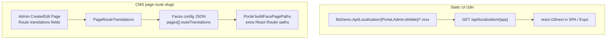
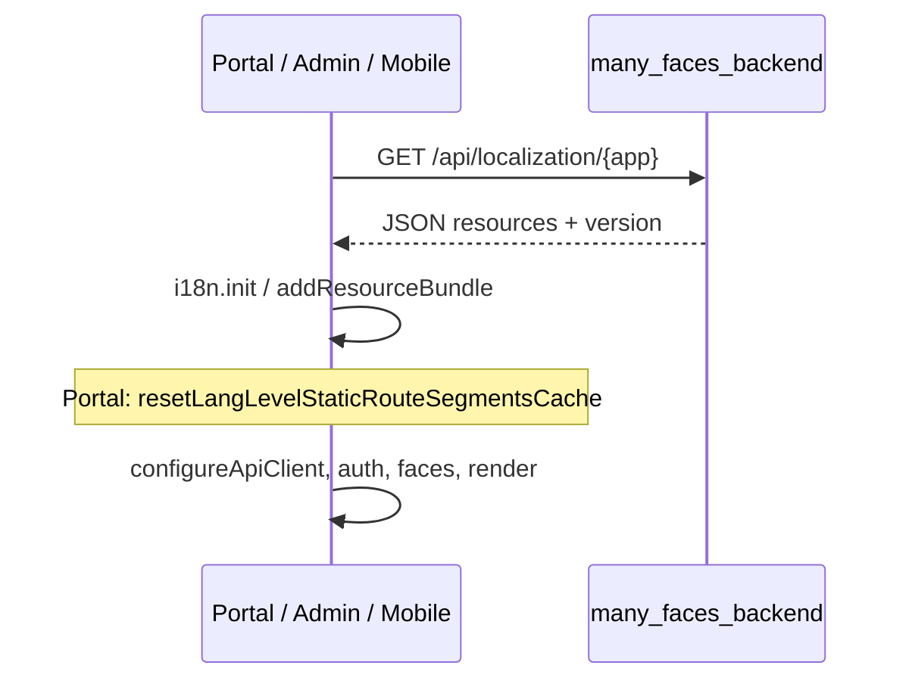
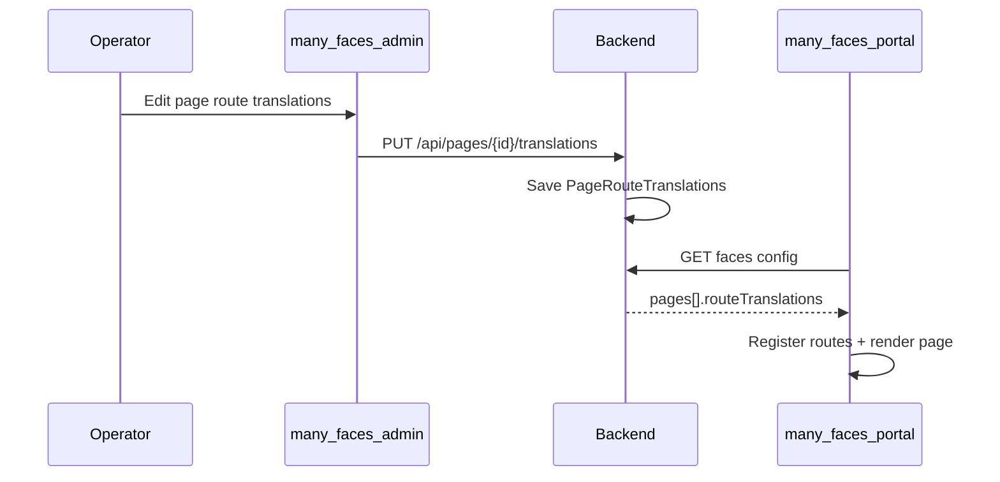

# Static localization and i18n (portal, admin, mobile)

How **UI copy** and **URL segments** are translated across Many Faces clients, and how that relates to **CMS page slugs** stored in PostgreSQL.

**Implementation spec:** [`docs/prompts/centralized-static-i18n-resx-backend-agent-prompt.md`](../prompts/centralized-static-i18n-resx-backend-agent-prompt.md)

**Short conventions:** [`i18n-conventions.md`](./i18n-conventions.md)

---

## Two separate systems (do not merge)

| System                      | What it translates                                                            | Source of truth                                                                                     | Edited by                             |
| --------------------------- | ----------------------------------------------------------------------------- | --------------------------------------------------------------------------------------------------- | ------------------------------------- |
| **Static UI i18n**          | Buttons, labels, validation, app menu routes (`routes.login` → `prihlasenie`) | **`many_faces_backend`** — `.resx` per app (`PortalResources`, `AdminResources`, `MobileResources`) | Developers in git                     |
| **CMS dynamic route slugs** | Per-page URL path under a face (`home` → `domov` for one `Page` row)          | **PostgreSQL** — `PageRouteTranslations`                                                            | Operators in admin (Create/Edit Page) |

Static strings are **not** stored in the database. CMS slugs are **not** in `.resx`.



---

## Languages

All product surfaces use the same language codes:

| Code | Meaning                                                                           |
| ---- | --------------------------------------------------------------------------------- |
| `en` | English (default)                                                                 |
| `sk` | Slovak                                                                            |
| `cz` | Czech (client/DB code; .NET satellites use `cs` / `cs-CZ` internally — see below) |

---

## Static UI — target architecture

### Authoring (backend)

- One **resource class per app** — no shared `SharedResources.resx` across portal/admin/mobile.
- Keys match i18next paths: nested JSON is produced by **unflattening** dotted `.resx` names (`pages.login.title`).
- Cultures: `PortalResources.resx` (default), `PortalResources.sk.resx`, `PortalResources.cs.resx` (served as **`cz`** in JSON).

### Wire API

```
GET /api/localization/{app}
```

| `app`    | Resource set      |
| -------- | ----------------- |
| `portal` | `PortalResources` |
| `admin`  | `AdminResources`  |
| `mobile` | `MobileResources` |

- **Anonymous** (no Bearer token) — required for login/register before OAuth.
- **Face-prefix exempt** — call `/api/localization/portal`, not `/{face}/api/localization/...` (see [routing](#face-prefix-routing-and-api-paths)).
- **Rate limited** — policy `localization-read` (per-client-IP **fixed window**; separate from OAuth `oauth-token` / `oauth-register`).
  - Config (in `many_faces_backend` `appsettings.json`): `Localization:RateLimitPermitLimit` (default **120**), `Localization:RateLimitWindowSeconds` (default **60**).
  - All `{app}` values (`portal`, `admin`, `mobile`) share the **same IP counter** — normal UX is one GET per app per session.
  - When exceeded: **HTTP 429**, `Retry-After` header, body `{"error":"rate_limit","error_description":"Too many requests. See Retry-After."}`.
  - Automated coverage: `BeDemo.Api.Tests/LocalizationRateLimit429Tests.cs` (low permit test host).
- Response includes `version` (content hash), `supportedLanguages`, and `resources` for `en` / `sk` / `cz`.

Example shape:

```json
{
  "app": "portal",
  "version": "a1b2c3d4",
  "defaultNamespace": "common",
  "supportedLanguages": ["en", "sk", "cz"],
  "resources": {
    "en": { "common": { "routes": { "login": "login" } } },
    "sk": { "common": {} },
    "cz": { "common": {} }
  }
}
```

Mobile may expose multiple namespaces per language (`common`, `login`, `register`) in the same response.

### Client startup (all apps)



| App        | Entry                          | Notes                                                                                                                                                             |
| ---------- | ------------------------------ | ----------------------------------------------------------------------------------------------------------------------------------------------------------------- |
| **Portal** | `main.tsx`                     | After `validateEnv`, **before** `configureApiClient` if needed for bare `/api/localization`; then `resetLangLevelStaticRouteSegmentsCache()`                      |
| **Admin**  | `main.tsx`                     | Async bootstrap; remove side-effect `import './i18n/config'`                                                                                                      |
| **Mobile** | `Bootstrap.tsx` → `initI18n()` | Before `App`; first launch uses **device locale** (`expo-localization`, `cs`→`cz`) when `i18nextLng` is unset; **settings `LanguageSwitcher`** persists overrides |

- **One GET** returns all languages; `changeLanguage('sk')` does not refetch.
- **Optional:** cache bundle in `localStorage` when `version` unchanged.

### Using copy in components

```tsx
import { useTranslation } from "react-i18next";
// Portal also: useApp() from contexts/AppContext.tsx

const { t } = useTranslation("common");
return <button>{t("pages.login.submit")}</button>;
```

### Static localized app routes (React Router)

English segment names (`login`, `register`, `dashboard`, …) are keys under `routes.*` in the static bundle. Utilities map them per language:

| App    | Utility                                                                        |
| ------ | ------------------------------------------------------------------------------ |
| Portal | `src/utils/routeTranslations.ts`, `useLocalizedLink`, `buildLocalizedLinkPath` |
| Admin  | `src/utils/routeTranslations.ts`, `useAdminRoutePaths`                         |

`getAllRouteTranslations` registers **multiple path variants** per route id so `/sk/prihlasenie` and `/en/login` both match.

Some paths stay **hardcoded in English** in route config (e.g. guest `register/complete` for email links) — only surrounding copy is translated.

---

## CMS dynamic page routes (unchanged by static i18n rollout)

### Data model

- Table: `PageRouteTranslations` (`PageId`, `LanguageCode`, `TranslatedRoute`).
- API: `GET/PUT /api/pages/{pageId}/translations` (`PagesController`).

### Admin

- **Create Page** / **Edit Page** — section “Route translations” with `en` / `sk` / `cz` inputs.
- Hooks: `usePageRouteTranslationsApi`, `updatePageRouteTranslations`.

### Portal

- Faces config includes per page:

```json
"routeTranslations": [
  { "languageCode": "sk", "translatedRoute": "domov" }
]
```

- `buildFacePagePaths` emits routes like `{faceIndex}/domov` in addition to `{faceIndex}/home`.
- `faceWallPage.ts` matches pathname against base path + translated slugs.



---

## Face-prefix routing and API paths

Browser REST calls usually go to `/{facePrefix}/api/...`. System paths are exempt:

| Path prefix                         | Purpose                                           |
| ----------------------------------- | ------------------------------------------------- |
| `/api/oauth2`                       | Token, registration                               |
| `/api/auth`                         | Legacy cookie auth                                |
| `/api/localization`                 | Static UI bundles (**required** for this feature) |
| `/swagger`, `/openapi`, `/uploads/` | Tooling / static files                            |

Portal `src/api/faceApiRouting.ts` must treat `/api/localization` like OAuth (no face prepend).

---

## Culture code `cz` vs .NET `cs`

| Layer                                        | Code                                           |
| -------------------------------------------- | ---------------------------------------------- |
| React apps, DB `LanguageCode`, API JSON keys | `cz`                                           |
| `.resx` satellite files                      | `*.cs.resx` or `cs-CZ` (valid `CultureInfo`)   |
| API builder                                  | Read `cs` resources, emit under `resources.cz` |

Do not call `CultureInfo.GetCultureInfo("cz")` — it is not a standard culture.

---

## Editing static copy in development

1. Edit `many_faces_backend/BeDemo.Api/Localization/{Portal|Admin|Mobile}/*.resx`.
2. Run key parity check: `node scripts/verify-localization-key-parity.mjs` (or `dotnet test` filter `LocalizationKeyParity`).
3. **Restart** the API (`dotnet watch run` or container restart) — `.resx` changes are not picked up by Vite/Expo HMR.
4. Confirm new `version` in `GET /api/localization/{app}`.
5. Hard refresh portal/admin or restart Expo; clear `localStorage` i18n cache if needed.

---

## Per-app pointers

| Submodule | Local README                                                                         | Backend resources      |
| --------- | ------------------------------------------------------------------------------------ | ---------------------- |
| Portal    | [`many_faces_portal/src/i18n/README.md`](../../many_faces_portal/src/i18n/README.md) | `Localization/Portal/` |
| Admin     | [`many_faces_admin/src/i18n/README.md`](../../many_faces_admin/src/i18n/README.md)   | `Localization/Admin/`  |
| Mobile    | (bootstrap in `src/i18n/index.ts`)                                                   | `Localization/Mobile/` |

---

## Related documentation

- [`i18n-conventions.md`](./i18n-conventions.md) — key naming discipline
- [`authentication-and-sessions.md`](./authentication-and-sessions.md) — OAuth before localized guest pages
- [`many_faces_backend/docs/reference/02-routing-config-and-workflow.md`](../../many_faces_backend/docs/reference/02-routing-config-and-workflow.md) — face-prefix rules
- Mailer template locales — separate Java `ResourceBundle` in `many_faces_mailer` (not this pipeline)
