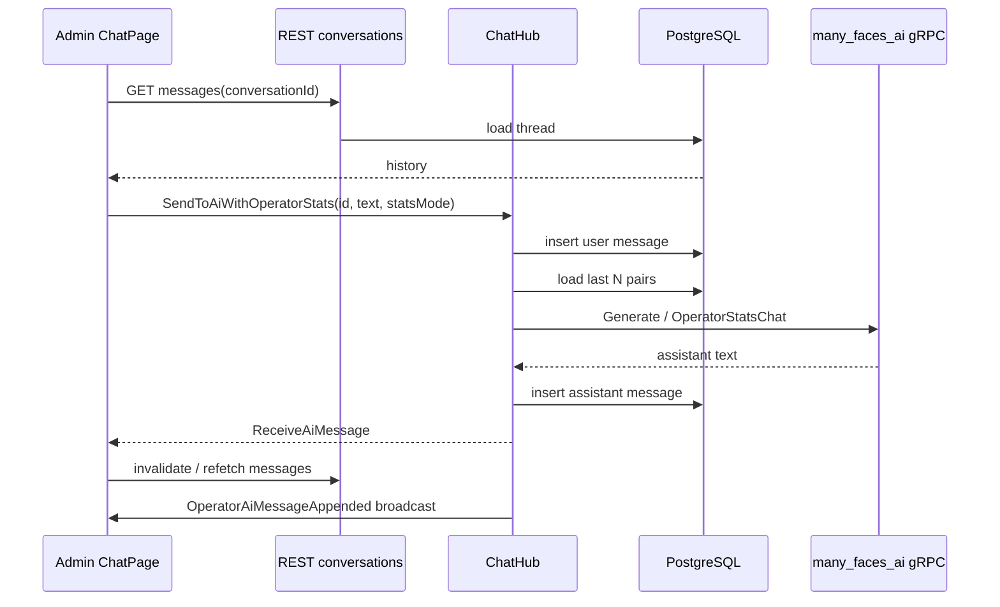
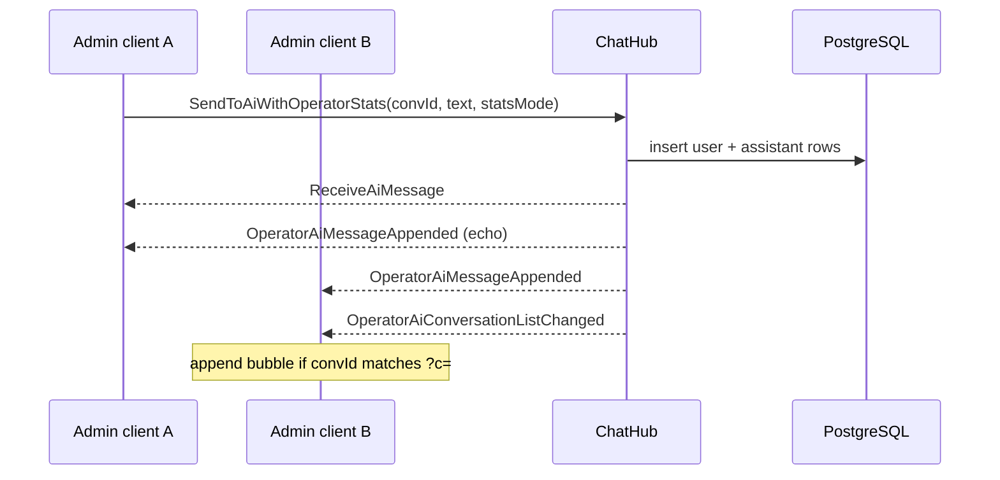
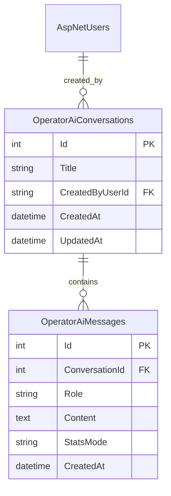
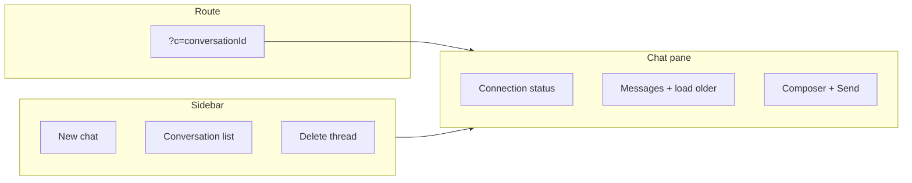
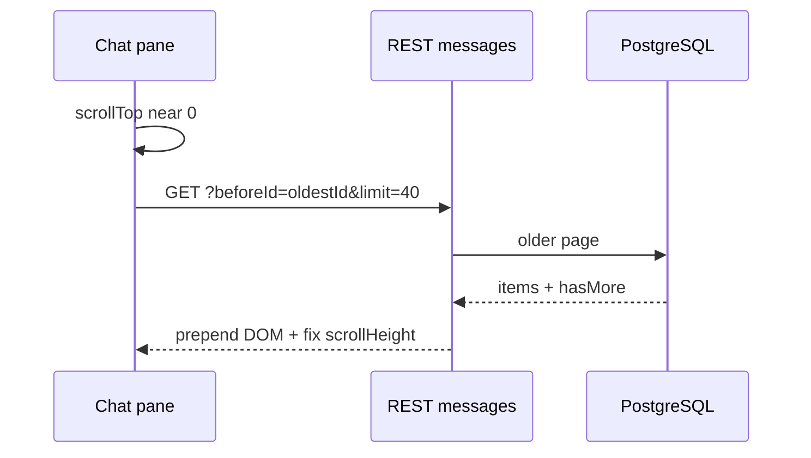
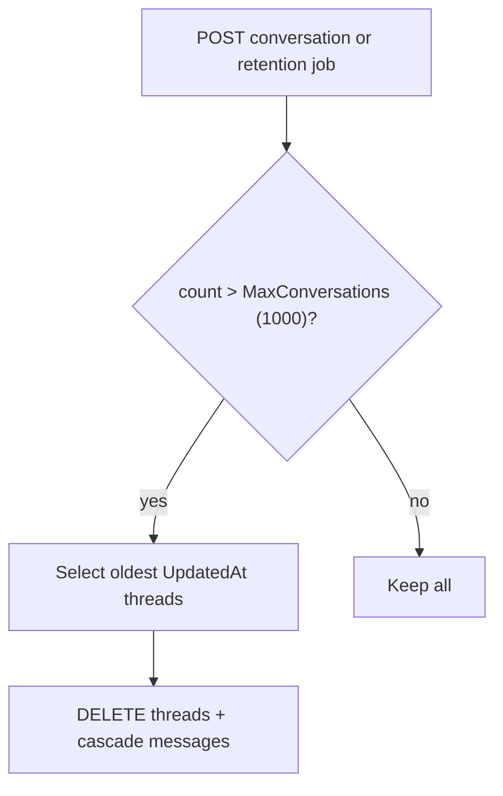
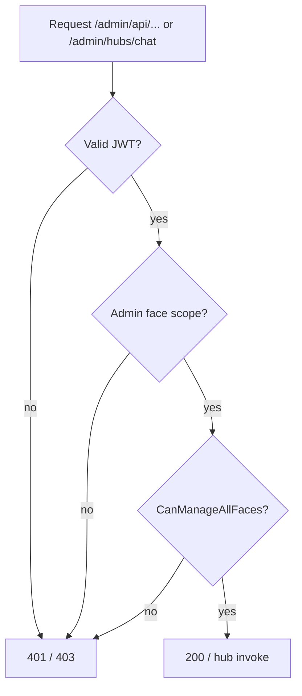
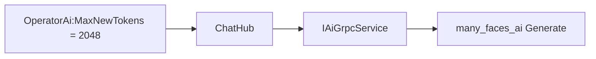

# Admin operator AI chat — threaded conversations (ChatGPT-style) — Agent prompt

**Language:** English (identifiers and paths follow the repository).  
**Use:** Copy **§0** (master instructions) or the **whole document** into a new AI agent session.

**Engagement name:** **Admin operator AI chat threads** (persistent support assistant, not private DMs).  
**Supersedes (browser-only history):** `sessionStorage` key `admin_ai_chat_history` in `many_faces_admin/src/pages/ChatPage/ChatPage.tsx` — **remove** after DB threads ship.

**Product intent (from stakeholders):**

- Admin web AI chat is a **shared support tool** for platform operators (JWT with **admin face prefix** + **`CanManageAllFaces`** — typically **`ADMIN`** or **`SUPER_ADMIN`** global role), **not** private messaging or end-user DMs.
- **All operators may see all conversations** — same as a shared support inbox; no per-user privacy requirement.
- UX like **ChatGPT**: conversation list on the **left**, active thread on the **right**, **New chat**, **delete** a thread, titles, persisted history in **PostgreSQL**.
- **Do not** clear history on logout (waived SHV2 **FE-A3** — see [security-hardening-v2-agent-prompt.md](./security-hardening-v2-agent-prompt.md) §7).

**Related docs:**

| Doc | Purpose |
|-----|---------|
| [admin-ai-public-stats-operator-chat-agent-prompt.md](./admin-ai-public-stats-operator-chat-agent-prompt.md) | Existing **`SendToAiWithOperatorStats`**, stats modes, gRPC — **keep**; extend with `conversationId` |
| [backend-stats-and-admin-ai-runbook.md](../guides/backend-stats-and-admin-ai-runbook.md) | Operator runbook — update after delivery |
| [admin-dashboard-metrics.md](../guides/admin-dashboard-metrics.md) | Dashboard / stats context |
| [signalr-hub-security-matrix.md](../guides/signalr-hub-security-matrix.md) | Hub auth matrix — add new hub methods |
| [acl-and-capabilities.md](../guides/acl-and-capabilities.md) | `CanManageAllFaces` vs `IsGlobalSuperAdmin` |
| [super-admin-api.md](./super-admin-api.md) | If tightening to **SUPER_ADMIN-only** REST |
| [endpoint-schema-validation-agent-prompt.md](./endpoint-schema-validation-agent-prompt.md) | FluentValidation for new REST DTOs |
| [security-hardening-v2-agent-prompt.md](./security-hardening-v2-agent-prompt.md) | PI-9 trust boundary — operator prompts are untrusted; log redaction (**BE-L3**) |
| [mermaid-documentation-diagrams-agent-prompt.md](./mermaid-documentation-diagrams-agent-prompt.md) | Mermaid style, `classDef` palette, sequence-diagram rules |

**Primary repositories:**

| Repo | Scope |
|------|--------|
| `many_faces_backend` | EF entities + migration, REST CRUD, `ChatHub` persistence, service layer, tests |
| `many_faces_admin` | Two-pane UI, hooks, OpenAPI client, i18n, Vitest, remove `sessionStorage` |
| `many_faces_ai` | **No proto change** unless prompt length limits require tuning — reuse existing `Generate` / `OperatorStatsChat` |

---

## 0. Master instructions (paste into agent chat)

You are implementing **ChatGPT-style threaded operator AI chat** for **`many_faces_admin`**, backed by **PostgreSQL** in **`many_faces_backend`**.

**Non-negotiable rules:**

1. **Persist every user/AI turn** in the DB for the active conversation. **Stop using** `sessionStorage` for message history once DB paths work.
2. **Shared inbox:** `GET` conversation list returns **all** threads (not filtered to `CreatedByUserId`), ordered by **last activity** descending. Show **creator display hint** (email domain or name) in the sidebar for support context.
3. **Authorization:** Same gate as **`StatsController`** and today’s operator AI hub path: **`IAccessEvaluator.CanManageAllFaces(User)`** on REST, and **`PlatformAccessRules.CanManageAllFaces`** / equivalent in **`ChatHub`** (requires **admin** face scope in URL + global **ADMIN** or **SUPER_ADMIN** role). **`ContentModerationController`** is **stricter** (super-admin only) — do **not** reuse that bar for operator AI chat unless product explicitly narrows access.
4. **Keep stats modes:** `off` / `inline` / `live` from `admin_ai_public_stats_mode` (`localStorage`) still apply **per send**; store optional `statsMode` on the **user message row** for audit/debug (not on AI row).
5. **SignalR for send only** (recommended): REST loads list + messages; hub method sends user text, loads history from DB, calls AI, persists AI reply, pushes **`ReceiveAiMessage`**. Avoid trusting client-sent `history[]` as source of truth when `conversationId` is set.
6. **FluentValidation** on all new REST bodies/query objects; **English** `///` comments on entities, services, hub changes, and non-obvious tests.
7. **PII logging:** Never log raw operator prompts or AI bodies — use `PiiLogRedaction.FormatChatMessageForLog` (existing **BE-L3**).
8. **Do not** stream tokens in v1 unless already trivial — unary `ReceiveAiMessage` callback is fine.
9. Run **`dotnet test`** (backend) and **`yarn test`** / **`vitest`** (admin) before declaring done; restart **`be-demo-dev`** and smoke-test UI.
10. Update **runbook** § in [backend-stats-and-admin-ai-runbook.md](../guides/backend-stats-and-admin-ai-runbook.md) and tick **§12** in this file in the PR body (do not mass-replace `[x]` in git unless team adopts living log).
11. **Documentation (§9):** create/update the canonical guide, cross-links, and **all Mermaid diagrams** listed in §11 (English labels; verify against code).
12. **Unit tests (§8):** every new service/validator/helper has **focused unit tests**; integration tests cover HTTP + hub; admin Vitest covers pure UI logic — **no merge without green CI**.

**Deliverables:** Migration, API, hub changes, admin two-pane UI, **unit + integration tests**, i18n (`en`, `sk`, `cz`), **guide + Mermaid + runbook updates**, removal of `sessionStorage` chat history.

---

## 1. Mission & success criteria

### 1.1 Mission

Replace the single browser-tab thread with **named conversations** stored in **PostgreSQL**, editable from a **two-column** admin UI, while preserving the existing **operator stats AI** pipeline (`SendToAiWithOperatorStats` + `many_faces_ai` gRPC).

### 1.2 Acceptance criteria

- [ ] Operator opens **Chat** → sees **left sidebar** (conversation list) + **right pane** (messages + composer).
- [ ] **New chat** creates an empty conversation (title placeholder until first message); selecting it shows empty state; first send creates title from truncated first user line (e.g. first 60 chars).
- [ ] **Delete** removes conversation and all messages (hard delete acceptable for v1; soft-delete optional with `DeletedAt`).
- [ ] Switching conversations loads messages from **REST** (or hub fetch); no bleed from previous thread.
- [ ] **Refresh page** / new tab: list and messages reload from API (same shared threads).
- [ ] **Second operator** sees the same threads and can continue a conversation (support handoff).
- [ ] **`SendToAiWithOperatorStats`** accepts **`conversationId`** (GUID/int per schema); server builds AI history from DB (cap last **N** pairs, align with current `MAX_HISTORY_PAIRS = 5` or configurable `OperatorAi:MaxHistoryPairs`).
- [ ] **`sessionStorage` `admin_ai_chat_history` removed** from `ChatPage` (and any helpers).
- [ ] Tests: backend integration tests for CRUD + forbidden without operator token; admin Vitest for list/select/new/delete UI logic (extract pure helpers where needed).
- [ ] OpenAPI / admin client regenerated if the repo uses `yarn generate:api` for new controllers.
- [ ] **`many_faces_portal` `ChatPage`** still works (`SendToAi` unchanged) after backend hub changes.
- [ ] Coordinated deploy: backend migration applied before admin SPA that calls new hub arity.
- [ ] **Deep link:** `?c={conversationId}` in admin chat route selects thread; refresh with query restores selection.
- [ ] **Live sync:** second operator/tab sees new messages and sidebar bumps without manual refresh (§3.7).
- [ ] **Retention:** at most **1000** conversations kept; older deleted by retention job (§4.4).
- [ ] **Message pagination:** initial window + **load older** when scrolling up (§3.8).
- [ ] **Documentation:** canonical guide [../guides/admin-operator-ai-chat-threads.md](../guides/admin-operator-ai-chat-threads.md) exists with API tables, config, and **§11 Mermaid** diagrams embedded.
- [ ] **Unit tests:** all **§8.1** backend unit files + **§8.2** admin Vitest files present and passing; integration/smoke per **§8.3–8.4**.

### 1.3 Explicit non-goals (v1)

- Per-operator private threads or ACL on individual conversations.
- Editing or regenerating individual messages.
- Full-text search across threads.
- Attachments / images in operator chat.
- Server-side storage of `admin_ai_public_stats_mode` (stays `localStorage`).
- Replacing face-scoped user **`Messages`** table or Messenger hubs — this is a **separate** operator-support domain.

---

## 2. Current state (baseline)

| Layer | Today |
|-------|--------|
| **Admin UI** | `many_faces_admin/src/pages/ChatPage/ChatPage.tsx` — single column, max ~50 messages in **`sessionStorage`**, `buildHistory()` sends last 5 pairs to hub |
| **SignalR** | `buildAdminAiChatHubConnection` → `{apiUrl}/hubs/chat` rewritten by axios to **`/{defaultFacePrefix}/hubs/chat`** (admin: **`/admin/hubs/chat?access_token=…`**) — see `faceApiRouting.ts` |
| **Backend hub** | `BeDemo.Api/Hubs/ChatHub.cs` — `SendToAiWithOperatorStats(message, history, statsMode)`; history is **client-supplied** today |
| **Portal** | `many_faces_portal` **`ChatPage`** still uses **`SendToAi`** (face-scoped user chat) — **do not break**; only the **admin operator stats** hub method signature changes |
| **AI** | Local **`many_faces_ai`** gRPC (`Generate` / `OperatorStatsChat`); generation length capped by **`max_new_tokens`** from .NET (today **150** hard-coded in `ChatHub`; target **`OperatorAi:MaxNewTokens` = 2048**) — see §13 |
| **DB** | **No** operator AI conversation tables — greenfield |
| **`ChatHistoryEntry` DTO** | **`BeDemo.Api/Models/DTOs/ChatHistoryEntry.cs`** — `userMessage` / `aiResponse` (camelCase JSON for SignalR); reuse for DB→hub history mapping |

**Waived:** SHV2 **FE-A3** (clear chat on logout) — history is a **feature**, not a leak, in this support model.

---

## 3. Product behaviour (UX spec)

### 3.1 Layout (ChatGPT-inspired)

```text
+----------------------------+----------------------------------------+
|  [ + New chat ]            |  Connection status    [optional title] |
|----------------------------|                                        |
|  > Billing question        |   User: ...                            |
|    @operator · 2h ago      |   AI:   ...                            |
|  > Deploy rollback         |                                        |
|    @you · yesterday   [x]  |   [ typing indicator while sending ]   |
|                            |                                        |
|                            |   [ message input ........... ] [Send] |
+----------------------------+----------------------------------------+
```

- **Left (~280–320px):** scrollable list; active row highlighted; **delete** icon/button per row (confirm modal).
- **Right:** existing message bubbles + input; reuse `ChatPage.scss` tokens where possible; extend for two-column **flex** layout (full width under `AdminLayout`).
- **Responsive:** below `md` breakpoint, collapse sidebar behind a toggle or stack list above chat — document chosen pattern in PR.
- **Empty list:** CTA “Start a new conversation”.
- **Empty active thread:** placeholder matching `pages.chat.placeholder` i18n.

### 3.2 Conversation list sort & metadata

- Sort by **`UpdatedAt` DESC** (bump on each new message).
- Row title: `Title` if set, else first user message preview, else `"New conversation"`.
- Subtitle: `CreatedBy` display name + relative time (`UpdatedAt`).
- Optional: unread badge — **out of scope v1** unless trivial.

### 3.3 New chat flow

1. User clicks **New chat** → `POST /api/operator-ai/conversations` → returns `{ id, title, createdAt, updatedAt, createdByUserId, createdByDisplayName }`.
2. UI selects new id; right pane empty; focus input.
3. First successful send sets title if still default (server-side in hub or REST patch).

### 3.4 Delete flow

1. User confirms delete → `DELETE /api/operator-ai/conversations/{id}`.
2. If deleted id was selected, select next newest or show empty state + prompt new chat.

### 3.5 Send message flow (recommended)

1. UI ensures `conversationId` selected (create via New chat if none).
2. Optimistic UI optional; v1 may wait for hub callback only.
3. `connection.invoke('SendToAiWithOperatorStats', conversationId, text, statsMode)` — **new 3-arg signature** (see §5.3). This is a **breaking change** for the admin SPA only; deploy **backend + admin** together (portal unchanged).
4. On `ReceiveAiMessage` to **caller**: append locally; other clients rely on **`OperatorAiMessageAppended`** broadcast (§3.7).
5. Sync URL: `navigate` / `setSearchParams` so `?c={id}` matches selected thread (§3.6).

### 3.6 Deep link — `?c={conversationId}`

- Admin chat route (all localized paths from `AppRoutes` / `useAdminRoutePaths`) accepts optional query **`c`** (integer conversation id).
- On mount: if `c` is valid and exists in list (or fetch `GET …/conversations/{id}`), select that thread; if invalid, clear `c` and show empty/new state.
- On select / new chat / delete: update `c` with **`replace: true`** (avoid history spam) via React Router `useSearchParams`.
- Sharing: operators can paste URL to colleagues — same shared inbox opens the same thread.

### 3.7 Live sync between operators (v1 — required)

When any operator completes a send (or creates/deletes a conversation), **all** connected admin chat clients on **`ChatHub`** receive updates without polling.

**Hub client callbacks (admin SPA subscribes on connect):**

| Event | Payload (suggested) | UI action |
|-------|---------------------|-----------|
| **`OperatorAiConversationListChanged`** | `{ conversationId, updatedAt, title?, createdByDisplayName? }` | Invalidate or patch sidebar list; re-sort by `updatedAt` |
| **`OperatorAiMessageAppended`** | `{ conversationId, userMessage, aiResponse, userMessageId?, assistantMessageId? }` | If `conversationId` === active `?c=`, append bubbles (dedupe by id if refetch); if other thread, only sidebar bump |
| **`OperatorAiConversationDeleted`** | `{ conversationId }` | Remove row; if active id deleted, clear `?c` and show empty state |

**Server broadcast groups:**

- Join every operator connection to group **`operator_ai_operators`** in `OnConnectedAsync` when `CanManageAllFaces()` (same check as stats AI).
- After persist in `SendToAiWithOperatorStats`: `Clients.Group("operator_ai_operators").SendAsync("OperatorAiMessageAppended", …)` **and** list-changed payload.
- After `POST`/`DELETE` conversation REST: broadcast list/deleted events (or rely on list-changed only).

**Caller still gets** `ReceiveAiMessage` for low latency on the sending tab; broadcasts keep **other** tabs/operators in sync.

### 3.8 Message pagination — load older on scroll up

Long threads must not load unbounded rows into the DOM.

**API:** `GET /api/operator-ai/conversations/{id}/messages`

| Query | Meaning |
|-------|---------|
| `limit` | Page size (default **40**, max **100**) |
| `beforeId` | Optional; return messages **older than** this message id (exclusive), ordered **`CreatedAt` ASC** in response |

**Response:**

```json
{
  "items": [ { "id", "role", "content", "statsMode", "createdByUserId", "createdAt" } ],
  "hasMore": true,
  "oldestId": 123
}
```

**UI behaviour (ChatGPT-style):**

1. Initial open: fetch **latest** page (`GET …/messages?limit=40` — no `beforeId`; server returns the **most recent** 40 in chronological order).
2. Message pane scroll container: when user scrolls **near top** (e.g. `scrollTop < 80px`) and `hasMore`, fetch `?beforeId={oldestId}&limit=40`, **prepend** DOM nodes, preserve scroll position (`scrollHeight` delta technique).
3. Show small “Loading older messages…” at top while fetching; disable duplicate fetches with a ref lock.
4. **Live append:** new messages from send or `OperatorAiMessageAppended` always append at **bottom** and auto-scroll if user was already at bottom.

**Tests:** service unit test for cursor paging; Vitest helper for merge/prepend scroll preservation optional.

---

## 4. Data model (`many_faces_backend`)

### 4.1 Tables (suggested names — adjust to EF conventions)

**`OperatorAiConversations`**

| Column | Type | Notes |
|--------|------|--------|
| `Id` | `int` PK identity or `uuid` | Consistent with project style |
| `Title` | `nvarchar(200)` | Nullable until first message |
| `CreatedByUserId` | `string` FK → **`ApplicationUser`** | Audit only; **not** used for list filter; expose `createdByDisplayName` in list DTO (join user FirstName/LastName or email local-part) |
| `CreatedAt` | `utc DateTime` | |
| `UpdatedAt` | `utc DateTime` | Touch on each message |
| `DeletedAt` | `utc DateTime?` | Optional soft delete |

**`OperatorAiMessages`**

| Column | Type | Notes |
|--------|------|--------|
| `Id` | PK | |
| `ConversationId` | FK | Cascade delete |
| `Role` | `string` (max 16) | Store `User` \| `Assistant`; when building hub prompt use **`User:`** / **`AI:`** lines (same as `BuildPromptWithHistory` today) |
| `Content` | `text` / `nvarchar(max)` | Plain text only v1 |
| `StatsMode` | `nvarchar(16)?` | `off` \| `inline` \| `live` on **user** rows only |
| `CreatedByUserId` | `string?` | Set for user rows; null for assistant |
| `CreatedAt` | `utc DateTime` | Order messages by this |

**Indexes:** `(ConversationId, CreatedAt)`; `(UpdatedAt DESC)` on conversations for list.

### 4.2 EF & migration

- Add entities under `BeDemo.Api/Models/` (or `Models/OperatorAi/`).
- Configure in `ApplicationDbContext` with max lengths, cascade delete, required fields.
- New migration in `BeDemo.Api/Migrations/` — name e.g. `AddOperatorAiConversations`.
- **No seed** required (operators create threads in UI).

### 4.3 History cap for AI context

- Config: `OperatorAi:MaxHistoryPairs` default **5** (match current admin client).
- Service loads last N **complete user→assistant pairs** ordered by `CreatedAt` (tie-break `Id`). Skip orphan user rows without a following assistant row when building AI context (failed sends may leave orphans — see §7).
- Map DB rows → **`ChatHistoryEntry`** (`UserMessage`, `AiResponse`) for `BuildPromptWithHistory` / `BuildHistoryPlainText`.

### 4.4 Retention — max **1000** conversations

Product cap: keep at most **`OperatorAi:MaxConversations`** (default **1000**) **non-deleted** rows in `OperatorAiConversations`.

**Enforcement (pick one, document in PR):**

1. **On create:** after `POST` new conversation, if count > 1000, delete (or soft-delete) **oldest by `UpdatedAt`** until count === 1000 — includes cascade messages; **or**
2. **Background job:** `IOperatorAiRetentionService` invoked from existing hosted worker / `Retention` options pattern — trim excess daily.

**Config:**

```json
"OperatorAi": {
  "MaxConversations": 1000
}
```

**Tests:** creating 1001st conversation drops oldest; messages of dropped conversation are gone.

**Non-goal:** per-message retention — only whole-thread cap.

---

## 5. Backend API & hub

### 5.1 REST controller (suggested route)

**Controller:** `OperatorAiConversationsController` — mirror **`StatsController`** / **`AdminRegistrationInvitesController`**: `[Authorize]` class + per-action **`if (!_access.CanManageAllFaces(User)) return Forbid();`**.

**Route (explicit — do not rely on `[controller]` token casing):**

```csharp
[Route("api/operator-ai/conversations")]
```

**Logical path (after face prefix):** `/api/operator-ai/conversations` → called as **`/admin/api/operator-ai/conversations`** from the admin SPA.

| Method | Path | Description |
|--------|------|-------------|
| `GET` | `/api/operator-ai/conversations` | List all non-deleted; paginate optional (`page`, `pageSize` default 50) |
| `POST` | `/api/operator-ai/conversations` | Create empty thread; body optional `{ title? }` |
| `GET` | `/api/operator-ai/conversations/{id}` | Metadata |
| `GET` | `/api/operator-ai/conversations/{id}/messages` | Cursor pagination — latest window or older via `beforeId` (§3.8) |
| `PATCH` | `/api/operator-ai/conversations/{id}` | Rename title (optional v1) |
| `DELETE` | `/api/operator-ai/conversations/{id}` | Delete thread + messages |

**DTOs** in `Models/Requests/OperatorAi/` + response records in `Models/DTOs/OperatorAi/`.

**Validation examples:**

- Title max 200 chars; message content max (e.g. 16_000) to match hub sanity.
- Conversation id must exist and not deleted.

### 5.2 Service layer

**`IOperatorAiConversationService`** (name illustrative):

- `ListAsync`, `CreateAsync`, `GetMessagesAsync`, `DeleteAsync`, `AppendUserMessageAsync`, `AppendAssistantMessageAsync`, `BuildHistoryForAiAsync(conversationId, maxPairs)`.
- Used by **controller** and **`ChatHub`** — single persistence path.

### 5.3 `ChatHub` changes

**File:** `BeDemo.Api/Hubs/ChatHub.cs`

**New preferred signature:**

```csharp
public async Task SendToAiWithOperatorStats(
    int conversationId,  // or Guid — match EF PK
    string message,
    string? statsMode)
```

**Server steps:**

1. Verify `CanManageAllFaces()`.
2. Load conversation; 404 path → caller error string (same pattern as rate limit).
3. Rate limit (`IChatHubAiRateLimiter`).
4. Persist **user** message row (`statsMode`, `CreatedByUserId`).
5. Build history from DB via service (**ignore** client history array).
6. Call existing AI pipeline (`inline` / `live` / `off`).
7. Persist **assistant** message row.
8. Update conversation `UpdatedAt` + title if first message.
9. `ReceiveAiMessage(userMessage, aiResponse)` to **caller**.
10. **`Clients.Group("operator_ai_operators").SendAsync("OperatorAiMessageAppended", …)`** and **`OperatorAiConversationListChanged`** (§3.7).

**Keep** existing `SendToAiWithOperatorStats(string message, ChatHistoryEntry[]? history, string? statsMode)` only if needed for backward compatibility during rollout — prefer **replacing** with the 3-arg overload and updating **admin** client in the same PR. **`SendToAi`** on the same hub (portal face chat) stays **unchanged**; portal may keep sending `ChatHistoryEntry[]` from the client.

**Persist error/rate-limit text:** When AI fails or rate limit returns the fixed English string via `ReceiveAiMessage`, still **persist** an **Assistant** row with that text (and the user row) so the shared thread shows what happened — broadcast append includes error text for other operators.

**`OnConnectedAsync`:** when `CanManageAllFaces()`, `await Groups.AddToGroupAsync(Context.ConnectionId, "operator_ai_operators")`.

### 5.4 Routing & face prefix

- REST is **not** face-exempt in `Routing.cs` — requests must use the **admin** face segment (same as **`GET /api/Stats`**).
- **`applyFacePrefixToRequestUrl`** in `many_faces_admin/src/api/config.ts` prefixes both `/api/*` and `/hubs/*` with `env.defaultFacePrefix` (default **`admin`**).
- SignalR: `OpenAPI` does not cover hubs; hub URL must stay consistent with **`prependFaceBeforeHubs`** (connection builder path `/hubs/chat` → `/admin/hubs/chat`).

### 5.5 OpenAPI & admin API client

- **`many_faces_admin`** uses **`openapi-typescript-codegen`** (`yarn generate:api` — backend must be up on port **8000**).
- After controller ships: regenerate **`openapi.json`** + `src/api/**`, **or** (house style for Stats) add hand-written fetch helpers in **`src/hooks/api/useOperatorAiConversationsApi.ts`** using `__request(OpenAPI, { method, url })` and types under **`src/types/operatorAiChat.ts`** — pick one approach and document in PR.
- Swagger must list new endpoints under the same document portal/admin already consume.

---

## 6. Admin frontend (`many_faces_admin`)

### 6.1 File plan

| Area | Action |
|------|--------|
| `src/pages/ChatPage/ChatPage.tsx` | Refactor to container + two-pane layout |
| `src/pages/ChatPage/OperatorAiConversationSidebar.tsx` | **New** — list, new, delete |
| `src/pages/ChatPage/OperatorAiChatPane.tsx` | **New** — messages, input, SignalR |
| `src/pages/ChatPage/ChatPage.scss` | Two-column layout — **remove** `max-width: 720px` center column constraint; use full content width under `AdminLayout` |
| `src/hooks/api/useOperatorAiConversationsApi.ts` | **New** — React Query |
| `src/utils/operatorAiChat.ts` | **New** — title preview, sort helpers (unit-tested) |
| Remove | `STORAGE_KEY`, `loadStoredMessages`, `saveMessagesToStorage` |

### 6.2 State management

- **`useQuery`** `['operator-ai', 'conversations']` for sidebar.
- **`useQuery`** `['operator-ai', 'messages', conversationId]` enabled when id selected.
- **`useMutation`** create / delete / optional rename.
- Selected `conversationId` synced with URL **`?c=`** (§3.6) — `useSearchParams` + `useNavigate`.
- Subscribe to hub events §3.7 in `ChatPage` or `OperatorAiChatPane`.

### 6.3 SignalR integration

- Keep one hub connection per `ChatPage` mount (same as today).
- Pass **`conversationId`** on invoke; on success invalidate messages query.
- Handle timeout path (existing 6 min race) — persist user+error assistant row or only show ephemeral error (document choice; prefer **persist assistant error bubble** for support audit).

### 6.4 i18n

Add keys under `pages.chat.*` (and `routes` if needed) in **`en`**, **`sk`**, **`cz`**:

- `newChat`, `deleteConversation`, `deleteConfirm`, `noConversations`, `conversationTitlePlaceholder`, `createdBy`, `deleted`, errors.

### 6.5 Accessibility

- Sidebar: `role="listbox"` or nav with `aria-current` on active conversation.
- Delete: confirmation dialog with focus trap (use existing radix/dialog if present).

---

## 7. Security & abuse

| Topic | Guidance |
|-------|----------|
| **Authz** | Same operator gate as today; return **403** JSON for non-operators on REST |
| **IDOR** | Any operator can read/delete any conversation **by design** — document in runbook |
| **Prompt injection** | User messages are untrusted; AI output is untrusted — display as **plain text** only (no `dangerouslySetInnerHTML`) |
| **Rate limit** | Keep `IChatHubAiRateLimiter` (`ChatHub:SendAiMaxPerWindow` / `SendAiWindowSeconds`) |
| **Size limits** | Cap message length server-side (`OperatorAi:MaxMessageLength`); optional max messages per conversation (e.g. 500) |
| **Concurrency** | Two operators may post in the same thread — use DB transaction per send; order by `CreatedAt`; last write wins on `UpdatedAt`; no locking required v1 |
| **Delete vs send race** | If conversation deleted mid-send, hub returns caller-visible error; do not resurrect deleted rows |
| **PI-9 boundary** | Operator chat stays **trusted operator path** — update `ContentModerationTrustBoundary` XML + [ai-assisted-content-approval.md](../guides/ai-assisted-content-approval.md) cross-link; do not run moderation instruction heuristic on operator messages |
| **Audit** | Optional `SecurityAuditLog` on delete — stretch |

---

## 8. Testing (unit, integration, manual)

**Policy:** Prefer **unit tests** for pure logic (no DB, no HTTP). Use **integration tests** for auth, EF, and controllers. Use **hub tests** only where harness exists; otherwise mock `IOperatorAiConversationService` + `IAiGrpcService` at service boundary. Admin: **Vitest** on extracted helpers (no full `render` of ChatPage unless house style already does).

**CI commands (must pass before merge):**

```bash
cd many_faces_backend && dotnet test BeDemo.Api.Tests/BeDemo.Api.Tests.csproj
cd many_faces_admin && yarn test && yarn tsc --noEmit
```

### 8.1 Backend unit tests (`BeDemo.Api.Tests`) — **required files**

| Test class | What to cover |
|------------|----------------|
| **`OperatorAiConversationServiceTests`** | `BuildHistoryForAiAsync` — cap `MaxHistoryPairs`, order by `CreatedAt`, skip incomplete pairs; `Append*` updates `UpdatedAt`; title from first user message (truncate, strip newlines) |
| **`OperatorAiRetentionServiceTests`** (or service method tests) | When count > `MaxConversations` (1000), oldest `UpdatedAt` threads removed; messages cascade-deleted |
| **`OperatorAiMessageCursorTests`** | `GetMessagesPageAsync` — latest window size, `beforeId` returns older only, `hasMore` false at start of history |
| **`OperatorAiConversationsValidatorTests`** | Title length, empty POST body allowed, invalid ids |
| **`OperatorAiTitleHelperTests`** (if extracted static helper) | Preview title from content, fallback `"New conversation"` |

Use **in-memory EF** (`UseInMemoryDatabase`) or mock `DbSet` only where the repo already does for similar services — follow nearest neighbour test in `BeDemo.Api.Tests`.

### 8.2 Backend integration tests — **required**

| Test class | Scenarios |
|------------|-----------|
| **`OperatorAiConversationsControllerTests`** | **401** no JWT; **403** non-operator (`CreateFaceClient("public")` + ordinary user token); **200** list/create/get messages/delete for **`AclTestClients.GetPlatformAdminTokenAsync`** + **`CreateFaceClient("admin")`** |
| **Pagination integration** | Seed 50 messages → `GET …/messages?limit=10` returns 10 newest + `hasMore`; `beforeId` returns older 10 |
| **Retention integration** | Set `MaxConversations=2` in test config → third create drops oldest |
| **`OperatorAiChatHubTests`** (or extend `SignalRHubTests`) | Mock `IAiGrpcService` + real EF in-memory: invoke `SendToAiWithOperatorStats(conversationId, …)` inserts 2 rows; optional: second connection receives `OperatorAiMessageAppended` |

Reference: `StatsControllerTests`, `PageTypesControllerTests`, `SignalRHubTests`, `AclTestClients`.

### 8.3 Admin unit tests (Vitest) — **required files**

| File | What to cover |
|------|----------------|
| **`src/utils/__tests__/operatorAiChat.test.ts`** | `conversationTitleFromContent`, `sortConversationsByUpdatedAt`, `parseConversationIdFromSearchParams` / `buildChatSearchParams` |
| **`src/utils/__tests__/operatorAiMessagesPagination.test.ts`** | `mergeOlderMessagesPrepend`, `shouldLoadOlderMessages(scrollTop, hasMore, loading)`, scroll preservation math (delta) |
| **`src/utils/__tests__/operatorAiLiveSync.test.ts`** | Reducer/handler: on `OperatorAiMessageAppended` append if active id; on `OperatorAiConversationDeleted` remove from list |
| **`src/hooks/__tests__/useOperatorAiDeepLink.test.ts`** (optional hook test) | Valid `?c=` selects id; invalid clears param |

**Not required v1:** full SignalR connection in jsdom; snapshot entire ChatPage layout.

### 8.4 Manual smoke (operators)

- [ ] Login as operator → New chat → send → refresh → history remains; URL `?c=` works.
- [ ] Second browser / incognito operator → sees same thread **without refresh** after send (live sync).
- [ ] Delete thread → gone for both; `?c=` cleared when active deleted.
- [ ] Scroll up → older messages load; send still appends at bottom.
- [ ] Stats modes `off` / `inline` / `live` unchanged (settings page).

---

## 9. Documentation (canonical guide + cross-links)

### 9.1 Primary deliverable — new guide

Create or fully update:

**[`docs/guides/admin-operator-ai-chat-threads.md`](../guides/admin-operator-ai-chat-threads.md)**

Minimum sections:

1. **Purpose** — shared support inbox for platform operators; not end-user chat.
2. **Access control** — `CanManageAllFaces`, admin face prefix `/admin/`.
3. **Data model** — tables, retention 1000, cascade delete.
4. **REST API** — table of endpoints + query params (`beforeId`, `limit`) + example JSON snippets.
5. **SignalR** — hub URL, `SendToAiWithOperatorStats` signature, client events (`ReceiveAiMessage` + broadcast events §3.7).
6. **Configuration** — full `OperatorAi` block (§13), env overrides `OperatorAi__MaxNewTokens`, etc.
7. **Admin UI** — two-pane layout, `?c=` deep link, pagination, live sync behaviour.
8. **Trust boundary** — link to [ai-assisted-content-approval.md](../guides/ai-assisted-content-approval.md) (operator path trusted; plain text UI).
9. **Mermaid** — embed **all diagrams from §11** (do not only link out).
10. **Testing** — pointer to test class names in §8.
11. **Related** — links to stats AI prompt, runbook, signalr matrix.

### 9.2 Cross-link updates (required)

| File | Change |
|------|--------|
| [backend-stats-and-admin-ai-runbook.md](../guides/backend-stats-and-admin-ai-runbook.md) | Replace sessionStorage baseline with DB threads; link to new guide |
| [admin-dashboard-metrics.md](../guides/admin-dashboard-metrics.md) | One paragraph: operator chat vs dashboard stats |
| [signalr-hub-security-matrix.md](../guides/signalr-hub-security-matrix.md) | Row for `SendToAiWithOperatorStats`, broadcast events, group `operator_ai_operators` |
| [ai-assisted-content-approval.md](../guides/ai-assisted-content-approval.md) | Cross-link operator chat (trusted path) |
| [many_faces_admin/README.md](../../many_faces_admin/README.md) | ChatPage feature bullet + link to guide |
| [many_faces_backend/README.md](../../many_faces_backend/README.md) | Operator AI conversations API bullet |
| [docs/prompts/README.md](./README.md) | Gap table row already present — set status when done |
| Monorepo root `README.md` | Optional one-line under admin/backend if other features listed there |

### 9.3 Code comments (English)

- `///` on new entities, `IOperatorAiConversationService`, hub methods, options class.
- Brief comment on broadcast group name constant (why shared inbox).

### 9.4 OpenAPI

- Swagger descriptions on new endpoints (summary + `conversationId` on hub documented in guide; SignalR not in OpenAPI).

---

## 10. Implementation phases (suggested order)

| Phase | Work |
|-------|------|
| **A** | EF entities + migration + `IOperatorAiConversationService` + unit tests on history builder |
| **B** | REST controller + FluentValidation + integration tests |
| **C** | `ChatHub` persistence + drop client history trust for operator method |
| **D** | Admin API hooks + two-pane UI + i18n + remove `sessionStorage` |
| **E** | Canonical guide + §11 Mermaid + cross-links (§9) |
| **F** | Manual smoke (§8.4) + full CI |

---

## 11. Mermaid diagrams (required in guide + PR)

**Rules:** Follow [mermaid-documentation-diagrams-agent-prompt.md](./mermaid-documentation-diagrams-agent-prompt.md) — English labels, `flowchart TB` / `sequenceDiagram` / `erDiagram`, verify hub paths against `Program.cs` (`MapHub<ChatHub>("/hubs/chat")`). Embed **every diagram below** in **`docs/guides/admin-operator-ai-chat-threads.md`** under a `### Diagram: …` heading.

### 11.1 D-OAI-01 — Send message (sequence)

**ID:** `D-OAI-01` | **Type:** `sequenceDiagram`



### 11.2 D-OAI-02 — Live sync between operators (sequence)

**ID:** `D-OAI-02` | **Type:** `sequenceDiagram`



### 11.3 D-OAI-03 — Data model (ER)

**ID:** `D-OAI-03` | **Type:** `erDiagram`



### 11.4 D-OAI-04 — Admin UI layout (flowchart)

**ID:** `D-OAI-04` | **Type:** `flowchart LR`



### 11.5 D-OAI-05 — Message pagination scroll-up (sequence)

**ID:** `D-OAI-05` | **Type:** `sequenceDiagram`



### 11.6 D-OAI-06 — Retention trim (flowchart)

**ID:** `D-OAI-06` | **Type:** `flowchart TB`



### 11.7 D-OAI-07 — Auth & face prefix (flowchart)

**ID:** `D-OAI-07` | **Type:** `flowchart TB`



### 11.8 D-OAI-08 — Config → AI token limit (flowchart)

**ID:** `D-OAI-08` | **Type:** `flowchart LR`



**PR:** Paste key diagrams (at least **D-OAI-01**, **D-OAI-02**, **D-OAI-03**) into PR description for reviewers.

---

## 12. Checklist (copy to PR — do not mass-tick in git unless adopted as living log)

### Backend

- [ ] **B1** Entities + migration applied locally and in CI.
- [ ] **B2** `IOperatorAiConversationService` + tests for history cap / ordering.
- [ ] **B3** REST CRUD + FluentValidation + integration tests.
- [ ] **B4** `ChatHub.SendToAiWithOperatorStats(conversationId, …)` persists rows; ignores client history.
- [ ] **B5** PII-safe logging on new paths.
- [ ] **B6** OpenAPI / Swashbuckle shows new endpoints.
- [ ] **B7** Retention `MaxConversations` = 1000 enforced + test.
- [ ] **B8** Hub groups + broadcast events (§3.7).
- [ ] **B9** Message cursor API `beforeId` + tests.
- [ ] **B10** Reuse `Models/DTOs/ChatHistoryEntry.cs` when mapping DB rows → hub prompt (do not duplicate type).

### Admin

- [ ] **F1** Two-pane layout + sidebar new/delete/select.
- [ ] **F2** React Query hooks wired to REST.
- [ ] **F3** SignalR uses `conversationId`; removed `sessionStorage`.
- [ ] **F4** i18n `en` / `sk` / `cz`.
- [ ] **F5** Vitest for pure helpers / selection logic.
- [ ] **F6** Manual smoke + screenshots in PR optional.
- [ ] **F7** URL `?c=` deep link sync.
- [ ] **F8** Scroll-up load older messages + live append at bottom.
- [ ] **F9** Hub listeners for `OperatorAi*` broadcast events.

### Documentation & Mermaid

- [ ] **D1** [admin-operator-ai-chat-threads.md](../guides/admin-operator-ai-chat-threads.md) complete (§9.1).
- [ ] **D2** All **§11** diagrams (`D-OAI-01` … `D-OAI-08`) embedded in guide; render on GitHub preview.
- [ ] **D3** Runbook + signalr matrix + cross-links (§9.2).
- [ ] **D4** Submodule README bullets updated.

### Tests

- [ ] **T1** Backend unit tests (§8.1) — all listed classes.
- [ ] **T2** Backend integration tests (§8.2).
- [ ] **T3** Admin Vitest (§8.3).
- [ ] **T4** Manual smoke (§8.4).

### Ship

- [ ] **D5** Submodule commits + monorepo pin if applicable.
- [ ] **D6** `dotnet format` + `yarn lint` + CI green.

---

## 13. Configuration keys

```json
"OperatorAi": {
  "MaxHistoryPairs": 5,
  "MaxMessageLength": 16000,
  "MaxConversationsListPageSize": 50,
  "MaxConversations": 1000,
  "MessagesPageSize": 40,
  "MaxNewTokens": 2048
}
```

### 13.1 Why `MaxNewTokens` if AI is local?

**`many_faces_ai`** runs on your infra (Docker `ai-demo-dev`, gRPC `Generate`). “Local” means **no OpenAI bill**, not “infinite output.”

The Python service still generates text **token by token** until `max_new_tokens` is reached. The .NET hub passes that cap into gRPC (`ChatHub` → `IAiGrpcService.GenerateAsync(..., maxNewTokens)`). Today the hub hard-codes **150**, which truncates long support answers.

**`OperatorAi:MaxNewTokens`** (product default **2048**; tune down on slow GPUs if latency suffers) centralizes the cap:

- Wire hub to read `IOptions<OperatorAiOptions>().MaxNewTokens` instead of literal `150`.
- Portal **`SendToAi`** may keep its own default or share the same config — document if unchanged.

Higher values increase GPU time and memory; keep **6 min** client timeout in admin UI or raise if needed.

Add section to **`appsettings.json`** + env overrides `OperatorAi__*`. Testing host: `CustomWebApplicationFactory` `UseSetting` as needed.

---

## 14. Future enhancements (track outside v1)

- Rename conversation inline in sidebar (PATCH listed optional v1 — promote if skipped).
- Pin / archive threads.
- Full-text search across titles and message bodies.
- Export thread as markdown for support tickets.
- Auto-title via small LLM summarization instead of truncating first user line.
- **Streaming** tokens to UI (SSE/WebSocket) instead of unary `ReceiveAiMessage`.
- Per-operator “my threads” filter while keeping default shared inbox.
- **SUPER_ADMIN-only** ACL if product narrows from `CanManageAllFaces`.

---

## 15. Common implementation mistakes (avoid)

| Mistake | Correct approach |
|--------|------------------|
| Calling REST without **`/admin/`** face prefix | Use existing axios interceptor + `CreateFaceClient("admin")` in tests |
| Breaking **`SendToAi`** used by portal | Only change **`SendToAiWithOperatorStats`** + admin invoke |
| Trusting client `history[]` after `conversationId` exists | Load pairs from DB in hub |
| Forgetting to persist rate-limit / AI error text | Save assistant row with error string |
| Using **`ContentModerationController`** auth pattern | Use **`StatsController`** / **`CanManageAllFaces`** pattern |
| Leaving **`sessionStorage`** as second source of truth | Remove `admin_ai_chat_history` entirely when DB path works |
| Skipping **`dotnet format`** on new C# files | Run `dotnet format BeDemo.sln` before push |

---

## 16. Reference paths (quick index)

| Component | Path |
|-----------|------|
| Admin chat UI | `many_faces_admin/src/pages/ChatPage/ChatPage.tsx` |
| Hub connection | `many_faces_admin/src/api/signalr/buildAdminAiChatHubConnection.ts` |
| Stats mode | `many_faces_admin/src/utils/adminAiStatsSettings.ts` |
| Backend hub | `many_faces_backend/BeDemo.Api/Hubs/ChatHub.cs` |
| Chat history DTO | `many_faces_backend/BeDemo.Api/Models/DTOs/ChatHistoryEntry.cs` |
| AI gRPC | `many_faces_backend/BeDemo.Api/Services/AiGrpcService.cs` |
| Platform gate (hub) | `BeDemo.Api/Utils/PlatformAccessRules.cs` |
| Access evaluator (REST) | `BeDemo.Api/Services/IAccessEvaluator.cs` — `CanManageAllFaces(ClaimsPrincipal)` |
| Trust boundary | `BeDemo.Api/Services/ContentModerationTrustBoundary.cs` |
| Admin API tests pattern | `BeDemo.Api.Tests/AclTestClients.cs`, `CreateFaceClient("admin")` |
| Prior stats + AI prompt | [admin-ai-public-stats-operator-chat-agent-prompt.md](./admin-ai-public-stats-operator-chat-agent-prompt.md) |
| Waived SHV2 item | [security-hardening-v2-agent-prompt.md](./security-hardening-v2-agent-prompt.md) **FE-A3** (no logout clear) |
| Canonical guide (target) | [../guides/admin-operator-ai-chat-threads.md](../guides/admin-operator-ai-chat-threads.md) |
| Mermaid style rules | [mermaid-documentation-diagrams-agent-prompt.md](./mermaid-documentation-diagrams-agent-prompt.md) |
