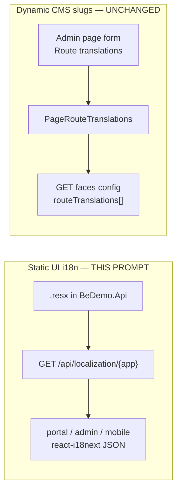
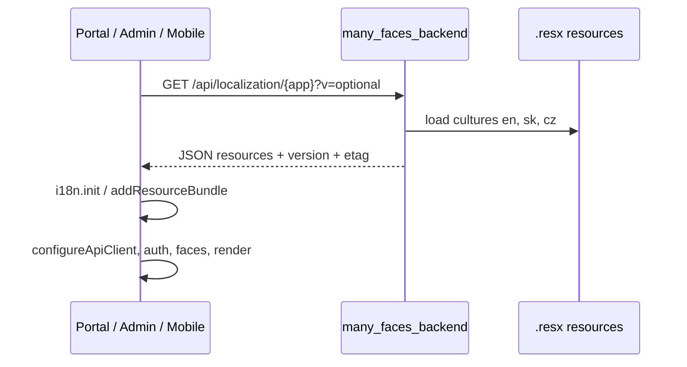

# Centralized static UI i18n (.resx on backend, JSON at clients) — Agent prompt

**Language:** All **new** prose you add to repositories (README, guides, comments in new code, PR description) must be **English**.

**Mission:** Move **static UI translations** (labels, buttons, validation copy, app-level `routes.*` URL segments for React Router) from **bundled JSON inside each frontend** into **`many_faces_backend`** as the **single source of truth**, stored in the **idiomatic .NET format** (`.resx` resource files). On startup, **`many_faces_portal`**, **`many_faces_admin`**, and **`many_faces_mobile`** must perform an **initial HTTP GET** for their app-specific bundle **before** the rest of app configuration/render, receive **JSON**, and hydrate **react-i18next** exactly as today (same keys, same `common` namespace, same `en` / `sk` / `cz` language codes).

**Critical scope boundary — CMS dynamic route translations stay in PostgreSQL:**

| In scope (this prompt)                                                                      | **Out of scope — do not remove or redesign**                                             |
| ------------------------------------------------------------------------------------------- | ---------------------------------------------------------------------------------------- |
| Static strings in `src/i18n/locales/*.json` (portal/admin) and mobile `src/i18n/locales/**` | **`PageRouteTranslations`** table, entity, EF configuration                              |
| App menu `routes.*` keys used by `routeTranslations.ts` utilities                           | **`GET/PUT /api/pages/{pageId}/translations`**                                           |
| Backend export API `GET /api/localization/{app}`                                            | Admin **Create/Edit Page** “Route translations” form section                             |
| CI key-parity across `en`/`sk`/`cz` for static bundles                                      | `routeTranslations` array on each page in **faces config** (`FacesController`)           |
|                                                                                             | Portal **`buildFacePagePaths`**, **`faceWallPage.ts`** behavior driven by API page slugs |

**(required)** Read **§1** (as-is) and **§2** (non-goals) before coding; complete **§15** master checklist while implementing; ship **§14** documentation with the PR.

**Related conventions today:** [`docs/guides/i18n-conventions.md`](../guides/i18n-conventions.md) (will need a major update in §14).

**Non-goals:**

- Changing **mailer** Java `ResourceBundle` email template i18n (separate worker).
- Localizing **backend exception messages** returned as API `error` strings (separate follow-up; not part of this prompt).
- A cross-app **`SharedResources.resx`** merged into portal/admin/mobile exports — **forbidden**; keep **separate** `PortalResources`, `AdminResources`, `MobileResources` even when keys duplicate (e.g. login copy).
- Removing or migrating **`PageRouteTranslations`** to static files.
- Operator-editable static strings in admin UI (static copy remains developer-maintained `.resx` in git).
- Adding languages beyond **`en`**, **`sk`**, **`cz`** unless product asks (design API to allow more later).
- Refactoring **`fe_demo`** / **`admin_demo`** legacy trees in the monorepo root (only **`many_faces_portal`**, **`many_faces_admin`**, **`many_faces_mobile`**, **`many_faces_backend`**).

---

## 0. Compliance — read every part (**required**)

### 0.1 Labels

| Label                           | Meaning                                                                   |
| ------------------------------- | ------------------------------------------------------------------------- |
| **(required)**                  | Must be satisfied before merge, or explicitly deferred in PR with reason. |
| **(required — if _condition_)** | Mandatory when _condition_ is true.                                       |
| **(optional)**                  | Skip only with written deferral.                                          |

### 0.2 Section coverage (**required** — copy into PR)

| §        | Topic                                  | Status (✓ / N/A) | If N/A, reason |
| -------- | -------------------------------------- | ---------------- | -------------- |
| **§1**   | As-is audit                            |                  |                |
| **§2**   | Scope boundary (CMS DB preserved)      |                  |                |
| **§3**   | Target architecture                    |                  |                |
| **§4**   | Backend `.resx` layout + services      |                  |                |
| **§5**   | Localization HTTP API                  |                  |                |
| **§6**   | Portal bootstrap                       |                  |                |
| **§7**   | Admin bootstrap                        |                  |                |
| **§8**   | Mobile bootstrap                       |                  |                |
| **§9**   | Culture `cz` vs `cs` (API alias)       |                  |                |
| **§3.4** | Face-prefix exempt `/api/localization` |                  |                |
| **§4.5** | Rate limiting `localization-read`      |                  |                |
| **§4.6** | Dev watch / restart workflow           |                  |                |
| **§10**  | CI + key parity                        |                  |                |
| **§11**  | Tests                                  |                  |                |
| **§12**  | Anti-patterns                          |                  |                |
| **§13**  | Phased delivery / PR split             |                  |                |
| **§14**  | Documentation                          |                  |                |
| **§15**  | Master checklist                       |                  |                |

---

## 1. As-is audit — what exists today (**required**)

### 1.1 Static UI i18n (in scope to centralize)

| App                     | Location                                           | Approx. size        | Load mechanism                                                                                        |
| ----------------------- | -------------------------------------------------- | ------------------- | ----------------------------------------------------------------------------------------------------- |
| **`many_faces_admin`**  | `src/i18n/locales/{en,sk,cz}.json`                 | ~570 lines / locale | **Static import** in `src/i18n/config.ts` — full bundle in initial JS                                 |
| **`many_faces_portal`** | `src/i18n/locales/{en,sk,cz}.json`                 | ~390 lines / locale | **Lazy** `import()` per language in `src/i18n/config.ts`; `main.tsx` calls `initI18n()` before render |
| **`many_faces_mobile`** | `src/i18n/locales/en/{common,login,register}.json` | small               | **Static import** in `src/i18n/index.ts`; **only English** today for `sk`/`cz`                        |

**Usage patterns:**

- Portal: `useTranslation('common')` and **`useApp()` from `src/contexts/AppContext.tsx`** (wraps `t`); `src/utils/routeTranslations.ts` for static app routes; `supportedLanguages` in `src/i18n/constants.ts`.
- Admin: `useTranslation('common')` across pages; `src/utils/routeTranslations.ts`; `useAdminRoutePaths` builds multi-language path lists from `routes.*` keys (includes e.g. `registrationInvites`).
- Mobile: `useTranslation('register')`, `i18next.t('common:...')` in navigator; **`intlayer`** packages in `package.json` but **not** used in `src/` — do not expand Intlayer in this project unless product reopens it.

**Important — source JSON is nested, not flat:**

- Today’s locale files are **nested objects** (e.g. `{ "pages": { "login": { "title": "..." } } }`), not a single flat map of dotted keys.
- **(required)** One-time migration must **flatten** nested JSON → dotted `.resx` `name` attributes (e.g. `pages.login.title`), then the API **un-flattens** back to nested JSON for i18next (see §4.2).

### 1.2 Dynamic CMS route translations (out of scope — preserve)

| Piece                             | Role                                                                                                             |
| --------------------------------- | ---------------------------------------------------------------------------------------------------------------- |
| **Table** `PageRouteTranslations` | Per-`Page` slug per `LanguageCode` (`en`, `sk`, `cz`)                                                            |
| **Model** `PageRouteTranslation`  | `TranslatedRoute` string (max 200)                                                                               |
| **API**                           | `GET/PUT /api/pages/{pageId}/translations` in `PagesController`                                                  |
| **Admin UI**                      | `CreatePagePage`, `EditPagePage` — manual inputs + `usePageRouteTranslationsApi` / `updatePageRouteTranslations` |
| **Faces config**                  | `FacesController` embeds `routeTranslations` on each page                                                        |
| **Portal**                        | `buildFacePagePaths` / `faceWallPage.ts` consume API data                                                        |

**(required)** Agent must **grep** before merge and confirm **no** deletion of the above surfaces.

### 1.3 Backend today

- **No** `AddLocalization`, **no** `.resx`, **no** `IStringLocalizer` usage found in `many_faces_backend` at prompt authoring time.
- Static strings for APIs are mostly inline English or ad hoc.

---

## 2. Scope boundary — CMS vs static (**required**)



| Question                                               | Answer for this engagement                                                                       |
| ------------------------------------------------------ | ------------------------------------------------------------------------------------------------ |
| Remove `PageRouteTranslations` from DB?                | **No**                                                                                           |
| Remove admin route-translation inputs?                 | **No**                                                                                           |
| Change faces config shape?                             | **No** (unless additive unrelated fields)                                                        |
| Move static `routes.login` to DB?                      | **No** — stays in `.resx` / localization API                                                     |
| Portal still registers multiple paths per CMS page?    | **Yes** — from API `routeTranslations`                                                           |
| Hardcoded guest path `register/complete` (email link)? | **Unchanged** — e.g. `languageRouteElements.tsx`; only **copy** around it comes from static i18n |

---

## 3. Target architecture (**required**)

### 3.1 Sequence — client startup



**(required)** Localization fetch runs **before**:

| App    | Today’s “config” step that must come **after** i18n                                                                                                                                                                                                                                                |
| ------ | -------------------------------------------------------------------------------------------------------------------------------------------------------------------------------------------------------------------------------------------------------------------------------------------------- |
| Portal | Today: sync `configureApiClient()` then async `initI18n()`. **Target order:** `validateEnv` → **localization GET** (see §3.4) → `initI18n` from response → **`resetLangLevelStaticRouteSegmentsCache()`** (`faceApiRouting.ts` depends on loaded `routes.*`) → `configureApiClient` → `createRoot` |
| Admin  | `import './i18n/config'` side-effect — **remove**; async bootstrap in `main.tsx` (localization → i18n → `configureApiClient` → `setupAxiosInterceptors` → render)                                                                                                                                  |
| Mobile | `App.tsx` render — block on fetch in `src/i18n/index.ts` (or entry) before `I18nextProvider`                                                                                                                                                                                                       |

### 3.2 Single source of truth

| Layer           | Format                                                                             | Consumers       |
| --------------- | ---------------------------------------------------------------------------------- | --------------- |
| **Authoring**   | `.resx` + culture-specific `.sk.resx`, `.cz.resx` under `BeDemo.Api/Localization/` | Developers, CI  |
| **Wire**        | JSON nested objects matching today’s i18next tree                                  | Browsers / Expo |
| **Runtime CMS** | PostgreSQL `PageRouteTranslations`                                                 | Unchanged       |

### 3.3 App identifiers

| `{app}` path segment | Resource class / folder | Source JSON today                                                                                      |
| -------------------- | ----------------------- | ------------------------------------------------------------------------------------------------------ |
| `portal`             | `PortalResources`       | `many_faces_portal/src/i18n/locales/*.json`                                                            |
| `admin`              | `AdminResources`        | `many_faces_admin/src/i18n/locales/*.json`                                                             |
| `mobile`             | `MobileResources`       | `many_faces_mobile/src/i18n/locales/en/*.json` (merge into one logical `common` + namespaces — see §8) |

**(required — no shared bundle)** Do **not** introduce `SharedResources.resx` or a merged `shared` namespace in the API response. Each `{app}` loads **only** its own `.resx` tree. Duplicate keys across portal/admin (e.g. `pages.login.*`) are **accepted**; keep naming aligned manually per [`i18n-conventions.md`](../guides/i18n-conventions.md).

### 3.4 Face-prefix routing — localization must be exempt (**required**)

Browser clients today call most APIs as `/{facePrefix}/api/...`. Bare `/api/...` (without face prefix) returns **400** from `RoutingMiddleware` unless the path is **system-exempt**.

| Layer              | File                                                          | Action                                                                                                                                         |
| ------------------ | ------------------------------------------------------------- | ---------------------------------------------------------------------------------------------------------------------------------------------- |
| **Backend**        | `BeDemo.Api/Utils/Routing.cs` → `ExemptPathPrefixes`          | Add **`/api/localization`** (prefix match, same pattern as `/api/oauth2`) so `GET /api/localization/{app}` works **without** `/{face}/` prefix |
| **Portal**         | `src/api/faceApiRouting.ts` → `isApiPathExemptFromFacePrefix` | Add **`/api/localization`** so axios/fetch does not prepend face segment                                                                       |
| **Admin / mobile** | API client helpers                                            | Same rule if they use face-prefix rewriting                                                                                                    |

**(required)** Integration test: `GET /api/localization/portal` with **no** face prefix returns **200** (not 400).

**Alternative (discouraged):** `GET /{publicFace}/api/localization/portal` — only if product insists; exempt list is simpler and matches OAuth.

### 3.5 Language switch after startup

- **(required)** Single GET returns **all** of `en`, `sk`, `cz` in one payload.
- `i18n.changeLanguage(lng)` must **not** trigger another localization HTTP call.
- Portal `ensureLanguageLoaded(lng)` becomes a no-op (or only checks bundle presence) once all languages are preloaded.

---

## 4. Backend implementation — `.resx` + services (**required**)

### 4.1 Project layout (illustrative)

```
BeDemo.Api/
  Localization/
    Portal/
      PortalResources.resx          # default neutral / en
      PortalResources.sk.resx
      PortalResources.cs.resx       # Czech — see §9 (API key still "cz")
    Admin/
      AdminResources.resx
      AdminResources.sk.resx
      AdminResources.cs.resx
    Mobile/
      MobileResources.resx
      MobileResources.sk.resx
      MobileResources.cs.resx
```

- Use **one public marker class per app** (e.g. `PortalResources` in `Localization/Portal/`) with culture-specific satellites — **not** a single ambiguous `ResourcesPath` for all apps unless you implement a custom factory.
- Typical pattern: `IStringLocalizer<PortalResources>` + `AddLocalization()`; embed `.resx` as `EmbeddedResource` in `BeDemo.Api.csproj`.
- Register in `Program.cs`:

```csharp
builder.Services.AddLocalization();
builder.Services.AddSingleton<ILocalizationBundleService>(); // name illustrative
```

### 4.2 Key naming convention

- **Preserve** today’s i18next key paths (`t('pages.login.title')` unchanged).
- **Authoring:** nested frontend JSON → **flatten** to dotted `.resx` names (`pages.login.title`).
- **Serving:** flat `.resx` entries → **unflatten** to nested JSON for i18next (`{ pages: { login: { title } } }`).

**(required)** Implement **`ResourceJsonFlattener`** (unflatten to nested JSON) with unit tests for:

- [ ] Single segment keys
- [ ] Deep nesting (3+ levels)
- [ ] Keys that share prefixes (`pages.login` vs `pages.login.title`) — **forbid ambiguous keys in CI**

### 4.2.1 One-time migration script (**required**)

- [x] Add `scripts/migrate-locale-json-to-resx.mjs` (or similar) that reads each `src/i18n/locales/**/*.json` and emits `.resx` per app/culture. _(Delivered; one-off script removed from monorepo after migration.)_
- [ ] Preserve `{{count}}`, `{{name}}`, etc. — XML-escape `&`, `<`, `>` in `.resx` values.
- [ ] PR includes generated `.resx` + spot-check diff against legacy JSON via golden test (§11.1).

### 4.2.2 Interpolation and special characters

- i18next interpolation uses `{{variable}}` — must survive `.resx` XML and round-trip unchanged.
- Apostrophes and newlines: use `xml:space="preserve"` where needed.

### 4.3 Caching and versioning

| Mechanism                    | Requirement                                                                                                   |
| ---------------------------- | ------------------------------------------------------------------------------------------------------------- |
| **In-memory cache**          | Build nested JSON once per app at first request (or at startup)                                               |
| **`version` field**          | String in response — hash of all `.resx` files for that app, or `AssemblyInformationalVersion` + content hash |
| **`ETag` / `If-None-Match`** | **(optional)** — return 304 when unchanged                                                                    |
| **`Cache-Control`**          | **(optional)** `public, max-age=300` for anonymous bundle (dev may use `no-cache`)                            |
| **Config override**          | `Localization:Version` in appsettings for forced bust in dev                                                  |
| **Client cache**             | `localStorage` key e.g. `i18nBundle:{app}:version` — skip GET when `version` matches **(optional)**           |

### 4.4 Authorization

- Endpoint is **anonymous** (**required**) so login/register/guest pages have strings before OAuth token exists.
- Do **not** require API key or Bearer token for read.

### 4.5 Rate limiting (**required**)

Anonymous localization is callable on every cold load (portal + admin + mobile). Apply a **dedicated** ASP.NET rate-limit policy so abuse cannot megabyte-scrape all apps in a tight loop, without blocking normal UX (one GET per app per session).

| Requirement     | Detail                                                                                                                                                                         |
| --------------- | ------------------------------------------------------------------------------------------------------------------------------------------------------------------------------ |
| **Policy name** | e.g. `localization-read` (new — do not overload `oauth-register`)                                                                                                              |
| **Partition**   | Client IP (`RemoteIpAddress`) — same pattern as `oauth-token` / `oauth-register` in `Program.cs`                                                                               |
| **Algorithm**   | Fixed window                                                                                                                                                                   |
| **Defaults**    | e.g. **120 requests / 60 seconds / IP** (generous for dev HMR + retries); tune via config                                                                                      |
| **Config keys** | `Localization:RateLimitPermitLimit`, `Localization:RateLimitWindowSeconds` in `appsettings` (+ `appsettings.Development.json`)                                                 |
| **Testing env** | When `ASPNETCORE_ENVIRONMENT=Testing` and existing OAuth bypass flags apply, allow high permit limit (mirror `oauth-register` bypass pattern) so integration tests stay stable |
| **Controller**  | `[EnableRateLimiting("localization-read")]` on `LocalizationController` (or equivalent)                                                                                        |
| **Response**    | **429** with existing global JSON shape `{"error":"rate_limit",...}` and `Retry-After` header (already configured in `AddRateLimiter` `OnRejected`)                            |

- [x] Integration test: exceeding limit returns **429** (`LocalizationRateLimit429Tests`, `RateLimitedLocalizationWebApplicationFactory`).

- [x] Document limits in `01-features-running-and-api.md` and [`static-localization-and-i18n.md`](../guides/static-localization-and-i18n.md).

### 4.6 Dev watch — refreshing bundles locally (**required** for developer UX)

`.resx` edits do **not** hot-reload into an already-built `ILocalizationBundleService` cache unless the running API process reloads them.

| Scenario                 | Expected behavior                                                                                                                                                                                  |
| ------------------------ | -------------------------------------------------------------------------------------------------------------------------------------------------------------------------------------------------- |
| **Edit `.resx` on disk** | Developer **restarts** `many_faces_backend` (or `dotnet watch run` on `BeDemo.Api`) so embedded resources / file provider reloads                                                                  |
| **In-memory cache**      | `ILocalizationBundleService` must expose **cache invalidation** when `IHostEnvironment.IsDevelopment()` and files change, **or** document that restart is mandatory (minimum: restart)             |
| **`version` / ETag**     | After backend reload, `version` hash **must change** so clients refetch (bust `localStorage` cache when version differs)                                                                           |
| **Frontends**            | Portal/admin Vite HMR does **not** refresh i18n strings from backend — after `.resx` change: restart BE → hard refresh browser (or clear `localStorage` i18n version keys)                         |
| **Optional enhancement** | `dotnet watch` + `IOptionsMonitor<LocalizationOptions>` or `PhysicalFileProvider` watching `Localization/**/*.resx` in Development only — if implemented, document in `static-localization-api.md` |

**(required)** Add a short **“Editing copy in dev”** subsection to updated `i18n-conventions.md`:

1. Edit `BeDemo.Api/Localization/{App}/*.resx`
2. Run parity script if needed
3. Restart backend (or rely on watch if implemented)
4. Hard refresh SPA / restart Expo — confirm new `version` in network tab

**(optional)** `scripts/localization-dev-bump.sh` that touches `Localization:Version` in dev config — only if team wants without full restart (still prefer hash from file content).

---

## 5. Localization HTTP API (**required**)

### 5.1 Route

```
GET /api/localization/{app}
```

| Parameter | Values                                             |
| --------- | -------------------------------------------------- |
| `app`     | `portal` \| `admin` \| `mobile` (case-insensitive) |

| Query | Purpose                                                                                |
| ----- | -------------------------------------------------------------------------------------- |
| `v`   | Client-known version; if matches server `version`, may return **304** (if implemented) |

### 5.2 Response shape (illustrative)

```json
{
  "app": "portal",
  "version": "a1b2c3d4",
  "defaultNamespace": "common",
  "supportedLanguages": ["en", "sk", "cz"],
  "resources": {
    "en": {
      "common": { "routes": { "login": "login" }, "pages": {} }
    },
    "sk": { "common": {} },
    "cz": { "common": {} }
  }
}
```

**Mobile:** if today uses namespaces `common`, `login`, `register`, either:

- **A (recommended):** return all three namespaces per language in `resources[lang]` (matches current `ns` array), or
- **B:** merge into single `common` and update mobile call sites — only if parity test proves no missing keys.

### 5.3 Errors

| Status | When                                                           |
| ------ | -------------------------------------------------------------- |
| `404`  | Unknown `app`                                                  |
| `500`  | Missing culture file / empty bundle — log and fail fast in dev |

### 5.4 OpenAPI / integration

- [ ] Document in `many_faces_backend/docs/reference/01-features-running-and-api.md`
- [ ] **(optional)** Add to OpenAPI spec if project exports public contract for FE

---

## 6. Portal changes (`many_faces_portal`) (**required**)

### 6.1 Bootstrap

- [ ] Add `fetchLocalizationBundle('portal')` — uses `env.apiUrl` from `src/config/env.ts` (absolute backend base URL)
- [ ] Call **`/api/localization/portal`** on exempt path (§3.4) — `fetch` or axios **before** face-prefix interceptor rewrites
- [ ] Replace dynamic `import('./locales/${lng}.json')` in `src/i18n/config.ts` with bundle from server
- [ ] One GET loads **all** `en`/`sk`/`cz`; `ensureLanguageLoaded` only verifies bundle presence (§3.5)
- [ ] After i18n init, call **`resetLangLevelStaticRouteSegmentsCache()`** before any API call that depends on `faceApiRouting.ts`
- [ ] Update `main.tsx` initialization comment block (steps 1–4) to match §3.1
- [ ] **Delete** `src/i18n/locales/en.json`, `sk.json`, `cz.json` after migration verified

### 6.2 Unchanged behavior

- [ ] `src/utils/routeTranslations.ts` — still uses `t('routes.*')` from loaded bundle
- [ ] `buildFacePagePaths` / face config — **no change** to CMS `routeTranslations`
- [ ] `useLocalizedLink`, `LanguageRouter`, language switcher

### 6.3 UX

- [ ] Loading shell or spinner until localization OK (**required** for first paint)
- [ ] On fetch failure: show actionable error + retry; **(optional)** fallback to minimal embedded `en` subset

### 6.4 Verification

- [ ] `yarn lint`, `tsc`, unit tests
- [ ] Manual: switch `sk`/`cz`, confirm routes (`/sk/prihlasenie` etc.) still work
- [ ] Manual: open CMS page with DB route translations — URLs still resolve

### 6.5 Dev / CORS (**required — if fetch fails in browser**)

- Portal/admin use absolute `env.apiUrl` / `VITE_API_URL` pointing at the backend host (not only Vite `server.proxy` unless you add an explicit `/api` proxy rule).
- Backend `Cors:Origins` must include portal/admin dev origins (existing `AddCors` in `Program.cs`).
- Localization `fetch` from `https://localhost:9081` → `https://localhost:8001` (example) must pass CORS preflight if cross-origin.

---

## 7. Admin changes (`many_faces_admin`) (**required**)

### 7.1 Bootstrap

- [ ] Remove side-effect `import './i18n/config'` from `main.tsx`
- [ ] Async bootstrap: localization GET → `i18n.init` → `configureApiClient` → render (align with §3.1)
- [ ] **Delete** `src/i18n/locales/*.json` after migration

### 7.2 Preserve CMS forms

- [ ] `CreatePagePage` / `EditPagePage` route translation section **unchanged** functionally
- [ ] `usePageRouteTranslationsApi.ts` **unchanged**
- [ ] i18n keys `pages.createPage.routeTranslations*` remain in **Admin** `.resx`

### 7.3 Performance note

- Today admin loads **all** locales in initial bundle — after change, one HTTP GET may be **smaller** than JS bundle duplication; record size in PR **(optional)**.

### 7.4 Verification

- [ ] `yarn lint`, `yarn validate` if present
- [ ] Create page with `sk`/`cz` route slugs → still persisted via PUT translations API

---

## 8. Mobile changes (`many_faces_mobile`) (**required**)

> **Status (2026-05-16):** Bootstrap via `Bootstrap.tsx` → `initI18n()` loads **`GET /api/localization/mobile`** (`en`/`sk`/`cz`). **First launch:** `expo-localization` + `mapLocaleTagToSupportedLanguage` when `i18nextLng` absent; **settings `LanguageSwitcher`** overrides and persists.

### 8.1 Bootstrap

- [x] `GET /api/localization/mobile` before `App` render (`src/Bootstrap.tsx`).
- [x] Hydrate `common`, `login`, `register` namespaces from response (`src/i18n/index.ts`).
- [x] **`sk`** and **`cz`** in API bundle; device locale maps `cs`→`cz` on first launch.

### 8.2 Cleanup

- [ ] Remove unused **`intlayer`** / `@intlayer/sync-json-plugin` from `package.json` if still unused after migration **(optional)** — only when nothing references them
- [ ] Delete local `src/i18n/locales/en/*.json` after migration

### 8.3 Offline / Expo

- [ ] Cache last good bundle in `AsyncStorage` keyed by `version` **(optional)**
- [ ] Document `EXPO_PUBLIC_API_URL` must point at backend for first launch

### 8.4 Verification

- [x] `yarn lint`, `yarn typecheck`, `yarn test` (`yarn validate` on `main`).
- [x] Register/login copy available in `sk`/`cz` via API bundle; language switcher + device locale on first launch.

---

## 9. Culture codes — `cz` vs `cs` (**required**)

Frontends and CMS DB use **`cz`** as the language code (`supportedLanguages`, `PageRouteTranslation.LanguageCode`, mailer locale in many flows). **ISO 639-1 for Czech is `cs`, not `cz`** — .NET satellite assemblies normally use valid cultures.

| Layer                       | Recommended rule                                                                                          |
| --------------------------- | --------------------------------------------------------------------------------------------------------- |
| **`.resx` satellite files** | Name files `PortalResources.sk.resx` and **`PortalResources.cs.resx`** (or `cs-CZ`) — valid `CultureInfo` |
| **API JSON keys**           | Expose **`cz`** (not `cs`) under `resources` so clients need **zero** renames                             |
| **Loader**                  | When building `cz` bundle, read from `CultureInfo("cs")` or `"cs-CZ"` resources, emit under key `"cz"`    |
| **CMS DB**                  | **Do not** rename `LanguageCode` values (`cz` stays `cz`)                                                 |

**(required)** Do **not** call `CultureInfo.GetCultureInfo("cz")` — it is not a standard culture and may throw. Map explicitly in `ILocalizationBundleService`.

**(optional)** Register custom `CultureInfo` named `cz` only if the team prefers `.cz.resx` filenames — document pitfalls; **recommended path is `cs` resx + `cz` API alias**.

---

## 10. CI and key parity (**required**)

### 10.1 Script (location flexible)

- [ ] `scripts/verify-localization-key-parity.mjs` or `BeDemo.Api.Tests/LocalizationKeyParityTests.cs`
- [ ] For each app: same set of keys in `en`, `sk`, `cz` `.resx`
- [ ] Fail CI on missing or empty values
- [ ] **(optional)** Compare exported JSON key count against legacy frontend JSON snapshot during transition only

### 10.2 Wire into monorepo CI

- [ ] Parent `ci.yml` or backend test job runs parity check
- [ ] Document command in `docs/guides/testing-and-ci-matrix.md` **(§14)**

---

## 11. Tests (**required**)

### 11.1 Backend

- [ ] `LocalizationControllerTests` — `portal`/`admin`/`mobile` return 200 + expected keys sample
- [ ] **`GET /api/localization/portal` without face prefix** returns 200 (routing exempt §3.4)
- [x] Rate limit: excess requests → **429** §4.5 (`LocalizationRateLimit429Tests`)
- [ ] Snapshot or golden-file test: exported JSON for one key path matches legacy `en.json` subtree (portal sample)
- [ ] `ResourceJsonFlattenerTests` — nesting edge cases
- [ ] Unknown app → 404
- [ ] **Regression:** `PagesController` `GET/PUT …/translations` and any `PageRouteTranslation` tests still pass — **do not delete**

### 11.2 Frontends

- [ ] Portal: mock localization API in tests that bootstrap i18n; update any test importing `locales/en.json`
- [ ] Admin: same
- [ ] Mobile: `RegisterScreen.test.tsx` — provide i18n via fetched bundle or test helper

### 11.3 Manual acceptance

- [ ] Portal login/register in `en`/`sk`/`cz`
- [ ] Admin dashboard + create page **with DB route translations**
- [ ] Mobile register screens
- [ ] DevTools: only **one** localization GET per app load (or documented cache hit)

---

## 12. Anti-patterns (**required** — do not)

- [ ] **Do not** drop `PageRouteTranslations` table or admin CMS fields.
- [ ] **Do not** store static UI strings in PostgreSQL.
- [ ] **Do not** require authentication for `GET /api/localization/*`.
- [ ] **Do not** change CMS `routeTranslations` JSON shape on faces config without product approval.
- [ ] **Do not** leave duplicate `src/i18n/locales/*.json` in frontends after migration (stale source of truth).
- [ ] **Do not** break `getAllRouteTranslations` / localized React Router matching for **static** routes.
- [ ] **Do not** add a shared `SharedResources.resx` or merge portal/admin/mobile into one static bundle.
- [ ] **Do not** add Cursor / agent attribution trailers to git commits (repo rule).

---

## 13. Phased delivery (**recommended**)

| Phase | PR focus                                                                | Merge gate                                     |
| ----- | ----------------------------------------------------------------------- | ---------------------------------------------- |
| **1** | Backend `.resx` + migration from current JSON + API + tests + CI parity | Backend tests green; Postman/curl returns JSON |
| **2** | Portal fetch bootstrap + delete local JSON                              | Portal lint/tsc/tests + manual routes          |
| **3** | Admin fetch bootstrap + delete local JSON                               | Admin lint + create page with DB slugs         |
| **4** | Mobile fetch + `sk`/`cz` + delete local JSON                            | Mobile lint/tests                              |
| **5** | Docs + monorepo hub + submodule bumps                                   | §14 complete                                   |

**(required)** Each phase leaves **`main`** deployable; phase 1 can ship with frontends still on JSON until phase 2–4 land.

---

## 14. Documentation (**required**)

Documentation is part of definition of done — not a follow-up PR. Canonical user-facing doc: **[`docs/guides/static-localization-and-i18n.md`](../guides/static-localization-and-i18n.md)** (create or refresh in phase 5 / doc-only PR if not already present).

### 14.1 Canonical monorepo guide — [`static-localization-and-i18n.md`](../guides/static-localization-and-i18n.md) (**required**)

**(required)** Guide must be **English** and include **all** sections below. Use Mermaid syntax consistent with other guides (no spaces in node IDs; quoted labels if needed).

| Section                     | Required content                                                                                                                |
| --------------------------- | ------------------------------------------------------------------------------------------------------------------------------- |
| **Two systems**             | Table + Mermaid: static UI (`.resx` → API → i18next) vs CMS `PageRouteTranslations` (admin → DB → faces config → portal routes) |
| **Languages**               | `en`, `sk`, `cz`                                                                                                                |
| **Static — authoring**      | Per-app `.resx` under `BeDemo.Api/Localization/`; **no** `SharedResources.resx`                                                 |
| **Static — API**            | `GET /api/localization/{app}`, anonymous, rate limit, `version`, sample JSON                                                    |
| **Static — client startup** | Mermaid sequence: GET before render; portal `resetLangLevelStaticRouteSegmentsCache`                                            |
| **Static — `routes.*`**     | `routeTranslations.ts` / localized React Router; note hardcoded paths like `register/complete`                                  |
| **CMS dynamic**             | Admin forms, `GET/PUT …/translations`, faces config shape, `buildFacePagePaths` — **unchanged**                                 |
| **Face-prefix exempt**      | `/api/localization` alongside `/api/oauth2`                                                                                     |
| **`cz` vs `cs`**            | API keys `cz`, `.resx` satellites `cs`                                                                                          |
| **Dev workflow**            | Restart backend after `.resx` edit; hard refresh SPA; link §4.6                                                                 |
| **Transitional note**       | Until rollout done, `src/i18n/locales/*.json` may still exist                                                                   |
| **Per-app pointers**        | Links to portal/admin `src/i18n/README.md` and mobile bootstrap                                                                 |

### 14.2 Update [`docs/guides/i18n-conventions.md`](../guides/i18n-conventions.md) (**required**)

Short pointer doc only — link to **`static-localization-and-i18n.md`** and this prompt; do not duplicate full Mermaid there.

### 14.3 `docs/README.md` hub (**required**)

- [ ] Under **Product domains** (or **Onboarding**): row for [`static-localization-and-i18n.md`](../guides/static-localization-and-i18n.md) — static + CMS i18n, Mermaid, per-app links.
- [ ] Update [`i18n-conventions.md`](../guides/i18n-conventions.md) row blurb to “pointer → static-localization-and-i18n”.
- [ ] Under **prompts** table: link this prompt file.

### 14.4 Backend docs (**required**)

- [ ] `many_faces_backend/docs/reference/01-features-running-and-api.md` — localization endpoint + rate limit + **face-prefix exempt**
- [ ] `many_faces_backend/docs/reference/02-routing-config-and-workflow.md` — add `/api/localization` to exempt list
- [ ] `many_faces_backend/README.md` — subsection “Localization” → monorepo guide + `Localization/` folder

### 14.5 Submodule READMEs — portal, admin, mobile (**required**)

Each app README must gain or refresh an **Internationalization (i18n)** subsection that:

- [ ] Links **[`docs/guides/static-localization-and-i18n.md`](../../docs/guides/static-localization-and-i18n.md)** (monorepo-relative path from submodule).
- [ ] States **`GET /api/localization/{app}`** with `{app}` = `portal` | `admin` | `mobile`.
- [ ] Distinguishes **static UI** (backend `.resx`) from **CMS route translations** (admin page form + DB).
- [ ] Points to local `src/i18n/README.md` (portal/admin) or `src/i18n/index.ts` (mobile) for code entrypoints.
- [ ] Removes or marks deprecated “add JSON under `src/i18n/locales`” as **transitional** only.

| Submodule | File                          | Extra                                                                |
| --------- | ----------------------------- | -------------------------------------------------------------------- |
| Portal    | `many_faces_portal/README.md` | Mention `routeTranslations.ts`, `faceApiRouting` exempt              |
| Admin     | `many_faces_admin/README.md`  | Mention Create/Edit Page route translation fields                    |
| Mobile    | `many_faces_mobile/README.md` | Namespaces `common`, `login`, `register`; `EXPO_PUBLIC_API_BASE_URL` |

### 14.6 Submodule `src/i18n/README.md` — portal & admin (**required**)

- [ ] Replace “Adding New Languages → create JSON in locales/” with link to monorepo guide + backend `.resx` workflow.
- [ ] Keep **usage** examples (`useTranslation`, interpolation) — still valid.
- [ ] Note: bundled `locales/*.json` removed after rollout (if applicable when editing).

### 14.7 Root `README.md` (**optional**)

- [ ] One sentence under documentation links pointing to static localization guide (if root README lists guides).

---

## 15. Master checklist — implementing agent

### Audit & scope

- [ ] §1 as-is confirmed in PR (file paths + line counts approximate).
- [ ] Grep proves **`PageRouteTranslations`** + page translation APIs **still present** after all work.
- [ ] PR explicitly states: **static only**; CMS dynamic unchanged.

### Backend — `.resx` + export

- [ ] `Localization/` tree with `Portal`, `Admin`, `Mobile` resources.
- [x] `scripts/migrate-locale-json-to-resx.mjs` (or equivalent) run; keys match nested JSON §4.2. _(Script removed post-migration; `.resx` is source of truth.)_
- [ ] `AddLocalization` + bundle service + JSON un-flattener.
- [ ] `GET /api/localization/{app}` anonymous, returns `en`/`sk`/`cz`.
- [ ] **`/api/localization` added to `Routing.ExemptPathPrefixes`** §3.4.
- [ ] `version` field populated; in-memory cache.
- [ ] Culture `cz` API alias from `cs` satellites per §9.
- [x] Rate limit policy `localization-read` + config + 429 test §4.5.
- [ ] Dev watch / restart workflow documented §4.6.
- [ ] Backend unit/integration tests §11.1 green.

### CI

- [ ] Key parity `en`/`sk`/`cz` per app enforced in CI §10.

### Portal

- [ ] Initial localization GET before render §6.
- [ ] `faceApiRouting.ts` exempt + `resetLangLevelStaticRouteSegmentsCache()` after i18n §6.1.
- [ ] Local `src/i18n/locales/*.json` removed.
- [ ] Static `routes.*` + `routeTranslations.ts` work.
- [ ] CMS multi-path routes from API unchanged §6.2.
- [ ] Guest `register/complete` route still works §2.
- [ ] Lint/tsc/tests §6.4.

### Admin

- [ ] Async bootstrap; no static locale imports §7.
- [ ] Local JSON removed.
- [ ] Create/Edit page **route translations** UI + API unchanged §7.2.
- [ ] Lint/validate §7.4.

### Mobile

- [ ] Initial localization GET §8.
- [ ] `sk`/`cz` bundles served.
- [ ] Local EN JSON removed.
- [ ] Lint/typecheck/Jest §8.4.

### Docs

- [ ] **`docs/guides/static-localization-and-i18n.md`** complete per §14.1 (Mermaid + static vs CMS).
- [ ] `i18n-conventions.md` updated §14.2 (pointer only).
- [ ] `docs/README.md` hub rows §14.3.
- [ ] Backend reference + README §14.4.
- [ ] Portal/admin/mobile **README** §14.5.
- [ ] Portal/admin **`src/i18n/README.md`** §14.6.

### Monorepo integration

- [ ] Submodule commits + parent gitlink bump (if multi-repo PR).
- [ ] PR §0.2 table complete.

### Manual acceptance

- [ ] Portal `en`/`sk`/`cz` UI + static routes.
- [ ] Admin UI + **DB** page route slugs create/edit.
- [ ] Mobile register copy (at least `en`; `sk`/`cz` if selector exists).
- [ ] Network tab: localization called **before** other API traffic on cold load.

---

**End of prompt.**
