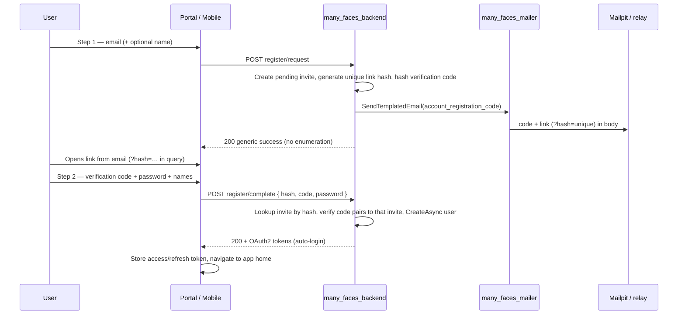

# Email-code registration (link + code) via mailer worker — Agent prompt

**Language:** All **new** prose you add to repositories (README, guides, comments in new code) must be **English**.

**Mission:** Replace today’s **one-shot public registration** (email + password → immediate `ApplicationUser`) with a **two-step, email-gated signup**: user requests signup → receives **mail with a short code and a completion link** → opens the link (and/or enters the code) → **only then** creates the account with password. Route all outbound mail through **`many_faces_mailer`** (`SendTemplatedEmail` over gRPC). **Remove** the legacy ASP.NET Identity **`IEmailSender` HTML bridge** (`MailerGrpcEmailSender` + `MailerIdentityEmailFlowClassifier`). **Do not** implement post-registration “confirm your email” as the primary product flow — that is the wrong model for this task.

**Canonical mail infrastructure (already delivered):** **`many_faces_mailer`**, **`Mail:`** + **`MailerWorkerGrpcClient`**, proto **`manyfaces.mailer.v1`**, guide **[`docs/guides/mailer-local-dev.md`](../guides/mailer-local-dev.md)**. Prior worker prompt: **[`smtp-mailer-java-grpc-worker-agent-prompt.md`](./smtp-mailer-java-grpc-worker-agent-prompt.md)**.

**Proto discipline:** Contract edits only in **`many_faces_proto`** (one nested checkout), push, pin same SHA in all consumers — **[`.cursor/rules/proto-single-source-submodule.mdc`](../../.cursor/rules/proto-single-source-submodule.mdc)**.

**(required)** Read **§1** (as-is audit) and **§2** (admin/dashboard gap) before coding; complete **§14** checklist while implementing; ship **§13** documentation with the PR.

**Non-goals:**

- Bulk marketing email, newsletters.
- Storing rendered MIME/HTML in PostgreSQL.
- Browser/mobile → gRPC to mailer (backend only).
- Reusing **`identity_email_confirm`** copy for “here is your registration code” without new template text (wrong UX).

---

## 0. Compliance — read every part (**required**)

### 0.1 Labels

| Label | Meaning |
| ----- | ------- |
| **(required)** | Must be satisfied before merge, or explicitly deferred in PR with reason. |
| **(required — if _condition_)** | Mandatory when _condition_ is true. |
| **(optional)** | Skip only with written deferral. |

### 0.2 Section coverage (**required** — copy into PR)

| § | Topic | Status (✓ / N/A) | If N/A, reason |
| - | ----- | ---------------- | -------------- |
| **§1** | As-is audit (no code registration today) | | |
| **§2** | Admin / dashboard gap + stance A/B | | |
| **§3** | Target product flow | | |
| **§4** | Data model + backend APIs | | |
| **§5** | Mail service + remove Identity bridge | | |
| **§6** | Mailer templates + catalog | | |
| **§7** | Proto | | |
| **§8** | Portal + mobile UX | | |
| **§9** | Configuration | | |
| **§10** | Tests + Mailpit verification | | |
| **§11** | Deliverables | | |
| **§12** | Anti-patterns | | |
| **§13** | Documentation (monorepo + backend + mailer) | | |
| **§14** | Master checklist | | |

---

## 1. As-is audit — what exists today (**required**)

### 1.1 Public registration is **immediate account creation** (not code-gated)

| Layer | Path / endpoint | Actual behavior |
| ----- | ---------------- | --------------- |
| **Portal** | `many_faces_portal/src/pages/RegisterPage.tsx` | Single form: email, password, firstName, lastName → `OAuth2Service.postApiOauth2Register` → toast “success” → redirect **login**. **No** “check email for code” step. |
| **Mobile** | `many_faces_mobile` `registerUser()` | Same one-shot API. |
| **Backend** | `POST /api/oauth2/register` (`OAuth2Controller.Register`) | `UserManager.CreateAsync` + profiles/face bootstrap → **200** with `userId`. User can log in immediately. **No** mail, **no** pending row, **no** OTP/code. |
| **Legacy** | `POST /api/auth/register` | Same pattern (cookie-era); still no mail. |

**Conclusion:** The product **does not** today implement “email with code + link → then register”. Any assumption otherwise is incorrect — this prompt **introduces** that model.

### 1.2 Mail stack (exists but **not** wired to signup)

| Piece | Role today |
| ----- | ---------- |
| **`IMailerWorkerClient` / `MailerWorkerGrpcClient`** | Correct pattern: gRPC `SendTemplatedEmail`. |
| **`MailerGrpcEmailSender` + `MailerIdentityEmailFlowClassifier`** | Legacy **post-facto** Identity HTML scraper → maps to `identity_email_confirm` / `identity_password_reset`. **Not used** from register path; **delete** in this project. |
| **`AdminMailerTestController`** | Operator smoke with `identity_email_confirm` — keep pattern (direct gRPC + params), not the classifier. |
| **Worker templates** | `identity_email_confirm`, `identity_password_reset` — aimed at **account already exists** flows, **not** “finish signup with this code”. |

### 1.3 Database / domain

- **No** table/entity found for: `RegistrationInvite`, `PendingRegistration`, `SignupCode`, `EmailVerificationCode` (re-verify with `rg` / EF migrations).
- **`ApplicationUser.EmailConfirmed`** exists (Identity column) but is **not** the same as “pending signup”; do not overload it as the pending-state flag without a design note.

### 1.4 APIs missing for target flow

| Needed (target) | Present today |
| --------------- | ------------- |
| Start signup (email only) + send code mail | **No** |
| Complete signup (`hash` from link + verification `code` + password) | **No** |
| Resend code | **No** |
| Admin list/revoke pending invites | **No** |

---

## 2. Admin & dashboard — inspect & gaps (**required**)

### 2.1 What admin **has** today (relevant surfaces)

| Surface | Path / route | Relation to signup |
| ------- | ------------ | ------------------ |
| **Dashboard** | `DashboardPage` — routes via `useAdminRoutePaths` / `AppRoutes.tsx` | KPIs, charts, AI stats strip — **no** registration-invite metrics or pending-signup queue. |
| **Users list / detail** | `UsersPage`, `UserDetailPage` | Lists **existing** users only. |
| **Create user** | `CreateUserPage` | Operator enters email + password → `POST /api/users` (or equivalent) → **instant** user. **Different** from public email-code flow; may remain for break-glass admin provisioning. |
| **Nav** | `AdminLayout` — Dashboard, Users, Faces, Chat (+ Moderation super-admin) | **No** “Registration invites” / “Pending signups”. |
| **Settings** | `SettingsPage` | AI stats mode, etc. — **no** mail/signup policy toggles. |
| **Mailer smoke** | `POST /api/admin/mailer/test-self` | Confirms worker connectivity only. |

### 2.2 What admin **needs** for operator-managed invites (**required — assess scope**)

Pick **one** product stance and document in PR:

| Stance | Admin work |
| ------ | ---------- |
| **A — Public self-serve only** | No new admin pages; optional dashboard widget later. Portal/mobile drive 100% of signups. |
| **B — Operator can invite** (**recommended** for demo/education) | New admin section (see below) + APIs. |

**If stance B (recommended checklist for agent):**

| Item | Description |
| ---- | ----------- |
| **Nav entry** | e.g. “Registration invites” under Users or Settings. |
| **List page** | Table: email, status (`pending` / `completed` / `expired` / `revoked`), created, expires, consumed at, created by. |
| **Create invite** | Form: email, optional first/last name, locale, optional face scope → triggers same mail pipeline as public `request`. |
| **Actions** | Resend (rate-limited), revoke pending, copy completion link (dev only / super-admin). |
| **Dashboard strip (optional)** | Count pending + completed last 24h — reuse stats patterns from `admin-dashboard-stats-and-charts-agent-prompt.md` only if cheap. |

**ACL:** Reuse **`IAccessEvaluator.CanManageAllFaces()`** (or stricter super-admin) for admin invite APIs — align with `AdminMailerTestController`.

### 2.3 Dashboard “not prepared” — explicit deliverable

If no admin UI in v1, PR must state **stance A** and still ship backend + portal. **Do not** leave admin operators only `CreateUserPage` as the implied “registration email” path without documenting the difference.

---

## 3. Target product flow (**required**)

### 3.1 Happy path (self-serve)



### 3.2 Email content (product)

Each signup mail must include **both**:

| Element | Purpose |
| ------- | ------- |
| **`registration_code`** | Short human-readable **verification code** (e.g. **6–8** alphanumeric, uppercase, no ambiguous `0/O`). User copies from email body into the complete-registration form. **Must not** be the same value as the link hash. |
| **`action_link`** | HTTPS URL to portal **complete registration** route with a **unique link hash** in the **query string** (see §3.2.1). |

### 3.2.1 Link hash in URL + code pairing (**required** contract)

The mail link and the verification code work **together** — the backend **never** validates a code without a matching link hash.

| Rule | Detail |
| ---- | ------ |
| **Query param name** | **`hash`** (required, stable contract). Example: `https://portal.example/register/complete?hash=7f3c…` |
| **Uniqueness** | Each pending invite gets a **new cryptographically random** link hash (e.g. 32+ bytes of entropy, URL-safe Base64 or lowercase hex). **One invite ↔ one hash.** |
| **Not in URL** | The human **`registration_code`** must **not** appear in the query string (only in email body + form POST). Reduces leakage via referrers and browser history. |
| **Lookup** | `POST register/complete` and `GET register/prefill` accept **`hash`** (from query on GET, from body on POST). Backend loads the **single** pending `RegistrationInvite` for that hash. |
| **Pairing** | After lookup, backend verifies the submitted **`code`** against **`CodeHash`** on **that same row**. Wrong code for the right hash → generic failure; unknown hash → generic failure. |
| **Resend / rotate** | On resend, issue a **new** `hash` + new verification code (invalidate previous hash) — document in PR. |

**Portal:** On `/register/complete`, read `hash` from `useSearchParams()` (or router equivalent); pass it on every API call together with the code the user typed.

**Mailer `action_link` param:** Built in .NET as `{PortalPublicBaseUrl}{CompleteRegistrationPath}?hash={urlEncodedLinkHash}` — the worker renders it verbatim (`|raw`).

### 3.3 Security rules (**required**)

- **Verification code:** store **only** `CodeHash` (HMAC-SHA256 or SHA-256 with server pepper). Compare with **constant-time** equality. Never store or log plaintext code.
- **Link hash:** generate a **high-entropy opaque** value (≥32 bytes random; URL-safe Base64 or hex). Persist it in column **`LinkHash`** as the **lookup key** (unique index). **Do not** double-hash for lookup unless you have a documented reason — the opaque value is already unguessable.
- **Expiry** (e.g. 15–60 minutes configurable, `ExpiresAtUtc`).
- **Attempt budget:** `FailedAttemptCount` on the invite; after **`RegistrationInvite:MaxAttempts`** wrong codes, treat invite as locked (generic error; optional auto-revoke — document).
- **Single consume** — successful `complete` sets `ConsumedAtUtc`; second complete with same hash → generic error.
- **Concurrency** — `complete` in a DB transaction: re-read invite row, verify not consumed/expired/revoked, then create user (prevents double-submit races).
- **Rate limit** — apply existing **`oauth-register`** policy (and/or dedicated policy) to **`register/request`**, **`register/resend`**, and **`register/complete`** (same as today’s `[EnableRateLimiting("oauth-register")]` on `OAuth2Controller.Register`).
- **No user enumeration** — see §3.3.1.
- **Do not log** raw verification code or link hash values.

### 3.3.1 `register/request` when email already exists (**required**)

| Case | Behavior |
| ---- | -------- |
| Email already has **`ApplicationUser`** | Return **same** `200` + generic message as success path; **do not** send mail; **do not** leak “already registered”. |
| Email has **pending** invite | **Replace** pending row (new `LinkHash` + new code, new expiry) or reject per product — default: **replace** and send one mail. |
| Email new | Create invite, send mail. |

Normalize email with **`NormalizedEmail`** (Identity upper-invariant) on all lookups.

### 3.4 API routing — face prefix (**required**)

`Routing.IsExemptFromFaceScope` already exempts **`/api/oauth2/*`** (token + register). New endpoints **must** live under the same prefix, e.g.:

- `POST /api/oauth2/register/request`
- `POST /api/oauth2/register/complete`
- `POST /api/oauth2/register/resend`
- `GET /api/oauth2/register/prefill?hash=…`

**Do not** require a face segment for these calls. Portal/mobile OpenAPI client should keep calling **bare** `/api/oauth2/...` (not `/public/api/oauth2/...`) unless you intentionally change global routing — today’s `RegisterPage` uses exempt paths.

**Mail link (`action_link`)** is a **portal front-end URL**, not the API host. Build from `Mail:PortalPublicBaseUrl` + localized path (§8.1).

### 3.5 On successful `complete` — auto-login (**required**)

- Set **`EmailConfirmed = true`** on the new user (email ownership was proven by code + hash pairing).
- Reuse existing post-create logic from `OAuth2Controller.Register` (profile, face profiles, `USER` role).
- **Issue OAuth2 tokens in the same HTTP response** — do **not** force a second login round-trip.

**Token issuance (reuse existing stack):**

- After `CreateAsync` succeeds, call the same components as password grant in **`OAuth2Service`**:
  - **`IOAuthAccessTokenFactory.CreateAsync(user, rememberMe)`**
  - **`IOAuthRefreshTokenStore.CreateAsync`** with new opaque refresh token
- Return **`OAuth2TokenResponse`** (or equivalent DTO): `accessToken`, `refreshToken`, `tokenType`, `expiresIn`, optional `scope`.
- Request body on `complete` includes **`clientId`** + **`clientSecret`** (portal/mobile from `env`, same as login) and optional **`rememberMe`** — validate via **`IOAuthClientValidator`** before issuing tokens.

**Response shape (illustrative):**

```json
{
  "accessToken": "...",
  "refreshToken": "...",
  "tokenType": "Bearer",
  "expiresIn": 3600,
  "userId": "...",
  "email": "user@example.com"
}
```

**Clients (portal + mobile):**

- On **200**, persist tokens exactly like **`runPasswordGrantLogin`** / mobile `postToken` + `secureStorage` — then navigate to authenticated home (not login screen).
- On token persistence failure, show error but user account **already exists** — offer “Sign in” with password.

**Security:** Never return the submitted **password**; never log tokens.

### 3.6 Relationship to `POST /api/oauth2/register` (**required** decision)

| Option | Action |
| ------ | ------ |
| **Replace (recommended)** | Deprecate public one-shot register; portal/mobile call `request` + `complete` only. Return **410** or **400** with migration message from old endpoint for one release if needed. |
| **Keep for admin only** | Restrict old endpoint to operator JWT / internal network. |

---

## 4. Backend — data model & APIs (**required**)

### 4.1 Entity (illustrative name `RegistrationInvite`)

| Field | Notes |
| ----- | ----- |
| `Id` | GUID PK |
| `Email`, `NormalizedEmail` | Unique among **pending** (define policy for re-request) |
| `FirstName`, `LastName` | Optional from step 1 |
| `LinkHash` | **Unique** opaque id for URL `?hash=` — indexed; rotates on resend |
| `CodeHash` | Hash of human verification code — paired only with its `LinkHash` row |
| `FailedAttemptCount` | Incremented on wrong `code` for this hash; enforce `MaxAttempts` |
| `ExpiresAtUtc`, `ConsumedAtUtc`, `RevokedAtUtc` | |
| `CreatedAtUtc`, `CreatedByUserId` | Null for self-serve; set for admin invite |
| `Locale` | BCP 47 for mail template |
| `FaceId` | **(optional)** if signup must bind to a face context |

EF migration in **`many_faces_backend`**; no seed requirement in SQL repo unless demo data wanted.

**Index policy:** unique on **`LinkHash`**; consider **filtered unique** on `NormalizedEmail` where `ConsumedAtUtc IS NULL AND RevokedAtUtc IS NULL` so only one active pending invite per email (enforce §3.3.1 replace semantics).

### 4.2 HTTP API (suggested routes — adjust to OpenAPI conventions)

| Method | Route | Auth | Behavior |
| ------ | ----- | ---- | -------- |
| `POST` | `/api/oauth2/register/request` | Anonymous | Body: `email`, optional `firstName`, `lastName`, optional `locale`. Per §3.3.1; create/replace pending invite; send mail. **`[EnableRateLimiting("oauth-register")]`**. |
| `POST` | `/api/oauth2/register/complete` | Anonymous | Body: **`hash`**, **`code`**, `password`, optional names, **`clientId`**, **`clientSecret`**, optional **`rememberMe`**. Lookup → verify pair → transactional `CreateAsync` → `EmailConfirmed=true` → consume → **return `OAuth2TokenResponse`** (§3.5). Rate-limited. |
| `POST` | `/api/oauth2/register/resend` | Anonymous | Body: `email`. Pending invite only; **new `hash` + code**; no mail if user already exists (§3.3.1). Rate-limited. |
| `GET` | `/api/oauth2/register/prefill` | Anonymous | Query: **`hash`** (required). **400** if missing/empty. Returns `email`, `firstName`, `lastName`, `expiresAt`, `valid` (pending & not expired) — **never** the code. |
| `POST` | `/api/admin/registration-invites` | Operator | Stance B: create invite + send. |
| `GET` | `/api/admin/registration-invites` | Operator | Stance B: paginated list. |
| `POST` | `/api/admin/registration-invites/{id}/revoke` | Operator | Stance B. |

**Complete registration** should replicate post-create side effects from current `OAuth2Controller.Register` (user profile, face profiles, roles) **after** password validation succeeds.

### 4.3 Application service

Introduce e.g. **`IRegistrationInviteService`**:

- `RequestAsync`, `CompleteAsync`, `ResendAsync`, `GetPrefillAsync`, admin CRUD.
- Injects **`IMailerWorkerClient`**, **`IOptions<RegistrationInviteOptions>`**, **`UserManager`**, DbContext.

**Mail send** builds:

```text
template_id: account_registration_code
params: action_link, registration_code, user_name (or email local-part), expiry_minutes
locale: from invite row / Accept-Language / Mail:DefaultLocale
idempotency_key: (optional) registration:{inviteId}:{linkHashPrefix} on send — avoids duplicate SMTP on retries
```

Reject null bytes in `email` / `password` on complete (same as current `OAuth2Controller.Register`).

### 4.4 Expired invite cleanup (**required**)

Prevent unbounded growth of `RegistrationInvites` with a **background cleanup** job in **`many_faces_backend`**.

| Piece | Requirement |
| ----- | ----------- |
| **Implementation** | `IHostedService` / `BackgroundService` (e.g. `RegistrationInviteCleanupService`) registered in `Program.cs`. |
| **Schedule** | Periodic timer — default every **60** minutes (configurable). |
| **Delete criteria** (hard-delete rows) | **Any of:** `ExpiresAtUtc < UtcNow`; `ConsumedAtUtc` older than retention; `RevokedAtUtc` older than retention. |
| **Retention** | `RegistrationInvite:ConsumedRetentionDays` (e.g. **7**) — keep consumed rows briefly for support/audit, then purge. Revoked/expired pending: purge immediately or after short grace (document). |
| **Logging** | Info log count deleted per run; no emails or hashes in logs. |
| **Safety** | Use single SQL `DELETE … WHERE` or batched delete; do not block HTTP threads. |
| **Tests** | Unit test eligibility predicate; optional integration test with frozen clock. |

**Config keys (add to §9):** `RegistrationInvite:CleanupIntervalMinutes`, `RegistrationInvite:ConsumedRetentionDays`.

---

## 5. Backend — remove Identity mail bridge (**required**)

Same as prior audit — **delete**:

- `MailerGrpcEmailSender.cs`
- `MailerIdentityEmailFlowClassifier.cs`
- `AddScoped<IEmailSender, MailerGrpcEmailSender>()` in `Program.cs`

**Keep:** `MailerWorkerGrpcClient`, correlation metadata, `AdminMailerTestController` (update to use new template constant for smoke if desired).

**Password reset:** If forgot-password is out of scope, add **`SendPasswordResetAsync`** stub on a small **`ITransactionalMailService`** for a follow-up PR — do not reintroduce HTML classifier.

---

## 6. Mailer worker — new template (**required**)

### 6.1 New catalog id

| `template_id` | Required `params` | Locales |
| ------------- | ----------------- | ------- |
| **`account_registration_code`** | `action_link`, `registration_code`, `user_name`, `expiry_minutes` | `en`, `sk` minimum |

### 6.2 Files to add/change (`many_faces_mailer`)

- `templates/account_registration_code.html` + `.txt`
- `i18n/messages_en.properties`, `messages_sk.properties` — subject key `subject.account_registration_code`
- **`TemplateCatalog.java`** — register id + param validation
- **`MailerServiceImpl`** — enforce required params
- Tests: render snapshot / param missing → `INVALID_ARGUMENT`

**Copy must say** “use this code to finish registration” and show the code prominently — **not** “confirm your existing account”.

### 6.3 `identity_email_confirm`

Leave for future **optional** “verify email after login” if product wants later — **not** used for this signup flow.

---

## 7. Proto (`many_faces_proto`) (**required — assess**)

**Default: no RPC change** — `SendTemplatedEmail` + string `template_id` + `params` map is enough.

Proto PR **only if** adding structured fields across all consumers is worth it (unlikely for v1).

---

## 8. Portal & mobile (**required**)

### 8.1 Portal routes

| Route | Purpose |
| ----- | ------- |
| `/{lang}/register` (step 1) | Email (+ optional names) → `POST /api/oauth2/register/request` → “Check your email”. |
| `/{lang}/register/complete` | **Required** query **`hash`**; if missing → error + link back to step 1. Form: verification **code**, password, confirm password; names if not returned by prefill. On mount: `GET /api/oauth2/register/prefill?hash=…` to prefill email (read-only) and names. Submit: `POST /api/oauth2/register/complete` → **store OAuth2 tokens** (§3.5) → redirect to authenticated home. |

**`action_link` in email** must match portal routing, e.g. `{PortalPublicBaseUrl}/{defaultOrInviteLocale}/register/complete?hash={urlEncodedLinkHash}`. Store invite **`Locale`** at request time so mail matches user language.

Register/login are **guest** routes (no JWT), same as today. API calls use exempt **`/api/oauth2/...`** base URL from OpenAPI client config.

### 8.2 Replace `RegisterPage` behavior

- Split into **`RegisterRequestPage`** (step 1) + **`RegisterCompletePage`** (step 2) or one component with route-driven step; register lazy routes in the portal router module (same pattern as login).
- Remove direct `postApiOauth2Register` from step 1.
- i18n keys under `pages.register.*` — split `requestSuccess`, `completeTitle`, `codeLabel`, `invalidCode`, `missingHash`, etc.
- On complete success: call shared helper (e.g. extend **`authSessionActions`**) to persist `accessToken` / `refreshToken` like login — then `navigate` to dashboard/home.
- Update **Cypress** register flow if present (`many_faces_portal/cypress`) — assert post-register session (token in storage or authenticated route).

### 8.3 OpenAPI client

Regenerate portal API client after backend swagger update.

### 8.4 Mobile (`many_faces_mobile`) (**required**)

Mobile must support the **same two-step contract** as portal, including **auto-login** after `complete`.

#### 8.4.1 Screens & API

| Screen | Behavior |
| ------ | -------- |
| **`RegisterRequestScreen`** (replaces one-shot `RegisterScreen` step 1) | Email + optional first/last name → `POST /api/oauth2/register/request` → success alert/copy “check email”. |
| **`RegisterCompleteScreen`** | Params: **`hash`** (required). Prefill via `GET …/prefill?hash=`. Fields: verification code, password, confirm password. Submit → `POST …/complete` with `clientId`/`clientSecret` from mobile env (same as login). On success → store tokens in **`secureStorage`** → navigate to authenticated root (e.g. main tabs), **not** `Login`. |

- Deprecate direct `fetch(…/api/oauth2/register)` one-shot in **`authSession.registerUser`** — replace with `requestRegistration` + `completeRegistration` helpers.
- i18n namespace `register` — add keys for request success, code label, missing hash, complete errors.

#### 8.4.2 Deep link from email (`action_link`)

Mail **`action_link`** must open the app on **`RegisterCompleteScreen`** when installed.

| Config | Purpose |
| ------ | ------- |
| **`Mail:MobileDeepLinkScheme`** | Custom scheme, e.g. `manyfaces://register/complete?hash=…` |
| **`Mail:MobileUniversalLinkBaseUrl`** | **(optional)** HTTPS app link base if Associated Domains / intent filters configured |

**Implement:**

1. **`expo-linking`** (or React Navigation linking) — map `manyfaces://register/complete` and, if used, `https://{appHost}/register/complete` → `RegisterComplete` route with `hash` query param.
2. **`app.config.ts` / `app.json`** — `scheme`, `ios.associatedDomains`, `android.intentFilters` as needed for universal links (document dev vs prod hosts).
3. **Backend link builder** — when sending mail, prefer mobile deep link if request header or body indicates mobile (`platform: mobile`) **or** use a single universal link that works for both web and app (document choice). Minimum v1: **separate config** `Mail:PortalPublicBaseUrl` vs `Mail:MobileDeepLinkBase` — invite stores which link was sent.

**Cold start:** User taps link → app opens → parsing `hash` → `RegisterCompleteScreen` without login.

**Fallback:** If app not installed, HTTPS `action_link` should still land on **portal** `/{locale}/register/complete?hash=…` (same hash).

#### 8.4.3 Navigation types

- Extend **`RootStackParamList`**: `RegisterComplete: { hash: string }`.
- Wire stack from guest auth flow (`Login` ↔ `RegisterRequest` ↔ `RegisterComplete`).

#### 8.4.4 Mobile tests

- Unit tests for URL parsing (`hash` extraction).
- Mock `complete` response with tokens → asserts `secureStorage` writes (mirror login tests).

---

## 9. Configuration (**required**)

Extend config (names illustrative):

| Key | Example |
| --- | ------- |
| `RegistrationInvite:CodeLength` | `6` |
| `RegistrationInvite:ExpiryMinutes` | `30` |
| `RegistrationInvite:MaxAttempts` | `5` per invite |
| `Mail:PortalPublicBaseUrl` | `https://localhost:9081` |
| `Mail:CompleteRegistrationPath` | `/register/complete` |
| `RegistrationInvite:HmacPepper` | secret from env |
| `RegistrationInvite:CleanupIntervalMinutes` | `60` |
| `RegistrationInvite:ConsumedRetentionDays` | `7` |
| `Mail:MobileDeepLinkBase` | `manyfaces://register/complete` (path + `?hash=` appended in code) |
| `Mail:MobileUniversalLinkBaseUrl` | optional HTTPS app link prefix |

Wire **`docker-compose.dev.yml`** / `MAIL_DEV_*` parity with existing mailer guide.

---

## 10. Tests (**required**)

| Area | Cases |
| ---- | ----- |
| **Invite service** | Hash lookup, code verify (constant-time), expiry, max attempts, consume once, revoke, resend rotation. |
| **Request** | Mail called with correct template + `?hash=` in `action_link`; disabled mail still returns generic OK. |
| **Complete** | Valid `hash`+`code` → user with `EmailConfirmed=true` + **OAuth2TokenResponse**; wrong code increments attempts; unknown hash; expired; double consume. |
| **Cleanup** | Hosted service deletes expired/consumed/revoked rows per retention rules. |
| **Portal/mobile** | Complete handler persists tokens and lands on authenticated route. |
| **Enumeration** | Existing user email on request → same response, no mail. |
| **Routing** | New routes remain under `/api/oauth2/*` exempt list (`RoutingUtilsEdgeTests` or equivalent). |
| **Admin APIs** | 403 without `CanManageAllFaces`. |
| **Worker** | Template render en/sk; missing param rejected. |

**Manual:** `ENABLE_MAILER_WORKER=1` → request signup → Mailpit shows **code + link** → complete → **logged in without visiting login** (portal + mobile). Tap mobile deep link → complete screen with `hash`.

### 10.1 Backend edge-case tests (**required**)

Add a dedicated test class (do **not** only extend happy-path tests), e.g. **`RegistrationInviteEdgeCaseTests.cs`** in **`BeDemo.Api.Tests`**, using **`CustomWebApplicationFactory<Program>`** (same pattern as **`OAuth2EdgeCaseTests`**).

**Migrate / replace** the existing **`#region Registration Edge Cases`** in **`OAuth2EdgeCaseTests`** that target legacy **`POST /api/oauth2/register`** — point them at **`register/request`** / **`register/complete`** or remove obsolete cases when the old endpoint is deprecated.

| Category | Example tests |
| -------- | ------------- |
| **request** | Empty/null email; null byte in email; invalid email format; rate limit returns 429 (if testable); existing user email → same 200 shape, no invite row (or no mail — assert via fake mailer). |
| **prefill** | Missing `hash` → 400; unknown hash → 404 or generic; expired invite → `valid: false`. |
| **complete** | Missing `hash` or `code`; wrong code for valid hash (increments `FailedAttemptCount`); unknown hash; expired; already consumed; max attempts exceeded; weak password (Identity errors); null byte in password; missing/invalid `clientId`/`clientSecret`; successful response includes **access + refresh** tokens. |
| **resend** | Rotates `LinkHash`; old hash no longer completes; existing user → no mail. |
| **pairing** | Code from invite A must not work with hash from invite B. |
| **cleanup** | Unit test eligibility query (expired / consumed retention) without waiting for timer. |
| **routing** | Assert `/api/oauth2/register/request` remains face-exempt (optional integration with **`RoutingUtilsEdgeTests`** parity). |

Use **fake `IMailerWorkerClient`** (or test double) in factory when asserting mail side effects.

### 10.2 Mailer edge-case tests (**required**)

In **`many_faces_mailer`**, add tests alongside **`MailerServiceImplTest`** — e.g. **`AccountRegistrationCodeTemplateEdgeTest.java`** (or dedicated nested class).

| Category | Example tests |
| -------- | ------------- |
| **Catalog** | `account_registration_code` accepted; unknown `template_id` rejected. |
| **Required params** | Missing `action_link`, `registration_code`, `user_name`, or `expiry_minutes` → gRPC **`INVALID_ARGUMENT`**. |
| **Rendering** | `en` + `sk` render non-empty subject/body; `registration_code` appears in text body; `action_link` contains `?hash=` substring when param passed that way. |
| **Safety** | Param values with `<script>` / HTML in `user_name` are **escaped** in HTML part; `action_link` still uses `|raw` only for the URL param. |
| **Locale** | Unknown locale falls back per worker rules (document expected chain). |
| **SMTP path** | Optional: mock SMTP failure after render → appropriate gRPC status (mirror existing confirm-template tests). |

Run **`./mvnw test`** (or project-standard command) in **`many_faces_mailer`** CI.

---

## 11. Deliverables (**required**)

1. **`many_faces_backend`:** entity + migration + APIs + `IRegistrationInviteService`; remove Identity mail bridge; tests.
2. **`many_faces_mailer`:** `account_registration_code` template + catalog + tests.
3. **`many_faces_portal`:** two-step UX + i18n.
4. **`many_faces_admin`:** stance B pages **or** documented stance A.
5. **`many_faces_mobile`:** two-step screens, deep link, token persistence, tests (§8.4).
6. **Documentation:** full pass per **§13** (monorepo `docs/`, root **`README.md`**, backend **`docs/`**, mailer **`README.md`**).
7. **Monorepo:** submodule SHAs per **`docs/guides/git-submodules.md`**.
8. **`AdminMailerTestController`:** replace `MailerIdentityEmailFlowClassifier` template constant with shared **`MailTemplateIds`** (or similar) when classifier is deleted.
9. **Tests:** **`RegistrationInviteEdgeCaseTests`** (backend) + mailer **`AccountRegistrationCodeTemplateEdgeTest`** (or equivalent) per **§10.1–§10.2**.

---

## 12. Anti-patterns (**required** reject)

- Implementing **post-registration** `identity_email_confirm` as the main signup story.
- Keeping one-shot `POST /api/oauth2/register` without deprecation plan.
- Storing plaintext codes in DB or logs.
- Putting the verification code in the URL query (use **`hash`** in query only; code in body + POST).
- Validating **`code`** without resolving the invite by **`hash`** first (no global code table).
- Reusing the same **`hash`** across multiple pending invites.
- Reintroducing `MailerIdentityEmailFlowClassifier`.
- Returning **only** `userId` from `complete` and forcing a second login call (use §3.5 auto-login).
- Skipping invite cleanup (§4.4) in production-minded builds.
- Shipping code without **§13** docs / **§10.1–§10.2** edge-case tests.

---

## 13. Documentation (**required**)

Documentation is part of the definition of done — not a follow-up PR.

### 13.1 New monorepo guide (`docs/guides/`)

Create **`docs/guides/email-code-registration.md`** (**English**) containing at minimum:

| Section | Content |
| ------- | ------- |
| **Overview** | Two-step signup (request → email with code + `?hash=` link → complete + auto-login). |
| **Mermaid** | Sequence diagram (portal/mobile → API → mailer → Mailpit) — align with §3.1; include **hash + code pairing** and **OAuth2 token** response on complete. |
| **API table** | `register/request`, `complete`, `resend`, `prefill` — paths, bodies, responses (no secrets in examples). |
| **Config** | `RegistrationInvite:*`, `Mail:PortalPublicBaseUrl`, mobile deep link keys. |
| **Manual acceptance** | Mailpit steps; dev stack `ENABLE_MAILER_WORKER=1`. |
| **Edge cases** | Short operator-facing list (expired link, max attempts, resend rotates hash). |
| **Links** | This prompt, **`mailer-local-dev.md`**, **`authentication-and-sessions.md`**, backend reference doc. |

### 13.2 Monorepo `docs/README.md` hub

Add a row under **Security, auth, and realtime** (or new **Onboarding** subsection):

| Document | Contents |
| -------- | -------- |
| [email-code-registration.md](./guides/email-code-registration.md) | Email-code registration: flow, Mermaid, API, Mailpit, mobile deep link, links to tests. |

### 13.3 Root monorepo `README.md`

Add a dedicated subsection (same style as **Mailer worker**, **Push worker**, **Elasticsearch**):

- **Title:** e.g. **Email-code registration (signup)**
- **Short prose:** two-step flow, hash in mail link, verification code, auto-login, cleanup job.
- **Mermaid diagram** (flowchart or sequence) — clients → backend → mailer → Mailpit; highlight `?hash=` + `register/complete`.
- **Links:** `docs/guides/email-code-registration.md`, `docs/prompts/email-code-registration-via-mailer-agent-prompt.md`, `mailer-local-dev.md`.
- **Update** the existing **Mailer worker** subsection if it still says registration goes through **`IEmailSender`** / Identity confirm — point to the new registration guide instead.

### 13.4 Backend documentation (`many_faces_backend/docs/`)

| File | Updates |
| ---- | ------- |
| **`docs/reference/01-features-running-and-api.md`** | Replace / extend **OAuth2** section: document **`POST /api/oauth2/register/request`**, **`complete`**, **`resend`**, **`GET …/prefill`**; mark legacy **`POST /api/oauth2/register`** deprecated; note face-exempt routing; **`OAuth2TokenResponse`** on complete; link to monorepo guide. |
| **`docs/reference/03-testing-integration-and-troubleshooting.md`** | List **`RegistrationInviteEdgeCaseTests`**; how to run `dotnet test` filter; fake mailer client note. |
| **`docs/README.md`** | Link to registration section in `01-features` + monorepo **`email-code-registration.md`**. |
| **`README.md`** (backend root) | One paragraph + link to reference doc (optional if reference is canonical). |

Include a **Mermaid** diagram in `01-features` or the monorepo guide (one canonical diagram is enough; cross-link duplicates).

### 13.5 Mailer submodule docs (`many_faces_mailer/`)

| File | Updates |
| ---- | ------- |
| **`README.md`** | Add **`account_registration_code`** to template catalog table (params: `action_link`, `registration_code`, `user_name`, `expiry_minutes`); note `action_link` must include `?hash=`; link to monorepo **`email-code-registration.md`**. |
| **Tests section** | Mention **`AccountRegistrationCodeTemplateEdgeTest`** (or actual class name). |

### 13.6 Related guide touch-ups

| File | Change |
| ---- | ------ |
| **`docs/guides/mailer-local-dev.md`** | Manual acceptance = **email-code registration** (not “confirm after register”); grpcurl example using `account_registration_code` + sample `?hash=` in `action_link`. |
| **`docs/guides/authentication-and-sessions.md`** | Subsection: signup uses invite + tokens on complete; legacy one-shot register removed. |
| **`docs/guides/testing-and-ci-matrix.md`** | **(optional)** Row for backend registration edge tests + mailer template edge tests. |

All new/edited docs: **English**, Mermaid blocks with labels matching repo style (see **`mermaid-documentation-diagrams-agent-prompt.md`** for syntax hygiene).

---

## 14. Master checklist — implementing agent

### Audit

- [ ] Re-run §1 grep — confirm no pre-existing code-registration implementation was missed.
- [ ] Record admin stance **A** or **B** in PR.

### Backend

- [ ] `RegistrationInvite` entity + migration.
- [ ] `POST register/request`, `complete`, `resend`, `prefill` — **`complete` requires `hash` + `code` pairing** (§3.2.1).
- [ ] Mail `action_link` uses `?hash=`; unique `LinkHash` per invite; resend rotates hash + code.
- [ ] Deprecate or restrict legacy `POST register`.
- [ ] `IRegistrationInviteService` + direct `IMailerWorkerClient`.
- [ ] Remove `MailerGrpcEmailSender` + classifier + `IEmailSender` DI.
- [ ] Rate limits (`oauth-register`) + pepper + `FailedAttemptCount` + transactional complete.
- [ ] `EmailConfirmed=true` on success; §3.3.1 existing-user request behavior.
- [ ] `complete` returns **OAuth2 tokens**; portal/mobile persist and skip login screen.
- [ ] `RegistrationInviteCleanupService` + config + tests.
- [ ] Routes under exempt `/api/oauth2/*`; portal `action_link` includes `/{locale}/`.
- [ ] **`RegistrationInviteEdgeCaseTests`** (§10.1); migrate obsolete cases in **`OAuth2EdgeCaseTests`**.
- [ ] Tests green.

### Mailer

- [ ] `account_registration_code` templates + i18n + catalog.
- [ ] **`AccountRegistrationCodeTemplateEdgeTest`** (or equivalent) per §10.2.
- [ ] Mailpit manual: code visible, link opens portal complete page.

### Portal

- [ ] Step 1 + step 2 pages and routes.
- [ ] OpenAPI client regen.
- [ ] Auto-login after complete (token storage + redirect).

### Mobile

- [ ] `RegisterRequestScreen` + `RegisterCompleteScreen` + navigation params.
- [ ] `expo-linking` / universal link config; mail `action_link` opens app with `hash`.
- [ ] `authSession` request/complete + token persistence; tests.

### Admin (if stance B)

- [ ] Nav + list + create + revoke/resend.
- [ ] ACL aligned with other admin mail endpoints.

### Docs & monorepo (§13)

- [ ] **`docs/guides/email-code-registration.md`** created (Mermaid + API + acceptance).
- [ ] **`docs/README.md`** hub row added.
- [ ] Root **`README.md`** subsection + Mermaid + links; mailer subsection corrected.
- [ ] **`many_faces_backend/docs/reference/01-features-running-and-api.md`** (+ `03-testing…`, `docs/README.md`).
- [ ] **`many_faces_mailer/README.md`** catalog + test pointer.
- [ ] **`mailer-local-dev.md`** + **`authentication-and-sessions.md`** touch-ups.
- [ ] Submodule commits + main gitlinks.
- [ ] PR §0.2 table complete (include §13–§14).

---

**End of prompt.**
