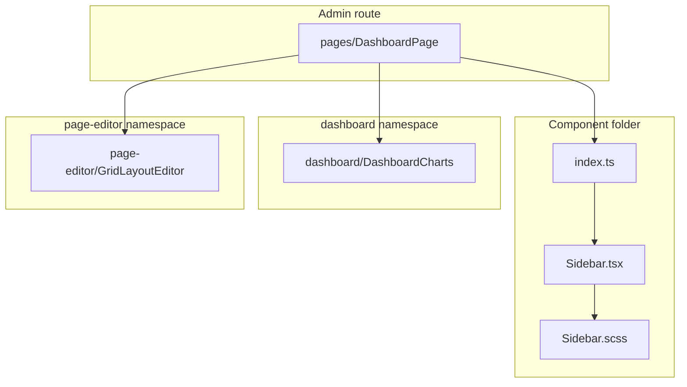

# `many_faces_admin` — component folder colocation (agent prompt)

**Language:** All **new** prose you add to repositories (README, guides, comments in new code, PR description) must be **English**.

**Mission:** Refactor **`many_faces_admin`** so UI building blocks are **not flat piles of files** under `src/components/`, `src/components/dashboard/`, and `src/pages/`. Each **component**, **dashboard widget**, and **page** lives in its **own directory** with its **`.tsx`**, **colocated `.scss`** (when present), and any **component-private** helpers beside it. **Behavior, routes, API contracts, and i18n keys stay unchanged** — this is a **structural / maintainability** rollout only.

**You are implementing what the product owner asked for:**

> Components will not sit in one heap; each TSX and its related SCSS (and scripts that belong only to that component) live together in folders.

**(required)** Read **§1** (as-is) and **§2** (target layout) before moving files; complete **§12** and **§15** while implementing; apply **§17–§26** (namespaces, tests, large pages, guards, DX); update **§11** documentation with the PR; obey the [**engagement exit rule**](#agent-engagement-exit-rule).

**Precedent (portal — already rolled out):**

- [fe-portal-component-folder-colocation-agent-prompt.md](./fe-portal-component-folder-colocation-agent-prompt.md) — same rules, phases, and tooling patterns; **reuse** monorepo scripts as templates (`colocate-portal-component.mjs`, `migrate-portal-colocate-phase.mjs`, `fix-colocated-relative-paths.mjs`, `verify-portal-component-colocation.mjs`) and adapt paths to `many_faces_admin`.

**Related (do not duplicate scope unless PR explicitly combines):**

- [admin-performance-and-refactor-agent-prompt.md](./admin-performance-and-refactor-agent-prompt.md) — performance, lazy routes, contexts (orthogonal; **may** land **after** colocation stabilizes imports).
- [admin-dashboard-stats-and-charts-agent-prompt.md](./admin-dashboard-stats-and-charts-agent-prompt.md) — dashboard **behavior** / stats APIs (do not mix feature work into a pure move PR).
- [unit-test-gap-fill-agent-prompt.md](./unit-test-gap-fill-agent-prompt.md) — add tests **after** folders exist if gaps remain.

**Non-goals:**

- **`many_faces_portal`**, **`many_faces_mobile`**, **`many_faces_backend`** (admin only unless product expands scope).
- Rewriting business logic, API clients, or OpenAPI-generated `src/api/**`.
- Renaming user-visible copy or i18n keys “for cleanliness”.
- Introducing a new state library or router.
- Mandatory barrel files at every ancestor level (only **per-component** `index.ts` where it helps imports).
- Moving **shared** hooks from `src/hooks/` into component folders when **two or more** unrelated screens use them.
- **`src/components/grid/`** — **N/A** for admin (portal-only subsystem).
- **Shared React form components** (`UserForm`, `FaceForm`, `PageForm`) that deduplicate `Create*` / `Edit*` page JSX — **§25** (separate feature PR after colocation).

**In scope (this prompt — structure only):**

- Namespaces **`dashboard/`**, **`page-editor/`**, optional **`tables/`** (§17–§18).
- **`routes/RouteLoadingFallback/`** colocation (§19).
- **Colocated Vitest** files (§21).
- **Large-page file splits** into private sub-components inside the page folder (§20).
- **`src/styles/forms/`** for shared form SCSS (§4.4, §8).
- **ESLint import boundaries** + verify `--imports` (§22, §16.2).
- **Vite chunk sanity** after moves (§23).
- **Documentation / local DX** (§26).

---

## 0. Compliance — read every part (**required**)

### 0.1 Labels

| Label | Meaning |
| ----- | ------- |
| **(required)** | Must be satisfied before merge, or explicitly deferred in PR with reason. |
| **(required — if _condition_)** | Mandatory when _condition_ is true. |
| **(optional)** | Skip only with written deferral in PR. |

### 0.2 Section coverage (**required** — copy into PR)

| § | Topic | Status (✓ / N/A) | If N/A, reason |
| - | ----- | ---------------- | -------------- |
| **§1** | As-is audit | | |
| **§2** | Target folder layout | | |
| **§3** | What belongs inside a component folder | | |
| **§4** | Import / export rules | | |
| **§5** | `pages/`, `routes/`, layout shell | | |
| **§6** | Dashboard subsystem | | |
| **§7** | Design system (`radix/`) | | |
| **§8** | Global styles | | |
| **§9** | Phased delivery / PR split | | |
| **§10** | Verification | | |
| **§11** | Documentation | | |
| **§12** | Master checklist (summary) | | |
| **§13** | Before / after examples | | |
| **§14** | Engagement exit rule | | |
| **§15** | Implementing-agent task list | | |
| **§16** | Tooling, CI, conventions | | |
| **§17** | `page-editor/` namespace | | |
| **§18** | `tables/` namespace (optional) | | |
| **§19** | `routes/` colocation | | |
| **§20** | Large pages — private sub-components | | |
| **§21** | Colocated tests | | |
| **§22** | Import boundaries (ESLint) | | |
| **§23** | Vite `manualChunks` verification | | |
| **§24** | Path alias `@/` (optional) | | |
| **§25** | Follow-up — shared form components (non-goal) | | |
| **§26** | DX — README, local verify, ci-local | | |

---

## 1. As-is audit — what exists today (**required**)

Re-run counts when starting work:

```bash
find many_faces_admin/src/components -maxdepth 1 -name '*.tsx' | wc -l
find many_faces_admin/src/components/dashboard -maxdepth 1 -name '*.tsx' 2>/dev/null | wc -l
find many_faces_admin/src/components/radix -maxdepth 1 -name '*.tsx' 2>/dev/null | wc -l
find many_faces_admin/src/pages -maxdepth 1 -name '*.tsx' | wc -l
```

| Area | Path | Today (snapshot) | Problem |
| ---- | ---- | ---------------- | ------- |
| **Flat shell components** | `src/components/*.tsx` + sibling `*.scss` | ~13 TSX at root of `components/` (~10 with SCSS) | Hard to see ownership; SCSS drifts from TSX in reviews |
| **Dashboard widgets** | `src/components/dashboard/*` | ~4 TSX (charts, metrics table, AI stats panel, moderation widget) — flat inside `dashboard/` | Same issue; feature area already grouped but not per-widget folders |
| **Radix wrappers** | `src/components/radix/*` | Button, Input, FormField, Table (+ SCSS where present) | Group folder OK; each control should be **its own subfolder** |
| **Pages** | `src/pages/*.tsx` (+ sibling `*.scss`) | ~20 TSX, mostly flat | **Phase 4** (§9) — same rules as components |
| **Routing glue** | `src/routes/AppRoutes.tsx`, `lazyAdminPages.tsx`, `useAdminRoutePaths.ts` | Imports pages/components | Update import paths when targets move |
| **App entry** | `src/App.tsx` | Thin provider shell | Update imports only; **do not** move `App.tsx` into `components/` |
| **Contexts / providers** | `src/contexts/*`, `src/providers/*` | Shared app state | **Keep** flat at layer root |
| **Tests** | `src/components/__tests__/*` | Centralized (`PagesTable.test.tsx`, `UsersTable.test.tsx`) | **Colocate** in Phase 2 per §21 |
| **Routes helper** | `src/routes/RouteLoadingFallback.tsx` | Flat TSX in `routes/` | Colocate in Phase 2 per §19 |
| **Page editor cluster** | `GridLayoutEditor`, `ComponentPickerModal`, `GradientPicker` | Flat in `components/` root | Only used by **`EditPagePage`**, **`EditFacePage`** → move to **`page-editor/`** in Phase 2b (§17) |
| **Large pages** | See §20 table | Single huge TSX files | Structure-only split in Phase 4 |
| **Imports** | Whole repo | Relative paths (`../components/Header`, `./Header.scss`) | Mass update; use `git mv` + scripted deepen (see portal `fix-colocated-relative-paths.mjs`) |

**Inventory — root `src/components/` (non-`dashboard/`, non-`radix/`, non-`page-editor/`, non-`tables/`, non-`__tests__`):**

`AdminLayout`, `GuestRoute`, `Header`, `LanguageRouter`, `LanguageSwitcher`, `ProtectedRoute`, `Sidebar`.

**Inventory — move to `src/components/page-editor/` in Phase 2b (§17):**

`ComponentPickerModal`, `GradientPicker`, `GridLayoutEditor`.

**Inventory — list tables (Phase 2 → `components/<Table>/`; optional Phase 2c → `components/tables/<Table>/`):**

`UsersTable`, `FacesTable`, `PagesTable`.

**Inventory — `src/components/dashboard/`:**

`DashboardCharts`, `DashboardAiStatsPanel`, `DashboardMetricsTable`, `DashboardModerationWidget`.

**Inventory — `src/components/radix/`:**

`Button`, `Input`, `FormField`, `Table`.

**Inventory — `src/pages/` (representative):**

`LoginPage`, `HomePage`, `HomePageProtected`, `DashboardPage`, `UsersPage`, `UserDetailPage`, `CreateUserPage`, `EditUserPage`, `FacesPage`, `FaceDetailPage`, `CreateFacePage`, `EditFacePage`, `FaceWallTicketsPage`, `CreatePagePage`, `EditPagePage`, `PageDetailPage`, `ContentModerationPage`, `ChatPage`, `SettingsPage`, `RegistrationInvitesPage`.

**Shared form SCSS (no matching `.tsx` at `pages/` root — move in Phase 4 per §4.4):**

| File | Importers today |
| ---- | ---------------- |
| `UserFormPage.scss` | `CreateUserPage.tsx`, `EditUserPage.tsx` |
| `FaceFormPage.scss` | `CreateFacePage.tsx`, `EditFacePage.tsx` |
| `PageFormPage.scss` | `CreatePagePage.tsx`, `EditPagePage.tsx` |

**Positive patterns to preserve:**

- SCSS imported **from the component file** (`import './Header.scss'`) — path becomes same-folder import inside `Header/Header.tsx`.
- `src/components/dashboard/` — **keep** the `dashboard/` namespace; colocate **inside** it per §6 (do not flatten widgets into `components/` root).

**Large pages — line-count audit (re-run `wc -l`; split in Phase 4 §20):**

| Page / area | ~lines (snapshot) | Split guidance |
| ----------- | ----------------- | -------------- |
| `ContentModerationPage.tsx` | ~570 | §20.1 — filters, table, drawer/panels as private siblings |
| `EditPagePage.tsx` | ~380 | §20.2 — optional `sections/` for grid-editor blocks |
| `EditFacePage.tsx` | ~320 | §20.2 — same as edit page where mirrored |
| `ChatPage.tsx` | ~240 | §20.3 — optional `useAdminAiChat.ts` (page-private SignalR) |
| `GridLayoutEditor.tsx` | ~340 | Stays one folder under `page-editor/` unless already split |

**Audit tasks (start of engagement):**

- [ ] Paste updated file counts into PR (TSX/SCSS under `components/`, `components/dashboard/`, `components/radix/`, `components/page-editor/`, `pages/`).
- [ ] Paste `wc -l` for §20 large pages into PR.
- [ ] Export importer list: `rg "from ['\"].*/(components|pages)" many_faces_admin/src -l | sort -u`.
- [ ] Document **page-editor** importers (`EditPagePage`, `EditFacePage`) before Phase 2b.
- [ ] Confirm `AppRoutes.tsx`: **`LoginPage` eager** import (not in `lazyAdminPages`) — §5.
- [ ] Confirm `lazyAdminPages.tsx` lazy list matches §1 page inventory.
- [ ] Note cross-page SCSS imports (shared form partials §4.4; page-to-page SCSS) — update paths in the same Phase 4 PR.
- [ ] List tests under `src/components/__tests__/` to colocate in Phase 2 (§21).

---

## 2. Target folder layout (**required**)

### 2.1 Canonical shape (one component = one folder)

**Default name:** PascalCase folder name **matches** the primary React component (same as today’s file basename).

```
src/components/Header/
  Header.tsx
  Header.scss
  index.ts            # re-export public API (recommended)
  Header.test.tsx     # (optional) if tests exist for Header
  useHeaderMenu.ts    # (optional) only if used exclusively by Header
  Header.types.ts     # (optional) props/types used only inside this folder
```

**Import after migration (preferred):**

```ts
import { Header } from '../components/Header';
```

**Today:** `many_faces_admin` uses **relative** imports (no `@/` alias unless **Phase 0** adds one). Do not introduce `@/` unless **Phase 0** is explicitly in scope.

**Forbidden after migration:**

```
src/components/Header.tsx
src/components/Header.scss   # sibling flat pair — remove
```

### 2.2 Dashboard widgets

Apply the **same** rule under `src/components/dashboard/`:

```
src/components/dashboard/DashboardCharts/
  DashboardCharts.tsx
  DashboardCharts.scss   # if present today
  index.ts
```

If a widget imports another widget’s styles or sub-view, use **sibling folder** paths (`../DashboardMetricsTable/...`), not deleted flat paths.

### 2.3 Design system (`radix/`)

```
src/components/radix/Button/
  Button.tsx
  Button.scss          # when SCSS exists today
  index.ts
```

Treat as **shared UI primitives**, not feature code. No business API hooks here.

### 2.4 Barrel `index.ts` rules

| Rule | Detail |
| ---- | ------ |
| **Per-component `index.ts`** | `export { Header } from './Header'` (or match existing export style) |
| **Public API only** | **`index.ts` exports only what other folders may import** |
| **No deep import requirement** | Consumers import from `components/Header`, not `components/Header/Header.tsx` |
| **Avoid mega-barrels** | Do **not** add `components/index.ts` that re-exports the entire app |
| **`dashboard/index.ts`** | **(optional)** — only if already used; do not create a mega-barrel of all widgets unless importers need it |

### 2.5 Optional path alias **(optional)**

If **Phase 0** is in scope, add `"paths": { "@/*": ["./src/*"] }` in `tsconfig` / `vite.config.ts` and migrate imports in the **same PR**.

### 2.6 ESLint `react-refresh` and barrels **(required)**

Same as portal: `index.ts` barrels that only re-export components are fine; split non-component exports to separate files or narrow eslint override — do **not** disable `react-refresh` globally.

### 2.7 Component-local types **(required)**

Prefer **`ComponentName.types.ts`** or **`types.ts`** inside the folder for props used only there.

### 2.8 `page-editor/` namespace (**required** — Phase 2b)

Mirror `dashboard/`: keep a **namespace folder**, colocate each widget inside it.

```
src/components/page-editor/
  GridLayoutEditor/
    GridLayoutEditor.tsx
    GridLayoutEditor.scss
    index.ts
  ComponentPickerModal/
    ComponentPickerModal.tsx
    ComponentPickerModal.scss
    index.ts
  GradientPicker/
    GradientPicker.tsx
    GradientPicker.scss
    index.ts
```

**Public import (after migration):**

```ts
import { GridLayoutEditor } from '../components/page-editor/GridLayoutEditor';
```

**Importers to update:** `EditPagePage`, `EditFacePage` (grep before moving).

**Verify:** `find many_faces_admin/src/components/page-editor -maxdepth 1 -name '*.tsx'` → **0** after Phase 2b.

### 2.9 `tables/` namespace **(optional** — Phase 2c)

If product enables Phase 2c, group list tables:

```
src/components/tables/
  UsersTable/
  FacesTable/
  PagesTable/
```

Skip Phase 2c in PR with §0.2 **N/A** + reason (e.g. “only three tables; defer”).

### 2.10 `routes/` route helpers (**required** — Phase 2)

```
src/routes/RouteLoadingFallback/
  RouteLoadingFallback.tsx
  index.ts          # export { RouteLoadingFallback } from './RouteLoadingFallback'
```

Update `AppRoutes.tsx` (and any other importers) to `from './RouteLoadingFallback'` (folder barrel).

**Do not** colocate `AppRoutes.tsx`, `lazyAdminPages.tsx`, or `useAdminRoutePaths.ts` into subfolders — they stay at `src/routes/` root as route wiring.

---

## 3. What belongs inside a component folder (**required**)

| Belongs **inside** `Component/` | Stays **outside** (shared) |
| ------------------------------- | -------------------------- |
| `.tsx` view + colocated `.scss` | `src/contexts/*`, `src/providers/*` |
| Component-only hooks | `src/hooks/api/*` (OpenAPI / Query) |
| Component-only utils | `src/utils/*` used in 3+ places |
| Component-only types | `src/api/types/*` |
| Colocated tests (`ComponentName.test.tsx`) | Shared test utilities under `src/test/` or `src/utils/__tests__` when used by many suites |
| Dashboard widget-specific chart helpers | Cross-page table formatters used on many screens |
| Page-private sub-components (§20) — **not exported** from page `index.ts` | Shared moderation helpers in `src/utils/contentModeration.ts` |
| Page-private hooks (e.g. `ChatPage/useAdminAiChat.ts`) | `src/hooks/api/*` used on multiple routes |

**Decision rule:** If a hook/util is imported from **more than one** top-level route folder, it remains in `src/hooks/` or `src/utils/`.

**Page `index.ts` rule (§20):** Export **only** the route-facing page component(s). Private splits (`ModerationQueueTable.tsx`, etc.) are imported relatively inside the page folder and **must not** appear in the page barrel.

---

## 4. Import / export migration (**required**)

### 4.1 Order of operations (safe sequence)

1. **Inventory** — `rg "from ['\"].*components/" many_faces_admin/src`.
2. **Move** — `git mv` from **`many_faces_admin`** submodule root (TSX + SCSS together).
3. **Fix** internal imports (`./Component.scss` stays same folder).
4. **Add** `index.ts` re-export.
5. **Update** importers: `src/routes/**`, `src/pages/**`, `src/components/**`, tests.
6. **Run** `node scripts/fix-colocated-relative-paths.mjs` with admin scope if script supports it (extend portal script or add `fix-admin-colocated-relative-paths.mjs`).
7. **Delete** empty flat files.
8. **Run** §10.

### 4.2 SCSS

- Keep **component-scoped** class names as today.
- **Do not** move global tokens out of `src/styles/` (if present) into random components.

### 4.3 Lazy routes

`src/routes/lazyAdminPages.tsx` uses **named exports** with a lazy wrapper, for example:

```ts
export const DashboardPage = lazy(() =>
  import('../pages/DashboardPage').then((m) => ({ default: m.DashboardPage }))
);
```

After Phase 4, keep this **`.then((m) => ({ default: m.X }))` pattern** — do **not** switch to default-export-only lazy imports unless you also change every page barrel and all static importers in the same PR.

**Required after colocation:**

- Folder `pages/DashboardPage/` with `DashboardPage.tsx` + `index.ts` containing `export { DashboardPage } from './DashboardPage'`.
- Lazy import path stays `../pages/DashboardPage` (resolves via `index.ts`); only file paths inside the folder change.

### 4.4 Cross-page / shared form SCSS (**required** in Phase 4)

Three **shared** form stylesheets live at `src/pages/` root today with **no** sibling `.tsx` (see §1 table). They must **not** remain flat at `pages/` after Phase 4 — otherwise §16.4 orphan checks fail.

**Canonical target (required):**

```
src/styles/forms/
  UserFormPage.scss
  FaceFormPage.scss
  PageFormPage.scss
```

**Importer updates (example):**

```ts
import '../../styles/forms/UserFormPage.scss';
```

(from `pages/CreateUserPage/CreateUserPage.tsx` — adjust `../` depth per folder depth).

**Do not** leave shared form SCSS in one arbitrary page folder (e.g. only under `CreateUserPage/`) unless product explicitly waives §16.4 in the PR; cross-page ownership belongs in `src/styles/forms/`, not a single route folder.

**Before moving:** grep all importers of each file; update in the **same** Phase 4 PR as page colocation.

### 4.5 Anti-patterns

| Anti-pattern | Why |
| ------------ | --- |
| Moving files without updating importers | Broken build; Vite pre-transform errors on old flat paths |
| `git mv` from monorepo root instead of `many_faces_admin/` | “not under version control” |
| Renaming exported components in the same PR | Explodes diff; structure-only first |
| Deep-importing `pages/Foo/Foo.tsx` or another page’s private split | Breaks encapsulation; use barrels + §22 |
| Exporting page-private splits from `pages/Foo/index.ts` | Leaks internals; couples routes |

### 4.6 `LoginPage` — eager route (**required**)

`AppRoutes.tsx` imports **`LoginPage`** directly from `../pages/LoginPage` ( **not** via `lazyAdminPages.tsx` ) for fast first paint on `/login`.

After Phase 4:

- [ ] `LoginPage` folder + `index.ts` exists.
- [ ] `AppRoutes.tsx` still uses a **static** import of `LoginPage` (not `React.lazy`).
- [ ] All localized login paths in `AppRoutes` still render the same component.

---

## 5. `pages/`, `routes/`, layout shell (**required**)

| Layer | Policy |
| ----- | ------ |
| **`src/pages/`** | **Phase 4** (§9) — `pages/LoginPage/LoginPage.tsx` + optional SCSS + `index.ts`; large-page splits §20. |
| **`src/routes/`** | Update imports when `pages/` or `components/` move; colocate `RouteLoadingFallback/` §19; **no** new business logic. |
| **`src/components/AdminLayout.tsx`** | Colocate to `AdminLayout/` in Phase 2 (layout chrome is still a component). |
| **`src/App.tsx`** | Stays at `src/App.tsx` — providers + `AppRoutes` only. |

**No `src/features/` or `src/shell/`** in admin today — mark **N/A** in PR §0.2 unless product adds them later.

### 5.1 Routes checklist (**required** — Phase 2 + 4)

- [ ] `RouteLoadingFallback/` colocated (§19).
- [ ] `AppRoutes.tsx` imports updated for all moved components/pages.
- [ ] `lazyAdminPages.tsx` — named-export lazy pattern preserved (§4.3).
- [ ] `LoginPage` remains **eager** in `AppRoutes` (§4.6).
- [ ] `useAdminRoutePaths.ts` unchanged behavior; paths still match i18n route keys.

---

## 6. Dashboard subsystem (**required**)

- [ ] Every file in `src/components/dashboard/` (except `__tests__` if any) follows **§2.2**.
- [ ] `find many_faces_admin/src/components/dashboard -maxdepth 1 -name '*.tsx'` → **0** after Phase 3.
- [ ] `DashboardPage` imports dashboard widgets via folder barrels (e.g. `../components/dashboard/DashboardCharts` through `index.ts`).
- [ ] Chart code uses **Recharts** in this repo (`package.json`); keep chart widgets **route-scoped** — colocation must not pull Recharts into unrelated routes.

---

## 7. Design system (`radix/`) (**required**)

- [ ] Each primitive gets its own folder (§2.3).
- [ ] Public imports: `from '../components/radix/Button'` or `from '../radix/Button'` depending on importer depth (via per-primitive `index.ts`).

### 7.1 Optional `radix/index.ts` barrel **(optional** — Phase 1)

Portal exposes `src/components/radix/index.ts` re-exporting custom wrappers. Admin **may** add a thin barrel:

```ts
export { Button } from './Button';
export { Input } from './Input';
export { FormField } from './FormField';
export { Table } from './Table';
```

**Do not** re-export the entire `@radix-ui/*` tree from admin unless already present — keep bundle boundaries clear. Respect §2.6 `react-refresh` (barrel = components only).

- [ ] If added: importers may use `from '../components/radix'` for primitives; document in `src/components/README.md`.
- [ ] If skipped: mark §0.2 **N/A** for §7.1.

---

## 8. Global styles (**required**)

| Path | Action |
| ---- | ------ |
| `src/styles/main.scss` or app entry SCSS | **Keep** — global entry |
| `src/styles/toast.scss` | **Keep** |
| `src/styles/forms/*.scss` | **Create in Phase 4** — shared user/face/page form styles (§4.4) |
| Other shared partials under `src/styles/` | **Keep** |
| Component / page SCSS | **Move** with component / page folder |

---

## 9. Phased delivery / PR split (**required**)

Prefer **reviewable PRs**; **commit and push after each phase** when the product owner requests incremental delivery.

| Phase | Scope | Suggested PR title |
| ----- | ----- | ------------------ |
| **0** | (optional) `@/` alias — §24 | `chore(admin): path alias for src imports` |
| **0.5** | Monorepo helper scripts + verify `--imports` + ESLint boundary rule stub — §16, §22 | `chore(admin): colocation helper scripts` |
| **1** | `src/components/radix/*` (+ optional `radix/index.ts` §7.1) | `refactor(admin): colocate radix primitives` |
| **2** | Shell + **tables at** `components/<Table>/` + `RouteLoadingFallback/` §19 + colocate tests §21 | `refactor(admin): colocate shell components and tests` |
| **2b** | `src/components/page-editor/*` §17 | `refactor(admin): colocate page-editor components` |
| **2c** | (optional) Move `UsersTable/`, `FacesTable/`, `PagesTable/` under `components/tables/` §18 | `refactor(admin): namespace admin tables` |
| **3** | `src/components/dashboard/*` | `refactor(admin): colocate dashboard widgets` |
| **4** | `src/pages/*` + `src/styles/forms/` §4.4 + large-page splits §20 | `refactor(admin): colocate pages and form styles` |
| **Final** | ESLint boundaries §22, CI verify §16.3, Vite chunk check §23, docs §26 | `chore(admin): colocation guards and docs` (may merge with Phase 4 if tree already clean) |

Each PR must pass **§10** independently (for its phase gates).

**Commit hygiene:** structure-only; prefer **`git mv`** for TSX/SCSS pairs.

**Importer hotspots** (re-grep every phase): `src/routes/AppRoutes.tsx`, `src/routes/lazyAdminPages.tsx`, `src/routes/useAdminRoutePaths.ts`, `src/pages/**`, `src/components/**`, `src/components/dashboard/**`, `src/components/page-editor/**`, `src/components/tables/**` (if Phase 2c), former `src/components/__tests__/**`.

**Dev stack note:** Admin Vite runs in Docker as **`admin-demo-dev`** (host **http://localhost:8082** or proxy per `docker-compose.dev.yml`). After moves, **`docker restart admin-demo-dev`** if the browser shows stale flat-path errors until HMR recovers.

---

## 10. Verification (**required**)

- [ ] `cd many_faces_admin && yarn install --immutable`
- [ ] `yarn validate`
- [ ] `yarn test` (Vitest)
- [ ] `yarn build`
- [ ] **Grep guard:**

```bash
find src/components -maxdepth 1 -name '*.tsx' | wc -l              # → 0 after Phase 2
find src/components/page-editor -maxdepth 1 -name '*.tsx' | wc -l  # → 0 after Phase 2b
find src/components/tables -maxdepth 1 -name '*.tsx' 2>/dev/null | wc -l  # → 0 after Phase 2c (if used)
find src/components/dashboard -maxdepth 1 -name '*.tsx' | wc -l      # → 0 after Phase 3
find src/pages -maxdepth 1 -name '*.tsx' | wc -l                   # → 0 after Phase 4
find src/routes -maxdepth 1 -name '*.tsx' | wc -l                  # only RouteLoadingFallback.tsx at root → 0 after Phase 2 (folder remains)
```

- [ ] `node scripts/verify-admin-component-colocation.mjs` (and `--imports` on final branch) — §16.2.
- [ ] §23 Vite chunk spot-check (`yarn build` + inspect `dist/assets` or build log).
- [ ] Manual smoke: login (**eager** `LoginPage`) → dashboard (charts load) → users list → create/edit user → faces list → **edit face** (gradient + grid editor) → **edit page** (grid + component picker) → content moderation queue → settings → AI chat — UI unchanged.

---

## 11. Documentation (**required**)

| Document | Content |
| -------- | ------- |
| `many_faces_admin/README.md` | Update **Project Structure** tree (no flat `components/*.tsx`); fix stack version if outdated; link to `src/components/README.md` |
| `many_faces_admin/src/components/README.md` | Conventions §2.1–§2.10, namespaces `dashboard/`, `page-editor/`, optional `tables/`; verify command |
| [docs/readmes/admin-portal-overview.md](../readmes/admin-portal-overview.md) | “Component colocation” subsection + Mermaid (§16.8) + link to this prompt |
| [docs/prompts/README.md](./README.md) | Row in prompt table (maintainer) |
| `.cursor/rules/admin-component-folders.mdc` | Agent rule §16.6 (components, pages, `page-editor/`, `tables/`) |
| `scripts/ci-local.sh` or contributor note in admin README | Run `node scripts/verify-admin-component-colocation.mjs` before push — §26 |

**Do not** tick `[ ]` items inside this canonical prompt file in git — mirror completion in the PR.

---

## 12. Master checklist (**required** — mirror in PR)

### 12.1 Structure

- [ ] No flat `Component.tsx` + `Component.scss` pairs under `src/components/` root (except documented exceptions).
- [ ] No flat pairs under `src/components/dashboard/`, `src/components/radix/`, `src/components/page-editor/` (and `tables/` if Phase 2c).
- [ ] `src/routes/RouteLoadingFallback.tsx` flat file removed — folder colocation §19.
- [ ] Each migrated folder has `index.ts` **or** PR explains why omitted.
- [ ] SCSS imports resolve (`yarn build` proves it).
- [ ] `src/styles/forms/` holds shared form SCSS; no orphan form SCSS at `pages/` root.

### 12.2 Imports

- [ ] All importers updated; `yarn build` clean.
- [ ] No circular imports introduced (barrel + context loops).
- [ ] `verify-admin-component-colocation.mjs --imports` clean on final branch (§16.2).
- [ ] ESLint import boundaries enabled or deferred with reason (§22).

### 12.3 Scope discipline

- [ ] Zero intentional behavior / copy / API changes.
- [ ] Shared hooks/utils remain shared per §3.
- [ ] Page `index.ts` exports only public page component(s) — private §20 splits not re-exported.
- [ ] §25 shared `UserForm` / `FaceForm` / `PageForm` React dedup **not** mixed into colocation PRs.

### 12.4 Tests & large pages

- [ ] Component tests colocated per §21 (no stale `src/components/__tests__/` paths).
- [ ] §20 splits: `ContentModerationPage` (+ optional `ChatPage`, `EditPagePage`) — structure only, tests green.

### 12.5 Quality gates

- [ ] §10 commands green.
- [ ] §23 Vite chunk spot-check documented in PR.
- [ ] PR lists phases delivered and any deferred phase (0, 2c, 7.1, 24) with reason.

---

## 13. Example before / after (reference)

**Before:**

```
src/components/Header.tsx
src/components/Header.scss
src/components/dashboard/DashboardCharts.tsx
```

**After:**

```
src/components/Header/
  Header.tsx
  Header.scss
  index.ts
src/components/page-editor/GridLayoutEditor/
  GridLayoutEditor.tsx
  GridLayoutEditor.scss
  index.ts
src/components/dashboard/DashboardCharts/
  DashboardCharts.tsx
  index.ts
src/pages/ContentModerationPage/
  ContentModerationPage.tsx
  ContentModerationPage.scss
  ModerationFilters.tsx      # private — not in index.ts
  ModerationQueueTable.tsx
  index.ts                   # export { ContentModerationPage } only
src/styles/forms/
  UserFormPage.scss
```

---

<a id="agent-engagement-exit-rule"></a>

## 14. Agent engagement exit rule (NON-NEGOTIABLE)

- **English:** Do **not** declare the task done until **§12** and the **agreed §15 phase section(s)** are satisfied (or explicitly waived in the PR with reason). A half-moved tree (broken imports, flat files left behind, page-editor still at `components/` root, tests still only under `__tests__/`) is **not** acceptable.

- **Slovak:** Agent **nesmie skončiť**, kým nie je dokončená dohodnutá fáza podľa **§12** a **§15** — každá komponenta má svoj priečinok so súvisiacim SCSS a privátnymi skriptmi; žiadne „polovičné“ presuny.

**Not governed by this exit rule:** optional **Phase 0**, **Phase 2c**, **§7.1**, **§24**, **§25** (follow-up feature PRs), **§13** examples (reference only).

---

## 15. Master checklist — implementing agent (**required** — mirror in PR)

### 15.0 Preconditions

- [ ] Branch clean; `cd many_faces_admin && yarn install --immutable` succeeds.
- [ ] §1 inventory re-run (counts in PR).
- [ ] Scope: **admin only**, structure-only.
- [ ] Agreed phase(s) from §9 in PR title/body.

### 15.1 Phase 0 — path alias **(optional)** — §24

- [ ] `tsconfig.app.json` + `vite.config.ts` `resolve.alias`: `@` → `./src`.
- [ ] ESLint / Vitest resolve alias if needed.
- [ ] Migrate imports in same PR or document follow-up; `yarn validate && yarn build` green.

### 15.1b Phase 0.5 — tooling only **(required before bulk moves)**

- [ ] `scripts/colocate-admin-component.mjs` (adapt from portal; flags §16.1).
- [ ] `scripts/verify-admin-component-colocation.mjs` (+ `--imports` §16.2).
- [ ] `scripts/migrate-admin-colocate-phase.mjs` with phases `radix | root | page-editor | tables | dashboard | pages | routes` (§16.7).
- [ ] `scripts/fix-colocated-relative-paths.mjs` extended with `admin` scope **or** `fix-admin-colocated-relative-paths.mjs`.
- [ ] `.cursor/rules/admin-component-folders.mdc` (§16.6).
- [ ] ESLint restricted-import patterns drafted (§22) — may enable in final PR.
- [ ] No component/page files moved in this PR (scripts + rules only).

### 15.2 Phase 1 — `src/components/radix/*`

- [ ] `Button/`, `Input/`, `FormField/`, `Table/` each with `index.ts`.
- [ ] No flat files left in `radix/`.
- [ ] (optional) `radix/index.ts` thin barrel §7.1.
- [ ] §10 green for this PR.

### 15.3 Phase 2 — shell + tables + routes helper + tests

- [ ] Shell components colocated: `AdminLayout/`, `Header/`, `Sidebar/`, `GuestRoute/`, `ProtectedRoute/`, `LanguageRouter/`, `LanguageSwitcher/`.
- [ ] Tables colocated: `UsersTable/`, `FacesTable/`, `PagesTable/` at `src/components/<Table>/` (Phase 2c may move them under `components/tables/`).
- [ ] **Not** in this phase: `page-editor/*` (Phase 2b), `dashboard/*`, `radix/*`.
- [ ] `find src/components -maxdepth 1 -name '*.tsx'` → **0** (only namespace subdirs remain).
- [ ] `RouteLoadingFallback/` per §19; `AppRoutes.tsx` import updated.
- [ ] Tests: `UsersTable.test.tsx` → `UsersTable/UsersTable.test.tsx`, `PagesTable.test.tsx` → `PagesTable/` (or under `tables/` if Phase 2c done first — document order in PR).
- [ ] Remove or empty `src/components/__tests__/` when last test moved.
- [ ] §10 green for this PR.

### 15.3b Phase 2b — `page-editor/` **(required)**

- [ ] `GridLayoutEditor/`, `ComponentPickerModal/`, `GradientPicker/` under `src/components/page-editor/`.
- [ ] `EditPagePage`, `EditFacePage` imports updated.
- [ ] `find src/components/page-editor -maxdepth 1 -name '*.tsx'` → **0**.
- [ ] Manual smoke: edit face + edit page (grid + picker + gradient) unchanged.
- [ ] §10 green for this PR.

### 15.3c Phase 2c — `tables/` namespace **(optional)**

- [ ] `git mv` `components/UsersTable` → `components/tables/UsersTable` (same for `FacesTable`, `PagesTable`) **or** §0.2 N/A (tables stay at `components/<Table>/`).
- [ ] List pages + tests imports updated to `../components/tables/UsersTable` (or unchanged if N/A).
- [ ] `find src/components/tables -maxdepth 1 -name '*.tsx'` → **0** when namespace used.
- [ ] §10 green if implemented.

### 15.4 Phase 3 — `src/components/dashboard/*`

- [ ] All dashboard widgets colocated per §2.2.
- [ ] `find src/components/dashboard -maxdepth 1 -name '*.tsx'` → **0**.
- [ ] §10 green for this PR.

### 15.5 Phase 4 — `src/pages/*` + form styles + large-page splits

- [ ] Each page in `pages/<Name>/` + `index.ts` (public export only).
- [ ] `lazyAdminPages.tsx` and `AppRoutes.tsx` imports still resolve; **`LoginPage` eager** §4.6.
- [ ] Shared form SCSS in `src/styles/forms/` (§4.4).
- [ ] **§20.1** `ContentModerationPage` split into private sibling TSX files (required).
- [ ] **§20.2** `EditPagePage` / `EditFacePage` optional `sections/` split — implement or N/A in PR.
- [ ] **§20.3** `ChatPage` optional `useAdminAiChat.ts` — implement or N/A in PR.
- [ ] §10 green for this PR.

### 15.6 Documentation (§11) + DX (§26)

- [ ] `many_faces_admin/README.md` structure section updated.
- [ ] `src/components/README.md` with namespaces + verify command.
- [ ] [admin-portal-overview.md](../readmes/admin-portal-overview.md) updated (Mermaid §16.8).
- [ ] [docs/prompts/README.md](./README.md) row present.
- [ ] Contributor note: run verify script before push (§26).

### 15.7 Final gates

- [ ] §12 satisfied.
- [ ] `yarn validate && yarn test && yarn build` on final branch.
- [ ] Manual smoke §10 (includes page-editor + moderation).
- [ ] `node scripts/verify-admin-component-colocation.mjs` exits **0**.
- [ ] `node scripts/verify-admin-component-colocation.mjs --imports` exits **0**.
- [ ] §22 ESLint boundaries active or deferred with issue link.
- [ ] §23 Vite chunk check documented.
- [ ] CI step in `many_faces_admin` job (§16.3) when tree is clean.

### 15.8 Anti-regression grep (final)

- [ ] `rg "components/[A-Za-z0-9]+\\.tsx" many_faces_admin/src` — no flat component imports.
- [ ] `rg "pages/[A-Za-z0-9]+\\.tsx" many_faces_admin/src` — no flat page imports.
- [ ] `rg "page-editor/[A-Za-z0-9]+\\.tsx" many_faces_admin/src` — no flat page-editor imports (if `--imports` extended).
- [ ] No duplicate flat `Header.scss` / `Header.tsx` at old paths.

---

## 16. Tooling, automation, and conventions (**required**)

### 16.1 Helper script — `scripts/colocate-admin-component.mjs` **(required)**

Adapt from `scripts/colocate-portal-component.mjs`:

```bash
node scripts/colocate-admin-component.mjs Header --dry-run
node scripts/colocate-admin-component.mjs Header

node scripts/colocate-admin-component.mjs DashboardCharts --dashboard
```

**Flags:**

| Flag | Target |
| ---- | ------ |
| `--dashboard` | `src/components/dashboard/<Name>/` |
| `--page-editor` | `src/components/page-editor/<Name>/` |
| `--tables` | `src/components/tables/<Name>/` (or `components/<Name>/` when Phase 2c N/A) |
| `--dry-run` | Print planned `git mv` only |

```bash
node scripts/colocate-admin-component.mjs GridLayoutEditor --page-editor
```

**Script MUST:** `git mv` with `cwd: many_faces_admin`; print importers to update; write minimal `index.ts`.

### 16.2 Verify script — `scripts/verify-admin-component-colocation.mjs` **(required)**

Exit non-zero when:

- Any `*.tsx` at `many_faces_admin/src/components/` maxdepth 1 (files only — **not** counting subdirectories like `__tests__/`).
- Any `*.tsx` at `many_faces_admin/src/components/dashboard/` maxdepth 1.
- Any `*.tsx` at `many_faces_admin/src/components/page-editor/` maxdepth 1.
- Any `*.tsx` at `many_faces_admin/src/components/tables/` maxdepth 1 **(only if Phase 2c namespace exists)**.
- Any `*.tsx` at `many_faces_admin/src/pages/` maxdepth 1.
- Any `RouteLoadingFallback.tsx` flat at `src/routes/` maxdepth 1 (folder required).

**Optional `--imports`:** run `rg` (or equivalent) and fail when import strings reference flat paths such as:

- `components/Foo.tsx`, `components/dashboard/Bar.tsx`, `components/page-editor/Baz.tsx`
- `pages/LoginPage.tsx` (must be `pages/LoginPage` folder barrel)

```bash
node scripts/verify-admin-component-colocation.mjs
node scripts/verify-admin-component-colocation.mjs --imports
```

### 16.3 CI wiring — `many_faces_main` **(required in final colocation PR)**

**Do not** merge the CI step until `node scripts/verify-admin-component-colocation.mjs` exits **0** on the branch (same policy as portal colocation). A short-lived red `many_faces_admin` job during rollout is not recommended.

In job `many_faces_admin`, after `yarn-spa-ci`, from monorepo root:

```yaml
      - name: Verify admin component folder colocation
        working-directory: .
        run: node scripts/verify-admin-component-colocation.mjs
```

Add `verify-admin-component-colocation.mjs` (and `colocate-admin-component.mjs`) to `scripts/verify-dev-stack-contracts.sh` existence check (alongside portal colocation scripts).

### 16.4 Orphan SCSS check **(required — run or waive)**

```bash
find many_faces_admin/src/components -maxdepth 1 -name '*.scss' | wc -l
find many_faces_admin/src/components/dashboard -maxdepth 1 -name '*.scss' | wc -l
find many_faces_admin/src/pages -maxdepth 1 -name '*.scss' | wc -l   # → 0 after Phase 4 (shared forms live under src/styles/forms/)
```

All → **0** after the relevant phase. **Exception:** none at `pages/` root — shared form SCSS belongs in `src/styles/forms/` per §4.4, not left as orphans beside colocated page folders.

### 16.5 Public API via `index.ts` **(required)**

External importers use folder barrels only; internal hooks/types stay private unless cross-folder use is required.

### 16.6 Cursor rule — `admin-component-folders.mdc` **(required)**

Create `.cursor/rules/admin-component-folders.mdc` (mirror `portal-component-folders.mdc`):

- **globs:** `many_faces_admin/src/components/**/*`, `many_faces_admin/src/pages/**/*`, `many_faces_admin/src/routes/**/*`
- **Rules:**
  - Never add flat `Component.tsx` + `Component.scss` at `components/`, `pages/`, `dashboard/`, `page-editor/`, or `tables/` roots.
  - New UI → `ComponentName/ComponentName.tsx` + optional SCSS + `index.ts`.
  - Page-editor widgets → under `components/page-editor/<Name>/`.
  - Page-private splits → inside `pages/<Page>/`, not exported from page `index.ts`.
- **Spec link:** this prompt file.

### 16.7 Bulk phase script — `scripts/migrate-admin-colocate-phase.mjs` **(required)**

Mirror `migrate-portal-colocate-phase.mjs`:

```bash
node scripts/migrate-admin-colocate-phase.mjs radix
node scripts/migrate-admin-colocate-phase.mjs root      # shell + tables at components/<Table>/
node scripts/migrate-admin-colocate-phase.mjs page-editor
node scripts/migrate-admin-colocate-phase.mjs tables    # optional namespace move (Phase 2c)
node scripts/migrate-admin-colocate-phase.mjs dashboard
node scripts/migrate-admin-colocate-phase.mjs routes    # RouteLoadingFallback only
node scripts/migrate-admin-colocate-phase.mjs pages
```

Include `deepenParentImports`, `fixBareImports`, `fixScssImports`, `fixSiblingImports` after each move (portal lessons learned).

### 16.8 Mermaid — documentation diagram **(required)**

Add to [docs/readmes/admin-portal-overview.md](../readmes/admin-portal-overview.md):



### 16.9 Portal parity reference **(informational)**

Portal rollout completed per [fe-portal-component-folder-colocation-agent-prompt.md](./fe-portal-component-folder-colocation-agent-prompt.md). Admin has **no `grid/` phase**; adds **`page-editor/`**, optional **`tables/`**, **`styles/forms/`**, and stricter page verify (flat `pages/*.tsx`).

### 16.10 New component snippet **(required)**

Document in `many_faces_admin/src/components/README.md`:

```text
New UI block:
  src/components/<Name>/<Name>.tsx
  src/components/<Name>/<Name>.scss
  src/components/<Name>/index.ts   → export { Name } from './Name'

Dashboard widget:
  src/components/dashboard/<Name>/<Name>.tsx
  src/components/dashboard/<Name>/index.ts

Page editor widget:
  src/components/page-editor/<Name>/<Name>.tsx
  src/components/page-editor/<Name>/index.ts

Admin table (optional namespace):
  src/components/tables/<Name>/<Name>.tsx
  src/components/tables/<Name>/index.ts
```

### 16.11 Optional `knip` / unused SCSS **(optional)**

After each phase, optionally run `yarn dlx knip` in `many_faces_admin` (if adopted) to flag orphan SCSS; attach output to PR or waive with reason.

---

## 17. `page-editor/` subsystem (**required** — Phase 2b)

**Purpose:** Group admin-only **page layout editing** UI used when configuring face/page `gridSchema` — distinct from portal’s `grid/` blocks.

| Component | Used by | Notes |
| --------- | ------- | ----- |
| `GridLayoutEditor` | `EditPagePage`, `EditFacePage` | `react-grid-layout` — keep in `vendor-grid-layout` chunk (§23) |
| `ComponentPickerModal` | same | Modal picker for block types |
| `GradientPicker` | same | Face gradient settings UI |

### 17.1 Checklist (**required**)

- [ ] Namespace folder `src/components/page-editor/` exists.
- [ ] Each of the three components has its own subfolder + `index.ts` (§2.8).
- [ ] No flat `*.tsx` at `page-editor/` maxdepth 1.
- [ ] `EditPagePage` and `EditFacePage` import from `../components/page-editor/...` barrels.
- [ ] No imports from deleted flat paths (`../components/GridLayoutEditor.tsx`).
- [ ] Phase 2b PR smoke: open edit page + edit face, grid drag/resize and picker still work.

---

## 18. `tables/` namespace (**optional** — Phase 2c)

**Purpose:** Optional clarity for the three admin CRUD list tables. Tables are **colocated in Phase 2** at `components/UsersTable/`; Phase 2c only adds the extra namespace segment.

### 18.1 Checklist

- [ ] Decision recorded in PR: namespace move **or** N/A.
- [ ] If move: `components/tables/{Users,Faces,Pages}Table/` + importers + tests updated.
- [ ] If N/A: tables remain `components/UsersTable/` etc.; verify script skips `tables/` maxdepth check.

---

## 19. `routes/` colocation (**required** — Phase 2)

See §2.10. **`RouteLoadingFallback`** is the only route-level presentational helper that gets a folder.

### 19.1 Checklist

- [ ] `src/routes/RouteLoadingFallback/RouteLoadingFallback.tsx` + `index.ts`.
- [ ] `AppRoutes.tsx` imports `RouteLoadingFallback` from folder barrel.
- [ ] `find many_faces_admin/src/routes -maxdepth 1 -name 'RouteLoadingFallback.tsx'` → **0** files (folder OK).
- [ ] `lazyAdminPages.tsx`, `useAdminRoutePaths.ts` remain at `routes/` root.

---

## 20. Large pages — structure-only decomposition (**required** where noted)

**Rules:**

- **No** behavior, API, or copy changes — move JSX into sibling files, pass the same props/state.
- Private files are **not** re-exported from `pages/<Page>/index.ts`.
- Keep shared logic in `src/utils/*` and `src/hooks/api/*` (e.g. `contentModeration.ts` stays shared).

### 20.1 `ContentModerationPage` (**required** in Phase 4)

Split the ~570-line file into the page folder:

| New file (private) | Responsibility |
| ------------------ | -------------- |
| `ContentModerationPage.tsx` | Route shell, hooks wiring, composes children |
| `ModerationFilters.tsx` | Filter row / form controls |
| `ModerationQueueTable.tsx` | Main table + row actions |
| `ModerationItemDrawer.tsx` (or `ModerationAuditPanel.tsx`) | Per-item audit / detail drawer |

- [ ] Each new file lives under `pages/ContentModerationPage/`.
- [ ] `index.ts` exports **only** `ContentModerationPage`.
- [ ] Existing `ContentModerationPage.scss` stays with the page (or split SCSS only if already trivial).
- [ ] Tests: add/adjust colocated `ContentModerationPage.test.tsx` if present — optional per [unit-test-gap-fill-agent-prompt.md](./unit-test-gap-fill-agent-prompt.md).

### 20.2 `EditPagePage` / `EditFacePage` **(optional** in Phase 4)

If JSX blocks for grid editor + metadata are separable without logic changes:

```
pages/EditPagePage/
  EditPagePage.tsx
  EditPagePage.scss
  sections/
    PageGridSection.tsx
    PageMetadataSection.tsx
```

- [ ] Implement for **both** edit pages if one is split (keep parity).
- [ ] `page-editor` imports unchanged (barrel paths).

### 20.3 `ChatPage` **(optional** in Phase 4)

- [ ] Extract page-private SignalR / chat session hook to `ChatPage/useAdminAiChat.ts` (or `chat/` subfolder) if it reduces `ChatPage.tsx` size without changing hub URL or events.
- [ ] Hook **not** imported from other pages; if reused later, promote to `src/hooks/`.

### 20.4 Checklist summary (Phase 4)

- [ ] §20.1 complete.
- [ ] §20.2 implemented or N/A in PR §0.2.
- [ ] §20.3 implemented or N/A in PR §0.2.
- [ ] `yarn test` + manual chat smoke if §20.3 touched SignalR wiring.

---

## 21. Colocated tests (**required** — Phase 2)

**Today:** `src/components/__tests__/PagesTable.test.tsx`, `UsersTable.test.tsx`.

**Target:**

```
src/components/UsersTable/UsersTable.test.tsx
src/components/PagesTable/PagesTable.test.tsx
```

(Or `src/components/tables/UsersTable/UsersTable.test.tsx` after Phase 2c.)

### 21.1 Checklist

- [ ] Every test for a colocated component lives **inside** that component’s folder (or page folder for page tests).
- [ ] `src/components/__tests__/` removed when empty.
- [ ] Vitest `include` globs still discover tests (`**/*.{test,spec}.tsx` — confirm `vitest.config`).
- [ ] `yarn test` green after each move.

---

## 22. Import boundaries — ESLint (**required** in final colocation PR unless deferred)

Add restricted imports (flat config example — adapt to `many_faces_admin/eslint.config.js`):

```js
// Example patterns — use no-restricted-imports or import-x/no-restricted-paths
{
  patterns: [
    {
      group: ['**/pages/*/**', '!**/pages/*/index'],
      message: 'Import pages via folder barrel (pages/Foo), not deep files.',
    },
    {
      group: ['**/*.tsx'], // tighten: block .../components/Foo.tsx string paths in favor of folders
      message: 'Use colocated folder barrels, not flat .tsx paths.',
    },
  ],
}
```

### 22.1 Checklist

- [ ] ESLint rule blocks deep page imports (`pages/Foo/Foo.tsx` from outside the page folder).
- [ ] ESLint rule blocks cross-page imports of private splits (`pages/Bar/ModerationFilters`).
- [ ] `yarn lint` green.
- [ ] If deferred: §0.2 N/A + follow-up issue linked in PR.

---

## 23. Vite `manualChunks` verification (**required** — final PR)

`many_faces_admin/vite.config.ts` already splits vendors (`vendor-grid-layout`, `vendor-signalr`, `recharts` in default `vendor` unless split).

After colocation:

- [ ] Run `yarn build` and confirm **no unexpected** merging of `page-editor` + dashboard into one giant app chunk (inspect `dist/assets/*.js` sizes vs pre-colocation baseline in PR notes).
- [ ] **Recharts** remains loaded only on routes that import dashboard widgets (dashboard page).
- [ ] **`react-grid-layout`** remains associated with edit page / `page-editor` routes, not login shell.
- [ ] If chunk regression > ~10% on login bundle, document cause; fix dynamic `import()` only in a **follow-up** PR (out of scope unless colocation broke static imports).

---

## 24. Path alias `@/` **(optional** — Phase 0)

**When worth it:** large Phase 4 import depth (`../../../hooks/...`).

### 24.1 Implementation checklist

- [ ] `tsconfig.app.json`: `"paths": { "@/*": ["./src/*"] }`.
- [ ] `vite.config.ts`: `resolve: { alias: { '@': path.resolve(__dirname, 'src') } }`.
- [ ] ESLint import resolver aligned.
- [ ] Migrate imports incrementally or in Phase 0 only for `components/` + `pages/` (document scope).
- [ ] `yarn validate && yarn build` green.

**Do not** mix alias and relative imports for the same module in one folder without reason.

---

## 25. Follow-up PRs — shared form **React** components (**non-goal**)

After colocation + `src/styles/forms/`:

| Follow-up | Description |
| --------- | ----------- |
| `components/forms/UserForm/` | Single form used by `CreateUserPage` + `EditUserPage` |
| `components/forms/FaceForm/` | Create/edit face |
| `components/forms/PageForm/` | Create/edit page |

- [ ] **Do not** implement in colocation PRs — track separately.
- [ ] Colocation PR may add a one-line comment in `CreateUserPage` pointing to future form component — **optional**, not required.

---

## 26. DX — local verification & docs (**required** — final PR)

### 26.1 Checklist

- [ ] `many_faces_admin/README.md` — project tree matches colocated layout; link to `src/components/README.md`.
- [ ] `src/components/README.md` — §16.10 snippets + verify commands.
- [ ] Monorepo root: document in `scripts/ci-local.sh` comment or `docs/guides/development.md` (if exists):  
  `node scripts/verify-admin-component-colocation.mjs [--imports]` before admin PR.
- [ ] `scripts/verify-dev-stack-contracts.sh` lists admin colocation scripts (§16.3).
- [ ] Submodule reminder in PR template: run `git mv` from **`many_faces_admin/`** cwd, then bump `many_faces_main` pointer if submodule policy requires.
