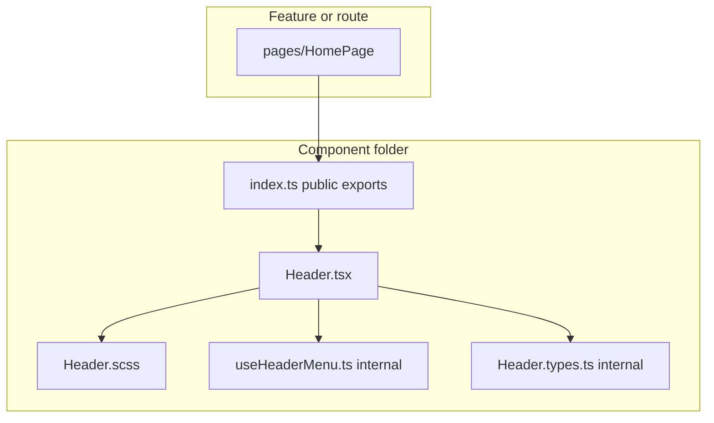

# `many_faces_portal` — component folder colocation (agent prompt)

**Language:** All **new** prose you add to repositories (README, guides, comments in new code, PR description) must be **English**.

**Mission:** Refactor **`many_faces_portal`** so UI building blocks are **not flat piles of files** under `src/components/` and `src/components/grid/`. Each **component** (and each **grid block**) lives in its **own directory** with its **`.tsx`**, **colocated `.scss`**, and any **component-private** helpers (hooks, small utils, constants, types) beside it. **Behavior, routes, API contracts, and i18n keys stay unchanged** — this is a **structural / maintainability** rollout only.

**You are implementing what the product owner asked for:**

> Components will not sit in one heap; each TSX and its related SCSS (and scripts that belong only to that component) live together in folders.

**(required)** Read **§1** (as-is) and **§2** (target layout) before moving files; complete **§12** and **§15** while implementing; update **§11** documentation with the PR; obey the [**engagement exit rule**](#agent-engagement-exit-rule).

**Related (do not duplicate scope unless PR explicitly combines):**

- [fe-performance-and-refactor-agent-prompt.md](./fe-performance-and-refactor-agent-prompt.md) — performance, lazy routes, `App.tsx` slimming (orthogonal; **may** land in the same PR series **after** colocation stabilizes imports).
- [fe-grid-face-scope-rollout-agent-prompt.md](./fe-grid-face-scope-rollout-agent-prompt.md) — grid **behavior** / face scope (do not mix behavior fixes into a pure move PR).
- [unit-test-gap-fill-agent-prompt.md](./unit-test-gap-fill-agent-prompt.md) — add tests **after** folders exist if gaps remain.

**Non-goals:**

- **`many_faces_admin`**, **`many_faces_mobile`**, **`many_faces_backend`** (portal only unless product expands scope).
- Rewriting business logic, API clients, or OpenAPI-generated `src/api/**`.
- Renaming user-visible copy or i18n keys “for cleanliness”.
- Introducing a new state library or router.
- Mandatory barrel files at every ancestor level (only **per-component** `index.ts` where it helps imports).
- Moving **shared** hooks from `src/hooks/` into component folders when **two or more** unrelated features use them.

---

## 0. Compliance — read every part (**required**)

### 0.1 Labels

| Label | Meaning |
| ----- | ------- |
| **(required)** | Must be satisfied before merge, or explicitly deferred in PR with reason. |
| **(required — if _condition_)** | Mandatory when _condition_ is true. |
| **(optional)** | Skip only with written deferral in PR. |

### 0.2 Section coverage (**required** — copy into PR)

| § | Topic | Status (✓ / N/A) | If N/A, reason |
| - | ----- | ---------------- | -------------- |
| **§1** | As-is audit | | |
| **§2** | Target folder layout | | |
| **§3** | What belongs inside a component folder | | |
| **§4** | Import / export rules | | |
| **§5** | `pages/`, `features/`, `shell/` | | |
| **§6** | Grid subsystem | | |
| **§7** | Design system (`radix/`) | | |
| **§8** | Global styles | | |
| **§9** | Phased delivery / PR split | | |
| **§10** | Verification | | |
| **§11** | Documentation | | |
| **§12** | Master checklist (summary) | | |
| **§13** | Before / after examples | | |
| **§14** | Engagement exit rule | | |
| **§15** | Implementing-agent task list | | |
| **§16** | Tooling, CI, conventions | | |

---

## 1. As-is audit — what exists today (**required**)

Re-run counts when starting work (`find src/components -name '*.tsx' | wc -l`).

| Area | Path | Today | Problem |
| ---- | ---- | ----- | ------- |
| **Flat components** | `src/components/*.tsx` + sibling `*.scss` | ~26 TSX pairs at root of `components/` | Hard to see ownership; SCSS drifts away from TSX in reviews |
| **Grid blocks** | `src/components/grid/*` | ~28 TSX + SCSS pairs, flat | Same issue at higher file count |
| **Radix wrappers** | `src/components/radix/*` | Button, Input, FormField + SCSS | Acceptable **group** folder but each control should still be **its own subfolder** after migration |
| **Partial feature colocation** | `src/features/settings/*` | Already grouped by feature | **Keep** — this is the precedent to extend |
| **Shell** | `src/shell/*` | Small set | Colocate the same way **or** document why shell stays flat (if <3 files, optional) |
| **Pages** | `src/pages/*.tsx` | Mostly flat | **Phase 5** (§9) — same rules as components |
| **Routing glue** | `src/routes/*.tsx` | Imports pages/components | Update import paths when targets move |
| **App shell** | `src/App.tsx` | Thin router shell (~few dozen lines) | Update imports only; **do not** move `App.tsx` into `components/` |
| **Tests** | `src/components/__tests__`, `src/components/grid/__tests__` | Centralized test dirs | Prefer **colocated** `ComponentName/ComponentName.test.tsx` when touching a component |
| **Imports** | Whole repo | Relative paths (`../contexts/...`, `./Header.scss`) | Mass update required; use IDE refactor / scripted rewrites |

**Positive patterns to preserve:**

- SCSS imported **from the component file** (`import './Header.scss'`) — only the path changes to `./Header.scss` inside `Header/Header.tsx`.
- `src/features/settings/` — feature-level grouping is correct; do not flatten it back into `components/`.

**Audit tasks (start of engagement):**

- [ ] Paste updated file counts into PR (TSX/SCSS under `components/`, `components/grid/`, `radix/`).
- [ ] Export importer list: `rg "from ['\"].*/(components|components/grid)" src -l | sort -u`.
- [ ] Confirm `src/App.tsx` import list documented before Phase 2.

---

## 2. Target folder layout (**required**)

### 2.1 Canonical shape (one component = one folder)

**Default name:** PascalCase folder name **matches** the primary React component (same as today’s file basename).

```
src/components/Header/
  Header.tsx          # default export or named export — match existing style
  Header.scss
  index.ts            # re-export public API (recommended)
  Header.test.tsx     # (optional) if tests exist for Header
  useHeaderMenu.ts    # (optional) only if used exclusively by Header
  Header.types.ts     # (optional) props/types used only inside this folder (see §2.7)
```

**Import after migration (preferred):**

```ts
// Preferred after migration (folder + index.ts):
import { Header } from '../components/Header';

// Optional Phase 0 only — add Vite/tsconfig alias if team agrees:
// import { Header } from '@/components/Header';
```

**Today:** `many_faces_portal` uses **relative** imports (no `@/` alias in `tsconfig.app.json`). Do not introduce `@/` unless **Phase 0** is explicitly in scope.

**Forbidden after migration:**

```
src/components/Header.tsx
src/components/Header.scss   # sibling flat pair — remove
```

### 2.2 Grid blocks

Apply the **same** rule under `src/components/grid/`:

```
src/components/grid/Blog/
  Blog.tsx
  Blog.scss
  index.ts
  BlogForm.tsx              # allowed: sub-component used only by Blog
  BlogForm.scss
  useBlogCarousel.ts        # allowed if Blog-only
```

If **`BlogForm`** is also imported from outside `Blog/` (grep importers first), either:

- keep `BlogForm/` as its **own** sibling folder under `grid/`, or
- leave a thin re-export in `grid/Blog/index.ts` documenting the public surface.

### 2.3 Design system (`radix/`)

```
src/components/radix/Button/
  Button.tsx
  Button.scss
  index.ts
```

Treat as **shared UI primitives**, not feature code. No business API hooks here.

### 2.4 Barrel `index.ts` rules

| Rule | Detail |
| ---- | ------ |
| **Per-component `index.ts`** | `export { Header } from './Header'` (or `export *` if already named exports) |
| **Public API only** | **`index.ts` exports only what other folders may import** — keep hooks/utils internal unless intentionally shared (§16.5) |
| **No deep import requirement** | Consumers import from `components/Header`, not `components/Header/Header.tsx` |
| **Avoid mega-barrels** | Do **not** add `components/index.ts` that re-exports the entire app |
| **`package.json` sideEffects** | If bundle analysis regresses, document; SCSS side effects stay in component entry files |

### 2.5 Optional path alias **(optional)**

If **Phase 0** is in scope, add `"paths": { "@/*": ["./src/*"] }` in `tsconfig.app.json`, mirror in `vite.config.ts` `resolve.alias`, and migrate imports in the **same PR** as the alias (half-migrated trees break CI).

### 2.6 ESLint `react-refresh` and barrels **(required)**

`eslint-plugin-react-refresh` (Vite preset) warns when a file exports non-components alongside components. **`index.ts` barrels that only re-export** are fine. If a folder’s `index.ts` also exports constants/helpers, either:

- export helpers from a separate `headerTypes.ts` / `useHeaderMenu.ts` file and keep `index.ts` as component-only re-exports, or
- add a **narrow** eslint override for that `index.ts` with a one-line comment (same pattern as `src/contexts/**` in `eslint.config.js`).

Do **not** disable `react-refresh` globally.

### 2.7 Component-local types **(required)**

- Prefer **`ComponentName.types.ts`** (e.g. `Header.types.ts`) for props and small unions used only in that folder.
- Alternatively **`types.ts`** inside the folder when the name is obvious from context.
- **Do not** re-export types from `index.ts` unless another feature imports them — otherwise keep types as implementation details.

---

## 3. What belongs inside a component folder (**required**)

| Belongs **inside** `Component/` | Stays **outside** (shared) |
| ------------------------------- | -------------------------- |
| `.tsx` view + colocated `.scss` | `src/contexts/*` |
| Component-only hooks (`useXxx.ts`) | `src/hooks/api/*` (OpenAPI / Query) |
| Component-only utils (`formatWallTicketDate.ts` used once) | `src/utils/*` used in 3+ places |
| Component-only types (`Header.types.ts`, `types.ts`) | `src/api/types/*` |
| Component-only constants | `src/constants/*` |
| Colocated tests | Cross-feature test utilities in `src/test/` or `__tests__/testUtils.ts` |
| Sub-components **exclusively** composed by this parent (document in folder README comment if non-obvious) | Generated OpenAPI clients |

**Decision rule:** If a hook/util is imported from **more than one** top-level route/feature folder, it remains in `src/hooks/` or `src/utils/`.

- [ ] For each moved component, grep importers before nesting sub-components (§2.2 `BlogForm` rule).

---

## 4. Import / export migration (**required**)

### 4.1 Order of operations (safe sequence)

1. **Inventory** — list every `src/components/**/*.tsx` and importers (`rg "from ['\"].*components/" src`).
2. **Move** — `git mv` (preserve history) TSX + SCSS together into new folder.
3. **Fix** internal imports (SCSS path `./Component.scss` same folder).
4. **Add** `index.ts` re-export.
5. **Update** all importers across `src/`, `App.tsx`, `pages/`, `features/`, tests.
6. **Delete** empty flat files and empty `__tests__` duplicates if tests moved.
7. **Run** `yarn validate`, `yarn test`, `yarn build` (see §10).
8. **Search** for stale paths: `rg "components/[A-Z][^/\"']+\\.tsx" src` should find **no** flat component entry paths after the relevant phase.

### 4.2 SCSS

- Keep **component-scoped** class names as today (no BEM rewrite unless already planned).
- **Do not** move global tokens / mixins out of `src/styles/` — components may `@use` shared partials from `src/styles/` if already done; otherwise leave globals untouched.

### 4.3 Lazy routes

If `React.lazy(() => import('./pages/HomePage'))` exists, update to folder path:

```ts
React.lazy(() => import('./pages/HomePage/HomePage'));
// or
React.lazy(() => import('./pages/HomePage'));
```

when `pages/HomePage/index.ts` exists.

### 4.4 Anti-patterns

| Anti-pattern | Why |
| ------------ | --- |
| Moving files without updating importers | Broken build |
| Splitting one component across `components/` and `features/` with no rule | Confusing ownership |
| Putting API hooks inside presentational folders | Couples UI to transport |
| Renaming exported components in the same PR | Explodes diff; do structure-only first |

---

## 5. `pages/`, `features/`, `shell/` (**required**)

| Layer | Policy |
| ----- | ------ |
| **`src/features/<name>/`** | **Feature modules** (e.g. settings side panel). May contain multiple components, each in **its own subfolder** under the feature: `features/settings/SettingsSidePanel/SettingsSidePanel.tsx`. |
| **`src/pages/`** | **Phase 5** (§9) — apply §2.1 per page: `pages/LoginPage/LoginPage.tsx`. Separate PR after Phases 1–4. |
| **`src/routes/`** | Update imports when `pages/` or `components/` move; no new business logic. |
| **`src/shell/`** | Colocate if more than one file per shell concept; otherwise document N/A in PR §0.2. |

**Do not** move `App.tsx` into `components/` — it stays at `src/App.tsx` (or `src/shell/` only if already extracted per performance prompt).

---

## 6. Grid subsystem (**required**)

- [ ] Every file in `src/components/grid/` except shared grid infrastructure follows **§2.2**.
- [ ] Shared grid helpers used by many blocks (e.g. a generic `GridCell`, `CreatorModerationBadge` if widely imported) may live in:

```
src/components/grid/_shared/GridCell/
```

Use `_shared` (or `common/`) **only** for genuinely shared grid internals — **document** what qualifies in PR.

- [ ] Update [fe-grid-face-scope-rollout-agent-prompt.md](./fe-grid-face-scope-rollout-agent-prompt.md) **audit paths** in the PR description (line numbers will change).
- [ ] **Heavy dependencies** (e.g. `BlogForm` + `react-quill-new` + Quill CSS): keep **lazy/dynamic import** behavior identical to pre-move — colocation must **not** pull Quill into unrelated routes (see [fe-performance-and-refactor-agent-prompt.md](./fe-performance-and-refactor-agent-prompt.md)). If `BlogForm` is shared, use `grid/BlogForm/` as its own folder.

---

## 7. Design system (`radix/`) (**required**)

- [ ] Each primitive gets its own folder (§2.3).
- [ ] Public imports become `from '../radix/Button'` (via `index.ts`).

---

## 8. Global styles (**required**)

| Path | Action |
| ---- | ------ |
| `src/styles/main.scss` | **Keep** — entry, global tokens, resets |
| `src/styles/*.scss` (shared) | **Keep** — do not dissolve into random components |
| Component SCSS | **Move** with component |

- [ ] No component-specific rules were moved into `src/styles/` by mistake.
- [ ] `main.scss` still imports only **global** partials; component SCSS stays beside components.

---

## 9. Phased delivery / PR split (**required**)

Prefer **reviewable PRs** over one giant diff.

| Phase | Scope | Suggested PR title |
| ----- | ----- | ------------------ |
| **0** | (optional) `@/` alias + `index.ts` convention doc in portal README | `chore(portal): path alias for components` |
| **0.5** | (optional) import codemod / helper script only — no mass moves | `chore(portal): colocation helper scripts` |
| **1** | `src/components/radix/*` | `refactor(portal): colocate radix primitives` |
| **2** | Top-level `src/components/*` (non-grid) | `refactor(portal): colocate shell components` |
| **3** | `src/components/grid/*` | `refactor(portal): colocate grid blocks` |
| **4** | `src/features/settings/*` inner structure | `refactor(portal): colocate settings feature components` |
| **5** | `src/pages/*` | `refactor(portal): colocate pages` |

Each PR must pass **§10** independently.

**Commit hygiene:** structure-only commits (no drive-by formatting of unrelated files). Prefer **`git mv`** for TSX/SCSS pairs so `git log --follow` stays useful.

**Importer hotspots** (re-grep every phase): `src/App.tsx`, `src/routes/**`, `src/pages/**`, `src/features/**`, `src/shell/**`, `src/components/**` (grid cross-imports), `src/**/__tests__/**`, `cypress/**` only if it imports `src/` paths directly.

---

## 10. Verification (**required**)

- [ ] `cd many_faces_portal && yarn install --immutable`
- [ ] `yarn validate` (`type-check` + `lint` + `format:check` per `package.json`)
- [ ] `yarn test` (Vitest)
- [ ] `yarn build`
- [ ] **(optional)** `yarn test:e2e:ci` if Cypress covers navigation shell — run before merge if feasible
- [ ] **Grep guard:** no stale flat imports:

```bash
# After Phase 2 (non-grid components): no TSX at components/ root
find src/components -maxdepth 1 -name '*.tsx' | wc -l   # → 0

# After Phase 3 (grid): no TSX at components/grid/ root (except none under _shared/)
find src/components/grid -maxdepth 1 -name '*.tsx' | wc -l   # → 0

# No imports pointing at deleted flat paths (adjust regex after each phase)
rg "from ['\"][^'\"]*components/[A-Za-z]+\\.(tsx|scss)" src || true
```

- [ ] Manual smoke: guest home, login, open settings panel, open one grid-heavy face page — UI unchanged.

---

## 11. Documentation (**required**)

Update in the **same PR series** (English):

| Document | Content |
| -------- | ------- |
| `many_faces_portal/README.md` or `src/components/README.md` (create if missing) | Folder convention §2.1, decision table §3, phased plan pointer |
| [docs/readmes/fe-portal-overview.md](../readmes/fe-portal-overview.md) | “Component colocation” subsection + Mermaid diagram (§16.8) + link to this prompt |
| [docs/prompts/README.md](./README.md) | Row in prompt table (maintainer) |
| `.cursor/rules/portal-component-folders.mdc` | Agent rule: new UI = folder per component (§16.6) |

**Do not** tick `[ ]` items inside this canonical prompt file in git — mirror completion in the PR checklist ([README](./README.md)).

---

## 12. Master checklist (**required** — mirror in PR)

### 12.1 Structure

- [ ] No flat `Component.tsx` + `Component.scss` pairs remain under `src/components/` (except documented exceptions).
- [ ] No flat pairs remain under `src/components/grid/` (except `_shared/`).
- [ ] Each migrated folder has `index.ts` **or** PR explains why omitted.
- [ ] SCSS imports resolve (Vite build proves it).

### 12.2 Imports

- [ ] All importers updated; `yarn build` clean.
- [ ] No circular imports introduced (watch barrel + context re-export loops).

### 12.3 Scope discipline

- [ ] Zero intentional behavior / copy / API changes (diff review).
- [ ] Shared hooks/utils remain shared per §3.

### 12.4 Quality gates

- [ ] §10 commands green.
- [ ] PR lists phases delivered and any deferred phase with reason.

---

## 13. Example before / after (reference)

**Before:**

```
src/components/Header.tsx
src/components/Header.scss
src/components/MainLogo.tsx
src/components/MainLogo.scss
```

**After:**

```
src/components/Header/
  Header.tsx
  Header.scss
  index.ts
src/components/MainLogo/
  MainLogo.tsx
  MainLogo.scss
  index.ts
```

**Before (grid):**

```
src/components/grid/ChatRoomCard.tsx
src/components/grid/ChatRoomCard.scss
```

**After:**

```
src/components/grid/ChatRoomCard/
  ChatRoomCard.tsx
  ChatRoomCard.scss
  index.ts
```

---

<a id="agent-engagement-exit-rule"></a>

## 14. Agent engagement exit rule (NON-NEGOTIABLE)

- **English:** Do **not** declare the task done until **§12** and the **agreed §15 phase section** are satisfied (or explicitly waived in the PR with reason). A half-moved tree (broken imports, flat files left behind) is **not** acceptable. Sub-bullets under a `- [ ]` inherit the same rule.

- **Slovak:** Agent **nesmie skončiť**, kým nie je dokončená dohodnutá fáza podľa **§12** a **§15** — každá komponenta má svoj priečinok so súvisiacim SCSS a privátnymi skriptmi; žiadne „polovičné“ presuny.

**Not governed by this exit rule:** optional **Phase 0** / **0.5**, **§13** examples (reference only), **§16.9** admin follow-up.

---

## 15. Master checklist — implementing agent (**required** — mirror in PR)

Tick in the **PR description**, not in this canonical file ([prompts/README.md](./README.md)).

### 15.0 Preconditions

- [ ] Branch clean; `cd many_faces_portal && yarn install --immutable` succeeds.
- [ ] §1 inventory re-run (`find` / `wc` counts recorded in PR).
- [ ] Scope confirmed: **portal only**, structure-only (no behavior/i18n/API changes).
- [ ] Agreed phase(s) from §9 listed in PR title/body.

### 15.1 Phase 0 — path alias **(optional)**

Skip entire subsection if not in scope; mark **N/A** in PR §0.2.

- [ ] `tsconfig.app.json` + `vite.config.ts` alias added.
- [ ] All touched imports use `@/` consistently (no mixed alias/relative mess).
- [ ] `yarn validate && yarn build` green.

### 15.1b Phase 0.5 — tooling only **(optional)**

- [ ] `scripts/colocate-portal-component.mjs` implemented (§16.1).
- [ ] `scripts/verify-portal-component-colocation.mjs` implemented (§16.2).
- [ ] `.cursor/rules/portal-component-folders.mdc` added (§16.6).
- [ ] No component files moved in this PR (scripts + docs only).

### 15.2 Phase 1 — `src/components/radix/*`

- [ ] `Button/`, `Input/`, `FormField/` (each: `.tsx`, `.scss`, `index.ts`).
- [ ] All importers under `src/` updated.
- [ ] No flat files left in `src/components/radix/`.
- [ ] §10 verification green for this PR.

### 15.3 Phase 2 — top-level `src/components/*` (excluding `grid/`, `radix/`, `__tests__`)

- [ ] Every root-level component pair moved (e.g. `Header/`, `Footer/`, `MessengerTab/`, …).
- [ ] `find src/components -maxdepth 1 -name '*.tsx'` → **0**.
- [ ] Centralized `src/components/__tests__` migrated or deleted if empty (prefer colocated tests).
- [ ] `GuestRoute`, `ProtectedRoute`, `LanguageRouter`, etc. follow §2.1.
- [ ] §10 verification green for this PR.

### 15.4 Phase 3 — `src/components/grid/*`

- [ ] Every grid block colocated per §2.2.
- [ ] `find src/components/grid -maxdepth 1 -name '*.tsx'` → **0** (except documented `_shared/`).
- [ ] Cross-imports between grid blocks use folder barrels (`../Blog`, not `../Blog.tsx`).
- [ ] `src/components/grid/__tests__` handled (move beside components or update paths).
- [ ] PR notes path updates for [fe-grid-face-scope-rollout-agent-prompt.md](./fe-grid-face-scope-rollout-agent-prompt.md) audit.
- [ ] §10 verification green for this PR.

### 15.5 Phase 4 — `src/features/settings/*`

- [ ] Each settings UI piece in its own subfolder (e.g. `SettingsSidePanel/SettingsSidePanel.tsx`).
- [ ] Feature-level imports from `App.tsx` / shell still resolve.
- [ ] §10 verification green for this PR.

### 15.6 Phase 5 — `src/pages/*`

- [ ] Each page folder: `pages/<Name>/<Name>.tsx` + optional colocated SCSS.
- [ ] `React.lazy` / route imports updated in `src/routes/**` and `App.tsx`.
- [ ] §10 verification green for this PR.

### 15.7 Documentation (§11) — once per series or final PR

- [ ] `many_faces_portal/README.md` or `src/components/README.md` describes folder convention.
- [ ] [docs/readmes/fe-portal-overview.md](../readmes/fe-portal-overview.md) links this prompt.
- [ ] [docs/prompts/README.md](./README.md) row present (maintainer).

### 15.8 Final gates (all phases in scope)

- [ ] §12 summary checklist satisfied.
- [ ] `yarn validate && yarn test && yarn build` green on final branch.
- [ ] **(optional)** `yarn test:e2e:ci` green or waiver with reason in PR.
- [ ] Manual smoke: guest home → login → settings panel → one grid-heavy face page — **unchanged UX**.
- [ ] PR lists deferred phases (if any) and why.

### 15.9 Anti-regression grep (final)

- [ ] `rg "components/[A-Za-z0-9]+\\.tsx" src` — no matches to flat component files.
- [ ] `rg "components/grid/[A-Za-z0-9]+\\.tsx" src` — no matches to flat grid files.
- [ ] No duplicate `Header.scss` / `Header.tsx` at old flat paths.

### 15.10 Tooling and CI (§16)

- [ ] `node scripts/verify-portal-component-colocation.mjs` exits **0** on the final branch.
- [ ] **(required in final colocation PR)** `many_faces_portal` CI job runs verify script (§16.3).
- [ ] Orphan SCSS check run or waived with `rg`/knip output in PR (§16.4).
- [ ] New components follow Cursor rule §16.6 (no new flat pairs).

---

## 16. Tooling, automation, and conventions (**required**)

### 16.1 Helper script — `scripts/colocate-portal-component.mjs` **(required)**

Monorepo root script (implement in **Phase 0.5** or first refactor PR):

```bash
# Example: move flat shell component into a folder (dry-run first)
node scripts/colocate-portal-component.mjs Header --dry-run
node scripts/colocate-portal-component.mjs Header

# Grid block
node scripts/colocate-portal-component.mjs Blog --grid
```

**Script MUST:**

- Accept component **PascalCase** name and flags `--grid`, `--dry-run`.
- Resolve paths under `many_faces_portal/src/components/` (or `.../grid/`).
- Use **`git mv`** when not dry-run (TSX + SCSS together).
- Create folder, write minimal **`index.ts`** (`export { X } from './X'`).
- Print **importer files** to update (`rg` on old import paths).

**Script MUST NOT:** auto-edit all importers without review (too risky for one shot) — list paths for IDE refactor.

- [ ] Script exists at repo root and is documented in `src/components/README.md`.

### 16.2 Verify script — `scripts/verify-portal-component-colocation.mjs` **(required)**

```bash
node scripts/verify-portal-component-colocation.mjs
```

**Script MUST exit non-zero when:**

- Any `*.tsx` exists directly under `many_faces_portal/src/components/` (maxdepth 1), except none expected after rollout.
- Any `*.tsx` exists directly under `many_faces_portal/src/components/grid/` (maxdepth 1), except under documented `_shared/`.
- **(optional flag `--imports`)** `rg` finds import strings ending in `components/Foo.tsx` or `components/grid/Foo.tsx`.

**Until colocation is complete:** expect failures on `main` — track progress in PR. **Do not** wire CI until the tree is clean or the team accepts a short-lived red CI (not recommended).

### 16.3 CI wiring — `many_faces_main` **(required in final colocation PR)**

Add to **`.github/workflows/ci.yml`** in job `many_faces_portal`, **after** `yarn-spa-ci` (or equivalent lint/test), from monorepo root:

```yaml
      - name: Verify portal component folder colocation
        working-directory: .
        run: node scripts/verify-portal-component-colocation.mjs
```

Also add `verify-portal-component-colocation.mjs` to `scripts/verify-dev-stack-contracts.sh` **bash -n** file list.

- [ ] CI step merged only when `verify-portal-component-colocation.mjs` passes on the branch.

### 16.4 Orphan SCSS check **(required — run or waive)**

After each phase, ensure no **orphan** `.scss` left at old flat paths:

```bash
# Flat SCSS still sitting beside where TSX used to be
find many_faces_portal/src/components -maxdepth 1 -name '*.scss' | wc -l   # → 0 after Phase 2
find many_faces_portal/src/components/grid -maxdepth 1 -name '*.scss' | wc -l   # → 0 after Phase 3
```

**(optional)** Run **`npx knip`** (or `yarn dlx knip`) in `many_faces_portal` if configured — flag unused SCSS/modules after moves. Waiver allowed in PR with knip output attached.

### 16.5 Public API surface via `index.ts` **(required)**

- **External importers** use `from '../components/Header'` only.
- **`index.ts`** re-exports: main component(s) intentionally public.
- **Internal** files (`useHeaderMenu.ts`, `Header.types.ts`) are **not** exported from `index.ts` unless cross-folder use is required.
- Deep imports (`components/Header/Header.tsx`) are **discouraged** — ESLint optional follow-up, not required in this prompt.

### 16.6 Cursor rule — new components **(required)**

Create **`.cursor/rules/portal-component-folders.mdc`** (monorepo root):

- **globs:** `many_faces_portal/src/components/**/*`, `many_faces_portal/src/features/**/*`
- **Rule:** never add new flat `Component.tsx` + `Component.scss` pairs; always create `ComponentName/` folder with `index.ts`.

- [ ] Rule file committed with this prompt series or first refactor PR.

### 16.7 Optional import codemod — Phase 0.5 **(optional)**

If import volume is high, a one-off **`jscodeshift`** (or `ts-morph`) transform may update:

`from '../components/Header'` → unchanged (already folder-safe)

`from '../components/Header.tsx'` → `from '../components/Header'`

- [ ] Codemod PR is **structure-only**, reviewed with `git diff`, and includes before/after importer counts.

### 16.8 Mermaid — documentation diagram **(required)**

Add to [docs/readmes/fe-portal-overview.md](../readmes/fe-portal-overview.md) (English):



### 16.9 Follow-up: admin parity **(optional — out of scope)**

After portal rollout, clone this prompt for **`many_faces_admin`** as a separate spec (e.g. `fe-admin-component-folder-colocation-agent-prompt.md`) — **do not** refactor admin in the same PR series unless explicitly requested.

### 16.10 New component snippet **(required)**

Document in `many_faces_portal/src/components/README.md`:

```text
New UI block:
  src/components/<Name>/<Name>.tsx
  src/components/<Name>/<Name>.scss
  src/components/<Name>/index.ts   → export { Name } from './Name'
```
