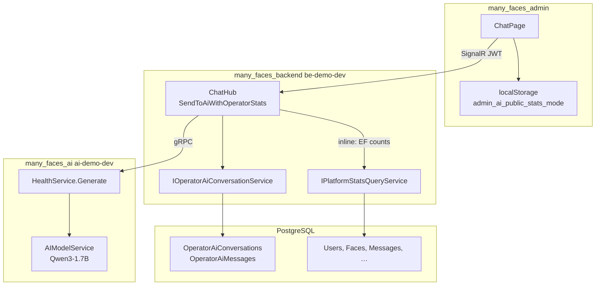
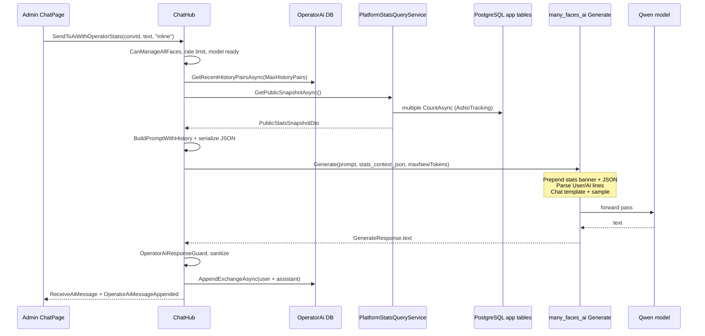

# Operator AI — database data access inspection (agent prompt)

**Language:** English  
**Audience:** Engineers and AI agents working on MFAI Demo (`many_faces_main` monorepo)  
**Scope:** How the **admin operator AI chat** can (and cannot) use **PostgreSQL data** when answering questions — full path from UI → backend → gRPC → local Qwen model.

**Related guides (canonical behaviour):**

- [`docs/guides/admin-dashboard-metrics.md`](../guides/admin-dashboard-metrics.md) — Stats APIs and AI modes  
- [`docs/guides/admin-operator-ai-chat-threads.md`](../guides/admin-operator-ai-chat-threads.md) — threaded conversations, SignalR, config  
- [`docs/guides/backend-stats-and-admin-ai-runbook.md`](../guides/backend-stats-and-admin-ai-runbook.md) — operator checklist  
- [`docs/prompts/admin-ai-public-stats-operator-chat-agent-prompt.md`](./admin-ai-public-stats-operator-chat-agent-prompt.md) — original stats+chat delivery prompt  

---

## 1. Executive summary

The local AI worker (`many_faces_ai`, gRPC port **50051**) **never connects to PostgreSQL** and **cannot run arbitrary SQL**. It only receives:

1. A **text prompt** built by **`many_faces_backend`** (`ChatHub.SendToAiWithOperatorStats`), including optional **server UTC clock** and the last **N conversation turns** loaded from **`OperatorAiMessages`**.
2. An optional **`stats_context_json`** string: **`OperatorAiStatsContextDto`** with **`dashboard`** = full **`AdminDashboardSummaryDto`** (same as `GET /api/Stats`) and optional **`timeseriesLast7Days`** (7-day daily buckets for users/messages/stories).

Therefore, when an operator asks *“How many users do we have?”*, the model can answer **only if**:

- Admin **Settings / localStorage** uses stats mode **`inline`** or **`live`**, and  
- The message is classified as **metrics-related** (unless `OperatorAi:AttachStatsOnlyForMetricsQuestions` is `false`), and  
- The question maps to a field in **`dashboard.*`** or **`timeseriesLast7Days.series`**, and  
- The small local model (e.g. **Qwen3-1.7B**) interprets the JSON correctly (not guaranteed).

The AI **cannot**: list users, read message bodies, run arbitrary SQL, or access per-row PII. It **can** use aggregate dashboard totals and a **7-day daily trend** for three metrics when attached.

---

## 2. Trust boundaries (what is authoritative)

| Source | Authoritative for | Not authoritative for |
|--------|-------------------|-------------------------|
| **`[Server clock: … UTC]`** in prompt (from `ChatHub.BuildPromptWithHistory`) | Current UTC date/time in operator chat | Per-user time zones, scheduled jobs |
| **`stats_context_json`** (`OperatorAiStatsContextDto`) | `dashboard.*` totals + optional `timeseriesLast7Days` | Row-level data, PII, secrets, full timeseries API for all metrics |
| **`OperatorAiMessages` history** (last N pairs) | Prior turns **in this thread** | Other conversations, deleted threads, full DB |
| **Model weights (Qwen)** | Language, general coding knowledge | Live DB state unless reflected in prompt |
| **System prompt** (`ai_model_service.SYSTEM_PROMPT` + runtime block) | Behaviour rules | Facts not injected above |

**Critical:** The Python service may **hallucinate** JSON (e.g. fake `system_time`, `__typename`, `active_sessions`). Post-processing in `ai_model_service._strip_invented_json_fences` removes some patterns; prompts explicitly forbid inventing fields. **Never treat model output as a database query result** without verifying against REST/DB.

---

## 3. End-to-end architecture

### 3.1 Split deployment (Mac dev + Windows AI worker)

Common educational setup:

| Machine | Runs | Role |
|---------|------|------|
| **Mac** | `be-demo-dev`, `admin-demo-dev`, PostgreSQL, Redis, … | Builds prompts, reads DB, persists chat |
| **Windows** | `ai-demo-dev` only | Loads Qwen, runs `Generate` / `OperatorStatsChat` |
| **Network** | Mac `socat` `host.docker.internal:50051` → Windows LAN IP `:50051` | Docker Desktop on Mac often cannot reach LAN IP directly |

`AI_SERVICE_GRPC_ADDRESS=http://host.docker.internal:50051` on Mac BE. **Stats inline** still reads DB on **Mac**; only **inference** runs on Windows.

### 3.2 Component diagram



### 3.3 Sequence: one operator message (inline stats)



---

## 4. Entry point: admin UI

**Route:** `/chat?c={conversationId}` (`many_faces_admin/src/pages/ChatPage/ChatPage.tsx`).

**Send:**

```typescript
connection.invoke('SendToAiWithOperatorStats', conversationId, text, statsMode);
```

**`statsMode`** comes from `getAdminAiPublicStatsMode()` → `localStorage` key **`admin_ai_public_stats_mode`**.

| Mode | Default | Effect on DB access |
|------|---------|---------------------|
| **`off`** | — | No stats JSON; only clock + thread history + user message |
| **`inline`** | **yes** (admin default) | BE queries DB once per message → embeds public snapshot JSON in gRPC |
| **`live`** | — | Python HTTP GET to `AiStats:PublicSnapshotAbsoluteUrl`; on failure BE falls back to inline |

**REST (separate from AI inference):**

- `GET /admin/api/operator-ai/conversations` — thread list  
- `GET /admin/api/operator-ai/conversations/{id}/messages` — paginated history for UI  
- `GET /admin/api/operator-ai/model-status` — gRPC health → Qwen readiness  

History displayed in UI is **REST + SignalR cache**; AI context is **server-side** `GetRecentHistoryPairsAsync`, not the full scrollback unless it fits in `MaxHistoryPairs`.

---

## 5. Backend hub: `SendToAiWithOperatorStats`

**File:** `many_faces_backend/BeDemo.Api/Hubs/ChatHub.cs`  
**Auth:** `[Authorize]` hub + **`CanManageAllFaces()`** inside method (admin face + platform operator role).  
**Rate limit:** `IChatHubAiRateLimiter` per user.  
**Model gate:** `IAiGrpcService.GetModelStatusAsync` — if not `ready`, returns transient Slovak message (not persisted).

### 5.1 Processing steps (ordered)

1. Validate `conversationId`, message length (`OperatorAi:MaxMessageLength`), conversation exists.  
2. Load **`history`** = `IOperatorAiConversationService.GetRecentHistoryPairsAsync(conversationId, MaxHistoryPairs)` (default **5** pairs).  
3. Build **`prompt`** = `BuildPromptWithHistory(message, history)`:
   - Prefix: `[Server clock: yyyy-MM-dd HH:mm:ss UTC]`  
   - For each history entry: `User:` / `AI:` lines  
   - Current user line + trailing `AI:` (completion cue for text format)  
4. Branch on **`statsMode`** (normalized to `off` | `inline` | `live`):  
   - **`inline`:** `GetPublicSnapshotAsync` → JSON → `GenerateAsync(prompt, statsContextJson: json)`  
   - **`live`:** `OperatorStatsChatAsync` (Python may HTTP GET snapshot) → on infrastructure failure, fallback to inline  
   - **`off`:** `GenerateAsync(prompt)` only  
5. **`OperatorAiResponseGuard`:** skip persist for loading/errors; strip prefixes for display.  
6. **`AppendExchangeAsync`** → insert **User** + **Assistant** rows in `OperatorAiMessages`.  
7. SignalR: `ReceiveAiMessage` (caller), `OperatorAiMessageAppended`, `OperatorAiConversationListChanged`.

### 5.2 Configuration (`OperatorAi` section)

| Key | Typical default | Meaning |
|-----|-----------------|--------|
| `MaxHistoryPairs` | 5 | Max user+assistant pairs from DB injected into prompt |
| `MaxMessageLength` | 16000 | User input cap |
| `MaxNewTokens` | 384–2048 | Passed to gRPC `max_new_tokens` |
| `AttachStatsOnlyForMetricsQuestions` | `true` | Skip stats JSON for non-metrics messages in inline/live |
| `IncludeTimeseriesInStatsContext` | `true` | Add `timeseriesLast7Days` when metrics question |
| `MaxConversations` | 1000 | Retention |
| `MessagesPageSize` | 40 | REST page size (UI only) |

**gRPC deadline:** `AiGrpcService` ~**300 s** (slow CPU/GPU generation).

---

## 6. Database: what is read for AI context

### 6.1 Operator chat tables (conversation memory only)

**Purpose:** Persist threads and supply **recent dialogue** to the model.

| Table | AI-relevant columns | Notes |
|-------|---------------------|-------|
| `OperatorAiConversations` | `Id`, `Title`, `UpdatedAt`, … | Metadata; not sent to model except via list UI |
| `OperatorAiMessages` | `Role`, `Content`, `StatsMode`, `CreatedAt` | Only last **N** pairs converted to `User:`/`AI:` text |

**Not sent to AI:** message IDs for context (except indirectly via ordering), other operators’ private notes, full archive if > `MaxHistoryPairs`.

**Implication:** Long threads “forget” early messages for inference. UI pagination can still load older messages from REST, but **generation** uses capped server history.

### 6.2 Platform statistics — `OperatorAiStatsContextDto`

**Built in:** `ChatHub.BuildOperatorStatsContextJsonAsync`  
**When attached:** stats mode `inline` or `live`, and `OperatorAiStatsIntent.IsMetricsQuestion(message)` (unless `AttachStatsOnlyForMetricsQuestions` is `false`).

**Payload shape (camelCase JSON):**

```json
{
  "snapshotUtc": "2026-05-18T12:00:00Z",
  "dashboard": { "...": "AdminDashboardSummaryDto — all fields from GET /api/Stats" },
  "timeseriesLast7Days": {
    "fromUtc": "...",
    "toUtc": "...",
    "bucket": "day",
    "series": {
      "users": [{ "periodStartUtc": "...", "count": 0 }],
      "messages": [ ... ],
      "stories": [ ... ]
    }
  }
}
```

**`dashboard` includes (among others):** `usersCount`, `friendRequestsCount` (pending), `messagesCount`, `facesCount`, `pagesCount`, `friendshipsCount`, `friendRequestsAcceptedCount`, `friendRequestsRejectedCount`, `userFollowsCount`, `userBlocksCount`, `messagesPendingRequestCount`, `notificationsCount`, all UGC totals, face chat/wall/profile engagement counts, `faceWallTicketsByStatus`, `aiReviewJobsCount`, `contentModerationEventsCount`, `oauthClientsCount`.

**`timeseriesLast7Days`:** only when `IncludeTimeseriesInStatsContext` is true and the message is metrics-related — last **7 UTC days**, daily buckets for **users**, **messages**, **stories** only (not full `GET /api/Stats/timeseries` surface).

**Still not injected:** arbitrary timeseries metrics (blogs, reels, …), histogram custom date ranges, `GET /api/Stats/timeseries` as API from the model.

### 6.3 What is never read for operator AI chat today

| Data | API | Why AI cannot see it |
|------|-----|----------------------|
| Full dashboard summary | `GET /api/Stats` | Not wired to `SendToAiWithOperatorStats` |
| Timeseries histograms | `GET /api/Stats/timeseries` | Not wired |
| User profiles, emails, posts content | Various CRUD APIs | No RAG / no tool calling |
| Moderation queue detail | Content moderation APIs | Separate from stats snapshot |
| Content approval (`ReviewContent` gRPC) | Separate RPC | Uses submission fields, not platform stats |

---

## 7. Stats modes — detailed behaviour

### 7.1 Mode `off`

- **DB reads:** `OperatorAiMessages` history only.  
- **gRPC:** `Generate(prompt)` without `stats_context_json`.  
- **Use when:** Coding help, architecture, clock questions (server clock still in prompt text).

### 7.2 Mode `inline` (recommended for metrics)

- **DB reads:** History + **full dashboard** (+ optional 7-day timeseries when metrics question).  
- **Conditional attach:** If `AttachStatsOnlyForMetricsQuestions` is `true` (default), JSON is **omitted** for non-metrics questions (e.g. “what time is it?”) even in inline mode.  
- **gRPC:** `Generate` with `stats_context_json` when attached.

### 7.3 Mode `live`

- **Same as inline** in current code: both modes call `BuildOperatorStatsContextJsonAsync` on the backend. No separate Python HTTP fetch for operator dashboard data.  
- **Historical note:** `OperatorStatsChat` + `FetchPublicStats` remain in proto for other paths; operator chat no longer depends on `AiStats:PublicSnapshotAbsoluteUrl` for the rich payload.

---

## 8. gRPC and Python prompt assembly

**Proto:** `many_faces_proto/proto/health.proto` (copied to backend + AI).

### 8.1 `Generate`

**Request:**

- `prompt` — full text from `BuildPromptWithHistory`  
- `max_new_tokens` — from `OperatorAi:MaxNewTokens`  
- `optional stats_context_json` — camelCase JSON string  

**Python (`server.py`):** If `stats_context_json` set:

```text
[Platform statistics JSON — use ONLY listed fields for user/post counts.
 NOT for clock/time. Do NOT invent system_time, __typename, or other fields.]
{ ... json ... }

---

[Server clock: ... UTC]
User: ...
AI: ...
User: <current>
AI:
```

**Model service (`ai_model_service.py`):**

- Parses `User:`/`AI:` lines into chat messages + **system prompt** (includes **live UTC** at generate time).  
- `enable_thinking=False` for Qwen3.  
- Generation: default **sampling** (`MFAI_FAST_GENERATION=0`), repetition penalty, optional `no_repeat_ngram_size`.  
- **Sanitize:** strip think tags, invented JSON fences, parroted closings.

### 8.2 `FetchPublicStats` / `ReviewContent`

- **`FetchPublicStats`:** utility GET for live mode; returns raw JSON body or error.  
- **`ReviewContent`:** **separate** moderation pipeline — **do not** pass `stats_context_json` or operator chat prompts into it.

---

## 9. REST endpoints operators may confuse with AI access

| Endpoint | Auth | Injected into AI? |
|----------|------|-------------------|
| `GET /admin/api/Stats` | JWT + `CanManageAllFaces` | **Same data as** `dashboard` in stats JSON when attached |
| `GET /admin/api/Stats/timeseries` | Same | **Partial** — only 7-day users/messages/stories in `timeseriesLast7Days` |
| `GET /public/api/Stats/public` | Anonymous on **public** face | **No longer** used for operator chat context (subset of dashboard) |
| `GET /admin/api/operator-ai/...` | Operator JWT | Persistence/UI only |

The dashboard **“AI & public aggregates”** panel may **display** public snapshot for humans; chat uses the **same DTO** when mode is inline/live.

---

## 10. Question-type cookbook (for testers and future agents)

| Operator question | Required mode | Where answer should come from | Common failure |
|-------------------|---------------|------------------------------|----------------|
| “How many users?” | inline/live | `usersCount` in JSON | off → hallucination |
| “How many messages in DB?” | inline/live | `messagesCount` | Model invents field name |
| “What time is it?” | any | `[Server clock: …]` in prompt | Model emits fake JSON (mitigated) |
| “Show me user john@…” | — | **Not supported** | Model invents PII |
| “Last 10 messages text” | — | **Not supported** | No message body in snapshot |
| “Posts per day this week” | — | **Not supported** | Timeseries not injected |
| “How many pending wall tickets by status?” | inline/live + metrics | `dashboard.faceWallTicketsByStatus` | Model misreads keys |
| “User signups this week?” | inline/live + metrics | `timeseriesLast7Days.series.users` | Only 7-day daily users |
| “Explain SignalR in our project” | off OK (or inline without JSON if non-metrics) | System prompt | — |

**Prompting tips for 1.7B:**

- Use **field names** from snapshot: “What is `usersCount` in the statistics JSON?”  
- **New chat** after prompt/rule changes (old assistant turns pollute history).  
- Prefer **Slovak or English** consistently; 1.7B weak on SK grammar either way.

---

## 11. Security and privacy notes

- Public snapshot is **aggregates only** — designed for anonymous-safe demo.  
- Still **sensitive in aggregate** (total users, messages) — do not expose `GET /public/...` on untrusted networks without thought.  
- AI worker on Windows **does not** need DB credentials — only gRPC from trusted BE.  
- Operator chat content is stored in **`OperatorAiMessages`** — protect DB backups.  
- **No automatic PII redaction** in prompts beyond what history contains (operators should not paste secrets).

---

## 12. Extension options

| Item | Status |
|------|--------|
| Full `AdminDashboardSummaryDto` in stats JSON | **Implemented** |
| Conditional stats attach (`OperatorAiStatsIntent`) | **Implemented** (`AttachStatsOnlyForMetricsQuestions`) |
| 7-day timeseries hints (users/messages/stories) | **Implemented** (`IncludeTimeseriesInStatsContext`) |
| System prompt field catalog in `ai_model_service` | **Implemented** |
| Tool calling / RAG / arbitrary SQL | **Not implemented** |
| All `GET /api/Stats/timeseries` metrics & custom ranges | **Not implemented** |
| Larger model or cloud API | Product choice |

---

## 13. File index (implementation map)

| Area | Path |
|------|------|
| SignalR hub | `many_faces_backend/BeDemo.Api/Hubs/ChatHub.cs` |
| Stats queries | `many_faces_backend/BeDemo.Api/Services/PlatformStatsQueryService.cs` |
| Stats REST | `many_faces_backend/BeDemo.Api/Controllers/StatsController.cs` |
| gRPC client | `many_faces_backend/BeDemo.Api/Services/AiGrpcService.cs` |
| Proto | `many_faces_proto/proto/health.proto` |
| Python gRPC | `many_faces_ai/server.py` |
| Model + prompts | `many_faces_ai/services/ai_model_service.py` |
| Admin chat UI | `many_faces_admin/src/pages/ChatPage/ChatPage.tsx` |
| Stats mode storage | `many_faces_admin/src/utils/adminAiStatsSettings.ts` |
| Compose BE AI URL | `docker-compose.dev.yml` → `AiStats__PublicSnapshotAbsoluteUrl` |
| Operator AI guide | `docs/guides/admin-operator-ai-chat-threads.md` |

---

## 14. Agent checklist (verification)

- [ ] Confirm `admin_ai_public_stats_mode` for the test browser (`inline` vs `off`).  
- [ ] Confirm `model-status` returns `ready` and expected `modelName`.  
- [ ] Send metric question with **inline** — tcpdump/log that `stats_context_json` is non-empty on gRPC (dev logging).  
- [ ] Send “what time is it?” — answer cites UTC from server clock, no fabricated JSON.  
- [ ] Confirm **live** URL reachable from AI container if testing live mode on split hosts.  
- [ ] Confirm `MaxHistoryPairs` behaviour on thread with >5 exchanges (older context omitted).  
- [ ] Document that **dashboard `GET /api/Stats`** totals may **differ** from public snapshot fields (different DTOs).

---

## 15. Summary sentence for product copy

> **MFAI operator AI reads the database only through the ASP.NET backend:** it receives aggregate counts (public snapshot JSON), recent chat lines from PostgreSQL, and the server clock — never direct SQL. For reliable platform numbers, use **inline** or **live** stats mode and ask about specific snapshot fields; for everything else, treat answers as generic assistant text, not live queries.
