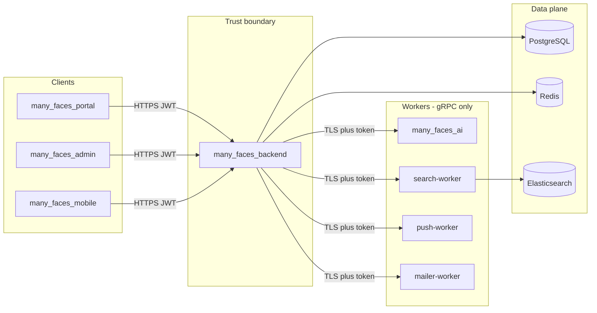

# Security hardening v2 — full monorepo agent prompt

**Language:** English (identifiers and code paths follow the repository).  
**Use:** Copy **§20** (master instructions) or the **whole document** into a new AI agent session.

**Engagement name:** **Security hardening v2** (2026-05-16 scope audit).  
**Supersedes / extends:** [security-hardening-full-stack-edge-tests-agent-prompt.md](./security-hardening-full-stack-edge-tests-agent-prompt.md) (**v1**, 2026-04-11 completion record in [`../guides/security-crypto-sockets.md`](../guides/security-crypto-sockets.md#security-hardening-engagement--completion-record-2026-04-11)). **Do not re-litigate v1 items already marked done** unless code drift is proven — **verify first**, then implement **net-new** items in this prompt.

**Strict compliance:** Every checklist item in **§14–§19** must be **completed** or **explicitly blocked** with a **tracking id** (`TRACK-SHV2-*`), owner, and written reason in the agent’s final report. Deferral without a tracking id is **forbidden**.

**Worksheet vs git:** The `[ ]` lists in **this** file are **templates**. Tick items in the **PR body / agent report**; do not mass-replace with `[x]` in git unless the team uses this file as a living completion log (see [prompts/README.md](./README.md)).

**Related docs (read before coding):**

| Doc | Purpose |
|-----|---------|
| [../guides/security-crypto-sockets.md](../guides/security-crypto-sockets.md) | K/J/O/T/S/H/D/M backlog; v1 completion record |
| [../guides/authentication-and-sessions.md](../guides/authentication-and-sessions.md) | Bearer + `localStorage` threat model |
| [../guides/acl-and-capabilities.md](../guides/acl-and-capabilities.md) | ACL, SignalR, capabilities |
| [../guides/ai-assisted-content-approval.md](../guides/ai-assisted-content-approval.md) | Moderation pipeline |
| [../guides/elasticsearch-grpc-tls-mtls.md](../guides/elasticsearch-grpc-tls-mtls.md) | Search worker TLS |
| [../guides/push-grpc-tls-mtls.md](../guides/push-grpc-tls-mtls.md) | Push worker TLS |
| [../guides/mailer-grpc-tls-mtls.md](../guides/mailer-grpc-tls-mtls.md) | Mailer worker TLS |
| [../guides/signalr-hub-security-matrix.md](../guides/signalr-hub-security-matrix.md) | Hub auth matrix |
| [moderation-content-prompt-injection-defense-agent-prompt.md](./moderation-content-prompt-injection-defense-agent-prompt.md) | **Phase 0** — prompt-injection defense (normative for moderation) |
| [super-admin-api.md](./super-admin-api.md) | **Required** for `SUPER_ADMIN` HTTP changes |
| [mermaid-documentation-diagrams-agent-prompt.md](./mermaid-documentation-diagrams-agent-prompt.md) | Mermaid style + `mmdc` rules |

**Hard boundaries (without explicit user approval):**

- Do **not** replace Bearer + `localStorage` with **httpOnly cookies + BFF** (document as `TRACK-SHV2-BFF` future work only).
- Do **not** run external penetration tests or change cloud accounts outside this repo.
- Do **not** refactor unrelated product features.

These boundaries **do not** relax documentation, tests, or infra profiles in this prompt.

---

## 1. Objectives

1. **Close trust-boundary gaps** between `many_faces_backend` and workers (`many_faces_ai`, `many_faces_elastic`, `many_faces_push`, `many_faces_mailer`), plus **Redis**, **Elasticsearch**, and **dev compose** lateral movement.
2. **Finish prompt-injection defense** for the moderation pipeline (Phase 0) and keep backend policy as source of truth.
3. **Harden client surfaces** (portal, admin, mobile): CSP, XSS on blog HTML, portal 401/refresh parity, env secret policy.
4. **Operational security:** secrets out of git, sane JWT TTLs, PII-safe logging, rate limits, upload validation, CI gates.
5. **Tests + docs:** edge-case tests per layer; update guides with **canonical Mermaid** trust-boundary diagram; reconciliation entry in `security-crypto-sockets.md`.

---

## 2. Monorepo scope map (all submodules)

| Submodule | Stack | Security focus in v2 |
|-----------|-------|----------------------|
| **`many_faces_backend`** | .NET 10, ASP.NET Core, EF, SignalR, gRPC clients | Auth fallback, TTL, rate limits, logs, uploads, gRPC to AI/workers, moderation wiring |
| **`many_faces_portal`** | React, Vite, TanStack Query | CSP, blog XSS, 401 refresh, Vitest |
| **`many_faces_admin`** | React, Vite | CSP, shared refresh module, moderation UI, SUPER_ADMIN audit |
| **`many_faces_mobile`** | Expo, RN | SecureStore, deep links, ATS, token refresh |
| **`many_faces_ai`** | Python gRPC | TLS + service auth, SSRF on `FetchPublicStats`, sanitize parity |
| **`many_faces_elastic`** | ES + Go search-worker | ES auth, mandatory worker token, TLS, no host ES in hardened profile |
| **`many_faces_push`** | Go gRPC, FCM | Mandatory token, TLS, reflection off, push-token API completion |
| **`many_faces_mailer`** | Java gRPC, Pebble | `action_link` policy, mandatory token, TLS, recipient policy |
| **`many_faces_database`** | PostgreSQL | Env-only credentials, pgAdmin dev-only |
| **`many_faces_redis`** | Redis 7 | `requirepass`/ACL, no host port in hardened profile |
| **`many_faces_logger`** | Dozzle | Dev-only; document prod log RBAC |
| **Monorepo root** | `docker-compose.dev.yml`, `scripts/`, `.github/` | `docker-compose.hardened.yml` (or `HARDENED=1`), CI audit fail, secret scan |

**Nested `many_faces_proto`:** If auth metadata or RPC contracts change, follow [proto-shared-repository-and-submodules-agent-prompt.md](./proto-shared-repository-and-submodules-agent-prompt.md) — **one** proto edit, bump all consumers.

---

## 3. Trust boundary (canonical — implement + document)

**Required:** Add this diagram (or equivalent) to [`../guides/security-crypto-sockets.md`](../guides/security-crypto-sockets.md) under a new **“Security hardening v2 — trust boundary”** subsection; cross-link from root `README.md` Security Highlights.

---

## 4. Phase 0 — Prompt-injection defense (moderation) — **P0**

**Normative detail (threat model, sanitization design, policy branches, LLM path):** [moderation-content-prompt-injection-defense-agent-prompt.md](./moderation-content-prompt-injection-defense-agent-prompt.md) — **§3–§6, §8 Phase 3–5** (do not re-copy that prose here).

**Engagement task IDs (tick in PR/report):** **PI-1…PI-10** below. Cross-cutting items also assigned in later v2 phases (**PI-8** ↔ portal blog XSS **FE-P2**).

**Typical paths (verify after submodule checkout):**

| Component | Paths |
|-----------|-------|
| Backend sanitize + heuristic | `many_faces_backend/BeDemo.Api/Services/ContentModerationInputSanitizer.cs`, `ContentModerationPromptInjectionHeuristic.cs`, `ContentModerationTextNormalization.cs`, `ContentModerationUntrustedContentEvaluator.cs`, `ContentModerationPromptInjectionCorpus.cs` |
| Backend policy | `ContentModerationHelpers.cs`, `ContentAiReviewService.cs`, `ContentModerationSecurityOptions.cs` |
| Backend tests | `many_faces_backend/BeDemo.Api.Tests/ContentModerationSecurityEdgeTests.cs`, `Fixtures/prompt_injection_corpus.txt` |
| AI mirror | `many_faces_ai/moderation_input_sanitize.py`, `server.py` `ReviewContent` |
| Docs | `docs/guides/ai-assisted-content-approval.md` |

### 4.1 Phase 0 tasklist

- [ ] **PI-1** Wire sanitizer + heuristic into **production** moderation path before `ReviewContentAsync` (not test-only).
- [ ] **PI-2** `ContentModerationSecurityOptions:InstructionHeuristicEnabled = true` in non-dev appsettings profile.
- [ ] **PI-3** Policy: instruction-like or `prompt_injection_suspected` → **never** auto-`RecommendedApprove`; malicious model approve → `NeedsHumanReview`.
- [ ] **PI-4** Mirror sanitization in `many_faces_ai` for fields sent to any LLM path.
- [ ] **PI-5** Corpus tests: every line in `prompt_injection_corpus.txt` → safe stored state (no unsafe approve persistence).
- [ ] **PI-6** Zero-width / homoglyph / mixed-script cases in edge tests.
- [x] **PI-7** Redact/truncate user content in `ProcessQueuedReviewAsync` invalid-payload logs (align with `RedactForAudit`) — `ContentModerationHelpers.FormatInvalidAiReviewPayloadForLog`, `ContentModerationPayloadLogRedactionTests`.
- [ ] **PI-8** Admin/portal: moderation preview **text-only** (no `dangerouslySetInnerHTML` on untrusted fields).
- [ ] **PI-9** Docs: untrusted vs trusted operator AI subsection in `ai-assisted-content-approval.md`.
- [ ] **PI-10** CI: run `ContentModerationSecurityEdgeTests` in required backend job.

---

## 5. Phase 1 — Backend API (`many_faces_backend`)

### 5.1 AuthN / AuthZ / session

| ID | Task | Paths / notes |
|----|------|----------------|
| BE-A1 | [ ] Global `FallbackPolicy = RequireAuthenticatedUser`; explicit `[AllowAnonymous]` on OAuth, JWKS, localization, documented public routes | `Program.cs` |
| BE-A2 | [ ] Fix `Jwt:ExpiresInMinutesRememberMe` (remove multi-year value; align with refresh policy, e.g. 7d access + 90d refresh) | `appsettings*.json`, `OAuthAccessTokenFactory.cs` |
| BE-A3 | [ ] Raise `Password.RequiredLength` to ≥12 (dev profile may use lower via `appsettings.Development.json` only) | `Program.cs` |
| BE-A4 | [ ] Cookie `AuthController`: `lockoutOnFailure: true` + rate limits matching OAuth | `Controllers/AuthController.cs` |
| BE-A5 | [ ] Document deprecate-or-align plan for cookie auth vs OAuth2 | `docs/guides/authentication-and-sessions.md` |
| BE-A6 | [ ] SignalR: prefer `Authorization` header; redact `access_token` query in logs | `Program.cs`, logging config |
| BE-A7 | [ ] Audit `[AllowAnonymous]`: `AdminMailerTestController`, `LocalizationController`, public stats — rate limit or dev-only | respective controllers + `FaceScopeEnforcementMiddleware.cs` |

### 5.2 Rate limiting & abuse

- [ ] **BE-R1** Global API rate limiter (IP; user id after auth).
- [ ] **BE-R2** Limits on: `AuthController`, file upload, `GET .../register/prefill`, SignalR negotiate/connect.
- [ ] **BE-R3** Tests: burst → **429** + `Retry-After` where applicable.

### 5.3 Transport, headers, config

- [ ] **BE-T1** Enable HTTPS redirection + HSTS in production profile (keep dev HTTP documented).
- [ ] **BE-T2** Restrict `AllowedHosts` in production (not `*`).
- [ ] **BE-T3** CORS: production origins config-only; narrow methods/headers if feasible.
- [ ] **BE-T4** Verify `SecurityHeadersMiddleware` on API responses; static `/uploads/` if served separately.

### 5.4 Secrets

- [ ] **BE-S1** Remove demo secrets from committed `appsettings.json` (DB password, `OAuth2:ClientSecret`) — placeholders + env vars.
- [ ] **BE-S2** Remove hardcoded `bedemo_password` from `Program.cs` diagram/bootstrap paths.
- [ ] **BE-S3** Document env var names in `many_faces_backend/README.md` and `security-crypto-sockets.md`.
- [ ] **BE-S4** Seq: HTTPS + API key in prod profile.

### 5.5 gRPC clients (workers + AI)

| ID | Task |
|----|------|
| BE-G1 | [ ] `AiGrpcService`: TLS + metadata service token (or mTLS); no cleartext off localhost |
| BE-G2 | [ ] Mandatory `Search:WorkerAuthToken`, `Push:WorkerAuthToken`, `Mail:WorkerAuthToken` in hardened profile |
| BE-G3 | [ ] `GrpcWorkerChannelFactory`: enable cert revocation in prod (`X509RevocationMode` not `NoCheck`) |
| BE-G4 | [ ] Document dev cleartext h2c vs prod TLS in worker READMEs |
| BE-G5 | [ ] Implement or remove dead `Search:ApiKey` config |

### 5.6 Uploads & static files

- [ ] **BE-U1** Magic-byte / content-type validation on avatar/story uploads.
- [ ] **BE-U2** Align max size error message with `MaxFileSizeBytes` (fix 5 MB vs 30 MB mismatch).
- [ ] **BE-U3** Protect `/uploads/*`: signed URLs or auth proxy (document threat of public avatars).
- [ ] **BE-U4** Path traversal tests in `SecurityEdgeCaseTests` or dedicated upload tests.
- [ ] **BE-U5** Non-guessable filenames if still using predictable paths.

### 5.7 Logging & PII

- [ ] **BE-L1** Stop logging raw usernames on failed OAuth password grant (hash or omit).
- [ ] **BE-L2** Stop logging raw emails on registration invite flows.
- [ ] **BE-L3** Do not log full chat/AI message bodies in `ChatHub` (metadata only).
- [ ] **BE-L4** Document redaction rules in `security-crypto-sockets.md`.

### 5.8 Supply chain (backend)

- [ ] **BE-D1** CI: `dotnet list package --vulnerable` **fails** on high/critical (or documented waiver per package with `TRACK-SHV2-*`).
- [ ] **BE-D2** Record audit snapshot date in `security-crypto-sockets.md`.

### 5.9 Reconcile v1 backlog (verify, then tick only if true)

- [ ] **BE-V1** K1–K6 JWKS / key rotation — per `security-crypto-sockets.md`.
- [ ] **BE-V2** J1–J7 JWT validation — per code vs guide.
- [ ] **BE-V3** O1–O6 OAuth — per code vs guide.
- [ ] **BE-V4** S1–S6 every hub in `Hubs/*.cs` — matrix in `signalr-hub-security-matrix.md`.
- [ ] **BE-V5** Swagger production policy — `Swagger:EnableInProduction`.

---

## 6. Phase 2 — Portal (`many_faces_portal`)

| ID | Task | Paths |
|----|------|-------|
| FE-P1 | [ ] Axios/fetch **401 refresh queue** parity with admin (no logout while refresh token valid) | `src/api/config.ts`, `authAwareFetch.ts`, compare `many_faces_admin/src/api/interceptors.ts` |
| FE-P2 | [ ] **BlogDetailPage**: remove raw `dangerouslySetInnerHTML` or sanitize (DOMPurify) + server-side HTML policy | `src/pages/BlogDetailPage/BlogDetailPage.tsx` |
| FE-P3 | [ ] Validate `img src` / URLs from API (https allow-list) | same + backend if needed |
| FE-P4 | [ ] **CSP** headers on static/nginx host | `dev/nginx-fe-wait/nginx.conf`, prod nginx template |
| FE-P5 | [ ] Document `VITE_OAUTH2_CLIENT_SECRET` as **demo-only**; hardened build uses public client + PKCE or server-mediated token (`TRACK-SHV2-BFF` if deferred) | `src/config/env.ts`, `authentication-and-sessions.md` |
| FE-P6 | [ ] Vitest: auth 401/refresh, expired token purge, face-prefixed API base | `src/hooks/api/*.test.ts` |
| FE-P7 | [ ] Extract shared `authRefreshInterceptor` module if duplicating admin (optional DRY) | new `packages/` or shared doc only |

---

## 7. Phase 3 — Admin (`many_faces_admin`)

| ID | Task | Paths |
|----|------|-------|
| FE-A1 | [ ] CSP on admin static host (same policy approach as portal) | nginx / Vite deploy config |
| FE-A2 | [ ] Share refresh interceptor with portal (import shared module or copy with test parity) | `src/api/interceptors.ts` |
| FE-A3 | [ ] `sessionStorage` AI chat: clear on logout; no system prompts in storage | `src/pages/ChatPage/ChatPage.tsx` |
| FE-A4 | [ ] Moderation drawer: remain text-only; tests for injection strings in preview | `ContentModerationPage/ModerationItemDrawer.tsx` |
| FE-A5 | [ ] SUPER_ADMIN routes audit per [super-admin-api.md](./super-admin-api.md) | controllers + `acl/` |
| FE-A6 | [ ] Vitest: admin prefix, capabilities, 403 states | existing test dirs |

---

## 8. Phase 4 — Mobile (`many_faces_mobile`)

| ID | Task | Paths |
|----|------|-------|
| MOB-1 | [ ] Document SecureStore threat model in README | `src/utils/secureStorage.ts`, README |
| MOB-2 | [ ] Prod web build: memory-only tokens (verify); dev web `localStorage` clearly dev-only | `secureStorage.ts` |
| MOB-3 | [ ] Registration deep link `manyfaces://register/complete`: backend single-use hash + rate limit verified | `src/utils/registrationDeepLink.ts`, backend invite service |
| MOB-4 | [ ] Remove `NSExceptionAllowsInsecureHTTPLoads` from **production** iOS config | `app.config.ts` |
| MOB-5 | [ ] `httpClient` single 401 refresh retry — tests for loop prevention | `src/api/httpClient.ts` |
| MOB-6 | [ ] Align `@microsoft/signalr` major with portal where feasible | `package.json` |
| MOB-7 | [ ] Document cert pinning as `TRACK-SHV2-PINNING` future work | README |

---

## 9. Phase 5 — AI worker (`many_faces_ai`)

| ID | Task | Paths |
|----|------|-------|
| AI-1 | [ ] gRPC **TLS** server + shared-secret or mTLS metadata validation | `server.py` |
| AI-2 | [ ] Do not map `50051:50051` to host in **hardened** compose profile | `docker-compose.dev.yml` / new hardened compose |
| AI-3 | [ ] `FetchPublicStats`: backend allow-list URLs before calling AI; block private IP ranges | `server.py`, backend operator chat path |
| AI-4 | [ ] Max message size, RPC timeouts, rate limits on `Generate` / `ReviewContent` | `server.py` |
| AI-5 | [ ] Threat model doc: who may call `ReviewContent` directly | `many_faces_ai/README.md` |
| AI-6 | [ ] `moderation_input_sanitize.py` aligned with backend corpus rules | Phase 0 |

---

## 10. Phase 6 — Elasticsearch + search worker (`many_faces_elastic`)

| ID | Task | Paths |
|----|------|-------|
| ES-1 | [ ] Hardened profile: **no** host publish of ES `59200` OR enable xpack security | `docker-compose.yml` |
| ES-2 | [ ] Worker → ES: API key / basic auth in Go config | `internal/config/config.go` |
| ES-3 | [ ] Mandatory `SEARCH_WORKER_EXPECTED_TOKEN` in hardened compose | `docker-compose.yml`, `auth_interceptor.go` |
| ES-4 | [ ] TLS on search-worker gRPC (reuse `grpccreds`, TLS smoke in CI) | `cmd/search-worker/main.go` |
| ES-5 | [ ] Disable gRPC reflection in prod build | `cmd/search-worker/main.go` |
| ES-6 | [ ] Docs: dev ES is not production-safe | `docs/guides/elasticsearch-local-dev.md` |

---

## 11. Phase 7 — Push worker (`many_faces_push`)

| ID | Task | Paths |
|----|------|-------|
| PUSH-1 | [ ] Mandatory `PUSH_WORKER_EXPECTED_TOKEN` in hardened profile | `docker-compose.yml`, `internal/server/auth_interceptor.go` |
| PUSH-2 | [ ] TLS on push-worker gRPC + CI smoke | `cmd/push-worker/main.go`, `docker-compose.tls-smoke.yml` |
| PUSH-3 | [ ] `PUSH_WORKER_GRPC_REFLECTION=0` in hardened profile | `docker-compose.yml` |
| PUSH-4 | [ ] Implement **`POST /api/me/push-token`** (or remove schema/docs if out of scope) with user binding + face scope | `BeDemo.Api/Controllers/`, EF `UserPushDevice` |
| PUSH-5 | [ ] Document: worker does not authorize domains — backend must not forward arbitrary tokens | `push_service.go`, README |
| PUSH-6 | [ ] Firebase SA never logged; path gitignored | `.gitignore`, README |

---

## 12. Phase 8 — Mailer (`many_faces_mailer`)

| ID | Task | Paths |
|----|------|-------|
| MAIL-1 | [ ] Mandatory `MAILER_WORKER_EXPECTED_TOKEN` in hardened profile | `MailerAuthInterceptor.java`, compose |
| MAIL-2 | [ ] TLS on mailer gRPC + CI smoke | `MailerWorkerMain.java` |
| MAIL-3 | [ ] Policy: `action_link` in templates is **server-built only**; validate https + expected host before enqueue | `account_registration_code.html`, `RegistrationInviteService.cs` |
| MAIL-4 | [ ] Never pass user-controlled URLs into `{{ action_link\|raw }}` | code review + test |
| MAIL-5 | [ ] Recipient domain policy for prod (document) | `SmtpMailSender.java`, `MailerServiceImpl.java` |
| MAIL-6 | [ ] `reply_to` header injection validation | `SmtpMailSender.java` |
| MAIL-7 | [ ] `MAILER_WORKER_GRPC_REFLECTION=0` in hardened profile | compose |
| MAIL-8 | [ ] Backend rate limit on mail enqueue (registration codes) | new middleware or existing rate limiter |

---

## 13. Phase 9 — Infra & auxiliary services

### 13.1 Redis (`many_faces_redis`)

- [ ] **INF-R1** `requirepass` or ACL user for app; document env var `REDIS_PASSWORD`.
- [ ] **INF-R2** Hardened compose: no `6379:6379` host mapping.
- [ ] **INF-R3** Document sensitive job payload handling in queue (`bedemo:jobs:*`).

### 13.2 PostgreSQL (`many_faces_database`)

- [ ] **INF-PG1** Credentials via env only in compose examples.
- [ ] **INF-PG2** pgAdmin dev-only; not in hardened prod-like profile.
- [ ] **INF-PG3** Least-privilege DB user for runtime vs migrations (document).

### 13.3 Logger (`many_faces_logger`)

- [ ] **INF-L1** Document Dozzle as **dev-only**; prod uses Seq with RBAC.

### 13.4 Dev orchestration (monorepo root)

- [ ] **INF-D1** Add `docker-compose.hardened.yml` **or** `HARDENED=1` in `start-all-dev.sh` enabling: worker tokens required, TLS URLs, AI not on host port, ES/Redis restricted.
- [ ] **INF-D2** Extend `scripts/verify-dev-stack-contracts.sh` for hardened checks.
- [ ] **INF-D3** Document lateral movement risk of `many_faces_main_dev-network` in `security-crypto-sockets.md`.

---

## 14. Phase 10 — CI, audits, E2E

| ID | Task | Paths |
|----|------|-------|
| CI-1 | [ ] `yarn npm audit` **fails** on high/critical for portal, admin, mobile (remove `\|\| true` or gate) | `.github/workflows/ci.yml` |
| CI-2 | [ ] `scripts/audit-monorepo-deps.sh` invoked in CI or documented weekly cadence | `scripts/` |
| CI-3 | [ ] Worker TLS smoke jobs **required** (not optional) for elastic, push, mailer | `ci.yml`, `*/scripts/smoke-grpc-tls.sh` |
| CI-4 | [ ] Secret scanning (gitleaks or trufflehog) on PR | new workflow or existing |
| CI-5 | [ ] Cypress / E2E: login → authenticated call → refresh or logout | per v1 §12 |
| CI-6 | [ ] Backend: `SecurityEdgeCaseTests`, OAuth chain, SignalR connect test remain green | `BeDemo.Api.Tests` |

---

## 15. English code documentation (mandatory)

Same rules as v1 **§14**:

- [ ] **BE:** XML on security-related APIs; English comments on non-obvious branches.
- [ ] **BE tests:** English scenario summary per new security test class/method.
- [ ] **FE/admin/mobile:** TSDoc on auth/ACL/API/SignalR exports.
- [ ] **Workers (Go/Java/Python):** package/doc comments on auth interceptors and TLS loaders.

---

## 16. Documentation closure (mandatory)

### 16.1 Inventory (required)

1. `docs/guides/security-crypto-sockets.md` — add **§ Security hardening v2 completion record** (date, PR links, deferred `TRACK-SHV2-*`).
2. Reconcile v1 baseline table; list what v2 changed.
3. Update `docs/README.md` and root `README.md` Security links if paths added.
4. Submodule READMEs touched by TLS/token env vars.

### 16.2 Mermaid (required)

- [ ] Trust boundary (**§3**) in `security-crypto-sockets.md`.
- [ ] Worker auth flow (metadata token + TLS) — one canonical diagram.
- [ ] Moderation untrusted-content path — link to `ai-assisted-content-approval.md` diagram (avoid duplicate).
- [ ] **Render-check** all new Mermaid (`scripts/check-mermaid-docs.sh` or `mmdc`).

### 16.3 Documentation checklist

- [ ] **DOC-1** Every new env var documented with example placeholder.
- [ ] **DOC-2** Hardened vs dev compose table in `docs/guides/` or root README.
- [ ] **DOC-3** OAuth error policy table still accurate (v1 §6.1).
- [ ] **DOC-4** SPA `localStorage` XSS risk stated; CSP documented as compensating control.

---

## 17. Suggested PR split (agent may use one PR if user insists)

| PR | Scope |
|----|--------|
| **1** | Phase 0 — moderation PI defense |
| **2** | Phase 1 — backend API hardening |
| **3** | Phases 2–3 — portal + admin FE |
| **4** | Phases 5–8 — workers + AI TLS/auth |
| **5** | Phases 6, 9–10 — ES/Redis/compose + CI |
| **6** | Phase 4 — mobile (can parallel with 3) |
| **7** | Phase 16 — docs + Mermaid only (or fold into each PR) |

---

## 18. Master deliverables checklist

**Analysis**

- [ ] Gap analysis in final report: v1 done vs v2 remaining (file:line evidence).
- [ ] All `TRACK-SHV2-*` items listed with owner.

**Implementation (phases)**

- [ ] Phase 0 (**§4**) — all **PI-*** or tracked.
- [ ] Phase 1 (**§5**) — all **BE-*** or tracked.
- [ ] Phase 2 (**§6**) — all **FE-P*** or tracked.
- [ ] Phase 3 (**§7**) — all **FE-A*** or tracked.
- [ ] Phase 4 (**§8**) — all **MOB-*** or tracked.
- [ ] Phase 5 (**§9**) — all **AI-*** or tracked.
- [ ] Phase 6 (**§10**) — all **ES-*** or tracked.
- [ ] Phase 7 (**§11**) — all **PUSH-*** or tracked.
- [ ] Phase 8 (**§12**) — all **MAIL-*** or tracked.
- [ ] Phase 9 (**§13**) — all **INF-*** or tracked.
- [ ] Phase 10 (**§14**) — all **CI-*** or tracked.

**Quality**

- [ ] `scripts/test-all.sh` (or documented equivalent) green or failures explained.
- [ ] No secrets committed; placeholders only.
- [ ] **§15** English comments on touched files.
- [ ] **§16** documentation closure complete.

---

## 19. Extended test checklist

- [ ] **BE:** `ContentModerationSecurityEdgeTests` + corpus green.
- [ ] **BE:** Upload magic-byte / traversal tests.
- [ ] **BE:** Rate limit 429 on new limiters.
- [ ] **BE:** Hardened-profile integration test or smoke script for worker token rejection when token missing.
- [ ] **BE:** AI gRPC rejects unauthenticated call when token configured.
- [ ] **FE portal:** Blog sanitize unit test or snapshot without script tags.
- [ ] **FE portal:** 401 refresh retry test.
- [ ] **FE admin:** Moderation preview escape test.
- [ ] **Mobile:** `httpClient` refresh loop test.
- [ ] **Workers:** existing TLS smoke scripts pass in CI.
- [ ] **E2E:** auth path per CI-5.

---

## 20. COPY-PASTE — Master instructions for the AI agent

You are implementing **Security hardening v2** in **`many_faces_main`**.

1. Read **§2** scope map and **related docs** in the header.
2. Run **gap analysis**: compare code to v1 completion record and every `[ ]` in **§4–§14**.
3. Execute in order: **Phase 0 → Phase 1 → Phases 2–3 (parallel ok) → Phases 5–8 → Phase 6 & 9 → Phase 10 → §16 docs**.
4. After each phase, run targeted tests; end with full suite.
5. Final message **must** include:
   - Checklist copy of **§18** and **§19** with done/blocked per item.
   - Table of `TRACK-SHV2-*` deferrals.
   - Files changed (grouped by submodule).
   - Test commands run and results.
6. **Verify, do not assume** v1 items are done — tick **BE-V*** only with evidence.
7. For **proto/wire** changes, follow submodule Strategy B.
8. **Super-admin** changes: [super-admin-api.md](./super-admin-api.md) is normative.
9. **Mermaid:** no semicolons inside `Note over` text in sequence diagrams.

**Quick wins (do first if time-boxed):** BE-A2, BE-S1, BE-R2 subset, FE-P2, FE-P1, INF-D1 worker tokens, AI-2, ES-1 host port, PUSH-3/MAIL-7 reflection off, PI-1–PI-3.

---

## 21. Changelog

- **v2.0** (2026-05-16) — Initial **Security hardening v2** prompt: full monorepo audit scope, phased tasklists (Phases 0–10), trust-boundary Mermaid, PR split guidance, master checklists §18–§19, extends v1 without replacing it.
- **v2.1** (2026-05-16) — Deduped overlapping checklists from moderation, push, elastic, mailer, v1 prompt, and `security-crypto-sockets.md`; cross-links only in those files.
