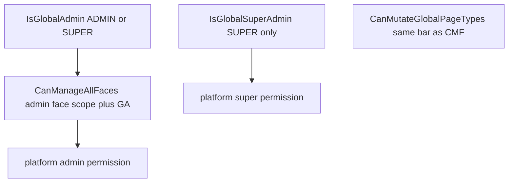
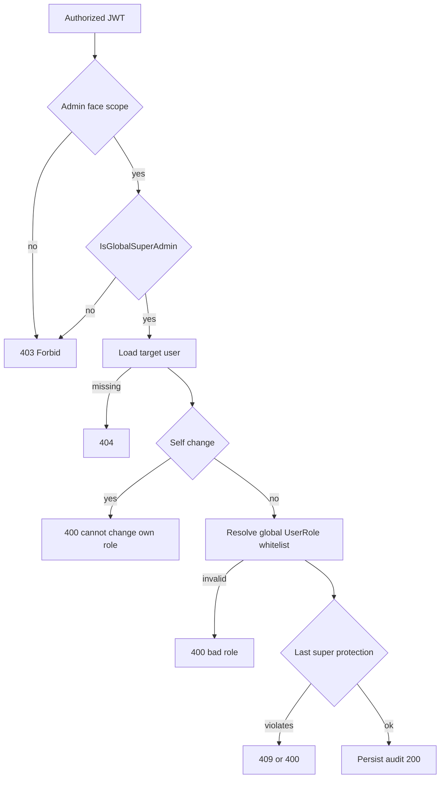
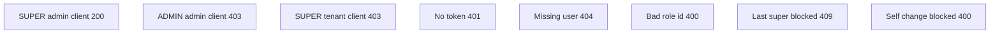

# Super-admin-only API — analysis, design, and AI implementation prompt

**Language:** English (technical identifiers and code paths stay as in the repo).  
**Related docs:** [acl-and-capabilities.md](../guides/acl-and-capabilities.md), [authentication-and-sessions.md](../guides/authentication-and-sessions.md).

---

## 1. Purpose

1. **Analyze** current `SUPER_ADMIN` vs `ADMIN` authorization in `many_faces_main`.
2. **Define** what “super-admin-only API” means for security, routing, and the data model.
3. **Provide a detailed AI-agent prompt** (section 10) you can paste into a new chat to implement changes consistently with existing code.

This document **does not** implement code; it is input for a follow-up implementation step.

---

## 2. Current state (inventory)

### 2.1 Global role and JWT

- Global role: `ApplicationUser.UserRoleId` → `UserRoles` (`Name`, `Scope` = `Global` | `Face`).
- Name constants: `UserRole.GlobalRoleNames` — `SuperAdmin` = `"SUPER_ADMIN"`, `Admin` = `"ADMIN"`, `User`, `Host`.
- When issuing an access token, `OAuth2Service.BuildAccessJwtAsync` loads the current role name from the DB and adds a single `ClaimTypes.Role` claim (thin token, A1/A9).
- After `UserRoleId` changes in the DB, **an old JWT still carries the old role** until expiry; the new role appears after **token refresh** (`refresh_token` grant) or a new **password** login — see XML on [`OAuth2Service`](../many_faces_backend/BeDemo.Api/Services/OAuth2Service.cs) (`BuildAccessJwtAsync`).

### 2.2 Who can do what today (platform vs super)

- `PlatformAccessRules.IsGlobalAdmin` = `ADMIN` **or** `SUPER_ADMIN` (JWT role claim).
- `PlatformAccessRules.IsGlobalSuperAdmin` = `SUPER_ADMIN` only.
- `CanManageAllFaces` = `IFaceScopeContext.IsAdminFaceScope` **and** `IsGlobalAdmin` — so **both** roles share the same bar for “platform” operations under the admin face prefix (e.g. `/admin/...`).
- `CanMutateGlobalPageTypes` = same threshold as `CanManageAllFaces`.
- `UsersController.CreateUser` / `UpdateUser` require `CanManageAllFaces()` — **ADMIN and SUPER_ADMIN** can create/update users but **cannot change global role** (`UpdateUserModel` has no `UserRoleId`).
- There is **no** public REST endpoint to change `ApplicationUser.UserRoleId`; changes are effectively seed / DB / scripts (`InitializeDatabase`, `IntegrationTestSeed`).

### Diagram: platform vs super checks



### 2.3 Capabilities and frontend

- `AccessCapabilitiesService`: `platform:super` (`AclPermissionKeys.PlatformSuper`) only if `IsGlobalSuperAdmin(principal)`; `platform:admin` if `CanManageAllFaces`.
- FE: `many_faces_portal/src/acl/permissions.ts` — `canSuperAdmin(caps)` exists; key catalog must stay aligned with `BeDemo.Api.Security.AclPermissionKeys` (Vitest).

### 2.4 Test infrastructure

- `IntegrationTestSeed`: `integration-superadmin@test.com` + `GetSuperAdminAccessTokenAsync`; `integration-admin@test.com` + `GetAdminAccessTokenAsync`.
- `AclTestClients`: `GetPlatformSuperAdminTokenAsync`, `GetPlatformAdminTokenAsync`; OAuth via `CreateUnscopedClient()`, API via `CreateFaceClient("admin")` for platform scope.
- Test pattern: [`PageTypesControllerTests.cs`](../many_faces_backend/BeDemo.Api.Tests/PageTypesControllerTests.cs) (401/403/200 by token and face client).

### 2.5 Audit

- `SecurityAuditLog`: templates for face roles, PageType, face config — **no** template for changing global platform role.

### 2.6 OpenAPI

- `BearerAuthOperationFilter` adds `security: Bearer` for actions with `[Authorize]` (excluding `[AllowAnonymous]`).

---

## 3. Problem and product ask

**Requirement:** HTTP API callable **only** by global `SUPER_ADMIN`, not normal `ADMIN`.

**Rationale (from ACL design, Part D.6):**

- Separate **privilege escalation** (assigning `SUPER_ADMIN`, possibly `ADMIN`) from day-to-day user management.
- Reduce blast radius: a compromised `ADMIN` must not perform “break-glass” changes.
- Align with capabilities: UI can hide actions behind `platform:super` (`canSuperAdmin`).

---

## 4. Proposed scope (phases)

### 4.1 MVP (recommended first merge)

Single source of truth for changing global role:

- **HTTP** `PUT` (or `PATCH`) under the **admin face prefix** — consistent with platform admin UI on `/admin/...`.
- **Authorization:** caller must have:
  - valid JWT,
  - `IFaceScopeContext.IsAdminFaceScope == true`,
  - `_access.IsGlobalSuperAdmin(User) == true`.
- **Request body:** e.g. `{ "userRoleId": <int> }` where `userRoleId` references `UserRoles` with `Scope == Global` and `Name` in a **whitelist** (below).
- **Validations (required):**
  1. Target user exists (`FindByIdAsync`).
  2. Target `UserRole` exists, `Scope == Global`.
  3. Target role is one of: `USER`, `ADMIN`, `HOST`, `SUPER_ADMIN` (match `UserRole.GlobalRoleNames` — resolve from DB by name, do not hardcode IDs).
  4. **Forbid** changing **your own** global role (avoid self lockout / one-step escalation).
  5. **Last SUPER_ADMIN protection:** if demoting someone from `SUPER_ADMIN`, at least one other user must remain `SUPER_ADMIN` after the update; else `400` or `409` with a clear message.
  6. Optional: forbid demoting another `SUPER_ADMIN` unless caller is the only super (product decision — MVP can rely on (5) only).

- **Response:** 200 + JSON with `id`, `email`, `globalRole` (name), optionally `userRoleId`.
- **Errors:** 400 (validation), 401 (no token), 403 (`ADMIN` or tenant scope), 404 (unknown user — or 404 vs 403 per info-leak policy; 404 for unknown IDs is acceptable for internal admin API).

### Diagram: PUT global-role decision tree (MVP)



### 4.2 Extensions (backlog)

- `GET /api/platform/.../global-roles` — read-only list for UI (super-only vs admin-readable — decide).
- Dedicated `promote-super-admin` / `demote-super-admin` with extra confirmation or 2FA (production).
- Rate limiting on super-only routes (e.g. policy in `Program.cs`).
- External SIEM event instead of Seq-only logging.

---

## 5. Technical recommendations

| Topic        | Recommendation                                                                                                                                                                                                 |
| ------------ | -------------------------------------------------------------------------------------------------------------------------------------------------------------------------------------------------------------- |
| Placement    | New controller, e.g. `PlatformUsersController` or `SuperAdminUsersController`, route `api/platform/users/{id}/global-role` — avoid colliding with `UsersController`.                                           |
| Face scope   | Require **admin** URL prefix (`RoutingMiddleware`); same pattern as `PageTypesController`.                                                                                                                     |
| Access check | Centralize: e.g. `PlatformAccessRules.CanPerformSuperAdminPlatformActions(IFaceScopeContext, ClaimsPrincipal)` = `IsAdminFaceScope && IsGlobalSuperAdmin`, exposed on `IAccessEvaluator` (consistent with A3). |
| DTO          | In `Models/DTOs/` or next to controller — clear name `SetGlobalRoleRequest`.                                                                                                                                   |
| EF           | `UserManager` + `ApplicationDbContext` — after `UserRoleId` change use `UpdateAsync` or consistent context update; prefer `UserManager` for user fields.                                                       |
| Audit        | `SecurityAuditLog.GlobalRoleChanged(...)` with `HttpContext.TraceIdentifier`.                                                                                                                                  |
| OpenAPI      | `[Authorize]` on controller; filter adds Bearer automatically.                                                                                                                                                 |
| Docs         | Update `docs/guides/acl-and-capabilities.md` (summary / file map).                                                                                                                                             |

---

## 6. Threats and mitigations

| Risk                  | Mitigation                                                                                                                          |
| --------------------- | ----------------------------------------------------------------------------------------------------------------------------------- |
| ADMIN bypass          | Gate on `IsGlobalSuperAdmin`, not `IsGlobalAdmin`.                                                                                  |
| Calls from tenant URL | Require `IsAdminFaceScope`; tenant JWT with `SUPER_ADMIN` still must not get admin scope without `/admin/` prefix — cover in tests. |
| Enumeration           | Avoid logging full email in public errors; audit to structured logs only.                                                           |
| No SUPER_ADMIN left   | Mandatory count check before commit.                                                                                                |
| Stale JWT             | Document in controller XML: target user must refresh token after role change.                                                       |

---

## 7. Test plan (acceptance)

Add a test class, e.g. `SuperAdminGlobalRoleTests.cs` (or extend existing ACL tests):

1. **SUPER_ADMIN** + `CreateFaceClient("admin")` + Bearer → `PUT` success (e.g. flip test user `USER` ↔ `ADMIN`).
2. **ADMIN** + admin face + Bearer → **403**.
3. **SUPER_ADMIN** + `CreateFaceClient("public")` (tenant scope) → **403** (if gate requires admin scope).
4. No token → **401**.
5. Missing target user → **404**.
6. Invalid / face-scoped `userRoleId` → **400**.
7. Demoting last SUPER_ADMIN blocked → **400/409**.
8. Self change blocked → **400** (or 403).

Use seeded users or a temporary user created with `UserManager` in the test.

### Diagram: acceptance tests matrix (compact)



---

## 8. Frontend (optional same PR)

- If admin UI needs “Change global role”, show only when `canSuperAdmin(caps)` from `useMeCapabilities`.
- Thin axios client with base URL via existing face routing interceptor (`/admin/...`).
- **Do not** add a new permission string if MVP only needs existing `platform:super`.

---

## 9. Files the AI will likely touch

| Action                                                         | Path (relative to monorepo root)               |
| -------------------------------------------------------------- | ---------------------------------------------- |
| New controller                                                 | `many_faces_backend/BeDemo.Api/Controllers/...`           |
| DTO                                                            | `many_faces_backend/BeDemo.Api/Models/DTOs/...`           |
| `PlatformAccessRules` + `IAccessEvaluator` + `AccessEvaluator` | `many_faces_backend/BeDemo.Api/Utils/`, `Services/`       |
| `SecurityAuditLog`                                             | `many_faces_backend/BeDemo.Api/Utils/SecurityAuditLog.cs` |
| Tests                                                          | `many_faces_backend/BeDemo.Api.Tests/...`                 |
| Docs                                                           | `docs/guides/acl-and-capabilities.md`          |
| Optional FE                                                    | `many_faces_admin/src/...`, `many_faces_portal/src/acl/...`    |

---

## 10. AI AGENT PROMPT (copy the block below)

```
You are implementing a SUPER_ADMIN-only HTTP API in the BeDemo .NET 10 solution (monorepo root **`many_faces_main`**, project `many_faces_backend/BeDemo.Api`).

GOAL
- Expose a secure endpoint to change an ApplicationUser’s GLOBAL role (UserRoleId) in UserRoles table.
- Only callers with JWT role claim SUPER_ADMIN (UserRole.GlobalRoleNames.SuperAdmin) AND admin face URL scope may call it (same pattern as platform admin: IFaceScopeContext.IsAdminFaceScope).
- Regular ADMIN must receive 403. Tenant-scoped URL (e.g. /public/...) must receive 403 even if JWT is SUPER_ADMIN.

CONTEXT (read before coding)
- Global role is ApplicationUser.UserRoleId → UserRoles; OAuth2 JWT carries single ClaimTypes.Role from DB at token issue (OAuth2Service.BuildAccessJwtAsync).
- Use PlatformAccessRules.IsGlobalSuperAdmin; extend with a new rule e.g. PlatformAccessRules.CanPerformSuperAdminPlatformActions(IFaceScopeContext, ClaimsPrincipal) = IsAdminFaceScope && IsGlobalSuperAdmin, and expose on IAccessEvaluator / AccessEvaluator.
- Existing UsersController uses CanManageAllFaces for create/update but does NOT change global role.
- SecurityAuditLog exists; add GlobalRoleChanged(actorUserId, targetUserId, previousRoleName, newRoleName, correlationId).
- Integration tests: CustomWebApplicationFactory, AclTestClients.GetPlatformSuperAdminTokenAsync / GetPlatformAdminTokenAsync, CreateFaceClient("admin") vs CreateFaceClient("public"), CreateUnscopedClient for OAuth.
- BearerAuthOperationFilter already marks [Authorize] operations with OpenAPI security.

IMPLEMENTATION TASKS
1) Add DTO SetGlobalRoleRequest { int UserRoleId } (JSON camelCase).
2) Add controller (name your choice, e.g. PlatformUsersController) with route prefix api/platform/users and method:
   PUT {id}/global-role
   - [Authorize] on class
   - Load target user by id; return 404 if missing
   - If !CanPerformSuperAdminPlatformActions(_faceScope, User) return Forbid()
   - Resolve caller user id from claims; if target id equals caller return 400 (cannot change own global role)
   - Load requested UserRole by id; if null or Scope != RoleScope.Global return 400
   - Whitelist allowed global role Names: USER, ADMIN, HOST, SUPER_ADMIN (use UserRole.GlobalRoleNames constants compared to role.Name)
   - Before saving: if target is currently SUPER_ADMIN and new role is not SUPER_ADMIN, ensure at least one other user remains SUPER_ADMIN after update; else return 409 or 400 with clear error body
   - Persist UserRoleId change (UserManager.UpdateAsync or equivalent), then SecurityAuditLog.GlobalRoleChanged with HttpContext.TraceIdentifier
   - Return 200 with { id, email, globalRole (name), userRoleId }

3) XML docs on controller: note that target user’s JWT keeps old role until refresh/login.

4) Tests: new file SuperAdminGlobalRoleTests.cs (or similar) covering:
   - Super admin + admin face client → success
   - Admin JWT + admin face → 403
   - Super admin + public face client → 403
   - No auth → 401
   - Invalid role id → 400
   - Last super demotion blocked
   - Self change blocked

5) Update docs/guides/acl-and-capabilities.md (summary + file map) briefly.

CONSTRAINTS
- Do not widen ADMIN to this endpoint.
- Do not use AspNetRoles for authorization.
- Match existing code style, naming, and patterns (IAccessEvaluator, PlatformAccessRules, Forbid vs NotFound policy as in other controllers).
- Keep the diff focused; no unrelated refactors.
- Run: dotnet test many_faces_backend/BeDemo.Api.Tests/BeDemo.Api.Tests.csproj and fix failures.

DELIVERABLE
- All tests green; endpoint documented; audit log called on success.
```

---

## 11. Note for human reviewers

Before merge, explicitly decide:

- whether **HOST** may be assigned via the same endpoint as other global roles,
- **404** vs **403** for missing users in admin API,
- whether production needs **2FA** or a ticket system (out of scope for the demo).

---

_Written as a spec for super-admin-only API; after implementation, add a PR link and optionally shorten section 10._
