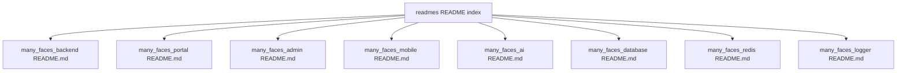

# README index and extended overviews

## Submodule README files (source of truth per app)

| Submodule        | README                                                       |
| ---------------- | ------------------------------------------------------------ |
| Backend API      | [`../../many_faces_backend/README.md`](../../many_faces_backend/README.md)         |
| Main frontend    | [`../../many_faces_portal/README.md`](../../many_faces_portal/README.md)         |
| Admin UI         | [`../../many_faces_admin/README.md`](../../many_faces_admin/README.md)   |
| Mobile (Expo)    | [`../../many_faces_mobile/README.md`](../../many_faces_mobile/README.md)   |
| AI gRPC          | [`../../many_faces_ai/README.md`](../../many_faces_ai/README.md)         |
| PostgreSQL stack | [`../../many_faces_database/README.md`](../../many_faces_database/README.md)         |
| Redis stack      | [`../../many_faces_redis/README.md`](../../many_faces_redis/README.md)   |
| Logger (Dozzle)  | [`../../many_faces_logger/README.md`](../../many_faces_logger/README.md) |

Canonical **guides and prompts** live in the monorepo [`docs/README.md`](../README.md) hub (`guides/`, `prompts/`) — submodule READMEs stay the per-app source of truth.

### Diagram: this index as hub to submodule READMEs

---

## Extended overviews (English)

Longer narratives that read like extended READMEs:

| File                                               | Description                                 |
| -------------------------------------------------- | ------------------------------------------- |
| [fe-portal-overview.md](./fe-portal-overview.md)       | Architecture and features of `many_faces_portal`.     |
| [admin-portal-overview.md](./admin-portal-overview.md) | Architecture and features of `many_faces_admin`.  |
| [be-backend-overview.md](./be-backend-overview.md)       | `many_faces_backend` API narrative + links to guides. |
| [ai-grpc-overview.md](./ai-grpc-overview.md)            | `many_faces_ai` gRPC narrative + links to guides.   |
| [redis-subrepo.md](./redis-subrepo.md)             | Developing with the `many_faces_redis` submodule. |
| Mobile (`many_faces_mobile`)                      | Long-form narrative lives in the submodule [`README.md`](../../many_faces_mobile/README.md) (Phase 1 parity, submissions read path). |

**Auth / JWT / sessions:** see the canonical guide [authentication-and-sessions.md](../guides/authentication-and-sessions.md).
