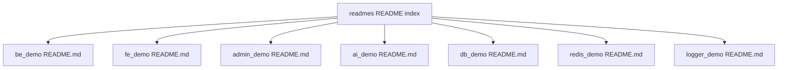

# README index and extended overviews

## Submodule README files (source of truth per app)

| Submodule        | README                                                       |
| ---------------- | ------------------------------------------------------------ |
| Backend API      | [`../../be_demo/README.md`](../../be_demo/README.md)         |
| Main frontend    | [`../../fe_demo/README.md`](../../fe_demo/README.md)         |
| Admin UI         | [`../../admin_demo/README.md`](../../admin_demo/README.md)   |
| AI gRPC          | [`../../ai_demo/README.md`](../../ai_demo/README.md)         |
| PostgreSQL stack | [`../../db_demo/README.md`](../../db_demo/README.md)         |
| Redis stack      | [`../../redis_demo/README.md`](../../redis_demo/README.md)   |
| Logger (Dozzle)  | [`../../logger_demo/README.md`](../../logger_demo/README.md) |

### Diagram: this index as hub to submodule READMEs

---

## Extended overviews (English)

Longer narratives that read like extended READMEs:

| File                                               | Description                                 |
| -------------------------------------------------- | ------------------------------------------- |
| [fe-demo-overview.md](./fe-demo-overview.md)       | Architecture and features of `fe_demo`.     |
| [admin-demo-overview.md](./admin-demo-overview.md) | Architecture and features of `admin_demo`.  |
| [redis-subrepo.md](./redis-subrepo.md)             | Developing with the `redis_demo` submodule. |

**Auth / JWT / sessions:** see the canonical guide [authentication-and-sessions.md](../guides/authentication-and-sessions.md).
