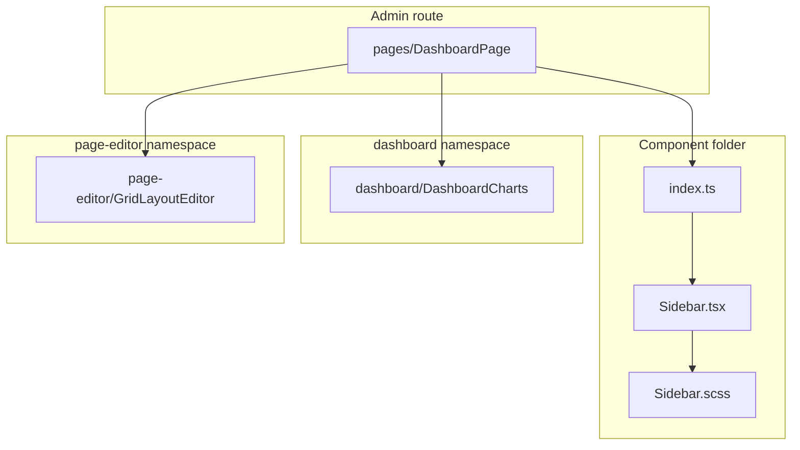
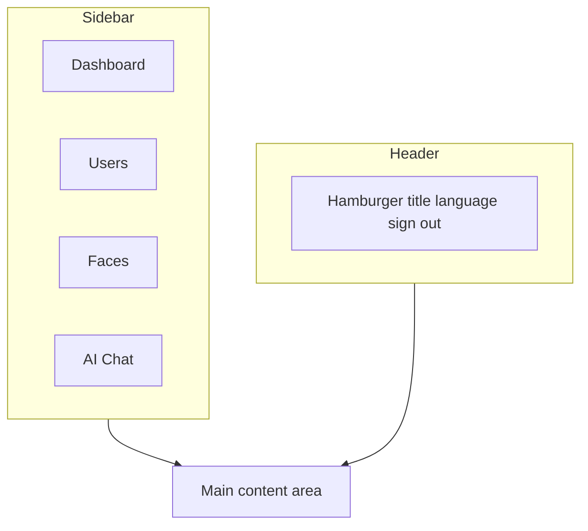
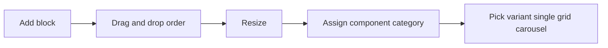
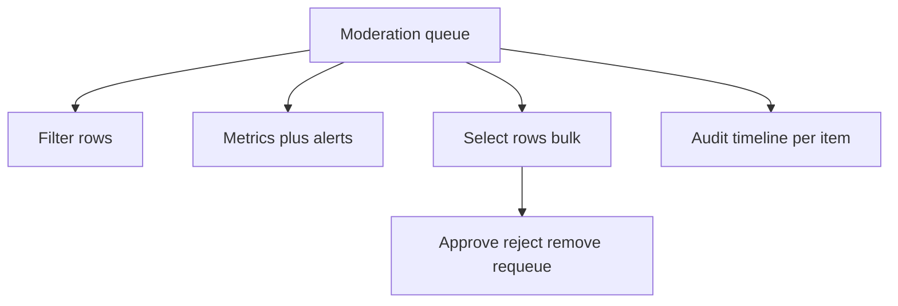
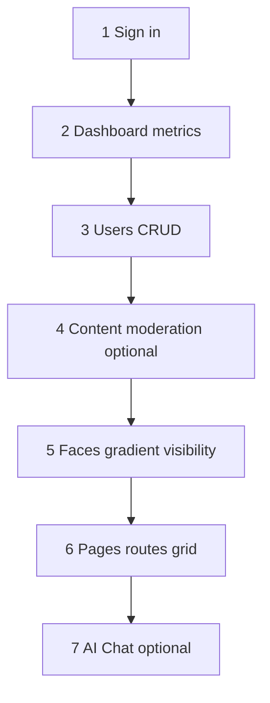

# Admin application (`many_faces_admin`) — functional overview

## Overview

The admin app manages the whole platform: users, faces (tenants), pages, and content. It includes an AI chat assistant.

Typical dev URL: **http://localhost:8082**.

**Component folder colocation** (structure rollout): each UI block lives in its own directory (`ComponentName/ComponentName.tsx` + SCSS + `index.ts`). Spec: [`docs/prompts/fe-admin-component-folder-colocation-agent-prompt.md`](../prompts/fe-admin-component-folder-colocation-agent-prompt.md). Verify: `node scripts/verify-admin-component-colocation.mjs` from monorepo root.

**Performance / TanStack Query / ACL notes** (for PRs and audits): [`many_faces_admin/docs/performance-and-query-appendix.md`](../../many_faces_admin/docs/performance-and-query-appendix.md).

---

## 1. Sign-in

Fields:

- **Email** (required)
- **Password** (min 4 characters)
- **“Stay signed in”** — optional; longer JWT when checked (same mechanism as `many_faces_portal`). See [**authentication-and-sessions.md**](../guides/authentication-and-sessions.md).
- **Sign in** button

Success → Dashboard. Failure → error toast.

Unauthenticated visits to protected routes redirect to sign-in, then return to the original URL.

---

## 2. Layout and navigation

### Header

- **Hamburger** — toggles sidebar on small screens.
- **Title:** Many Faces Admin.
- **Language** (`sk` / `en` / `cz`).
- Admin **email** + **Sign out**.

### Left sidebar

- **Dashboard**
- **Users**
- **Faces**
- **AI Chat**

On mobile the sidebar is an overlay.

### Diagram: admin shell

---

## 3. Languages

Three locales: **Slovak** (`sk`), **English** (`en`), **Czech** (`cz`). Toggle in the header; URLs localize (e.g. dashboard paths per locale).

---

## 4. Dashboard

- Greeting with signed-in name or email.
- **KPI cards** (with deep links): users, faces, pages, pending friend requests, messages, notifications.
- **Charts** (last 30 days UTC): new users vs messages (line), content mix albums/blogs/reels/stories (donut), friend-request outcomes (bar). Data from `GET /api/Stats` and `GET /api/Stats/timeseries` (requires admin face URL prefix + platform operator JWT — see [Admin dashboard metrics](../guides/admin-dashboard-metrics.md)).
- **Super-admin strip**: pending submissions, AI failed jobs, needs human review, link to moderation console (`GET /api/contentmoderation/metrics`).
- **All platform metrics** table: every field returned by the stats summary, including wall tickets by status.
- **Quick actions:** Users, Faces, and a hint that **pages** are managed **per face** (no global `/pages` list route).

---

## 5. Users

### List

Search, Refresh, **Create user**, sortable paginated table.

| Column     | Description    |
| ---------- | -------------- |
| ID         | Click → detail |
| Email      |                |
| First name |                |
| Last name  |                |
| Created    |                |
| Actions    | Edit           |

### Detail

ID, email, names, created date.

### Create

Email, first name, last name, password, confirm password → back to list on success.

### Edit

Same fields; password optional (blank = unchanged).

> User delete is not exposed in admin UI.

---

## 6. Faces

A **face** is a tenant space with its own pages and settings.

### List

Search, Refresh, **Create face**, sortable table.

| Column      | Description                 |
| ----------- | --------------------------- |
| ID          | Click → detail              |
| Index       | URL slug (e.g. `acme-corp`) |
| Name        | Display name                |
| Description | Short text                  |
| Color       | Badge                       |
| Visibility  | Public / Private            |
| Actions     | Edit                        |

### Detail

ID, index, name, visibility, description, color, timestamps, embedded **Pages** list.

### Create

Index, name, description, color, **Public access** toggle. Default pages are created (Home, List, Detail; private faces also get Wall).

### Edit

Same fields plus:

#### Background gradient editor

Gradient type (linear/radial), angle, color stops, animation toggle and speed.

#### Pages

Table of pages with **Create page**.

> Face delete is not exposed in admin UI.

---

## 7. Pages

Pages belong to a face; managed from face detail/edit.

### Create

Page type (Home, List, Detail, Wall), name, path, sort index, description.

#### Route translations

Per-locale URL segments (each locale can use its own slug for the same logical page).

### Detail / Edit

Same fields + translation editor.

#### Grid layout editor

Add block, drag/drop, resize, rename, delete, assign component type.

##### Component categories

| Category   | Description              |
| ---------- | ------------------------ |
| Albums     | Single / grid / carousel |
| Ads        | Classifieds              |
| Blog       | Articles                 |
| Chat rooms | Chat tiles               |
| Profiles   | User profiles            |
| Reels      | Short video              |
| Stories    | Story bubbles            |

Each category: **single**, **grid**, **carousel**.

### Diagram: grid block editor flow

### Delete page

**Delete** with confirmation in the pages table.

---

## 7.5 User content moderation (SUPER_ADMIN)

**Moderation** in the sidebar (visible when the signed-in user is **`SUPER_ADMIN`**) lists albums, blogs, and reels submitted from the user-facing app: **`PendingApproval`** and related AI review states. The page supports rich **filters** (content type, approval and AI status, face, author, risk tier, flags substring, confidence band, submitted time window, reviewer, queue age, moderation version), **metrics** with **alerts** when the queue is stressed, a **detail** drawer with **audit** events, single-item **approve / reject / remove / re-queue AI**, and **bulk** actions with per-row results. All routes are enforced again on the API.

See [`guides/ai-assisted-content-approval.md`](../guides/ai-assisted-content-approval.md).

---

## 8. AI Chat

Sidebar **AI Chat**: connection state, **You** / **AI** history, input, **Send**, “AI is typing…” indicator, long-running notice. History is in-memory for the browser session (refresh clears it).

---

## 9. Typical admin workflow

1. Sign in.
2. Dashboard metrics.
3. Users — create/edit as needed.
4. **Content moderation** (superadmin) — pending user submissions, metrics, bulk decisions, audit.
5. Faces — create, tune gradient and visibility.
6. Pages — routes, translations, grid layout.
7. AI Chat — optional assistance.

### Diagram: typical workflow

---

## 10. Albums (API)

REST CRUD; model: Album, AlbumFace, AlbumComment, AlbumLike. Visibility: Public (any signed-in), Private/Paid (creator for now).

Endpoints mirror [`fe-portal-overview.md`](./fe-portal-overview.md) album table (`/api/albums` …).

---

## 11. Reels (API) and Redis

Reel, ReelFace (no rows = global across faces), ReelComment, ReelLike. POST enqueues Redis jobs. Submodule **`many_faces_redis`**, `Redis__Configuration=host.docker.internal:6379`. Keys `bedemo:jobs:ready`, `bedemo:jobs:delayed`. See [**redis-subrepo.md**](./redis-subrepo.md) and `many_faces_redis/README.md`.

---

## 12. Blog (API)

Blog bound to one Face; HTML content; max 3 images; comments/likes. Endpoints under `/api/blogs` (see `many_faces_portal` overview for pattern).

---

## 13. Default local development credentials

- **Email:** `admin@admin.com`
- **Password:** `admin`
