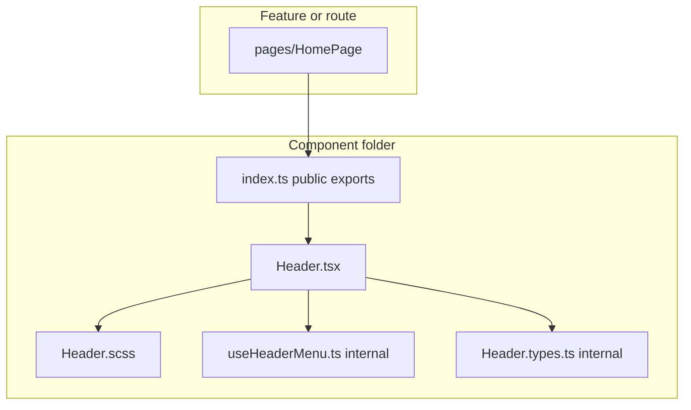
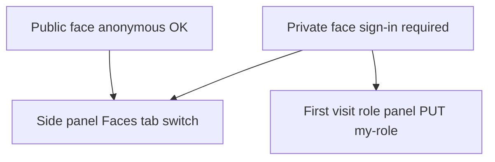
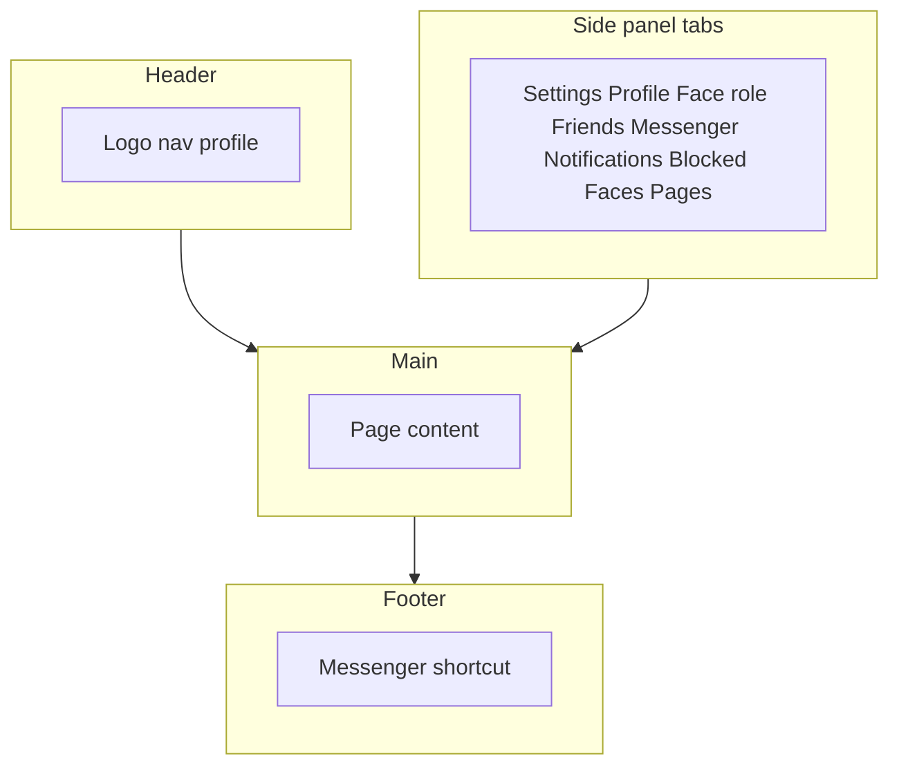
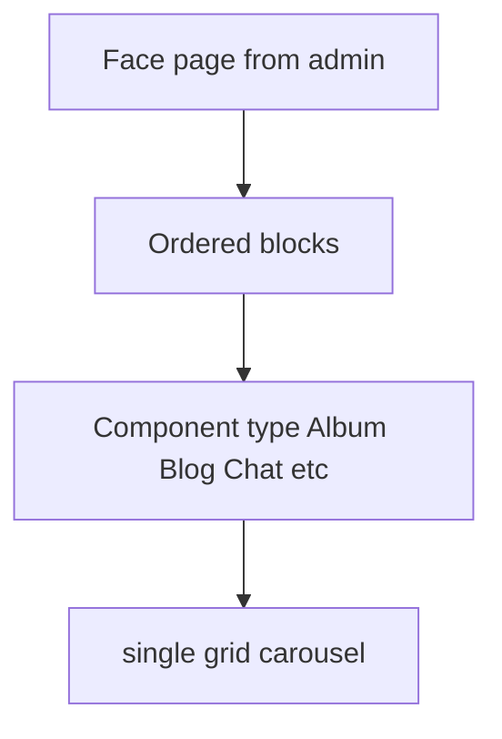
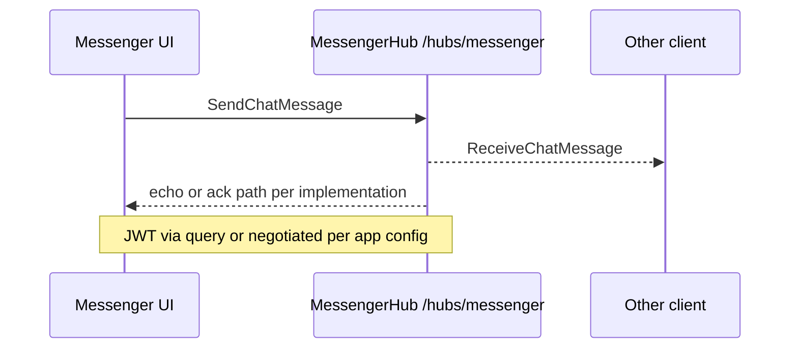
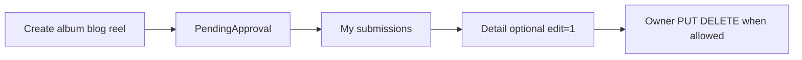

# Frontend application (`many_faces_portal`) — functional overview

## Overview

The frontend is a multi-face social-style SPA. Users work inside a selected **face** (tenant) with dynamic pages, messenger, notifications, friends, and profile.

Typical dev URL: **http://localhost:8081**.

**Performance / TanStack Query / ACL notes** (for PRs and audits): [`many_faces_portal/docs/performance-and-query-appendix.md`](../../many_faces_portal/docs/performance-and-query-appendix.md).

**Component folder colocation** (structure rollout): each UI block lives in its own directory (`ComponentName/ComponentName.tsx` + SCSS + `index.ts`). Spec: [`docs/prompts/fe-portal-component-folder-colocation-agent-prompt.md`](../prompts/fe-portal-component-folder-colocation-agent-prompt.md). Verify: `node scripts/verify-portal-component-colocation.mjs` from monorepo root.

---

## 1. Sign-in and registration

### Registration

Form fields:

- **Email** (required, valid format)
- **Password** (min 4 characters; must include lowercase, uppercase, and digit)
- **First name**
- **Last name**

After success, a message is shown and the user is redirected to sign-in.

### Sign-in

- **Email** (required)
- **Password** (min 4 characters)
- **“Stay signed in”** checkbox — when checked, the API issues a JWT with a **longer lifetime** (`Jwt:ExpiresInMinutesRememberMe`); otherwise a shorter lifetime (`Jwt:ExpiresInMinutes`). Same token storage (`localStorage`); only the `exp` claim differs. Details: [**authentication-and-sessions.md**](../guides/authentication-and-sessions.md).

After success, the user lands on the home page of the current face.

### Automatic sign-out

When the JWT **expires** (`exp`), the app clears stored tokens and shows a session-expired message; the API rejects further requests with that token. A background check runs about every 30 seconds. See [**authentication-and-sessions.md**](../guides/authentication-and-sessions.md).

---

## 2. What is a “face”

A **face** is an isolated environment inside the app—a **space** or **community** with its own pages and content.

- **Public face** — visible to everyone, including anonymous visitors.
- **Private face** — only after sign-in.

The user always works in one selected face. The URL encodes the face and locale (e.g. `/en/acme-corp/home`), so context is explicit.

### Switching faces

In the side panel, tab **Faces** lists cards; clicking a card switches the active face.

### First visit to a private face

A **Choose role** panel opens automatically:

- Dropdown of available face roles (e.g. FACE_USER, INZERENT, SUBSCRIBER).
- After confirm, the role is saved.
- On later visits the panel does not show again.

### Diagram: public vs private face paths

---

## 3. Navigation and layout

### Header

- **Left:** app logo.
- **Center:** icon navigation — Home, dynamic face pages, Users.
- **Right:** profile card (name + avatar), actions (Info, Settings, Menu).

Anonymous users only see Sign in and Register.

### Footer

- Copyright.
- **Messenger** button for signed-in users (opens messenger in the side panel).

### Side panel

Tabs include:

- **Settings** — language, sign-out.
- **Profile** — edit profile.
- **Face role** — role selection (private faces).
- **Friend Requests** — friend requests.
- **Messenger** — conversations.
- **Notifications** — notifications.
- **Blocked users** — block list.
- **Faces** — pick face.
- **Pages** — page navigation.

### Diagram: shell layout

---

## 4. Languages

The app ships with three locales:

- **Slovak** (`sk`)
- **English** (`en`)
- **Czech** (`cz`)

Switch under **Settings**. URLs are localized per locale route keys (e.g. different path segments for `en` vs `sk` vs `cz`).

---

## 5. Home

- **Guest:** welcome with links to sign-in and register.
- **Signed-in:** protected home with welcome content.

---

## 6. Dynamic face pages

Each face has pages configured in the admin app. They appear in navigation and contain blocks of different content types.

### Block types

| Type            | Description                                              |
| --------------- | -------------------------------------------------------- |
| **Album**       | Photos and albums                                        |
| **Ad**          | Classifieds with price and location                      |
| **Blog**        | Articles with date, title, excerpt                       |
| **ChatRoom**    | Chat rooms with member counts                            |
| **UserProfile** | User profiles                                            |
| **Reel**        | Short video cards from API (first reel or grid/carousel) |
| **Story**       | Story bubbles (seen/unseen)                              |

Each type supports **single**, **grid**, and **carousel** layouts.

Blocks have a header (Create, List, Report, Help, Sort, Favorites, Settings) and footer navigation (Previous / Play / Next) where applicable.

### Diagram: page to blocks to display mode

---

## 7. Users

### List

Grid or list layout; each row/card shows name, email, avatar. Click opens detail.

### Detail

Shows ID, email, first/last name, created date (if available), **Back**, and **Block** / **Unblock**.

---

## 8. Profile

### View

Basic fields: ID, email, first/last name.

### Edit (side panel — Profile)

- First and last name.
- **Global profile photo** — all faces.
- **Face-specific profile photo** — overrides global for the current face only.

Uploads must be images.

---

## 9. Friend requests

**Friend Requests** tab:

- **Incoming** — Accept / Reject.
- **Add friend** — search (300 ms debounce), paginated list of addable users, **Send request** per row (dynamic page size to fit viewport).

---

## 10. Messenger

Opened from the side panel or footer.

- **Left:** conversation — messages, input, message requests.
- **Right:** chat list and message requests.

**Enter** sends; **Shift+Enter** newline. Realtime delivery. Connection state: Connecting / Connected / Disconnected. Unread badges.

### Diagram: messenger send path (simplified)

---

## 11. Notifications

**Notifications** tab: list with title, body, time, type; new items as toasts. Empty state: “No notifications yet.”

---

## 12. Blocking

Blocked users cannot message the blocker, appear in the user list, or send friend requests; conversations/requests are hidden.

**Block** on user detail (red shield). **Unblock** on detail or under **Blocked users** in the side panel.

---

## 13. Follow

**Follow** on user detail (blue UserPlus). **Unfollow** on detail or under **Following** in the side panel.

**Following** tab: people you follow (Unfollow) and **Followers** (read-only).

---

## 14. AI Chat

Chat UI for the AI assistant: **You** / **AI** bubbles, input, **Send**, connection state. Sends short prior context with each message.

> May not appear in main nav—depends on face page configuration.

---

## 15. Albums

Create/edit via **+** in Album / AlbumGrid / AlbumCarousel headers (slide-over form): title (required, max 200), description (optional, max 2000), album type (Public/Private/Paid), media type (Image/Video), face multiselect (defaults to all faces). Only creator can edit.

**Display:** Album (hero + thumbs), AlbumGrid (paged grid), AlbumCarousel (carousel). Click → detail at `/album/{id}`: back, header, likes, comments, edit/delete for creator.

**Visibility:** public albums for any signed-in user; private/paid only for creator; on another user’s profile only public albums show.

**API (summary)**

| Method | Endpoint                    | Description      |
| ------ | --------------------------- | ---------------- |
| GET    | `/api/albums`               | Visible albums   |
| GET    | `/api/albums/{id}`          | Detail           |
| GET    | `/api/albums/user/{userId}` | By user          |
| POST   | `/api/albums`               | Create           |
| PUT    | `/api/albums/{id}`          | Update (creator) |
| DELETE | `/api/albums/{id}`          | Delete (creator) |

Comments and likes under `/api/albums/{id}/comments` and `/likes`.

---

## 16. Reels

Single video with title, description, comments, likes; grid components like albums.

**Create/edit:** **+** on Reel / ReelGrid / ReelCarousel — title, description, **video URL**, optional face multiselect (none = visible on **all** faces; otherwise scoped).

**List** icon → `/list/7`. API calls pass **faceId** for scoped reels.

**Detail** `/reel/{id}` with `?faceId=` where required.

**Redis queue:** after POST, jobs `reel.postprocess` (immediate + delayed ~1 min). **StackExchange.Redis** lists `bedemo:jobs:ready` and sorted set `bedemo:jobs:delayed`; `RedisJobWorkerService` drains them (currently logging). Submodule **`many_faces_redis`**; `be-demo-dev` uses `host.docker.internal:6379`. See [**redis-subrepo.md**](./redis-subrepo.md). If Redis is down or config empty / **Testing**, **NoOp** queue is used.

**API (summary)**

| Method          | Endpoint                           | Description          |
| --------------- | ---------------------------------- | -------------------- |
| GET             | `/api/reels?faceId=`               | List                 |
| GET             | `/api/reels/{id}?faceId=`          | Detail               |
| GET             | `/api/reels/user/{userId}?faceId=` | By user              |
| POST/PUT/DELETE | `/api/reels` …                     | CRUD (creator rules) |

Comments/likes paths mirror albums with `faceId` where needed.

---

## 17. Blogs

**Create/edit:** **+** on Blog / BlogGrid / BlogCarousel — title, **single required Face**, WYSIWYG content (no inline images), up to 3 image URLs. Creator-only edit.

**Detail** `/blog/{id}`: images, HTML content, likes, comments.

Filter: `GET /api/blogs?faceId=`.

**API (summary)**

| Method | Endpoint             | Description      |
| ------ | -------------------- | ---------------- |
| GET    | `/api/blogs?faceId=` | List             |
| GET    | `/api/blogs/{id}`    | Detail           |
| POST   | `/api/blogs`         | Create           |
| PUT    | `/api/blogs/{id}`    | Update (creator) |
| DELETE | `/api/blogs/{id}`    | Delete (creator) |

---

## 18. User content moderation (creator)

Albums, blogs, and reels created from the Frontend start as **`PendingApproval`**: they do not appear in public grids or anonymous detail views. After create, success copy explains that the item is submitted for review.

**My submissions** (`/:lang/.../my-submissions` under the authenticated shell) calls **`GET /api/my/content-submissions`** and groups rows by moderation pipeline state. Each card links to the module detail route; **`?edit=1`** opens the editor when the API marks the row as editable (typically owner + pending or rejected). Edit/delete on detail pages follows the same rules.

See the monorepo guide [`guides/ai-assisted-content-approval.md`](../guides/ai-assisted-content-approval.md).

---

## 19. Default local development credentials

- **Email:** `admin@admin.com`
- **Password:** `admin`
