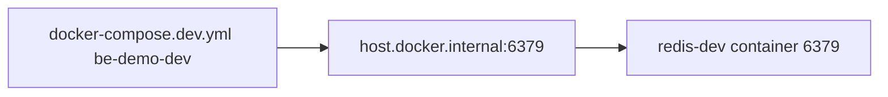
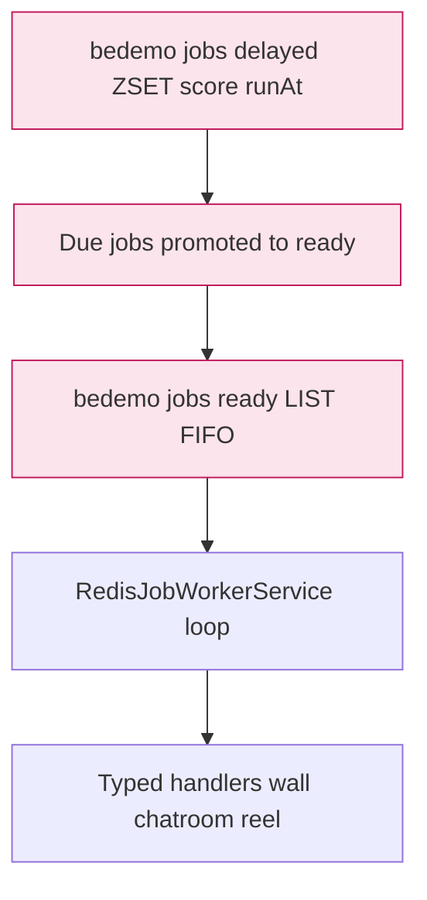

# Redis — `many_faces_redis` submodule

The Redis instance used for the backend **job queue** is a **standalone git submodule**, same pattern as **`many_faces_database`**.

## Location

```
<monorepo-root>/many_faces_redis/
```
(GitHub root repo: **`many_faces_main`**.)

- Its own GitHub repository (see `.gitmodules` for the URL).
- From the monorepo root: `git submodule update --init many_faces_redis`

## Running

```bash
cd many_faces_redis
./start-redis.sh
```

Or from the root via `./scripts/start-all-dev.sh` (Redis starts after DB).

## Backend connection

Root **`docker-compose.dev.yml`** → `be-demo-dev`:

- `Redis__Configuration=host.docker.internal:6379`
- `extra_hosts: host.docker.internal:host-gateway`

`many_faces_redis` publishes **6379:6379**, so traffic from the BE container reaches the host and `redis-dev`.

### Diagram: backend to Redis dev container



The API uses **`Redis__Configuration`** to reach this instance; **`RedisJobWorkerService`** in `many_faces_backend` consumes **`bedemo:jobs:ready`** and **`bedemo:jobs:delayed`** for background work (wall ticket delete, chat room idle checks, reel postprocess, etc.).

### Diagram: job queues (ready and delayed)



## Files in `many_faces_redis`

| File                                                  | Purpose                                     |
| ----------------------------------------------------- | ------------------------------------------- |
| `docker-compose.yml`                                  | `redis:7-alpine`, volume, healthcheck       |
| `start-redis.sh` / `stop-redis.sh` / `clear-redis.sh` | Same idea as `many_faces_database` scripts              |
| `README.md`                                           | English description for the standalone repo |

## Fresh monorepo clone

```bash
git clone --recurse-submodules <root-url>
# or after clone:
git submodule update --init many_faces_redis
```

## First-time publish of `many_faces_redis` as its own repo

1. Create an empty **`many_faces_redis`** repository on GitHub (submodule path stays `many_faces_redis/`).
2. In `many_faces_redis/`: `git init`, `git add .`, commit, `remote add`, `push`.
3. In root **`many_faces_main`**: if you did not have the submodule yet, `git submodule add <url> many_faces_redis` (or commit `.gitmodules` + submodule pointer).

For the full workflow, see **[git-submodules.md](../guides/git-submodules.md)** (treat `many_faces_redis` like `many_faces_database`).
